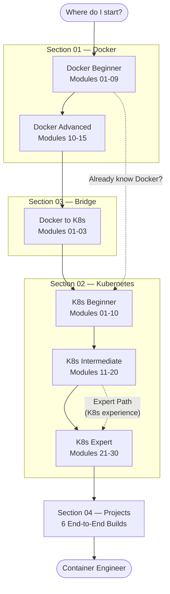

# Container Engineering — Learning Path

This guide helps you figure out where to start and how to move through the repo based on your background and goals.

---

## The Full Learning Journey

---

## The Four Tracks

### Track 1: Full Path — Recommended for Beginners

> New to containers entirely? No prior knowledge needed.

**Estimated time: 75-85 hours**
**Prerequisites**: command line basics

| Phase | Modules | Hours | What You Learn |
|---|---|---|---|
| Docker Beginner | Docker 01-09 | 12-14 hrs | Containers, images, Dockerfile, volumes, networking, Compose |
| Docker Advanced | Docker 10-15 | 6-8 hrs | Registries, multi-stage builds, security, Swarm, CI/CD, best practices |
| Bridge | Bridge 01-03 | 3-4 hrs | How Docker concepts map to Kubernetes |
| K8s Beginner | K8s 01-10 | 10-12 hrs | Pods, Deployments, Services, ConfigMaps, Ingress, Persistent Volumes |
| K8s Intermediate | K8s 11-20 | 10-12 hrs | RBAC, CRDs, StatefulSets, health probes, strategies, Jobs, autoscaling, NetworkPolicies |
| K8s Expert | K8s 21-30 | 12-15 hrs | Service accounts, monitoring, security, mesh, GitOps, Helm, scheduling, cluster ops, cost |
| Projects | 04 01-06 | 20+ hrs | End-to-end production experience |

---

### Track 2: K8s Fast Track — I Know Docker

> You have built Docker images and run containers. Skip straight to Kubernetes.

**Estimated time: 35-45 hours**
**Prerequisites**: Docker basics (images, containers, Compose)

| Phase | Modules | Hours |
|---|---|---|
| Bridge (optional, 1 day) | Bridge 01-03 | 3-4 hrs |
| K8s Beginner | K8s 01-10 | 10-12 hrs |
| K8s Intermediate | K8s 11-20 | 10-12 hrs |
| K8s Expert | K8s 21-30 | 12-15 hrs |
| Projects | 04 03-06 | 12+ hrs |

**Minimum Docker knowledge to skip ahead:**
- [ ] Build a Docker image with a Dockerfile
- [ ] Run, stop, and remove containers
- [ ] Use volumes for persistent data
- [ ] Use Docker Compose to run multi-container apps
- [ ] Push an image to a registry

---

### Track 3: Docker Only

> Your goal is Docker mastery: production images, Compose, CI/CD.

**Estimated time: 20-25 hours**
**Prerequisites**: command line basics

| Phase | Modules | Hours |
|---|---|---|
| Core Docker | Docker 01-09 | 12-14 hrs |
| Production Docker | Docker 10-15 | 6-8 hrs |
| Projects | 04 01-02 | 4-6 hrs |

---

### Track 4: Expert Path — CKA / CKAD Preparation

> You have Kubernetes experience but want production depth and exam readiness.

**Estimated time: 25-35 hours**
**Prerequisites**: K8s modules 01-10 complete or equivalent experience

| Phase | Modules | Hours |
|---|---|---|
| Intermediate review | K8s 11-20 | 5-8 hrs |
| Expert topics | K8s 21-30 | 12-15 hrs |
| Production projects | 04 04-06 | 10-15 hrs |

---

## Module Reference Tables

### Section 01 — Docker (15 modules)

| # | Module | Level | Time | Key Topics |
|---|---|---|---|---|
| 01 | Virtualization & Containers | Beginner | 1 hr | VMs vs containers, why Docker exists |
| 02 | Docker Architecture | Beginner | 1 hr | Daemon, client, registry, image layers |
| 03 | Installation & Setup | Beginner | 30 min | Install Docker, first `docker run` |
| 04 | Images & Layers | Beginner | 1.5 hr | Pull, inspect, layer caching |
| 05 | Dockerfile | Beginner | 2 hr | FROM, RUN, COPY, CMD, ENTRYPOINT |
| 06 | Container Lifecycle | Beginner | 1.5 hr | run, exec, logs, stop, rm, inspect |
| 07 | Volumes & Bind Mounts | Beginner | 1.5 hr | Persistent data, bind mounts, tmpfs |
| 08 | Networking | Intermediate | 2 hr | Bridge, host, overlay networks, DNS |
| 09 | Docker Compose | Intermediate | 2 hr | Multi-container apps, services, depends_on |
| 10 | Docker Registry | Intermediate | 1 hr | Docker Hub, ECR, GCR, private registries |
| 11 | Multi-Stage Builds | Intermediate | 1.5 hr | Slim images, build-time vs runtime deps |
| 12 | Docker Security | Intermediate | 1.5 hr | Non-root users, secrets, image scanning |
| 13 | Docker Swarm | Intermediate | 1.5 hr | Basic orchestration, services, stacks |
| 14 | Docker in CI/CD | Intermediate | 2 hr | GitHub Actions, build and push pipeline |
| 15 | Best Practices | Intermediate | 1 hr | Layer optimization, .dockerignore, tagging |

### Section 02 — Kubernetes (30 modules)

| # | Module | Level | Time | Key Topics |
|---|---|---|---|---|
| 01 | What is Kubernetes | Beginner | 1 hr | Why K8s, what problems it solves |
| 02 | K8s Architecture | Beginner | 1.5 hr | Control plane, worker nodes, etcd, kubelet |
| 03 | Installation & Setup | Beginner | 1 hr | kubectl, minikube, kind, kubeconfig |
| 04 | Pods | Beginner | 1.5 hr | Pod spec, lifecycle, multi-container pods |
| 05 | Deployments & ReplicaSets | Beginner | 1.5 hr | Rolling updates, rollbacks, scaling |
| 06 | Services | Beginner | 1.5 hr | ClusterIP, NodePort, LoadBalancer |
| 07 | ConfigMaps & Secrets | Beginner | 1.5 hr | App config, secret injection |
| 08 | Namespaces | Beginner | 1 hr | Isolation, resource scoping |
| 09 | Ingress | Intermediate | 1.5 hr | HTTP routing, TLS, ingress controllers |
| 10 | Persistent Volumes | Intermediate | 2 hr | PV, PVC, StorageClass, dynamic provisioning |
| 11 | RBAC | Intermediate | 2 hr | Roles, ClusterRoles, bindings, subjects |
| 12 | Custom Resources | Intermediate | 1.5 hr | CRDs, Operators, controller pattern |
| 13 | DaemonSets & StatefulSets | Intermediate | 1.5 hr | Node agents, ordered stateful workloads |
| 14 | Health Probes | Intermediate | 1.5 hr | Liveness, readiness, startup probes |
| 15 | Deployment Strategies | Intermediate | 1.5 hr | Blue/green, canary, rolling, recreate |
| 16 | Sidecar Containers | Intermediate | 1 hr | Ambassador, adapter, init container patterns |
| 17 | Jobs & CronJobs | Intermediate | 1.5 hr | Batch workloads, scheduled tasks |
| 18 | HPA / VPA / Autoscaling | Intermediate | 2 hr | Horizontal, vertical, cluster autoscaler |
| 19 | Resource Quotas & Limits | Intermediate | 1.5 hr | LimitRange, ResourceQuota, QoS classes |
| 20 | Network Policies | Intermediate | 2 hr | Pod isolation, ingress/egress rules |
| 21 | Service Accounts | Expert | 1.5 hr | SA tokens, IRSA, Workload Identity, RBAC |
| 22 | Monitoring & Logging | Expert | 2 hr | Prometheus, Grafana, Loki, EFK, tracing |
| 23 | Security | Expert | 2 hr | Pod Security Standards, securityContext, OPA, Falco |
| 24 | Service Mesh | Expert | 2 hr | Istio, Linkerd, mTLS, traffic management |
| 25 | GitOps & CI/CD | Expert | 2 hr | ArgoCD, Flux, GitOps feedback loop |
| 26 | Helm Charts | Expert | 2 hr | Packaging, values, templates, hooks, helmfile |
| 27 | Advanced Scheduling | Expert | 1.5 hr | NodeAffinity, taints/tolerations, topology spread |
| 28 | Cluster Management | Expert | 1.5 hr | Upgrades, etcd backup, cordon/drain/uncordon |
| 29 | Backup & DR | Expert | 1.5 hr | Velero, etcd backup, RTO/RPO, DR testing |
| 30 | Cost Optimization | Expert | 1.5 hr | Kubecost, VPA right-sizing, Karpenter, spot |

### Section 03 — Bridge: Docker to K8s (3 modules)

| # | Module | Level | Time |
|---|---|---|---|
| 01 | Docker vs Kubernetes | Bridge | 1 hr |
| 02 | Compose to K8s Migration | Bridge | 1.5 hr |
| 03 | Image to Deployment Workflow | Bridge | 1.5 hr |

---

## Prerequisites Table

| Track | What You Need Before Starting |
|---|---|
| Full Path (Track 1) | Command line basics only |
| K8s Fast Track (Track 2) | Docker: images, containers, Compose |
| Docker Only (Track 3) | Command line basics only |
| Expert Path (Track 4) | K8s modules 01-10 or equivalent production experience |

---

## Milestone Checkpoints

| Milestone | After completing | You can... |
|---|---|---|
| Docker Beginner | Docker 01-09 | Build and run any containerized app locally |
| Docker Pro | Docker 10-15 | Build production-ready images, push to registries, run CI/CD pipelines |
| K8s Beginner | K8s 01-10 | Deploy apps to K8s, expose with Services and Ingress, manage config |
| K8s Intermediate | K8s 11-20 | Set up RBAC, autoscaling, health probes, StatefulSets, NetworkPolicies |
| K8s Expert | K8s 21-30 | Operate production clusters: GitOps, security, monitoring, cost control |
| Container Engineer | All + Projects | Design, build, and operate production container platforms end-to-end |

---

## 📂 Navigation

| | Link |
|---|---|
| How to Use This Repo | [How to Use](./How_to_Use.md) |
| Progress Tracker | [Progress Tracker](./Progress_Tracker.md) |
| Start: New to Containers | [Docker 01 — Virtualization & Containers](../01_Docker/01_Virtualization_and_Containers/Theory.md) |
| Start: Know Docker | [K8s 01 — What is Kubernetes](../02_Kubernetes/01_What_is_Kubernetes/Theory.md) |
| Bridge Path | [Bridge 01 — Docker vs Kubernetes](../03_Docker_to_K8s/01_Docker_vs_K8s/Theory.md) |
