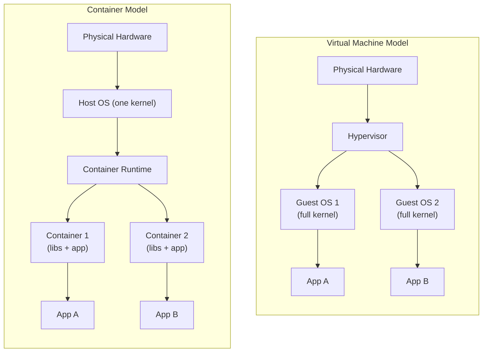
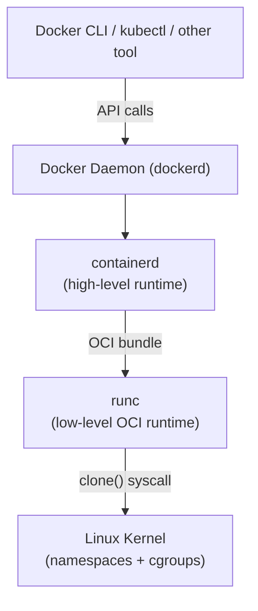

# Virtualization and Containers

## The Problem: "It Works on My Machine"

Picture this: you spend two weeks building a web application on your laptop. It runs perfectly. You hand it off to a teammate, and within minutes they're sending you Slack messages — it crashes immediately on their machine. Sound familiar?

The root cause is almost always environmental differences. Your laptop has Python 3.11, they have Python 3.8. You have a specific version of OpenSSL installed via Homebrew, they're on a different OS entirely. Your app expects an environment variable that you set in your `.bashrc` six months ago and completely forgot about.

This problem is older than Docker. Engineers have been fighting it since the dawn of software. The industry's answer to it has evolved through several generations:

1. **"Just document the setup steps"** — documentation rots, steps drift, and nobody reads it anyway.
2. **Virtual Machines** — provision an entire operating system per application.
3. **Containers** — package just the application and its dependencies, share the host OS kernel.

Understanding *why* each approach exists, and what trade-offs each one makes, is the foundation of everything else in this course.

---

## Virtual Machines: The First Real Answer

A **Virtual Machine (VM)** is a complete software emulation of a computer. You run a piece of software called a **hypervisor** on your physical machine (the "host"), and that hypervisor creates one or more virtual machines (the "guests"). Each guest thinks it's running on real hardware, but it's actually running on virtualized hardware that the hypervisor provides.

### Types of Hypervisors

- **Type 1 (Bare-metal):** Runs directly on the hardware. Examples: VMware ESXi, Microsoft Hyper-V, KVM. Used in data centers.
- **Type 2 (Hosted):** Runs on top of a host OS. Examples: VirtualBox, VMware Workstation, Parallels. Used on developer laptops.

The VM approach genuinely solved the "works on my machine" problem. You package your entire OS + application into a VM image and ship that. If it works in the VM, it works anywhere a hypervisor can run that VM image.

But VMs have costs:

- Each VM includes a full OS kernel, system libraries, and daemons — often gigabytes of overhead.
- Booting a VM takes minutes (it literally boots an OS).
- Running 10 VMs on a server means running 10 full OS copies.
- The hypervisor itself consumes CPU cycles translating instructions.

---

## Containers: A Leaner Answer

A **container** is a process (or group of processes) running on a host OS, isolated from other processes using Linux kernel features. Unlike a VM, a container does **not** have its own kernel — it shares the host OS kernel directly.

The key insight: most of what makes two environments different isn't the kernel. It's the libraries, binaries, configuration files, and environment variables layered on top. Containers package exactly that layer — just the userspace — and nothing more.

### The Linux Features That Make Containers Work

Two kernel features do most of the heavy lifting:

**Namespaces** — isolate what a process can *see*:
- `pid` namespace: the container has its own process ID numbering (PID 1 inside the container isn't PID 1 on the host)
- `net` namespace: the container has its own network interfaces, routing tables, firewall rules
- `mnt` namespace: the container has its own filesystem mount points
- `uts` namespace: the container can have its own hostname
- `ipc` namespace: isolated inter-process communication
- `user` namespace: map container users to different host users

**cgroups (Control Groups)** — control what a process can *use*:
- Limit CPU usage (e.g., max 0.5 cores)
- Limit memory (e.g., max 512 MB)
- Limit disk I/O
- Limit network bandwidth

Together, namespaces + cgroups give you a process that *feels* like it's running alone in its own OS, but is actually just a carefully fenced-off process on the host.

---

## Architecture Comparison

---

## VM vs Container: The Trade-Off Table

| Dimension | Virtual Machine | Container |
|---|---|---|
| **Startup time** | Minutes (OS boot) | Milliseconds (process start) |
| **Size** | GBs (full OS image) | MBs (app + libs only) |
| **Isolation** | Strong (separate kernels) | Weaker (shared kernel) |
| **OS flexibility** | Run any OS on any host | Must match host kernel type |
| **Overhead** | High (hypervisor + full OS) | Low (just process overhead) |
| **Density** | ~10s per host | ~100s per host |
| **Portability** | Heavy (multi-GB images) | Light (layered, cached) |
| **Security** | Better kernel isolation | Kernel vulnerabilities shared |
| **Dev workflow** | Slow to rebuild/redeploy | Fast iteration, fast CI |
| **Best for** | Legacy apps, full OS isolation | Microservices, cloud-native apps |

Neither is universally "better." Many production environments use both — containers run *inside* VMs to get the fast iteration of containers while retaining the strong isolation boundaries of VMs.

---

## The Container Ecosystem

### Docker

When most people say "container," they mean Docker. Docker Inc. popularized containers by wrapping the raw Linux kernel features in a user-friendly CLI and image format. Before Docker (circa 2013), containers existed (Google had been using them internally for years via their internal tool "Borg"), but they were complex to set up.

Docker's key contributions:
- A standard image format (layers + metadata)
- `docker build` / `docker run` CLI workflow
- Docker Hub — a public registry for sharing images
- The Dockerfile — a repeatable recipe for building images

### OCI: Open Container Initiative

As Docker grew dominant, the industry got nervous about one company controlling the container standard. In 2015, Docker donated its image format and runtime specification to the **Open Container Initiative (OCI)**, a neutral standards body under the Linux Foundation.

OCI defines two specs:
- **Image Spec:** what a container image looks like (layers, manifests, config)
- **Runtime Spec:** what a container runtime must do (how to launch a container from an image)

This means any OCI-compliant tool can build images that any OCI-compliant runtime can run. You're not locked into Docker.

### The Runtime Stack

- **runc:** the reference OCI runtime. Given an OCI-compliant filesystem bundle, it calls the Linux kernel to create the container process. Tiny, focused tool.
- **containerd:** manages the container lifecycle above runc. Handles image pull/push, snapshot management, networking plugins. Used by both Docker and Kubernetes.
- **dockerd:** the Docker daemon. The full Docker experience — builds, networks, volumes, the Docker API.

---

## Why Containers Changed Software Delivery

Before containers, deploying software reliably required:

1. A detailed runbook: "install these packages, set these env vars, configure this file..."
2. A dedicated ops team to execute the runbook on every server
3. Snowflake servers: every server slightly different, impossible to reason about
4. Long deployment windows: hours or days, lots of manual steps

After containers:

1. The developer ships a container image that *includes* everything the app needs
2. Operations just runs the image — no runbook, no configuration drift
3. Every environment (dev laptop, CI server, staging, production) runs the exact same image
4. Deployments are as simple as swapping one image version for another

This is why containers are foundational to modern practices like **DevOps**, **CI/CD**, and **microservices**. They close the gap between "it works on my machine" and "it works in production."

---

## Common Mistakes and Misconceptions

### Mistake 1: Treating Containers Like VMs

New users often SSH into a container, install packages interactively, and tweak configuration manually — just like they would with a VM or a bare-metal server. This defeats the entire purpose.

Containers should be **immutable** and **ephemeral**. Any change you want to make to a container should be made to its image (the Dockerfile), and a new container should be built and deployed. If you're SSHing in to fix things, you're doing it wrong.

### Mistake 2: Forgetting That Containers Are Ephemeral

When a container stops and is removed, everything written to its filesystem is gone. If your app writes logs, uploads, or database files directly into the container filesystem, you will lose that data when the container is replaced.

Persistent data needs to live in **volumes** (covered in a later module) — storage that exists outside the container's lifecycle.

### Mistake 3: Assuming Containers Are Fully Isolated

Because containers share the host kernel, a kernel vulnerability can potentially affect all containers on that host. Containers are isolated from each other at the process level, but they're not as isolated as VMs are. For highly sensitive workloads (payment processing, untrusted code execution), you may still want VMs, or a container runtime with stronger isolation guarantees (like gVisor or Kata Containers).

### Mistake 4: Using `:latest` Everywhere

The `latest` tag on a container image doesn't mean "the most recent version" in a reliable, stable way. It just means "whatever was tagged latest when someone last pushed." In production, always pin to a specific image version/digest.

---

## Summary

- **VMs** virtualize hardware; each has its own kernel. Strong isolation, high overhead.
- **Containers** virtualize the userspace; all share one host kernel. Lightweight, fast, but weaker kernel isolation.
- **Namespaces** isolate what a container can see. **cgroups** limit what it can use.
- **Docker** popularized containers by making them approachable. The **OCI** standardized them.
- The runtime stack: `dockerd` → `containerd` → `runc` → Linux kernel.
- Containers solved the "works on my machine" problem by packaging the app *and* its environment together.
- Don't treat containers like VMs. Don't store persistent data inside containers. Don't assume they're fully isolated.

---

## 📂 Navigation

**In this folder:**
| File | |
|---|---|
| 📖 **Theory.md** | ← you are here |
| [⚡ Cheatsheet.md](./Cheatsheet.md) | Quick reference |
| [🎯 Interview_QA.md](./Interview_QA.md) | Interview prep |

➡️ **Next:** [02 — Docker Architecture](../02_Docker_Architecture/Theory.md)
🏠 **[Home](../../README.md)**
