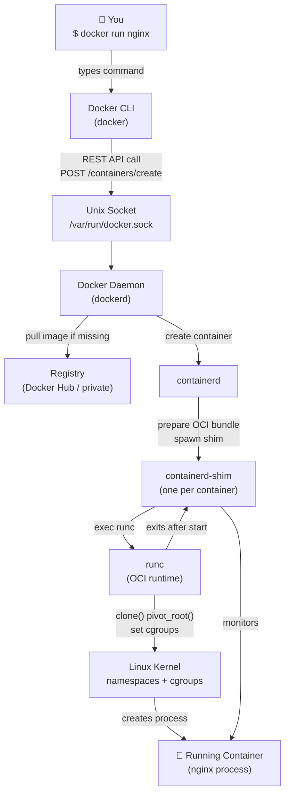
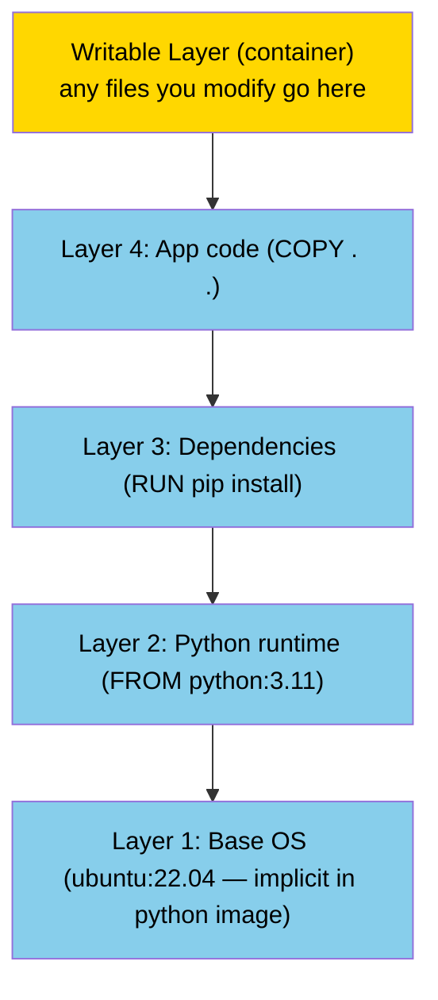
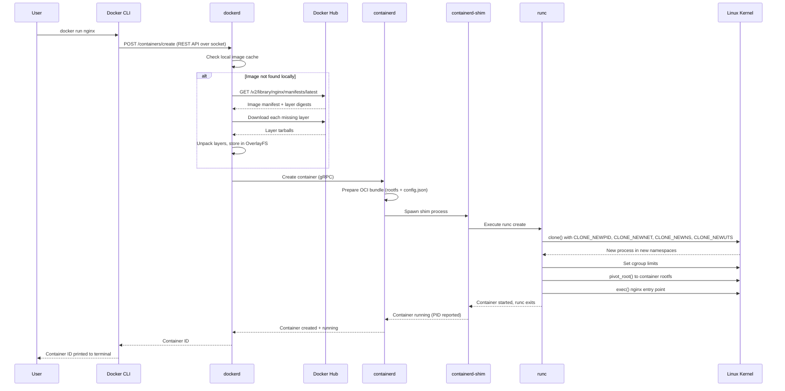

# Docker Architecture

## The Story: Tracing a Single Command

You open your terminal and type:

```
docker run nginx
```

Seven words. Press Enter. Within seconds, a fully configured Nginx web server is running on your machine. But what actually happened? Between your keystroke and that running server, a remarkable chain of events fired across multiple software components, hitting the network, manipulating the filesystem, and making Linux kernel syscalls. Let's trace every step.

Understanding this chain isn't just academic — when something goes wrong (and it will), knowing *which component* in the chain is responsible tells you exactly where to look.

---

## 📌 Learning Priority

**Must Learn** — core concepts, needed to understand the rest of this file:
[Docker Engine Components](#the-components-of-docker-engine) · [runc and containerd roles](#3-containerd) · [Architecture Diagram](#architecture-diagram)

**Should Learn** — important for real projects and interviews:
[Image Layers and OverlayFS](#image-layers-and-the-union-filesystem) · [Docker Registries](#docker-registries) · [End-to-End Sequence](#sequence-diagram-docker-run-nginx-end-to-end)

**Good to Know** — useful in specific situations, not needed daily:
[Docker Socket Security](#the-docker-socket-and-why-its-a-security-concern) · [containerd-shim](#5-shim-containerd-shim)

**Reference** — skim once, look up when needed:
[Common Misconceptions](#common-misconceptions)

---

## The Components of Docker Engine

Docker is not a single program. It's a layered set of components, each with a specific responsibility. When people say "Docker," they usually mean the whole stack:

### 1. Docker Client (`docker` CLI)

The Docker CLI is the tool you type into. It's a thin client — it takes your commands, converts them into API calls, and sends them over a Unix socket (or TCP in remote mode) to the Docker daemon. The CLI itself contains no container-running logic. It's just a translator.

When you type `docker run nginx`, the CLI constructs a JSON body and sends a POST request to `http://localhost/v1.44/containers/create`.

### 2. Docker Daemon (`dockerd`)

The Docker daemon is the long-running background service that does the real work at the Docker level. It:

- Exposes the Docker REST API (consumed by the CLI, CI tools, Portainer, etc.)
- Manages Docker-specific concepts: networks, volumes, `docker build`, image tagging
- Receives container run requests and delegates actual container management to containerd

`dockerd` is what you interact with indirectly. It listens on `/var/run/docker.sock` by default.

### 3. containerd

containerd is a **container lifecycle manager**. It handles:

- Pulling images from registries
- Managing image layers as filesystem snapshots
- Starting and stopping containers (via runc)
- Exposing a gRPC API used by dockerd (and also directly by Kubernetes)

containerd is a CNCF (Cloud Native Computing Foundation) graduated project — separate from Docker Inc. Kubernetes dropped Docker in favor of talking directly to containerd (via the Container Runtime Interface, CRI).

### 4. runc

runc is the **OCI runtime** — the lowest-level component. It's a tiny CLI tool that receives an OCI-formatted filesystem bundle and creates the container process using Linux kernel calls. It:

- Calls `clone()` with namespace flags to create isolated processes
- Sets cgroup limits
- Performs `pivot_root()` to change the root filesystem
- Executes the container's entry point

runc exits after starting the container. containerd then monitors the container's process.

### 5. shim (`containerd-shim`)

Between containerd and runc there's a shim process. For each container, containerd spawns a shim. The shim:

- Calls runc to create the container, then runc exits
- Remains running as the container's "parent" process
- Reports container exit codes back to containerd
- Keeps stdin/stdout/stderr pipes open for `docker logs` and `docker attach`

This design means you can upgrade or restart containerd without killing running containers.

---

## Architecture Diagram



---

## Docker Registries

A **registry** is a server that stores and serves container images. When you `docker pull nginx`, Docker contacts a registry and downloads the image.

**Docker Hub** (`hub.docker.com`) is the default public registry. Images on Docker Hub have short names like `nginx`, `ubuntu`, `python`. These are actually `docker.io/library/nginx` — Docker adds the default registry prefix for you.

**Private registries** are registries you control. Common examples:
- **Amazon ECR** (Elastic Container Registry)
- **Google Artifact Registry**
- **GitHub Container Registry** (ghcr.io)
- **Harbor** (self-hosted, open source)
- **GitLab Container Registry**

To use a private registry, you prefix the image name with the registry hostname:
```
myregistry.example.com/myapp:1.0
```

Authentication:
```bash
docker login myregistry.example.com
docker pull myregistry.example.com/myapp:1.0
```

---

## The Docker Socket and Why It's a Security Concern

The Docker socket at `/var/run/docker.sock` is the Unix socket that the Docker daemon listens on. Whoever can talk to this socket can control Docker — including running containers.

This is a critical security consideration:

- Mounting `/var/run/docker.sock` into a container (a common pattern for CI agents) gives that container full control over the Docker daemon on the host. A compromised container could spawn new privileged containers, escape to the host, or delete everything.
- The `docker` group on Linux effectively gives root-equivalent access. Only add trusted users to this group.
- In production environments, consider:
  - **Rootless Docker** (run dockerd as a non-root user)
  - **Docker socket proxies** like [Tecnativa/docker-socket-proxy](https://github.com/Tecnativa/docker-socket-proxy) that restrict which API calls are allowed
  - **Replacing Docker** in Kubernetes with containerd (no daemon socket to expose)

---

## Image Layers and the Union Filesystem

A Docker image is not a single monolithic file — it's a **stack of read-only layers**. Each layer represents a set of filesystem changes (files added, modified, or deleted). When you run a container, Docker adds one thin **writable layer** on top.

This is managed by a **Union Filesystem** (specifically **OverlayFS** on most modern Linux systems). OverlayFS presents multiple layers as a single merged filesystem view.



**Key consequences:**

- **Layers are reused.** If 10 images all use `ubuntu:22.04` as a base, that base layer is stored once on disk and shared. This is why `docker pull` often says "Already exists" for some layers.
- **The writable container layer is ephemeral.** When you delete a container, the writable layer goes with it. The read-only image layers remain.
- **Copy-on-write (CoW):** If a container modifies a file from a lower read-only layer, OverlayFS copies that file up to the writable layer first, then modifies the copy. The original in the lower layer is unchanged.

---

## Sequence Diagram: `docker run nginx` End to End



---

## Common Misconceptions

**"Docker is the container runtime."**
Docker is a platform that *includes* a container runtime (via containerd + runc). But containerd is increasingly used directly — by Kubernetes, for example — without Docker involved at all.

**"Killing dockerd kills all containers."**
Not true with modern Docker. containerd-shim keeps containers alive if dockerd crashes. You can restart dockerd without stopping running containers.

**"Docker only works on Linux."**
Docker Desktop on macOS and Windows runs a lightweight Linux VM in the background (using Apple's Virtualization framework on macOS, Hyper-V or WSL2 on Windows). Your containers run inside that Linux VM — because containers need a Linux kernel.

---

## Summary

- The Docker CLI is just a client. It talks to `dockerd` via the Docker socket.
- `dockerd` manages Docker-specific concepts and delegates container operations to `containerd`.
- `containerd` pulls images, manages snapshots, and spawns containers via shim + runc.
- `runc` makes the actual Linux kernel calls to create isolated container processes.
- Images are stacked read-only layers; containers add a writable layer on top (OverlayFS/CoW).
- The Docker socket grants root-equivalent access — protect it carefully.
- Kubernetes bypasses dockerd and talks directly to containerd via CRI.


---

## 📝 Practice Questions

- 📝 [Q71 · container-runtime](../docker_practice_questions_100.md#q71--thinking--container-runtime)
- 📝 [Q86 · compare-docker-podman](../docker_practice_questions_100.md#q86--interview--compare-docker-podman)


---

## 📂 Navigation

**In this folder:**
| File | |
|---|---|
| 📖 **Theory.md** | ← you are here |
| [⚡ Cheatsheet.md](./Cheatsheet.md) | Quick reference |
| [🎯 Interview_QA.md](./Interview_QA.md) | Interview prep |

⬅️ **Prev:** [01 — Virtualization and Containers](../01_Virtualization_and_Containers/Theory.md) &nbsp;&nbsp;&nbsp; ➡️ **Next:** [03 — Installation and Setup](../03_Installation_and_Setup/Theory.md)
🏠 **[Home](../../README.md)**
