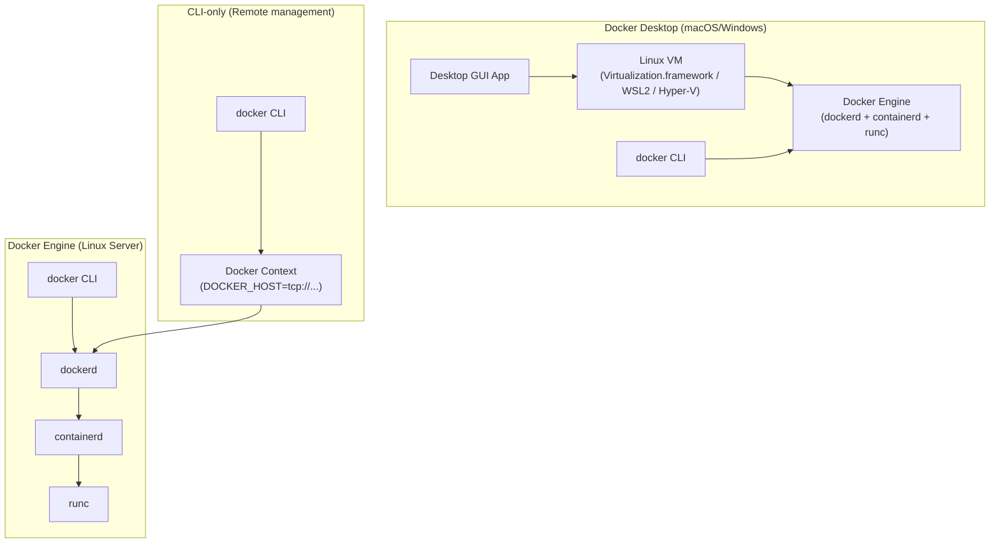

# Installation and Setup

## The Story: Getting Your Workshop Ready

Before a carpenter can build anything, they need their workshop set up — workbench assembled, tools in their right places, saw calibrated, safety checks done. There's no point grabbing a plank of wood until the environment is ready.

Installing Docker is exactly that: setting up your workshop before the real work begins. Most people rush through installation, miss a post-install step, and then spend an hour debugging why `docker run` requires `sudo` or why containers can't reach the internet. This module does it right.

---

## Understanding What You're Actually Installing

The phrase "install Docker" is ambiguous. Depending on your platform and use case, you might be installing very different things:

### Docker Engine (Linux)

This is the original Docker — `dockerd`, the daemon, plus the `docker` CLI. It runs natively on Linux because containers are a Linux technology. No virtualization layer in between. This is what servers, CI runners, and production nodes run.

Components installed:
- `dockerd` — the daemon
- `docker` — the CLI
- `containerd` — container runtime
- `runc` — OCI runtime

### Docker Desktop (macOS and Windows)

Docker Desktop is a **graphical application** that installs and manages a lightweight Linux VM on your Mac or Windows machine. All containers run inside that VM. From your terminal, the `docker` CLI talks through a special socket that proxies into the VM.

On macOS, Docker Desktop uses Apple's **Virtualization Framework** (or HyperKit on older Macs) to run the VM. On Windows, it uses either **WSL2** (Windows Subsystem for Linux version 2) or **Hyper-V**.

Docker Desktop also includes:
- A GUI dashboard for managing containers, images, and volumes
- Docker Compose (built in)
- Kubernetes (optional, single-node, toggle on/off)
- Volume and port forwarding between your Mac/Windows filesystem and the Linux VM

### Docker CLI only

The `docker` CLI can be installed without the daemon. You'd point it at a remote daemon using `DOCKER_HOST` environment variable or Docker contexts. Useful for managing remote servers from your laptop.

---

## Installation: macOS (Docker Desktop)

```bash
# Option 1: Download the .dmg from https://www.docker.com/products/docker-desktop/
# Drag Docker.app to /Applications, open it

# Option 2: Install via Homebrew (recommended for developers)
brew install --cask docker

# After installation, launch Docker Desktop from Applications
# Wait for the whale icon in the menu bar to stop animating
# This means the Linux VM has started and the daemon is ready

# Verify installation
docker version
docker run hello-world
```

Note: Docker Desktop requires macOS 13 (Ventura) or later for the latest versions. Always check the release notes.

---

## Installation: Linux (Ubuntu/Debian)

The package in Ubuntu's default apt repository (`docker.io`) is often outdated. Use Docker's official repository:

```bash
# 1. Remove any old versions
sudo apt remove docker docker-engine docker.io containerd runc 2>/dev/null

# 2. Install prerequisites
sudo apt update
sudo apt install -y ca-certificates curl gnupg lsb-release

# 3. Add Docker's official GPG key
sudo install -m 0755 -d /etc/apt/keyrings
curl -fsSL https://download.docker.com/linux/ubuntu/gpg \
  | sudo gpg --dearmor -o /etc/apt/keyrings/docker.gpg
sudo chmod a+r /etc/apt/keyrings/docker.gpg

# 4. Add Docker's repository
echo \
  "deb [arch=$(dpkg --print-architecture) signed-by=/etc/apt/keyrings/docker.gpg] \
  https://download.docker.com/linux/ubuntu \
  $(lsb_release -cs) stable" | \
  sudo tee /etc/apt/sources.list.d/docker.list > /dev/null

# 5. Install Docker Engine
sudo apt update
sudo apt install -y docker-ce docker-ce-cli containerd.io docker-buildx-plugin docker-compose-plugin

# 6. Start and enable Docker
sudo systemctl start docker
sudo systemctl enable docker
```

---

## Installation: Linux (RHEL/CentOS/Fedora)

```bash
# Remove old versions
sudo yum remove docker docker-client docker-client-latest docker-common \
  docker-latest docker-latest-logrotate docker-logrotate docker-engine

# Add Docker repo
sudo yum install -y yum-utils
sudo yum-config-manager --add-repo \
  https://download.docker.com/linux/centos/docker-ce.repo

# Install
sudo yum install -y docker-ce docker-ce-cli containerd.io \
  docker-buildx-plugin docker-compose-plugin

# Start and enable
sudo systemctl start docker
sudo systemctl enable docker
```

---

## Installation: Windows (WSL2)

The recommended approach for Windows is Docker Desktop with WSL2 backend:

1. Enable WSL2:
```powershell
# In PowerShell (Administrator)
wsl --install
# Restart your machine
wsl --set-default-version 2
```

2. Download and install Docker Desktop from `https://www.docker.com/products/docker-desktop/`

3. In Docker Desktop settings → Resources → WSL Integration → enable integration for your Linux distro.

4. Open your WSL2 terminal and verify:
```bash
docker version
docker run hello-world
```

---

## Post-Install: Critical Steps (Linux)

### Add Your User to the `docker` Group

By default, the Docker socket is owned by root and the `docker` group. Running `docker` without `sudo` requires being in this group.

```bash
sudo usermod -aG docker $USER

# The group membership takes effect on next login.
# To apply immediately in the current shell:
newgrp docker

# Verify (you should see docker in the list)
groups
```

**Security note:** Members of the `docker` group have effective root access on the host. Only add trusted users.

### Verify Docker is Working

```bash
docker info        # full daemon info — storage driver, cgroup driver, etc.
docker version     # client and server (daemon) versions

# Run the official hello-world container to confirm end-to-end works
docker run hello-world
```

---

## Your First Container: `docker run hello-world` Explained

When you run `docker run hello-world`, here's exactly what you see and what each line means:

```
Unable to find image 'hello-world:latest' locally
```
Docker checked the local image cache. The image wasn't there.

```
latest: Pulling from library/hello-world
```
Docker is pulling the `hello-world` image from Docker Hub (`docker.io/library/hello-world`).

```
c1ec31eb5944: Pull complete
```
A single layer was downloaded.

```
Digest: sha256:d211f485f2dd1dee407a80973c8f129f00d54604d2c90732e8e320e5038a0348
```
The image's content-addressed SHA256 hash — a unique fingerprint. Use this for pinning to an exact version.

```
Status: Downloaded newer image for hello-world:latest
```
Download complete, image stored locally.

```
Hello from Docker!
This message shows that your installation appears to be working correctly.
```
The hello-world container's process ran, printed this message, and exited. The container is now in "exited" state.

---

## Docker Desktop vs Docker Engine vs Docker CLI



---

## Docker Contexts

A **Docker context** lets you configure which Docker daemon your CLI talks to. You can have multiple contexts and switch between them.

```bash
# List contexts
docker context ls

# Create a context for a remote server
docker context create my-server \
  --docker "host=ssh://user@my-server.example.com"

# Switch to the remote context
docker context use my-server

# All docker commands now talk to the remote daemon
docker ps

# Switch back to local
docker context use default
```

This is useful for managing multiple environments (dev, staging, prod) from one machine without SSH-ing in separately.

---

## Key Directories: Where Docker Stores Things

| Directory | What's in it |
|---|---|
| `/var/lib/docker/` | Docker's data root — everything Docker manages |
| `/var/lib/docker/overlay2/` | Image layer data (OverlayFS) — usually the largest directory |
| `/var/lib/docker/containers/` | Per-container metadata, config.json, log files |
| `/var/lib/docker/volumes/` | Named volume data |
| `/var/lib/docker/image/` | Image metadata (manifests, layer references) |
| `/var/lib/docker/network/` | Docker network configurations |
| `/etc/docker/daemon.json` | Daemon configuration (storage driver, log driver, registries, etc.) |

Check disk usage:
```bash
docker system df          # summary of images, containers, volumes, build cache
docker system df -v       # verbose, per-item breakdown
```

---

## Common Installation Pitfalls

**"Got permission denied while trying to connect to the Docker daemon socket"**
You haven't added your user to the `docker` group, or you haven't started a new session after doing so. Run `newgrp docker` or log out and back in.

**"Cannot connect to the Docker daemon at unix:///var/run/docker.sock"**
The daemon isn't running. On Linux: `sudo systemctl start docker`. On macOS/Windows: open Docker Desktop.

**"Error response from daemon: OCI runtime create failed: ... no such file or directory"**
Usually a kernel version issue or missing containerd/runc. Reinstall from the official Docker repository.

**Docker Desktop on macOS is slow**
File I/O between the macOS filesystem and the Linux VM is the bottleneck. Use Docker volumes instead of bind mounts for database files and node_modules. The VirtioFS file sharing mode (newer Docker Desktop) is significantly faster than the older osxfs.

---

## Summary

- Docker Desktop (macOS/Windows) runs containers in a Linux VM — always. Containers need a Linux kernel.
- Docker Engine (Linux) runs containers natively — no VM, maximum performance.
- Always install from Docker's official repository on Linux, not the distro's built-in package.
- Add your user to the `docker` group for non-sudo access, but understand the security implications.
- `/var/lib/docker/` is where Docker stores all its data — images, containers, volumes.
- Docker contexts let you manage multiple remote Docker daemons from one CLI.

---

## 📂 Navigation

**In this folder:**
| File | |
|---|---|
| 📖 **Theory.md** | ← you are here |
| [⚡ Cheatsheet.md](./Cheatsheet.md) | Quick reference |
| [🎯 Interview_QA.md](./Interview_QA.md) | Interview prep |

⬅️ **Prev:** [02 — Docker Architecture](../02_Docker_Architecture/Theory.md) &nbsp;&nbsp;&nbsp; ➡️ **Next:** [04 — Images and Layers](../04_Images_and_Layers/Theory.md)
🏠 **[Home](../../README.md)**
