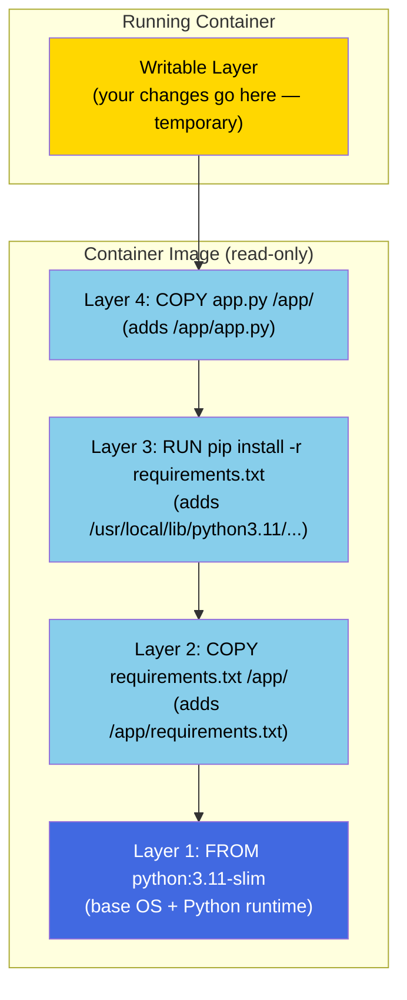

# Images and Layers

## The Story: Shipping Containers and Standardized Boxes

Before the 1950s, shipping cargo was chaotic. Every dock worker loaded goods differently — barrels, crates, sacks, all piled together however they fit. Unloading a ship in New York was completely different from loading it in Rotterdam. The process was slow, expensive, and error-prone.

Then Malcolm McLean invented the standardized shipping container — a metal box with fixed dimensions, fixed corner fittings, and a universal interface. Every crane, ship, truck, and warehouse on Earth was designed around that same box. Suddenly, cargo didn't care how it was transported. Load the box in China, ship it to Germany, put it on a truck, deliver it — the contents never touched human hands.

Docker images are exactly that standardized container. They're portable, immutable, standard boxes. Your application goes in. It doesn't care whether it's running on a developer's MacBook (inside a Linux VM), a CI runner in GitHub Actions, a staging server in AWS, or production in GCP. The image is the same. The environment inside is the same. The "it works on my machine" problem disappears — because the machine is inside the box.

---

## What Is a Container Image?

A **container image** is a read-only, layered filesystem bundle plus metadata (environment variables, the command to run, port information, etc.). Think of it as a template — you create containers from images, just like you create objects from a class in programming.

Key properties:

- **Read-only:** You cannot modify an image. When you run a container from it, Docker adds a thin writable layer on top, but the image itself is never changed.
- **Layered:** An image is composed of multiple stacked layers. Each layer represents a set of filesystem changes from a particular build step.
- **Content-addressed:** Each layer is identified by the SHA256 hash of its content. Two layers with the same content have the same hash and are stored only once.
- **Portable:** Images conform to the OCI Image Specification and can be run by any OCI-compatible runtime.

---

## What a Layer Actually Is

Each layer in a Docker image stores a **diff** — the filesystem changes introduced by one Dockerfile instruction (or by one commit in the image's history). It records:

- Files added
- Files modified
- Files deleted (using "whiteout" files — marker files that tell OverlayFS a file from a lower layer should be hidden)

When you write a Dockerfile like this:

```dockerfile
FROM ubuntu:22.04        # Layer 1 (from the ubuntu image)
RUN apt install -y curl  # Layer 2 (added curl + its dependencies)
COPY app.py /app/        # Layer 3 (added app.py at /app/)
```

Each instruction produces a new layer. The final image is those layers stacked.

---

## Layer Architecture Diagram



---

## Image IDs, Digests, and Tags

These are three different ways to refer to an image. Understanding the difference prevents a lot of confusion.

### Tags

A **tag** is a human-readable label that points to an image. Tags are mutable — they can be updated to point to a new image version at any time.

```
nginx:1.25.3       # the nginx image, version 1.25.3
nginx:latest       # the nginx image, "latest" tag
nginx              # same as nginx:latest (tag defaults to latest)
python:3.11-slim   # python 3.11, slim variant
```

**The `latest` trap:** The tag `latest` does NOT automatically mean "the most recent version." It's just a tag like any other — it only means "the most recent version" if the maintainer bothered to update it. On Docker Hub, `latest` is usually updated to the newest release, but never rely on this in production. Pin to a specific version.

### Image IDs

When you run `docker images`, you see short Image IDs like `a8780b506fa4`. These are the first 12 characters of the full SHA256 hash of the image's **manifest** (its metadata). They're local to your Docker daemon.

### Digests

A **digest** is the full SHA256 hash of an image manifest, prefixed with `sha256:`. It's the true immutable identifier for an image.

```
nginx@sha256:d711f485f2dd1dee407a80973c8f129f00d54604d2c90732e8e320e5038a0348
```

If you pull `nginx@sha256:...`, you always get exactly that image — no ambiguity, no tag drift. Use digests in production for repeatability.

---

## Essential Image Commands

### Pulling Images

```bash
# Pull by tag (default registry: Docker Hub)
docker pull nginx
docker pull nginx:1.25.3

# Pull by digest (exact, immutable)
docker pull nginx@sha256:d711f485f2dd1dee407a80973c8f129f00d54604d2c90732e8e320e5038a0348

# Pull for a specific platform
docker pull --platform linux/arm64 nginx
```

### Listing Images

```bash
docker images                         # list all local images
docker images nginx                   # list all local nginx images (all tags)
docker images --digests               # include digest column
docker images --filter dangling=true  # list dangling (untagged) images
```

### Inspecting Images

```bash
# Full metadata as JSON
docker inspect nginx

# Just the image ID
docker inspect --format '{{.Id}}' nginx

# Environment variables embedded in the image
docker inspect --format '{{json .Config.Env}}' nginx | jq .

# Exposed ports
docker inspect --format '{{json .Config.ExposedPorts}}' nginx
```

### Viewing Layer History

```bash
docker history nginx                  # show all layers and the commands that created them
docker history nginx --no-trunc       # show full commands (not truncated)
docker history --format "{{.Size}}\t{{.CreatedBy}}" nginx
```

---

## Layer Caching: Docker's Superpower (and Gotcha)

Docker builds are fast when caching works. The rule is:

**A layer is reused from cache if and only if:**
1. The instruction is identical to the cached instruction, AND
2. Every layer below it was also reused from cache

The moment any layer is invalidated (instruction changed, or files changed for COPY/ADD), all subsequent layers are also invalidated. This is why instruction order in a Dockerfile matters enormously.

### The Classic Cache Mistake

```dockerfile
# BAD: copies all source code before installing dependencies
FROM node:20-alpine
WORKDIR /app
COPY . .                     # copies everything — changes to any .js file breaks cache here
RUN npm install              # runs npm install every time, even if package.json didn't change
```

```dockerfile
# GOOD: install dependencies first (they change less often)
FROM node:20-alpine
WORKDIR /app
COPY package.json package-lock.json ./   # only copy what npm needs
RUN npm install              # cached as long as package.json doesn't change
COPY . .                     # copy source code last — changes here don't bust npm cache
```

In the good version, `npm install` is only re-run when `package.json` or `package-lock.json` changes. Changing your application source files (`*.js`) only rebuilds the final `COPY` layer.

---

## Image Naming: The Full Format

The full format of an image name is:

```
[registry/][namespace/]repository[:tag][@digest]
```

Examples:

| Short form | Full form |
|---|---|
| `nginx` | `docker.io/library/nginx:latest` |
| `myuser/myapp` | `docker.io/myuser/myapp:latest` |
| `myapp:1.0` | `docker.io/myuser/myapp:1.0` (if you're logged in) |
| `ghcr.io/org/app:v2` | `ghcr.io/org/app:v2` |
| `123.dkr.ecr.us-east-1.amazonaws.com/api:prod` | AWS ECR full path |

### Tagging

```bash
# Tag an image with a new name (creates an alias — same underlying image)
docker tag nginx:latest myregistry.example.com/infra/nginx:1.25.3

# The original tag and the new tag point to the same image ID
docker images | grep nginx
```

---

## Dangling Images and Cleanup

A **dangling image** is an untagged image — it has no name, only a hash. They accumulate when you rebuild images (the old image loses its tag to the new one) or when multi-stage builds leave intermediate layers behind.

```bash
# List dangling images (they show as <none>:<none>)
docker images --filter dangling=true

# Remove dangling images
docker image prune

# Remove ALL unused images (no running container references them)
docker image prune -a

# Nuclear option: clean everything (images, stopped containers, unused networks, build cache)
docker system prune -a
```

---

## Multi-Platform Images

Modern registries (Docker Hub, ECR, etc.) support **multi-platform image manifests** — a single image tag that works on multiple CPU architectures. When you pull `nginx` on an Intel Mac, you get the `linux/amd64` image. On an M1/M2/M3 Mac, you get `linux/arm64`. Same tag, different underlying layers.

```bash
# See what platforms an image supports
docker buildx imagetools inspect nginx

# Pull a specific platform (useful for CI on ARM running amd64 images)
docker pull --platform linux/amd64 nginx
```

---

## Summary

- A Docker image is a read-only stack of layers plus metadata.
- Each layer is a filesystem diff — files added, changed, or deleted by one build instruction.
- Layers are content-addressed (SHA256). Identical layers are stored once and shared.
- Tags are mutable labels; digests are immutable content hashes. Use digests in production.
- `latest` is just a tag — it doesn't guarantee recency. Always pin versions in production.
- Layer caching is powerful: put stable layers early in the Dockerfile, frequently-changing layers last.
- Dangling images accumulate over time; clean them with `docker image prune`.

---

## 📂 Navigation

**In this folder:**
| File | |
|---|---|
| 📖 **Theory.md** | ← you are here |
| [⚡ Cheatsheet.md](./Cheatsheet.md) | Quick reference |
| [🎯 Interview_QA.md](./Interview_QA.md) | Interview prep |
| [💻 Code_Example.md](./Code_Example.md) | Working code |

⬅️ **Prev:** [03 — Installation and Setup](../03_Installation_and_Setup/Theory.md) &nbsp;&nbsp;&nbsp; ➡️ **Next:** [05 — Dockerfile](../05_Dockerfile/Theory.md)
🏠 **[Home](../../README.md)**
