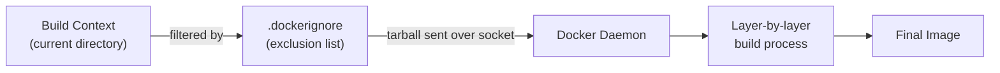
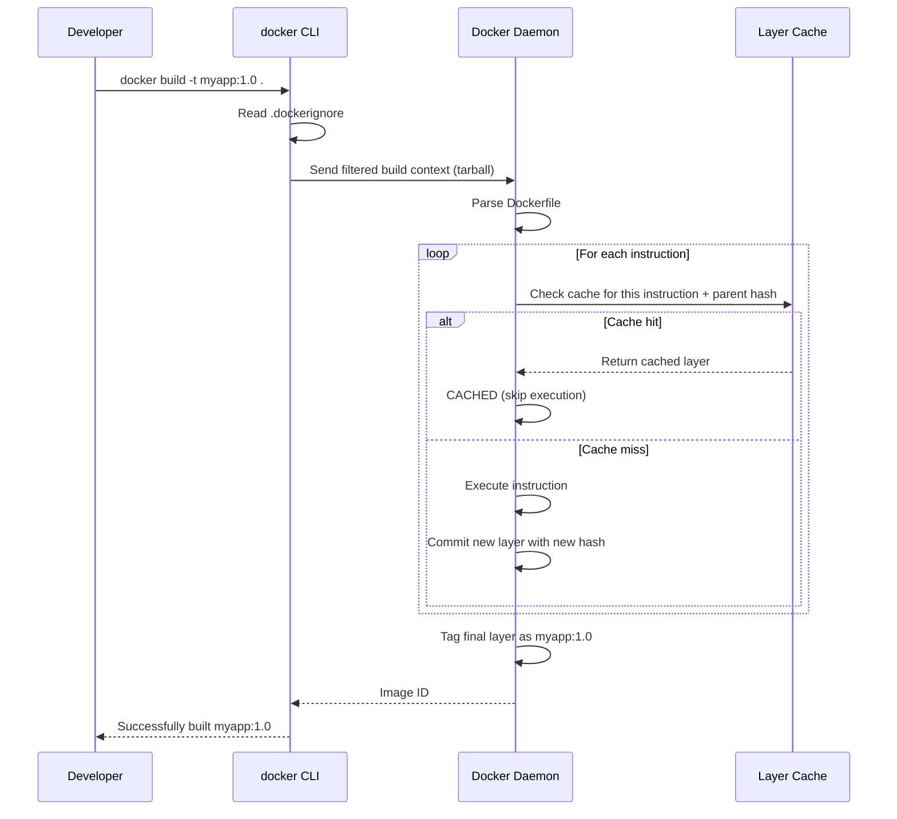

# Dockerfile

## The Story: A Recipe Card for Your Application

Imagine you've perfected a recipe for a complex dish — say, a three-layer French pastry. You've dialed in every detail: the exact type of flour, the temperature of the butter, the precise oven timing. If someone else wants to recreate your dish exactly, you hand them the recipe card. Not the dish itself — the *instructions* for creating the dish, from scratch, every time.

A Dockerfile is that recipe card. It's a text file containing step-by-step instructions for building a Docker image. Anyone with your Dockerfile can produce an identical image. The image is reproducible, shareable, and version-controlled right alongside your source code.

Before Dockerfiles existed, shipping software meant writing multi-page runbooks: "install package X, then configure file Y, then set environment variable Z..." Runbooks rotted. Steps drifted. New team members spent days getting set up. The Dockerfile collapsed all of that into a few lines of text that Docker executes automatically, deterministically, every single time.

---

## 📌 Learning Priority

**Must Learn** — core concepts, needed to understand the rest of this file:
[Build Context](#the-build-context) · [FROM, RUN, COPY, WORKDIR](#from--choose-your-starting-ingredients) · [CMD vs ENTRYPOINT](#cmd-vs-entrypoint--what-happens-when-you-serve-the-dish)

**Should Learn** — important for real projects and interviews:
[ENV and ARG](#env--setting-the-kitchen-temperature) · [USER for Security](#user--whos-allowed-in-the-kitchen) · [Layer Caching Strategy](#layer-caching-strategy-stable--changing)

**Good to Know** — useful in specific situations, not needed daily:
[HEALTHCHECK](#healthcheck--quality-check-before-serving) · [.dockerignore](#dockerignore-what-not-to-send-to-the-daemon) · [EXPOSE](#expose--labeling-the-serving-window)

**Reference** — skim once, look up when needed:
[LABEL](#label--attaching-metadata) · [Build Sequence Diagram](#build-context-and-layer-build-sequence)

---

## The Build Context

Before diving into individual instructions, understand the **build context** — a concept that trips up many beginners.

When you run `docker build .`, the `.` tells Docker to use your current directory as the build context. Docker sends everything in that directory to the Docker daemon over the socket. The daemon then executes your Dockerfile against that context.

Consequences:
- **Only files in the build context can be copied into the image.** You can't `COPY ../other-project/file.txt` — that file is outside the context.
- **Large build contexts slow down builds.** If you have a `node_modules` directory with 50,000 files, all of them are sent to the daemon every build — even if you don't copy them into the image.
- **Use `.dockerignore`** to exclude files from the context (covered at the end of this module).



---

## Every Dockerfile Instruction, with Analogies

### FROM — Choose Your Starting Ingredients

```dockerfile
FROM python:3.11-slim
```

Every Dockerfile must start with `FROM`. It specifies the **base image** — the starting point your image builds upon. Think of it as choosing which kitchen you're working in, already stocked with certain ingredients.

- `FROM scratch` — an empty image. You bring everything. Used for statically compiled binaries (Go programs, C programs).
- `FROM ubuntu:22.04` — a full Ubuntu OS. Lots of tools, large size.
- `FROM python:3.11-slim` — Python pre-installed, on a minimal Debian base.
- `FROM python:3.11-alpine` — Python on Alpine Linux (even smaller, but can have compatibility issues).

**Best practice:** use specific version tags, not `latest`. `FROM python:3.11-slim` is reproducible. `FROM python:latest` could break you when Python 4 ships.

---

### RUN — Steps Taken During Cooking

```dockerfile
RUN apt-get update && apt-get install -y curl git && rm -rf /var/lib/apt/lists/*
```

`RUN` executes a command **during the build** and commits the result as a new layer. It's the main way to install software, compile code, or modify files.

Key rules:
- **Each `RUN` creates a new layer.** Combine related commands with `&&` to reduce layer count and keep deletions in the same layer as additions.
- **`rm -rf /var/lib/apt/lists/*` must be in the same `RUN` as `apt-get install`**, not a separate instruction. If it's a separate `RUN`, the apt cache still exists in the install layer (just hidden by the delete layer — but it's still on disk).
- **Shell form vs exec form:**
  - Shell form: `RUN apt-get install -y curl` — runs in `/bin/sh -c "..."`, supports shell features like `&&`, `||`, variable expansion.
  - Exec form: `RUN ["apt-get", "install", "-y", "curl"]` — no shell, exact command. Useful for images that don't have `/bin/sh`.

---

### COPY vs ADD — Putting Ingredients In

```dockerfile
COPY requirements.txt /app/
COPY --chown=appuser:appuser . /app/
ADD https://example.com/config.tar.gz /etc/myapp/   # don't do this
```

Both `COPY` and `ADD` copy files from the build context into the image. **Use `COPY` almost always.**

`ADD` has extra (surprising) behavior:
- It can download URLs directly into the image — but this bypasses layer caching and is generally a bad idea. Use `RUN curl` or `RUN wget` instead, so you control the download.
- It auto-extracts tar archives — which can be surprising. Sometimes useful, but often not what you want.

`COPY` does exactly one thing: copies files. No surprises. Use it.

`--chown` sets the owner of copied files:
```dockerfile
COPY --chown=1000:1000 app.py /app/app.py
```

---

### WORKDIR — Your Working Counter

```dockerfile
WORKDIR /app
```

`WORKDIR` sets the working directory for all subsequent `RUN`, `CMD`, `ENTRYPOINT`, `COPY`, and `ADD` instructions. Think of it as `cd` for your Dockerfile, except it also *creates* the directory if it doesn't exist.

**Never use `RUN cd /some/dir && do-something`** — the directory change doesn't persist between `RUN` instructions. Use `WORKDIR` instead.

You can use multiple `WORKDIR` instructions in one Dockerfile. Multi-stage builds often switch directories between stages.

---

### ENV — Setting the Kitchen Temperature

```dockerfile
ENV APP_ENV=production
ENV PORT=8080
ENV DATABASE_URL=postgresql://user:pass@db:5432/mydb
```

`ENV` sets environment variables that are available **both during the build** (in subsequent `RUN` instructions) and **at runtime** (when the container runs). They're baked into the image.

You can override `ENV` values when running a container:
```bash
docker run -e DATABASE_URL=postgresql://other-host/db myapp
```

**Do not put secrets in `ENV`.** Anyone who can run `docker inspect` on the image will see them. Use runtime secrets injection or Docker secrets instead.

---

### ARG — Ingredient Variations Per Batch

```dockerfile
ARG PYTHON_VERSION=3.11
FROM python:${PYTHON_VERSION}-slim
ARG APP_VERSION=dev
LABEL version=${APP_VERSION}
```

`ARG` defines build-time variables — values you can pass in at build time with `--build-arg`, but which do **not** persist in the final image.

```bash
docker build --build-arg APP_VERSION=1.2.3 --build-arg PYTHON_VERSION=3.12 .
```

`ARG` vs `ENV`:
- `ARG` — build-time only. Not visible in running containers. Good for versions, paths used during build.
- `ENV` — persists in image AND containers. Good for runtime configuration.
- Important: `ARG` before `FROM` can parameterize the base image. `ARG` after `FROM` is scoped to that build stage.

---

### CMD vs ENTRYPOINT — What Happens When You Serve the Dish

These two are the most commonly confused Dockerfile instructions.

**`CMD`** provides the *default command* to run when the container starts. It can be completely replaced by arguments passed to `docker run`.

```dockerfile
CMD ["python", "app.py"]        # default: run python app.py
```

```bash
docker run myapp                  # runs: python app.py
docker run myapp python debug.py  # overrides CMD: runs python debug.py
```

**`ENTRYPOINT`** defines the *executable* that always runs. Arguments passed to `docker run` are appended to the entrypoint, not replacing it.

```dockerfile
ENTRYPOINT ["python"]
CMD ["app.py"]                    # default argument to the entrypoint
```

```bash
docker run myapp                  # runs: python app.py
docker run myapp debug.py         # runs: python debug.py  (CMD replaced, ENTRYPOINT fixed)
docker run --entrypoint /bin/sh myapp   # override ENTRYPOINT explicitly
```

**Common patterns:**
- `CMD` only: flexible container, command easily overridden. Good for base images and developer use.
- `ENTRYPOINT` + `CMD`: the container behaves like a specific executable. `CMD` provides default args. Good for tool images (`docker run mytool --help`).
- `ENTRYPOINT` shell script: run `ENTRYPOINT ["/docker-entrypoint.sh"]` for setup/initialization logic, then `exec "$@"` at the end to hand off to CMD.

**Always use exec form for ENTRYPOINT/CMD:**
```dockerfile
# GOOD — exec form, process is PID 1, receives signals properly
ENTRYPOINT ["python", "app.py"]

# BAD — shell form, shell is PID 1, signals not forwarded to your app
ENTRYPOINT python app.py
```

---

### EXPOSE — Labeling the Serving Window

```dockerfile
EXPOSE 8080
EXPOSE 443/tcp
EXPOSE 5353/udp
```

`EXPOSE` is **documentation only** — it does not publish the port. It signals to the person running the container (and to tooling like `docker run -P`) what ports the application listens on.

To actually publish a port, use `-p` at runtime:
```bash
docker run -p 8080:8080 myapp    # publish: host_port:container_port
docker run -P myapp              # publish all EXPOSED ports to random host ports
```

---

### USER — Who's Allowed in the Kitchen

```dockerfile
# Create a non-root user
RUN groupadd -r appgroup && useradd -r -g appgroup appuser
USER appuser
```

By default, containers run as `root` (UID 0). Running as root inside a container is a security risk — if an attacker escapes the container, they have root on the host (especially in non-rootless Docker setups).

**Always switch to a non-root user before the final `CMD`/`ENTRYPOINT`.**

```dockerfile
FROM python:3.11-slim
WORKDIR /app
COPY requirements.txt .
RUN pip install -r requirements.txt

# Create non-root user
RUN useradd -m -u 1001 appuser

# Copy app files with correct ownership
COPY --chown=appuser:appuser . .

# Switch to non-root user
USER appuser

CMD ["python", "app.py"]
```

---

### HEALTHCHECK — Quality Check Before Serving

```dockerfile
HEALTHCHECK --interval=30s --timeout=5s --start-period=10s --retries=3 \
  CMD curl -f http://localhost:8080/health || exit 1
```

`HEALTHCHECK` tells Docker how to test whether a container is still healthy. Docker will periodically run this command inside the container. If it returns non-zero, the container is marked `unhealthy`.

Options:
- `--interval`: how often to run the check (default: 30s)
- `--timeout`: how long to wait for the command (default: 30s)
- `--start-period`: grace period after start before failures count (default: 0s)
- `--retries`: how many failures before marking unhealthy (default: 3)

Container orchestrators (Docker Compose, Swarm, Kubernetes) use health status for:
- Not routing traffic to unhealthy containers
- Restarting unhealthy containers
- Waiting for a service to be healthy before starting dependent services

---

### LABEL — Attaching Metadata

```dockerfile
LABEL maintainer="team@example.com"
LABEL org.opencontainers.image.source="https://github.com/example/myapp"
LABEL org.opencontainers.image.version="1.2.3"
LABEL org.opencontainers.image.description="My application"
```

`LABEL` attaches key-value metadata to the image. Zero size impact. Query with:
```bash
docker inspect --format '{{json .Config.Labels}}' myapp | jq .
```

Use [OCI standard label names](https://github.com/opencontainers/image-spec/blob/main/annotations.md) for tooling compatibility.

---

## .dockerignore: What NOT to Send to the Daemon

`.dockerignore` lives in the same directory as your Dockerfile. It uses `.gitignore`-style syntax to exclude files and directories from the build context.

```
# .dockerignore
.git                    # never send .git to the daemon
node_modules            # already installed in the container, no need to copy
*.md                    # documentation not needed in image
.env                    # NEVER include secrets
.env.*
__pycache__
*.pyc
*.pyo
dist/
build/
.vscode/
.idea/
Dockerfile              # the Dockerfile itself doesn't need to be in the image
docker-compose*.yml
tests/
```

A well-maintained `.dockerignore` dramatically reduces build context size and prevents accidentally copying sensitive files (`.env`, credentials, private keys) into images.

---

## Build Context and Layer Build Sequence



---

## Layer Caching Strategy: Stable → Changing

Organize your Dockerfile so that the least-frequently-changing instructions are at the top, and the most-frequently-changing are at the bottom:

```
1. FROM (almost never changes)
2. Install system packages (changes when OS deps change — rarely)
3. Copy dependency manifests ONLY (package.json, requirements.txt, go.mod)
4. Install application dependencies (cached if manifests unchanged)
5. Copy application source code (changes every commit)
6. Build/compile if needed
7. Set metadata (USER, EXPOSE, HEALTHCHECK, CMD)
```

---

## Summary

- A Dockerfile is a reproducible recipe for building a container image.
- `FROM`: base image. `RUN`: build-time commands. `COPY`: bring files in. `WORKDIR`: set working directory.
- `ENV`: runtime + build-time env vars. `ARG`: build-time only variables.
- `ENTRYPOINT`: fixed executable. `CMD`: default arguments (overridable at runtime).
- Always use exec form `["cmd", "arg"]` for `ENTRYPOINT` and `CMD` to ensure proper signal handling.
- Run as a non-root `USER` for security.
- Add a `HEALTHCHECK` so orchestrators know when your container is ready.
- `.dockerignore` keeps secrets out of images and builds fast.
- Put stable layers first, changing layers last — maximize cache hits.


---

## 📝 Practice Questions

- 📝 [Q61 · dockerfile-healthcheck](../docker_practice_questions_100.md#q61--thinking--dockerfile-healthcheck)
- 📝 [Q77 · compare-entrypoint-cmd](../docker_practice_questions_100.md#q77--interview--compare-entrypoint-cmd)


---

🚀 **Apply this:** Build a production Dockerfile → [Project 01 — Dockerize a Python App](../../05_Capstone_Projects/01_Dockerize_a_Python_App/01_MISSION.md)
## 📂 Navigation

**In this folder:**
| File | |
|---|---|
| 📖 **Theory.md** | ← you are here |
| [⚡ Cheatsheet.md](./Cheatsheet.md) | Quick reference |
| [🎯 Interview_QA.md](./Interview_QA.md) | Interview prep |
| [💻 Code_Example.md](./Code_Example.md) | Working code |

⬅️ **Prev:** [04 — Images and Layers](../04_Images_and_Layers/Theory.md) &nbsp;&nbsp;&nbsp; ➡️ **Next:** [06 — Container Lifecycle](../06_Containers_Lifecycle/Theory.md)
🏠 **[Home](../../README.md)**
