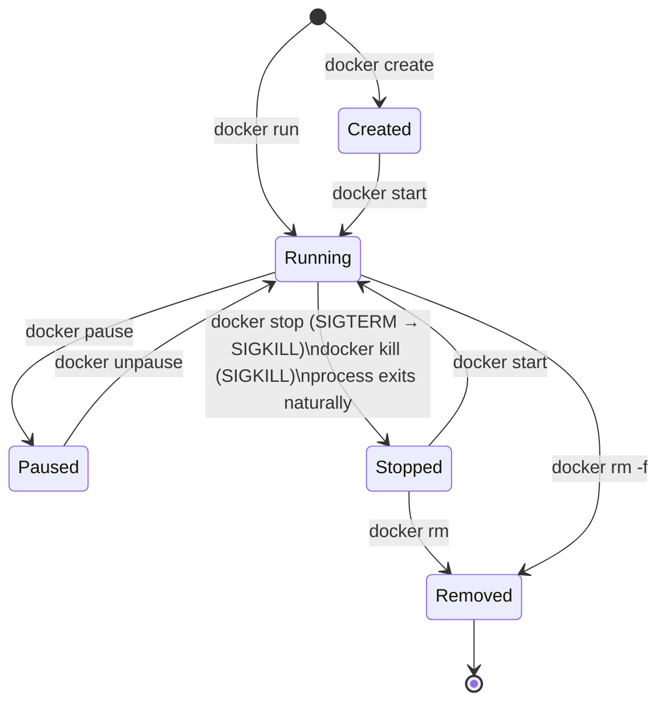

# Container Lifecycle

## The Story: A Process with a Lifetime

Think about how a restaurant kitchen operates. When a new order comes in, a cook is assigned to it — they start prepping, cooking, maybe pause if the restaurant gets slammed (paused), finish the dish and wait for pickup (stopped), then eventually the station is cleared down for the next service (removed).

A Docker container has a similar lifecycle. It's not always "running or dead." It passes through well-defined states, and understanding those states — and the transitions between them — is what separates someone who *uses* Docker from someone who *understands* it.

This matters in production. An ops engineer who doesn't understand restart policies will deploy a container that dies silently and never recovers. A developer who doesn't understand `docker exec` vs `docker attach` will panic when they accidentally detach from a running process. This module covers all of it.

---

## 📌 Learning Priority

**Must Learn** — core concepts, needed to understand the rest of this file:
[Container States](#container-states) · [docker run Flags](#docker-run-flags-deep-dive) · [Restart Policies](#restart-policies-explained)

**Should Learn** — important for real projects and interviews:
[exec vs attach](#docker-exec-vs-docker-attach) · [Container Logs](#container-logs) · [Inspecting Containers](#inspecting-containers)

**Good to Know** — useful in specific situations, not needed daily:
[Resource Limits](#resource-limits) · [Copying Files](#copying-files)

**Reference** — skim once, look up when needed:
[Cleanup Commands](#cleanup) · [Lifecycle State Diagram](#lifecycle-state-diagram)

---

## Container States

A container can be in one of five states:

| State | Meaning |
|---|---|
| **Created** | Container exists (filesystem allocated, config applied) but the process hasn't started yet |
| **Running** | The container's main process is executing |
| **Paused** | Process is frozen (SIGSTOP sent to all processes in the container) — no CPU, no progress |
| **Stopped (Exited)** | Main process has terminated (either normally or by error) |
| **Removed** | Container has been deleted — gone completely |

---

## Lifecycle State Diagram



---

## `docker run` Flags Deep Dive

`docker run` is the most important Docker command — and it has dozens of flags. These are the ones you'll use daily:

### Detached vs Interactive

```bash
# -d (detach): run in background, print container ID
docker run -d nginx

# -it: interactive + allocate a pseudo-TTY
# Use this to get a shell inside a container
docker run -it ubuntu bash

# --rm: remove the container automatically when it exits
# Perfect for one-off commands you don't want to clean up manually
docker run --rm ubuntu echo "hello"
```

### Naming

```bash
# --name: give the container a predictable name
# Without this, Docker generates a random name like "quirky_hopper"
docker run --name my-nginx nginx
```

### Port Publishing

```bash
# -p hostPort:containerPort
docker run -p 8080:80 nginx          # host:8080 → container:80
docker run -p 127.0.0.1:8080:80 nginx  # bind to specific host IP only
docker run -p 0.0.0.0:8080:80 nginx    # explicit all interfaces (default)
docker run -p 8080:80/udp nginx      # UDP port

# -P (uppercase): publish all EXPOSED ports to random host ports
docker run -P nginx
docker port my-nginx                 # see what ports were assigned
```

### Environment Variables

```bash
# -e KEY=VALUE: set individual env var
docker run -e APP_ENV=production -e PORT=8080 myapp

# --env-file: load from file (one KEY=VALUE per line)
docker run --env-file .env myapp
```

### Volumes and Mounts

```bash
# -v name:path: named volume
docker run -v mydata:/data postgres

# -v /host/path:/container/path: bind mount
docker run -v $(pwd)/src:/app/src myapp

# --mount (more explicit alternative to -v)
docker run --mount type=volume,source=mydata,target=/data postgres
docker run --mount type=bind,source=$(pwd),target=/app myapp
docker run --mount type=tmpfs,target=/tmp myapp
```

### Resource Limits

```bash
# Memory limit (container killed if exceeded)
docker run --memory 512m nginx        # 512 megabytes
docker run --memory 1g nginx          # 1 gigabyte
docker run --memory 512m --memory-swap 512m nginx  # no swap (same as memory)

# CPU limits
docker run --cpus 0.5 nginx           # max 0.5 CPU cores
docker run --cpus 2.0 nginx           # max 2 CPU cores
docker run --cpu-shares 512 nginx     # relative weight (default 1024)
```

### Network

```bash
# --network: connect to a specific network
docker run --network my-network nginx

# --network host: share host network stack (no isolation)
docker run --network host nginx

# --network none: no network access
docker run --network none nginx
```

### Restart Policies

```bash
# --restart: define what happens when the container exits
docker run --restart no nginx             # default: never restart
docker run --restart always nginx         # always restart
docker run --restart on-failure nginx     # restart only on non-zero exit code
docker run --restart on-failure:5 nginx   # restart up to 5 times
docker run --restart unless-stopped nginx # always restart unless manually stopped
```

---

## Restart Policies Explained

| Policy | Behavior | Use case |
|---|---|---|
| `no` (default) | Never restart | Short-lived one-off containers |
| `always` | Always restart, even on Docker daemon restart | Long-running services in production |
| `on-failure` | Restart only on non-zero exit code | Batch jobs that should retry on error |
| `on-failure:N` | Restart up to N times on failure | Limit retry loops |
| `unless-stopped` | Like `always`, but respects manual `docker stop` | Services you want to manually stop without fighting the restart policy |

In production, `unless-stopped` is usually preferred over `always` for services. It means "keep this running across reboots and crashes, but respect when an operator manually stops it."

---

## `docker exec` vs `docker attach`

### `docker exec`

Runs a **new process** inside an already-running container. This is the right way to "get into" a container for debugging.

```bash
# Open an interactive shell inside a running container
docker exec -it my-nginx bash
docker exec -it my-nginx sh     # if bash isn't available (Alpine)

# Run a single command and exit
docker exec my-nginx ls /etc/nginx/
docker exec my-nginx nginx -t   # test nginx config

# Run as a different user
docker exec -u root my-nginx bash
docker exec -u 0 my-nginx bash   # UID 0 = root

# Set env vars for this exec session
docker exec -e DEBUG=1 my-nginx bash

# Set working directory
docker exec -w /var/log my-nginx ls
```

**Key point:** `docker exec` processes don't survive container restart — they're attached to the container's lifetime but are independent processes.

### `docker attach`

Connects your terminal to **the existing PID 1 process** of the container (its main process, stdin/stdout/stderr).

```bash
docker attach my-container
```

**Warning:** If you press `Ctrl+C` while attached to a container, you send SIGINT to PID 1, which may stop the container. The safe detach sequence is `Ctrl+P, Ctrl+Q`. But this is easy to forget.

**When to use `attach`:** Mainly for containers started with `-it` where you detached with `Ctrl+P, Ctrl+Q` and want to re-attach. For debugging, almost always prefer `docker exec -it container bash`.

---

## Container Logs

```bash
# View all logs
docker logs my-nginx

# Follow logs in real time (like tail -f)
docker logs -f my-nginx

# Show only last N lines
docker logs --tail 50 my-nginx

# Show logs with timestamps
docker logs -t my-nginx

# Combine: last 100 lines, follow, with timestamps
docker logs -f -t --tail 100 my-nginx

# Show logs since a time
docker logs --since 2024-01-01T12:00:00 my-nginx
docker logs --since 30m my-nginx    # last 30 minutes
docker logs --until 1h my-nginx     # up to 1 hour ago
```

Docker stores logs in JSON files by default at:
`/var/lib/docker/containers/<id>/<id>-json.log`

Configure log rotation in daemon.json to prevent disk filling:
```json
{
  "log-driver": "json-file",
  "log-opts": {
    "max-size": "10m",
    "max-file": "3"
  }
}
```

---

## Inspecting Containers

```bash
# Full container metadata (JSON)
docker inspect my-nginx

# Extract specific fields
docker inspect --format '{{.State.Status}}' my-nginx
docker inspect --format '{{.State.Pid}}' my-nginx          # PID on host
docker inspect --format '{{.NetworkSettings.IPAddress}}' my-nginx
docker inspect --format '{{json .Config.Env}}' my-nginx
docker inspect --format '{{json .Mounts}}' my-nginx | jq .
docker inspect --format '{{.HostConfig.RestartPolicy.Name}}' my-nginx

# Live resource usage
docker stats my-nginx                # live CPU, memory, network, disk I/O
docker stats --no-stream my-nginx    # one-shot snapshot

# Running processes inside container
docker top my-nginx
```

---

## Copying Files

```bash
# Copy from container to host
docker cp my-nginx:/etc/nginx/nginx.conf ./nginx.conf

# Copy from host to container
docker cp ./my-config.conf my-nginx:/etc/nginx/nginx.conf

# Copy a directory
docker cp my-nginx:/var/log/nginx/ ./nginx-logs/
```

---

## Cleanup

```bash
# Stop a container (sends SIGTERM, waits 10s, then SIGKILL)
docker stop my-nginx
docker stop --time 30 my-nginx     # wait 30 seconds before SIGKILL

# Kill immediately (SIGKILL)
docker kill my-nginx
docker kill --signal SIGHUP my-nginx   # send specific signal

# Remove a stopped container
docker rm my-nginx

# Remove a running container (force)
docker rm -f my-nginx

# Remove all stopped containers
docker container prune

# Remove containers exited more than 24h ago
docker container prune --filter "until=24h"

# Start/restart
docker start my-nginx
docker restart my-nginx
docker restart --time 5 my-nginx   # 5-second grace before kill
```

---

## Summary

- Containers have five states: Created → Running → Paused → Stopped → Removed.
- `docker run` flags control detachment (`-d`), interactivity (`-it`), naming (`--name`), ports (`-p`), env vars (`-e`), volumes (`-v`), resources (`--memory`, `--cpus`), and restart policy (`--restart`).
- Use `docker exec -it container bash` for debugging — NOT `docker attach` (easy to accidentally kill the container).
- Restart policies determine what happens when containers exit. Use `unless-stopped` for long-running services.
- `docker logs -f --tail 100` is your first debugging tool for a misbehaving container.
- `docker inspect` gives you everything: container state, IPs, mounts, environment, restart policy.
- Always clean up stopped containers with `docker container prune` to avoid accumulation.


---

## 📝 Practice Questions

- 📝 [Q60 · container-resource-limits](../docker_practice_questions_100.md#q60--thinking--container-resource-limits)
- 📝 [Q64 · container-logging](../docker_practice_questions_100.md#q64--thinking--container-logging)


---

## 📂 Navigation

**In this folder:**
| File | |
|---|---|
| 📖 **Theory.md** | ← you are here |
| [⚡ Cheatsheet.md](./Cheatsheet.md) | Quick reference |
| [🎯 Interview_QA.md](./Interview_QA.md) | Interview prep |
| [💻 Code_Example.md](./Code_Example.md) | Working code |

⬅️ **Prev:** [05 — Dockerfile](../05_Dockerfile/Theory.md) &nbsp;&nbsp;&nbsp; ➡️ **Next:** [07 — Volumes and Bind Mounts](../07_Volumes_and_Bind_Mounts/Theory.md)
🏠 **[Home](../../README.md)**
