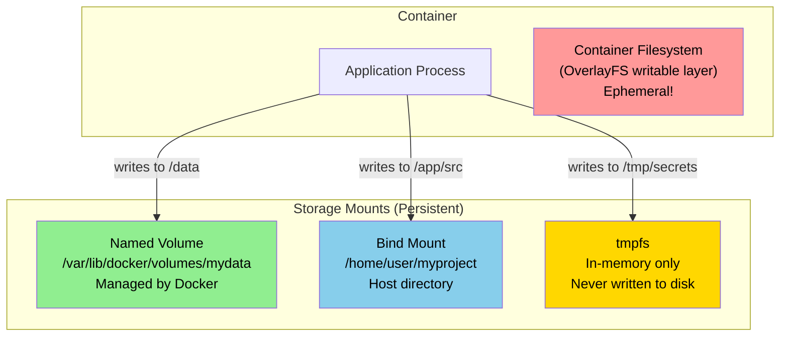

# Volumes and Bind Mounts

## The Problem: Containers Are Ephemeral

Imagine you're renting a hotel room. You live there for a week — you arrange the furniture, hang your clothes, put your laptop on the desk. When you check out, the room is cleaned and reset to its original state. Everything you left behind is gone. The next guest gets a fresh, clean room.

Docker containers are that hotel room. When a container is removed, everything written to its filesystem disappears. The container's writable layer — all those files created or modified during the container's life — is deleted along with it.

For stateless applications (a web server serving static files that never change), this is fine. But for stateful workloads:

- A database storing customer records
- An application writing upload files
- A service writing log files that need to be analyzed
- A development environment where you're editing source code

...the ephemeral nature of containers is a problem. If your Postgres container dies and you haven't persisted the data outside the container, the database is gone.

Docker solves this with three types of storage mounts:

---

## Three Types of Storage



---

## Named Volumes

A **named volume** is storage managed entirely by Docker. You give it a name, Docker creates and manages its location on the host (`/var/lib/docker/volumes/<name>/_data`), and you mount it into containers.

Key characteristics:
- Docker manages the lifecycle (create, delete via `docker volume` commands)
- Persists across container stop/start/remove
- Only deleted when explicitly removed with `docker volume rm`
- Can be mounted in multiple containers simultaneously
- On Linux: lives at `/var/lib/docker/volumes/<name>/_data`
- On Docker Desktop (macOS/Windows): inside the VM's virtual disk
- Supports volume drivers for cloud storage (NFS, AWS EBS, Azure Files, etc.)
- **Docker can pre-populate a volume** with data from the image: if you mount an empty named volume to a path that has files in the image, Docker copies those files into the volume the first time.

---

## Bind Mounts

A **bind mount** maps a specific path from the host filesystem into the container. Whatever exists at that host path is visible inside the container at the mount point.

Key characteristics:
- You control the path on the host — the host directory must exist
- Changes from inside the container are immediately visible on the host, and vice versa
- Perfect for development: edit code on your host, see changes instantly in the container (no rebuild needed)
- Files at the mount point are owned by the host user that owns them — may cause permission mismatches with the container user
- On Docker Desktop (macOS/Windows): bind mounts go through a filesystem sharing mechanism between the VM and your host OS. This is slower than native Linux bind mounts.
- Security consideration: a bind mount gives the container direct access to your host filesystem at that path. Mount only what's needed.

---

## tmpfs

A **tmpfs** mount stores data in the host's RAM (and possibly swap). It's never written to disk.

Key characteristics:
- Extremely fast (RAM access)
- Completely private (not accessible from outside the container, even via other containers)
- Lost immediately when the container stops (even more ephemeral than the container itself)
- Good for secrets that should never touch disk, temporary files, and caches

---

## Decision Table: Which Storage Type to Use?

| Scenario | Use |
|---|---|
| Database data (Postgres, MySQL, Redis) | Named volume |
| Application uploads/files that must persist | Named volume |
| Development: edit code, see changes in container | Bind mount |
| Sharing config files from host into container | Bind mount |
| Sharing a secret or credential at runtime | tmpfs or Docker Secrets |
| Temporary scratch space during container run | tmpfs |
| Sharing data between containers on same host | Named volume |
| Portable data (not tied to one host's filesystem) | Named volume |
| You need exact control over the file path on the host | Bind mount |

---

## Named Volume Commands

```bash
# Create a named volume
docker volume create mydata

# List all volumes
docker volume ls

# Inspect a volume (see its mount point on the host)
docker volume inspect mydata

# Remove a volume
docker volume rm mydata

# Remove all unused volumes (not mounted in any container)
docker volume prune

# Remove all unused volumes including those with labels
docker volume prune -a
```

---

## Volume and Bind Mount Syntax

### `-v` (Legacy, terse)

```bash
# Named volume: -v volumeName:/path/in/container
docker run -v mydata:/var/lib/postgresql/data postgres:16

# Bind mount: -v /absolute/host/path:/path/in/container
docker run -v /home/user/myapp:/app myapp

# Read-only bind mount: add :ro
docker run -v /etc/secrets:/secrets:ro myapp

# Anonymous volume (no name — Docker generates one)
docker run -v /data myapp
```

### `--mount` (Modern, explicit, recommended)

```bash
# Named volume
docker run --mount type=volume,source=mydata,target=/var/lib/postgresql/data postgres:16

# Bind mount
docker run --mount type=bind,source=/home/user/myapp,target=/app myapp

# Read-only bind mount
docker run --mount type=bind,source=/etc/nginx/nginx.conf,target=/etc/nginx/nginx.conf,readonly myapp

# tmpfs
docker run --mount type=tmpfs,target=/tmp,tmpfs-size=100m myapp
```

`--mount` is more verbose but self-documenting and catches errors (e.g., if the source path doesn't exist for a bind mount, it fails explicitly instead of creating an empty dir).

---

## Volume Pre-Population (Initializing Volumes from Images)

This is a useful but often unknown Docker feature:

When you mount an **empty named volume** to a path in a container where the **image has files**, Docker copies the image's files into the volume before the container starts.

```bash
# postgres image has files in /var/lib/postgresql/data
# First run: Docker copies those files into the 'pgdata' volume
docker run -v pgdata:/var/lib/postgresql/data postgres:16

# Second run: volume already has data, not overwritten
docker run -v pgdata:/var/lib/postgresql/data postgres:16
```

This is how databases initialize their data directory. The first run copies default files into the volume; subsequent runs use the now-populated volume.

Note: this only applies to **named volumes**, not bind mounts. With a bind mount, the host directory completely replaces (overlays) the container path.

---

## Volume Sharing Between Containers

Named volumes can be mounted in multiple containers simultaneously. This is how containers share files:

```bash
# Create a volume
docker volume create shared-uploads

# Start an uploader container
docker run -d --name uploader -v shared-uploads:/data upload-service

# Start a processor container (same volume)
docker run -d --name processor -v shared-uploads:/data process-service

# Both containers can read and write /data, sharing the same files
```

Caution: without locking (handled at the application level), simultaneous writes to the same file from multiple containers can corrupt data.

---

## Volume Drivers: Beyond Local Storage

By default, Docker volumes use the `local` driver (files on the host's local disk). Volume drivers allow volumes to be backed by networked storage:

| Driver | Storage Backend |
|---|---|
| `local` | Host disk (default) |
| `nfs` | NFS share (built into local driver with options) |
| `rclone` | S3, GCS, Azure Blob, and 40+ cloud backends |
| `cloudstor` | AWS EBS, Azure Files (legacy Docker plugins) |
| `portworx` | Portworx distributed storage |
| `glusterfs` | GlusterFS distributed filesystem |

```bash
# Create an NFS volume using the local driver with options
docker volume create \
  --driver local \
  --opt type=nfs \
  --opt o=addr=nfs-server.example.com,rw \
  --opt device=:/exports/mydata \
  nfs-volume

# Use it like any named volume
docker run -v nfs-volume:/data myapp
```

---

## Troubleshooting Volumes

**Permission errors when container writes to a bind mount:**
The container process's UID may not match the file owner on the host. Fix by either:
1. Setting `--user` to match the host UID: `docker run -u $(id -u):$(id -g) myapp`
2. Using `chmod` / `chown` on the host directory
3. Adding `--userns-remap` (more complex, rootless setup)

**Volume not persisting data:**
Check you're mounting to the correct path inside the container. Run `docker exec container ls /data` to verify the path. Check `docker inspect container` under `Mounts` to see what's actually mounted.

**Bind mount on macOS/Windows is slow:**
File I/O goes through the VM's file sharing layer. For database data and node_modules, use named volumes instead — they stay inside the VM and avoid the cross-VM file sharing overhead.

---

## Summary

- Containers are ephemeral — their writable layer is deleted with the container. Persist data outside containers.
- **Named volumes:** managed by Docker, portable, best for databases and application data.
- **Bind mounts:** host directory mapped in; perfect for development hot-reload and config injection.
- **tmpfs:** in-memory, never on disk; for secrets and temp files.
- Use `--mount` syntax over `-v` for clarity and error checking.
- Named volumes can be pre-populated from image contents on first mount.
- Volume drivers extend volumes to cloud and networked storage.

---

## 📂 Navigation

**In this folder:**
| File | |
|---|---|
| 📖 **Theory.md** | ← you are here |
| [⚡ Cheatsheet.md](./Cheatsheet.md) | Quick reference |
| [🎯 Interview_QA.md](./Interview_QA.md) | Interview prep |
| [💻 Code_Example.md](./Code_Example.md) | Working code |

⬅️ **Prev:** [06 — Container Lifecycle](../06_Containers_Lifecycle/Theory.md) &nbsp;&nbsp;&nbsp; ➡️ **Next:** [08 — Networking](../08_Networking/Theory.md)
🏠 **[Home](../../README.md)**
