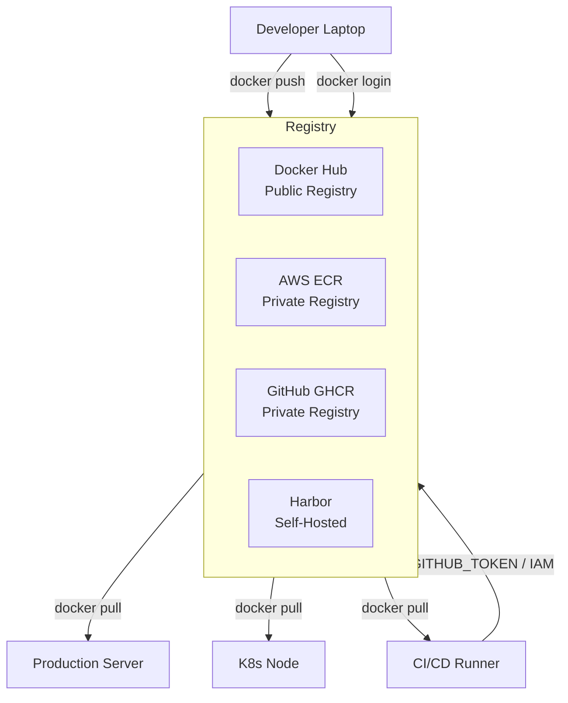

# Module 10 — Docker Registry

## The App Store for Docker Images

Imagine the App Store on your phone. You search for an app, tap install, and it downloads to your device. You didn't build the app — someone else packaged it and published it to a central store where you could find it.

Docker registries work the same way. A registry is a storage and distribution service for Docker images. When you run `docker pull nginx`, Docker connects to a registry, finds the nginx image, and downloads it to your machine. When you build your own app image and want to run it on a remote server — or share it with your team — you push it to a registry first.

Without registries, sharing container images would mean copying files over USB sticks. With registries, a developer in Berlin can push an image and a server in Tokyo can pull it seconds later.

---

## Docker Hub: The Default Registry

Docker Hub (hub.docker.com) is Docker's own public registry and the default when you don't specify one. Every time you do `docker pull ubuntu` or `docker pull postgres:16`, you're talking to Docker Hub.

Docker Hub has three tiers of images:

**Official Images** are maintained by Docker itself in partnership with the software maintainers. They have no prefix — just `nginx`, `postgres`, `redis`, `python`. These are heavily curated, regularly scanned for vulnerabilities, and the safest starting point for production base images.

**Verified Publisher images** come from trusted companies like Microsoft, Elastic, or Datadog. They appear with a blue "Verified Publisher" badge and have the format `company/image`. These are maintained by the vendor and also regularly scanned.

**Community images** are everything else — uploaded by any Docker Hub user. Use with caution. Always check the Dockerfile, the star count, the last update date, and pull count before trusting a community image in production.

```
Official image:          nginx
                         ^^^^^^
                         no prefix = Docker Hub official

Verified publisher:      bitnami/postgresql
                         ^^^^^^^
                         company name

Community image:         randomuser/my-cool-app
```

---

## Private Registries: Where Production Lives

Public Docker Hub is fine for learning and open source. But in production, you almost never want your company's application images sitting publicly on Docker Hub for anyone to inspect. You also don't want to depend on Docker Hub's rate limits (free tier limits unauthenticated pulls).

Enter private registries — services that give you a private, authenticated Docker registry.

### AWS Elastic Container Registry (ECR)

ECR is the most common choice for teams already on AWS. Each image repository lives inside your AWS account, and access is controlled by IAM. Pushing and pulling requires AWS credentials — no separate username/password.

ECR also offers:
- Automatic image scanning on push (powered by Trivy/Snyk)
- Lifecycle policies to auto-delete old images
- Cross-region replication
- Public ECR for open source images (gallery.ecr.aws)

### GCP Artifact Registry

Google's registry for teams on GCP. Supports Docker images, npm packages, Maven, and more. Access controlled by GCP IAM. Replaced the older Container Registry (gcr.io).

### GitHub Container Registry (GHCR)

GHCR (ghcr.io) is tightly integrated with GitHub. If your code is on GitHub, this is the most natural choice — your CI pipeline can use `GITHUB_TOKEN` (already available in GitHub Actions) to push images without additional secrets.

```
ghcr.io/my-org/my-app:1.2.0
^^^^^^^  ^^^^^^  ^^^^^^  ^^^^^
registry  org    repo    tag
```

### Self-Hosted: Harbor

Harbor is an open-source registry you deploy on your own infrastructure. It adds:
- Role-based access control (RBAC)
- Image replication between registries
- Vulnerability scanning (Trivy integration)
- Content trust and signing
- Quota management

Teams with strict compliance requirements (air-gapped environments, financial services, government) often run Harbor on-premises.

---

## Logging In: docker login

Before you can push to (or pull from) a private registry, you authenticate:

```bash
# Docker Hub
docker login

# AWS ECR (uses AWS CLI to get a temporary token)
aws ecr get-login-password --region us-east-1 \
  | docker login --username AWS --password-stdin \
    123456789.dkr.ecr.us-east-1.amazonaws.com

# GitHub Container Registry
echo $GITHUB_TOKEN | docker login ghcr.io \
  --username my-github-username --password-stdin

# Self-hosted Harbor
docker login harbor.mycompany.com
```

Credentials are stored in `~/.docker/config.json`. In CI/CD pipelines, use a credential helper or short-lived tokens — never hard-code passwords.

---

## Image Naming Convention

Every Docker image follows a strict naming convention that encodes where it lives:

```
registry/namespace/repository:tag
   ^          ^         ^       ^
   |          |         |       |
   |          |         |       semver, SHA, or "latest"
   |          |         your app name
   |          org name, team, or username
   registry hostname (omit for Docker Hub)
```

Examples:
```
# Docker Hub (registry omitted, defaults to hub.docker.com)
nginx:1.25                             # official image
bitnami/postgresql:16.2                # vendor image
myusername/my-app:v2.1.0               # your personal image

# AWS ECR
123456789.dkr.ecr.us-east-1.amazonaws.com/my-app:abc123f

# GHCR
ghcr.io/my-org/backend:v1.0.0

# Harbor
harbor.company.com/production/api:2025-01-15
```

---

## Tagging and Pushing Images

To push an image to a registry, you must tag it with the full registry path first:

```bash
# Build with a tag
docker build -t my-app:latest .

# Tag for a remote registry
docker tag my-app:latest ghcr.io/my-org/my-app:v1.0.0

# Push to the registry
docker push ghcr.io/my-org/my-app:v1.0.0

# Pull from a registry
docker pull ghcr.io/my-org/my-app:v1.0.0
```

You can apply multiple tags to the same image. It's common to tag the same image with both the exact version and a "floating" channel tag:

```bash
docker tag my-app:v1.0.0 ghcr.io/my-org/my-app:v1.0.0
docker tag my-app:v1.0.0 ghcr.io/my-org/my-app:v1
docker tag my-app:v1.0.0 ghcr.io/my-org/my-app:latest
docker push ghcr.io/my-org/my-app:v1.0.0
docker push ghcr.io/my-org/my-app:v1
docker push ghcr.io/my-org/my-app:latest
```

---

## ECR Quick Start: Create, Authenticate, Push

```bash
# 1. Create a repository in ECR
aws ecr create-repository \
  --repository-name my-app \
  --region us-east-1

# 2. Authenticate Docker to your ECR registry
aws ecr get-login-password --region us-east-1 \
  | docker login --username AWS --password-stdin \
    123456789012.dkr.ecr.us-east-1.amazonaws.com

# 3. Build your image
docker build -t my-app:1.0.0 .

# 4. Tag it for ECR
docker tag my-app:1.0.0 \
  123456789012.dkr.ecr.us-east-1.amazonaws.com/my-app:1.0.0

# 5. Push
docker push \
  123456789012.dkr.ecr.us-east-1.amazonaws.com/my-app:1.0.0
```

---

## Image Tagging Strategy

Bad tagging is a significant source of production incidents. Here are the three main strategies:

### Semantic Versioning (semver)

```
v1.2.3
^  ^ ^
|  | patch (bug fixes)
|  minor (new backward-compatible features)
major (breaking changes)
```

Pros: Human-readable, communicates change severity, supports range-based selection.
Cons: Requires discipline to bump correctly.

### Git SHA (commit hash)

```
ghcr.io/my-org/my-app:a3f9b2c
                       ^^^^^^^
                       short git commit SHA
```

Pros: Immutable — a SHA always refers to the same code. Perfect traceability — you can check out the exact commit that produced the image.
Cons: Not human-readable. You need tooling to look up what's in a SHA.

Many teams combine both: tag with git SHA for exact traceability, and also apply a semver tag pointing to the same image.

### The `latest` Tag: Anti-Pattern for Production

`latest` is just a tag — it has no special meaning in Docker. It doesn't auto-update. It doesn't mean "newest." It just means "the most recent push that didn't specify a tag, or was explicitly tagged latest."

Problems with using `latest` in production:
- Non-deterministic: today's `latest` is different from last week's `latest`
- No rollback: if you deploy `latest` and it's broken, what was the previous version?
- Cache confusion: Docker may use a locally cached `latest` that's weeks old
- Kubernetes may not re-pull if the tag hasn't changed

**Rule: In production, always use a specific, immutable tag. Use `latest` only for local dev convenience.**

---

## Image Vulnerability Scanning

Pushing an image isn't enough — you need to know what's inside it. Base images contain hundreds of packages, and any of them could have known CVEs (Common Vulnerabilities and Exposures).

### Docker Scout

Docker's built-in scanning tool. Available in Docker Desktop and the CLI:

```bash
# Quick overview of vulnerabilities
docker scout quickview my-app:v1.0.0

# Full detailed CVE report
docker scout cves my-app:v1.0.0

# Compare current image to a previous version
docker scout compare my-app:v1.0.0 --to my-app:v1.0.1
```

### Trivy

Trivy (by Aqua Security) is the most widely used open-source scanner. It scans OS packages, language packages (pip, npm, cargo, etc.), Dockerfiles, and Kubernetes manifests.

```bash
# Install
brew install trivy   # macOS

# Scan an image
trivy image my-app:v1.0.0

# Scan only HIGH and CRITICAL
trivy image --severity HIGH,CRITICAL my-app:v1.0.0

# Scan a Dockerfile
trivy config ./Dockerfile

# Exit with non-zero code if vulnerabilities found (use in CI)
trivy image --exit-code 1 --severity CRITICAL my-app:v1.0.0
```

### ECR Native Scanning

ECR can scan images automatically on push. Enable it in the ECR console or via AWS CLI:

```bash
aws ecr put-image-scanning-configuration \
  --repository-name my-app \
  --image-scanning-configuration scanOnPush=true

# View scan results
aws ecr describe-image-scan-findings \
  --repository-name my-app \
  --image-id imageTag=v1.0.0
```

---

## Registry Architecture Diagram



---

## 📂 Navigation

| | Link |
|---|---|
| Previous | [09 · Docker Compose](../09_Docker_Compose/Theory.md) |
| Cheatsheet | [Registry Cheatsheet](./Cheatsheet.md) |
| Interview Q&A | [Registry Interview Q&A](./Interview_QA.md) |
| Next | [11 · Multi-Stage Builds](../11_Multi_Stage_Builds/Theory.md) |
| Section Home | [Docker Section](../README.md) |
