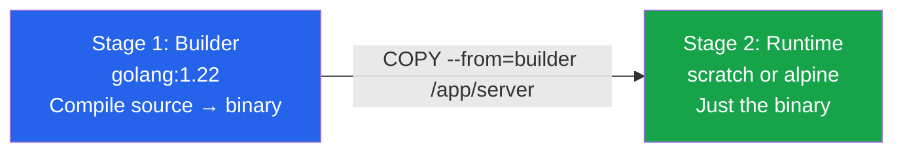

# Module 11 — Multi-Stage Builds

## The Bloated Image Problem

Imagine you're baking a cake. You need a stand mixer, measuring cups, flour, eggs, and a whole pantry of ingredients. But when you hand someone the finished cake, you don't also hand them the stand mixer, the pantry, and the flour bags. You hand them just the cake.

Docker images, without multi-stage builds, are like handing someone the cake plus your entire kitchen.

When you compile a Go binary, you need the Go compiler, the standard library, the build tools — hundreds of megabytes just to turn source code into a single executable. But in production, you don't need any of that. You need the executable. That's it.

Without multi-stage builds, a typical Go app image might be 1 GB. With multi-stage builds, it can be 5 MB.

---

## What Are Dev Dependencies Doing in Prod?

Let's look at what developers innocently include without realizing it:

**Go application without multi-stage:**
```dockerfile
FROM golang:1.22
WORKDIR /app
COPY . .
RUN go build -o server .
CMD ["/app/server"]
```

This image contains:
- The Go compiler
- All Go standard libraries
- Build cache
- Source code
- The compiled binary

The final image: ~1.1 GB. For an app whose binary is 15 MB.

**Node.js application without multi-stage:**
```dockerfile
FROM node:20
WORKDIR /app
COPY . .
RUN npm install    # pulls in ALL dev dependencies
RUN npm run build
CMD ["node", "dist/server.js"]
```

This includes Jest, ESLint, TypeScript compiler, webpack, and all their transitive dependencies — none of which are needed to serve the app.

**The problem isn't just size.** Every extra package is a potential CVE. A known vulnerability in a build tool you bundled in your image becomes your security problem — even though it has nothing to do with your running application.

---

## Multi-Stage Builds: The Solution

Multi-stage builds let you use multiple `FROM` statements in a single Dockerfile. Each `FROM` starts a new stage with a fresh filesystem. You can then selectively copy artifacts from one stage to another.



The key insight: **only the final stage becomes your image.** All intermediate stages are discarded.

---

## The FROM ... AS Syntax

```dockerfile
# Stage 1: Give it a name with AS
FROM golang:1.22 AS builder
WORKDIR /app
COPY go.mod go.sum ./
RUN go mod download
COPY . .
RUN CGO_ENABLED=0 go build -o server .

# Stage 2: Start fresh from a minimal image
FROM alpine:3.19
WORKDIR /app
# Copy ONLY the compiled binary from the builder stage
COPY --from=builder /app/server .
CMD ["/app/server"]
```

The `AS builder` name is arbitrary — you can call it anything. The `--from=builder` in the `COPY` instruction references it by that name.

---

## COPY --from=builder

The `COPY --from` instruction is the heart of multi-stage builds. It copies files from a previous stage (or even an external image) into the current stage:

```dockerfile
# Copy from a named stage
COPY --from=builder /app/dist ./dist

# Copy from a stage by index (0-based)
COPY --from=0 /app/server .

# Copy from an external public image
COPY --from=alpine:3.19 /etc/ssl/certs/ca-certificates.crt /etc/ssl/certs/
```

That last pattern is powerful: you can pull a specific file from a public image without inheriting the entire image.

---

## Typical Size Reductions

| Language | Before Multi-Stage | After Multi-Stage | Reduction |
|----------|--------------------|-------------------|-----------|
| Go | ~1.1 GB (golang:1.22) | ~5–15 MB (scratch) | 99% |
| Node.js (static build) | ~600 MB (node:20) | ~25 MB (nginx:alpine) | 96% |
| Python | ~1 GB (python:3.12) | ~120 MB (python:3.12-slim) | 88% |
| Java (Spring Boot) | ~700 MB (maven:3.9) | ~300 MB (eclipse-temurin:21-jre) | 57% |

---

## Building Specific Stages with --target

Sometimes you want to build only up to a specific stage — for example, to run tests in CI without building the final production image:

```dockerfile
FROM golang:1.22 AS builder
RUN go build -o server .

FROM golang:1.22 AS tester
COPY --from=builder /app .
RUN go test ./...

FROM alpine:3.19 AS production
COPY --from=builder /app/server .
```

```bash
# Run just the test stage
docker build --target tester -t my-app:test .

# Build the production image
docker build --target production -t my-app:prod .

# Build to default (last) stage
docker build -t my-app:latest .
```

---

## Parallel Stages (Independent Build Stages)

BuildKit (Docker's build engine since 18.09) automatically runs independent stages in parallel. If you have two stages that don't depend on each other, they build simultaneously:

```dockerfile
# These two stages run IN PARALLEL with BuildKit
FROM node:20 AS frontend-builder
WORKDIR /app
COPY frontend/ .
RUN npm ci && npm run build

FROM python:3.12 AS backend-builder
WORKDIR /app
COPY backend/ requirements.txt ./
RUN pip install -r requirements.txt

# This stage waits for both to finish
FROM nginx:alpine AS final
COPY --from=frontend-builder /app/dist /usr/share/nginx/html
COPY --from=backend-builder /app /backend
```

Enable BuildKit explicitly (default in recent Docker versions):
```bash
DOCKER_BUILDKIT=1 docker build .
```

---

## Common Patterns

### Go Binary (smallest possible image)

The Go binary is fully self-contained — no external runtime needed. You can run it from `scratch` (truly empty image):

```dockerfile
FROM golang:1.22 AS builder
WORKDIR /app
COPY go.mod go.sum ./
RUN go mod download
COPY . .
RUN CGO_ENABLED=0 GOOS=linux go build -o server .

FROM scratch
COPY --from=builder /app/server /server
ENTRYPOINT ["/server"]
```

`scratch` has nothing — no shell, no utilities, no OS packages. The final image is only as large as your binary (~5–20 MB). Security is excellent: there's nothing to exploit.

If you need network certificate verification or a shell for debugging, use `alpine:3.19` (~5 MB) instead of `scratch`.

### Python Application

Python isn't compiled to a single binary, but you can still dramatically reduce image size by using `python:3.12-slim` in the final stage and only copying installed packages:

```dockerfile
FROM python:3.12 AS builder
WORKDIR /app
COPY requirements.txt .
RUN pip install --no-cache-dir --prefix=/install -r requirements.txt

FROM python:3.12-slim
WORKDIR /app
COPY --from=builder /install /usr/local
COPY . .
CMD ["python", "app.py"]
```

### Node.js — Build to Static Files

A Node.js frontend (React, Vue, Angular) can be built into static HTML/CSS/JS files and served by nginx:

```dockerfile
FROM node:20 AS builder
WORKDIR /app
COPY package*.json ./
RUN npm ci
COPY . .
RUN npm run build

FROM nginx:1.25-alpine
COPY --from=builder /app/dist /usr/share/nginx/html
```

The final image is just nginx + your static files — no Node.js, no node_modules, no build tools.

### Java Spring Boot (JRE only)

```dockerfile
FROM maven:3.9-eclipse-temurin-21 AS builder
WORKDIR /app
COPY pom.xml .
RUN mvn dependency:go-offline
COPY src ./src
RUN mvn package -DskipTests

FROM eclipse-temurin:21-jre-alpine
WORKDIR /app
COPY --from=builder /app/target/*.jar app.jar
EXPOSE 8080
ENTRYPOINT ["java", "-jar", "app.jar"]
```

JDK vs JRE: the build stage needs the full JDK (Java Development Kit). The runtime stage only needs the JRE (Java Runtime Environment) — roughly half the size.

---

## Builder Cache: How It Interacts with Multi-Stage

Each stage has its own layer cache. If only your source code changed but not your `go.mod`, Docker reuses the cached dependency download layer and only rebuilds from the `COPY . .` instruction:

```dockerfile
FROM golang:1.22 AS builder
WORKDIR /app
COPY go.mod go.sum ./       # copied first — only changes when dependencies change
RUN go mod download          # cached as long as go.mod/go.sum don't change
COPY . .                     # source code — invalidates cache on every change
RUN go build -o server .
```

This ordering — copy dependency manifests first, then source code — is critical for fast builds.

---

## 📂 Navigation

| | Link |
|---|---|
| Previous | [10 · Docker Registry](../10_Docker_Registry/Theory.md) |
| Cheatsheet | [Multi-Stage Cheatsheet](./Cheatsheet.md) |
| Interview Q&A | [Multi-Stage Interview Q&A](./Interview_QA.md) |
| Code Examples | [Multi-Stage Code Examples](./Code_Example.md) |
| Next | [12 · Docker Security](../12_Docker_Security/Theory.md) |
| Section Home | [Docker Section](../README.md) |
