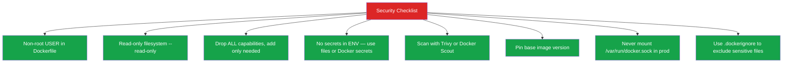

# Module 12 — Docker Security

## The Default is Dangerous

Imagine handing a contractor a master key to your entire building — all floors, all rooms, all server racks — just because they need to fix a faucet in the kitchen. That's what running containers as root with default settings does. Docker's defaults are optimized for convenience, not for security.

A container running as root, with full Linux capabilities, with the Docker socket mounted, on a host with no AppArmor profile... that's not a sandbox. That's root on the host, behind a very thin curtain.

Security isn't something you bolt on at the end. It's a set of small decisions you make at every step: who the container runs as, what filesystem access it has, what system calls it can make, and how you manage secrets.

---

## 📌 Learning Priority

**Must Learn** — core concepts, needed to understand the rest of this file:
[Attack Surface](#the-attack-surface-what-can-go-wrong) · [Non-Root Users](#non-root-users-the-simplest-win) · [Secrets Management](#secrets-management-not-environment-variables)

**Should Learn** — important for real projects and interviews:
[Linux Capabilities](#linux-capabilities) · [Image Scanning](#image-scanning) · [Supply Chain Security](#supply-chain-security-base-images)

**Good to Know** — useful in specific situations, not needed daily:
[Read-Only Filesystems](#read-only-filesystems) · [Docker Socket Risk](#the-docker-socket-risk) · [Rootless Docker](#rootless-docker)

**Reference** — skim once, look up when needed:
[Seccomp and AppArmor Profiles](#seccomp-and-apparmor-profiles) · [Security Checklist](#security-checklist)

---

## The Attack Surface: What Can Go Wrong

Understanding the attack surface is the first step. Here are the major Docker security risks:

**1. Running as root inside the container**
By default, Docker containers run as UID 0 (root). If an attacker exploits your application and gets code execution, they have root inside the container. With namespace misconfigurations, this can translate to root on the host.

**2. The Docker socket**
`/var/run/docker.sock` is the Unix socket the Docker daemon listens on. Mounting it into a container gives that container full control over Docker on the host — it can start new privileged containers, mount host filesystems, exfiltrate secrets. It is functionally equivalent to giving root access to the host.

**3. Privileged containers**
`docker run --privileged` disables almost all container isolation. The container can load kernel modules, modify network routes, mount filesystems — essentially everything root on the host can do.

**4. Capabilities**
Linux capabilities break the all-or-nothing root model into ~40 specific permissions. By default, Docker grants a subset of them. Many of those defaults aren't needed by most applications.

**5. Over-trusted base images**
Base images with unpatched CVEs become your CVEs. Using `FROM ubuntu:latest` (unfixed), `FROM python:latest` (no digest pin), or random community images introduces supply chain risk.

---

## Non-Root Users: The Simplest Win

The single most impactful change: don't run your process as root.

### The pattern:

```dockerfile
FROM python:3.12-slim

WORKDIR /app

# Install dependencies as root (they need system access)
COPY requirements.txt .
RUN pip install --no-cache-dir -r requirements.txt

# Create a dedicated non-root user and group
RUN groupadd --gid 1001 appgroup && \
    useradd --uid 1001 --gid appgroup --no-create-home appuser

# Copy application files
COPY --chown=appuser:appgroup . .

# Switch to the non-root user
# All subsequent RUN/CMD/ENTRYPOINT run as this user
USER appuser

EXPOSE 8000
CMD ["python", "app.py"]
```

For Alpine-based images:

```dockerfile
RUN addgroup -S appgroup && adduser -S appuser -G appgroup
USER appuser
```

### Why a fixed UID/GID?

Using numeric `--uid 1001` and `--gid 1001` ensures consistency when this image runs in Kubernetes — you can write Pod Security Policies or SecurityContext rules that reference specific UIDs.

---

## Read-Only Filesystems

Most applications don't need to write to their own filesystem. A web server just reads static files. An API server just processes requests. By making the container filesystem read-only, you prevent an attacker from writing malware, modifying binaries, or installing backdoors:

```bash
# Run with read-only root filesystem
docker run --read-only my-app

# But allow writing to specific directories that legitimately need it
docker run --read-only \
  --tmpfs /tmp \
  --tmpfs /var/run \
  -v my-logs:/app/logs \
  my-app
```

In a Dockerfile HEALTHCHECK scenario, the temp file must go to a tmpfs mount. Plan your write paths explicitly.

---

## Linux Capabilities

Linux capabilities are granular permissions. `CAP_NET_ADMIN` lets you modify network routing. `CAP_SYS_ADMIN` is basically root. `CAP_CHOWN` lets you change file ownership. Docker grants a default set of ~14 capabilities.

The principle: **drop everything, add only what you need.**

```bash
# Drop ALL capabilities, then add back only what's needed
docker run \
  --cap-drop ALL \
  --cap-add NET_BIND_SERVICE \
  my-web-app

# NET_BIND_SERVICE allows binding to ports < 1024 (like port 80)
# Without this, a non-root process can't bind to port 80
```

Common capabilities you might legitimately need:
- `NET_BIND_SERVICE` — bind to privileged ports (< 1024)
- `SETUID`, `SETGID` — change UID/GID (needed by some apps)
- `CHOWN` — change file ownership (needed by some init scripts)

Almost no application needs: `SYS_ADMIN`, `SYS_MODULE`, `SYS_PTRACE`, `NET_ADMIN`.

---

## Secrets Management: Not Environment Variables

The most common Docker security mistake: putting secrets in environment variables.

```bash
# BAD: Secret visible in docker inspect, logs, /proc/self/environ
docker run -e DATABASE_PASSWORD=supersecret my-app

# BAD: Secret baked into image layer
ENV API_KEY=abc123
```

Why env vars are problematic:
- Visible in `docker inspect` output
- Accessible from any process in the container
- Often accidentally logged
- Show up in crash dumps
- Visible in CI/CD pipeline logs if the command is echoed

### Better: Docker Secrets (Swarm mode)

```bash
# Create a secret
echo "supersecret" | docker secret create db_password -

# Mount it into a service (available at /run/secrets/db_password)
docker service create \
  --secret db_password \
  --name my-app \
  my-app:latest
```

### Better: Mounted Secret Files

In Docker Compose or Kubernetes, mount secrets as files:

```yaml
# docker-compose.yaml
services:
  app:
    image: my-app
    secrets:
      - db_password

secrets:
  db_password:
    file: ./secrets/db_password.txt
```

The application reads `open("/run/secrets/db_password")` rather than `os.Getenv("DB_PASSWORD")`.

### BuildKit Build Secrets

For secrets needed only during the build (npm tokens, pip credentials):

```dockerfile
# --mount=type=secret makes the secret available ONLY during this RUN
# It is NOT stored in any layer
RUN --mount=type=secret,id=npmrc,target=/root/.npmrc \
    npm install
```

```bash
docker build --secret id=npmrc,src=~/.npmrc .
```

---

## Image Scanning

Never push an image without scanning it. Two tools dominate:

### Docker Scout

```bash
# Quick summary view
docker scout quickview my-app:v1.0.0

# Full CVE list with fix recommendations
docker scout cves my-app:v1.0.0

# Show only fixable vulnerabilities
docker scout cves --only-fixed my-app:v1.0.0
```

### Trivy

```bash
# Scan image
trivy image my-app:v1.0.0

# Only HIGH and CRITICAL
trivy image --severity HIGH,CRITICAL my-app:v1.0.0

# Fail build on CRITICAL (use in CI)
trivy image --exit-code 1 --severity CRITICAL my-app:v1.0.0

# Scan Dockerfile for misconfigurations
trivy config ./Dockerfile
```

---

## Seccomp and AppArmor Profiles

### Seccomp (Secure Computing Mode)

Seccomp restricts which Linux system calls a process can make. Docker uses a default seccomp profile that blocks ~44 dangerous syscalls (like `ptrace`, `kexec_load`, `mount`). For maximum security, use a custom profile:

```bash
# Apply Docker's default seccomp profile explicitly
docker run --security-opt seccomp=/path/to/default.json my-app

# Disable seccomp (for debugging only, never production)
docker run --security-opt seccomp=unconfined my-app
```

### AppArmor

AppArmor provides mandatory access control — restricting which files, network sockets, and capabilities a process can use, even as root. Docker ships with a default `docker-default` profile:

```bash
# Use the default AppArmor profile (this is the default)
docker run --security-opt apparmor=docker-default my-app

# Apply a custom AppArmor profile
docker run --security-opt apparmor=my-custom-profile my-app
```

---

## The Docker Socket Risk

Mounting the Docker socket is one of the most dangerous things you can do:

```bash
# DANGER: This container has full Docker control over the host
docker run -v /var/run/docker.sock:/var/run/docker.sock my-app
```

From inside that container, anyone can run:
```bash
docker run --privileged -v /:/host --rm -it alpine chroot /host
# You now have root on the host filesystem
```

Legitimate uses (CI/CD agents that need to build images) should use alternatives:
- **Kaniko** — builds Docker images in Kubernetes without needing the socket
- **Buildah** — rootless container image building
- **Docker-in-Docker (DinD)** — with extreme care and isolation
- **Remote Docker daemon** — connect to a dedicated, isolated build daemon

---

## Rootless Docker

Rootless Docker runs the entire Docker daemon as a non-root user. Container processes running as UID 0 inside the container map to a non-root UID on the host via user namespaces.

```bash
# Install rootless Docker (run as non-root user)
dockerd-rootless-setuptool.sh install

# Start the rootless daemon
systemctl --user start docker

# Use normally
export DOCKER_HOST=unix://$XDG_RUNTIME_DIR/docker.sock
docker run nginx
```

Benefits: a breakout from the container gets a non-root UID on the host, limiting blast radius significantly.

---

## Supply Chain Security: Base Images

Your image's security is only as good as your base image. Recommendations:

```dockerfile
# BAD: Floating tag, unknown digest, could change any time
FROM python:latest

# GOOD: Pinned version
FROM python:3.12.3-slim

# BEST: Pinned by digest (immutable, reproducible)
FROM python:3.12.3-slim@sha256:a1b2c3d4e5f6...
```

Rules for base images:
1. Use only official images or verified publisher images for production
2. Pin to a specific version, not `latest`
3. For critical systems, pin by digest
4. Regularly update to get patched versions — set a calendar reminder

---

## Security Checklist




---

## 📝 Practice Questions

- 📝 [Q65 · dockerfile-user](../docker_practice_questions_100.md#q65--critical--dockerfile-user)
- 📝 [Q80 · explain-security-model](../docker_practice_questions_100.md#q80--interview--explain-security-model)
- 📝 [Q82 · scenario-image-vulnerability](../docker_practice_questions_100.md#q82--design--scenario-image-vulnerability)
- 📝 [Q89 · scenario-multi-tenant](../docker_practice_questions_100.md#q89--design--scenario-multi-tenant)


---

## 📂 Navigation

| | Link |
|---|---|
| Previous | [11 · Multi-Stage Builds](../11_Multi_Stage_Builds/Theory.md) |
| Cheatsheet | [Security Cheatsheet](./Cheatsheet.md) |
| Interview Q&A | [Security Interview Q&A](./Interview_QA.md) |
| Next | [13 · Docker Swarm](../13_Docker_Swarm/Theory.md) |
| Section Home | [Docker Section](../README.md) |
