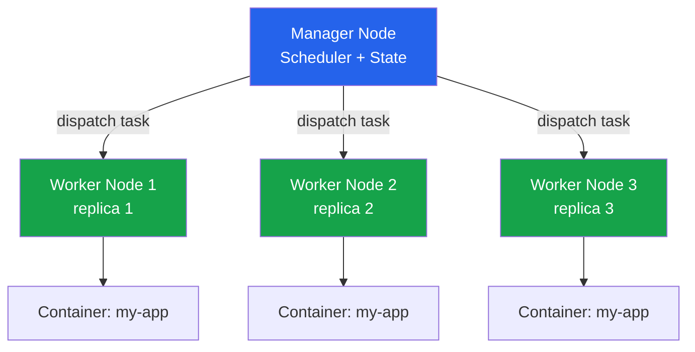

# Module 13 — Docker Swarm

## The Problem With One Machine

You've built a containerized app. It runs perfectly with Docker Compose on your laptop. You deploy it to a single server, and for a while, things are fine.

Then your app gets popular. One server isn't enough. Or the server goes down at 2am and your app is dead until you SSH in and restart it. Or you need to deploy a new version and can't afford even 30 seconds of downtime.

This is where orchestration comes in. You need a system that can:
- Run your containers across **multiple machines** as if they were one
- **Automatically restart** containers when they crash
- **Roll out updates** without taking the app offline
- **Scale** from 2 replicas to 20 with one command

Docker Swarm is Docker's built-in answer to this problem. No separate installation, no new CLI to learn — it's already in Docker.

---

## 📌 Learning Priority

**Must Learn** — core concepts, needed to understand the rest of this file:
[What Is Docker Swarm?](#what-is-docker-swarm) · [Swarm Concepts](#swarm-concepts) · [Services: docker service create](#services-docker-service-create)

**Should Learn** — important for real projects and interviews:
[Stacks: Deploying Compose Files](#stacks-deploying-compose-files) · [Overlay Networks in Swarm](#overlay-networks-in-swarm) · [Swarm Secrets](#swarm-secrets)

**Good to Know** — useful in specific situations, not needed daily:
[Initializing a Swarm](#initializing-a-swarm) · [Adding Nodes](#adding-nodes)

**Reference** — skim once, look up when needed:
[Swarm vs Kubernetes](#swarm-vs-kubernetes-when-swarm-is-enough)

---

## What Is Docker Swarm?

Docker Swarm is Docker's native clustering and orchestration tool. It turns a group of Docker hosts into a single, virtual Docker host. You talk to the Swarm the same way you talk to a single Docker host — the Swarm figures out where to actually run your containers.

**Key characteristics:**
- Ships with Docker — no extra software to install
- Uses the same Docker Compose file format (with minor additions)
- Simpler than Kubernetes — less powerful, but much easier to learn
- Built-in TLS encryption between nodes
- Built-in secrets management
- Zero-downtime rolling updates

---

## Swarm Concepts

### Nodes

A **node** is any Docker host participating in the Swarm. Nodes have one of two roles:

**Manager nodes** are the control plane. They:
- Maintain the cluster state
- Schedule services onto worker nodes
- Expose the Swarm API
- Participate in Raft consensus (leader election)

**Worker nodes** run the actual containers (tasks). They receive instructions from managers but don't participate in cluster management decisions.

In small setups, a manager can also run tasks (it's a manager AND worker). In production, dedicated managers are recommended.

### Services, Tasks, and Replicas

When you tell Swarm to run your app, you create a **service** — a description of the desired state (which image, how many replicas, what ports to expose, etc.).

The Swarm manager breaks each service into **tasks** — one task per replica. Each task is assigned to a node and runs as a container.

If a task dies, Swarm automatically schedules a replacement on any available node. You describe the desired state; Swarm makes it happen.



### Stacks

A **stack** is a group of services that are deployed together using a Compose file. It's the Swarm equivalent of `docker compose up` — but across your entire cluster:

```bash
docker stack deploy -c docker-compose.yml my-app-stack
```

---

## Initializing a Swarm

On the machine you want to be the first manager:

```bash
# Initialize Swarm (this machine becomes the first manager)
docker swarm init

# Or specify which IP address to advertise (for multi-network hosts)
docker swarm init --advertise-addr 192.168.1.10
```

This outputs a join token. Copy it — you'll use it to add other machines.

---

## Adding Nodes

```bash
# On the manager, get the join tokens
docker swarm join-token worker    # token for adding workers
docker swarm join-token manager   # token for adding more managers

# On a worker machine, run the join command output above:
docker swarm join \
  --token SWMTKN-1-abc123... \
  192.168.1.10:2377

# Back on manager, verify nodes
docker node ls
```

---

## Services: docker service create

Services are the unit of work in Swarm:

```bash
# Create a service with 3 replicas
docker service create \
  --name web \
  --replicas 3 \
  --publish 80:80 \
  nginx:1.25

# List services
docker service ls

# See which nodes are running which tasks
docker service ps web

# Scale up/down
docker service scale web=5
docker service scale web=2

# Update the image (rolling update)
docker service update \
  --image nginx:1.26 \
  --update-delay 10s \
  --update-parallelism 1 \
  web

# Remove a service
docker service rm web
```

---

## Stacks: Deploying Compose Files

The real power of Swarm is deploying full multi-service applications from a Compose file. The Compose file for Swarm adds a `deploy` section:

```yaml
version: "3.9"
services:
  web:
    image: my-org/web:v1.0.0
    deploy:
      replicas: 3
      update_config:
        parallelism: 1
        delay: 10s
        failure_action: rollback
      restart_policy:
        condition: on-failure
    ports:
      - "80:80"

  worker:
    image: my-org/worker:v1.0.0
    deploy:
      replicas: 2
      placement:
        constraints:
          - node.role == worker
```

```bash
# Deploy the stack
docker stack deploy -c docker-compose.yml my-app

# List stacks
docker stack ls

# List services in the stack
docker stack services my-app

# List tasks (containers) in the stack
docker stack ps my-app

# Remove the stack
docker stack rm my-app
```

---

## Overlay Networks in Swarm

When services need to communicate with each other across nodes, Swarm uses **overlay networks** — virtual networks that span all nodes in the Swarm. Containers on the same overlay network can talk to each other by service name, regardless of which physical node they're on.

```bash
# Create an overlay network
docker network create --driver overlay my-app-network

# Create a service attached to the network
docker service create \
  --name api \
  --network my-app-network \
  my-org/api:v1.0.0

docker service create \
  --name db \
  --network my-app-network \
  postgres:16
# The api service can reach postgres at hostname "db"
```

In a Compose file, networks are automatically created as overlay networks in Swarm mode.

---

## Swarm Secrets

Swarm has a built-in secrets management system. Secrets are encrypted at rest and in transit, and mounted as files (not environment variables) inside containers:

```bash
# Create a secret from a string
echo "my-super-secret-db-password" | docker secret create db_password -

# Create a secret from a file
docker secret create ssl_cert ./certs/server.crt

# List secrets
docker secret ls

# Use a secret in a service (mounted at /run/secrets/db_password)
docker service create \
  --name db \
  --secret db_password \
  postgres:16

# In docker-compose.yml:
# secrets:
#   db_password:
#     external: true
```

---

## Swarm vs Kubernetes: When Swarm Is Enough

Swarm is simpler and sufficient for many real-world use cases. Kubernetes is more powerful but significantly more complex.

| Consideration | Use Swarm | Use Kubernetes |
|---|---|---|
| Team size | Small (1–5 engineers) | Medium to large |
| App complexity | Simple services, few microservices | Many microservices, complex dependencies |
| Deployment frequency | Low–medium | High, GitOps workflows |
| Scaling needs | Manual scaling is acceptable | Need autoscaling (HPA/VPA) |
| Learning curve acceptable | Want to ship fast | Time to invest in platform |
| Cloud-managed option needed | Self-managed OK | Want EKS/GKE/AKS |
| Advanced networking needed | Basic service discovery OK | Need Ingress, network policies, service mesh |

A common path: start with Swarm for simplicity, migrate to Kubernetes when you outgrow it. The concepts transfer well.


---

## 📝 Practice Questions

- 📝 [Q87 · compare-swarm-k8s](../docker_practice_questions_100.md#q87--interview--compare-swarm-k8s)
- 📝 [Q90 · scenario-zero-downtime](../docker_practice_questions_100.md#q90--design--scenario-zero-downtime)


---

## 📂 Navigation

| | Link |
|---|---|
| Previous | [12 · Docker Security](../12_Docker_Security/Theory.md) |
| Cheatsheet | [Swarm Cheatsheet](./Cheatsheet.md) |
| Interview Q&A | [Swarm Interview Q&A](./Interview_QA.md) |
| Code Examples | [Swarm Code Examples](./Code_Example.md) |
| Next | [14 · Docker in CI/CD](../14_Docker_in_CICD/Theory.md) |
| Section Home | [Docker Section](../README.md) |
