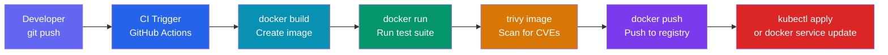

# Module 14 — Docker in CI/CD

## Every Push Should Mean Something

Imagine you push a bug fix to GitHub. Ten minutes later, that fix is running in production, tested, scanned, and deployed without you doing anything else. That's the promise of CI/CD with Docker.

Without CI/CD, deployments are manual, error-prone ceremonies. Someone SSH's into a server, runs some commands, hopes it works. With Docker and CI/CD, the pipeline is automated, repeatable, and auditable — the same steps run every single time in the same environment.

Docker is the perfect building block for CI/CD because it eliminates "works on my machine." The container that runs in CI is the same container that runs in production. Not similar — identical.

---

## 📌 Learning Priority

**Must Learn** — core concepts, needed to understand the rest of this file:
[The CI/CD Pipeline with Docker](#the-cicd-pipeline-with-docker) · [GitHub Actions with Docker](#github-actions-with-docker) · [Image Tagging in CI](#image-tagging-in-ci)

**Should Learn** — important for real projects and interviews:
[Docker Layer Caching in CI](#docker-layer-caching-in-ci) · [Testing in Docker](#testing-in-docker) · [Security: Secrets and Credentials](#security-secrets-and-credentials)

**Good to Know** — useful in specific situations, not needed daily:
[Multi-Platform Builds](#multi-platform-builds)

**Reference** — skim once, look up when needed:
[ECR with OIDC](#ecr-with-oidc-no-long-lived-credentials) · [docker/metadata-action](#use-dockermetadata-action-for-smart-tagging)

---

## The CI/CD Pipeline with Docker

Here's what a complete Docker-powered CI/CD pipeline looks like:



Each step is a gate. If tests fail, the pipeline stops. If scanning finds a critical CVE, the pipeline stops. Only clean, tested, scanned images reach the registry and deployment.

---

## GitHub Actions with Docker

GitHub Actions is the most common CI/CD choice for teams using GitHub. Three official Docker actions power most workflows:

### docker/setup-buildx-action

Sets up Docker Buildx — the advanced build engine that supports multi-platform builds, advanced caching, and BuildKit features.

```yaml
- name: Set up Docker Buildx
  uses: docker/setup-buildx-action@v3
```

### docker/login-action

Authenticates to any container registry. Supports Docker Hub, ECR, GHCR, GCR, and any custom registry.

```yaml
# GHCR — uses built-in GITHUB_TOKEN, no extra secrets needed
- name: Log in to GHCR
  uses: docker/login-action@v3
  with:
    registry: ghcr.io
    username: ${{ github.actor }}
    password: ${{ secrets.GITHUB_TOKEN }}
```

### docker/build-push-action

Builds and optionally pushes the image. Handles BuildKit, caching, multi-platform, and metadata in one action.

```yaml
- name: Build and push
  uses: docker/build-push-action@v5
  with:
    context: .
    push: true
    tags: ghcr.io/my-org/my-app:${{ github.sha }}
    cache-from: type=gha
    cache-to: type=gha,mode=max
```

---

## Docker Layer Caching in CI

Without caching, every CI run downloads all dependencies from scratch. A Go app might re-download 200 MB of modules. A Node app might re-run `npm install` for thousands of packages. This wastes 2–5 minutes per run.

### Cache Strategy: Registry Cache

Push a cache manifest to the registry. Subsequent builds pull it before building:

```yaml
- uses: docker/build-push-action@v5
  with:
    context: .
    push: true
    tags: ghcr.io/my-org/app:latest
    # Pull cache from registry
    cache-from: type=registry,ref=ghcr.io/my-org/app:buildcache
    # Push updated cache to registry
    cache-to: type=registry,ref=ghcr.io/my-org/app:buildcache,mode=max
```

### Cache Strategy: GitHub Actions Cache

Store BuildKit cache in GitHub's built-in cache storage. Faster, free, and no registry entries needed:

```yaml
- uses: docker/build-push-action@v5
  with:
    context: .
    push: true
    tags: ghcr.io/my-org/app:${{ github.sha }}
    cache-from: type=gha        # restore from GitHub Actions cache
    cache-to: type=gha,mode=max  # save to GitHub Actions cache
```

`mode=max` caches all intermediate layers, not just the final stage. More storage but better cache hit rate.

---

## Multi-Platform Builds

Modern apps need to run on both `linux/amd64` (Intel/AMD) and `linux/arm64` (Apple Silicon, AWS Graviton). BuildKit handles this with QEMU emulation or native cross-compilation:

```bash
# Local multi-platform build
docker buildx create --use --name builder
docker buildx build \
  --platform linux/amd64,linux/arm64 \
  --push \
  -t ghcr.io/my-org/app:v1.0.0 \
  .
```

In GitHub Actions:

```yaml
- name: Set up QEMU (for arm64 emulation)
  uses: docker/setup-qemu-action@v3

- name: Set up Buildx
  uses: docker/setup-buildx-action@v3

- name: Build multi-platform
  uses: docker/build-push-action@v5
  with:
    platforms: linux/amd64,linux/arm64
    push: true
    tags: ghcr.io/my-org/app:v1.0.0
```

---

## Testing in Docker

The test suite runs inside the same container it will be deployed as. This eliminates "tests passed on CI but fail in production" because the environment is identical.

```yaml
# Run tests inside the container
- name: Run tests
  run: |
    docker build --target tester -t my-app:test .
    docker run --rm my-app:test
```

Or build and run directly:

```yaml
- name: Build
  run: docker build -t my-app:test .

- name: Test
  run: docker run --rm my-app:test npm test

- name: Push (only if tests passed)
  run: |
    docker tag my-app:test ghcr.io/my-org/app:${{ github.sha }}
    docker push ghcr.io/my-org/app:${{ github.sha }}
```

---

## Image Tagging in CI

Good tagging in CI gives you traceability, rollback capability, and clear promotion paths.

### Tag with Git SHA

```yaml
tags: ghcr.io/my-org/app:${{ github.sha }}
```

Every commit produces a unique, traceable image. You can always find the exact code for any deployed image.

### Tag with Branch Name

```yaml
tags: ghcr.io/my-org/app:${{ github.ref_name }}
# Produces: ghcr.io/my-org/app:main
#           ghcr.io/my-org/app:feature-payment-flow
```

Useful for staging environments (deploy `main` branch to staging automatically).

### Use docker/metadata-action for Smart Tagging

This action generates tags based on your git context (tags, branches, SHAs) automatically:

```yaml
- name: Docker metadata
  id: meta
  uses: docker/metadata-action@v5
  with:
    images: ghcr.io/my-org/app
    tags: |
      type=semver,pattern={{version}}       # v1.2.3
      type=semver,pattern={{major}}.{{minor}} # v1.2
      type=sha                              # sha-a3f9b2c
      type=ref,event=branch                 # main, feature-x

- name: Build and push
  uses: docker/build-push-action@v5
  with:
    tags: ${{ steps.meta.outputs.tags }}
    labels: ${{ steps.meta.outputs.labels }}
```

---

## Security: Secrets and Credentials

### GHCR with GITHUB_TOKEN

The cleanest option — no additional secrets needed:

```yaml
- uses: docker/login-action@v3
  with:
    registry: ghcr.io
    username: ${{ github.actor }}
    password: ${{ secrets.GITHUB_TOKEN }}
```

`GITHUB_TOKEN` is automatically available in all GitHub Actions workflows with appropriate permissions.

### ECR with OIDC (No Long-Lived Credentials)

The most secure approach for AWS ECR — uses OpenID Connect to get short-lived credentials:

```yaml
permissions:
  id-token: write
  contents: read

- name: Configure AWS credentials via OIDC
  uses: aws-actions/configure-aws-credentials@v4
  with:
    role-to-assume: arn:aws:iam::123456789:role/github-actions-ecr
    aws-region: us-east-1

- name: Login to ECR
  uses: aws-actions/amazon-ecr-login@v2
```

No AWS access keys stored as secrets. The OIDC token proves GitHub Actions is who it claims to be, and AWS issues temporary credentials.

### Docker Hub with Access Token

If using Docker Hub, use an Access Token (not your password) scoped to only what's needed:

```yaml
- uses: docker/login-action@v3
  with:
    username: ${{ secrets.DOCKERHUB_USERNAME }}
    password: ${{ secrets.DOCKERHUB_TOKEN }}
    # DOCKERHUB_TOKEN = Docker Hub access token, not your login password
```


---

## 📝 Practice Questions

- 📝 [Q88 · scenario-ci-optimization](../docker_practice_questions_100.md#q88--design--scenario-ci-optimization)


---

🚀 **Apply this:** Build a real CI/CD pipeline → [Project 05 — CI/CD Build-Push-Deploy](../../05_Capstone_Projects/05_CICD_Build_Push_Deploy/01_MISSION.md)
## 📂 Navigation

| | Link |
|---|---|
| Previous | [13 · Docker Swarm](../13_Docker_Swarm/Theory.md) |
| Cheatsheet | [CI/CD Cheatsheet](./Cheatsheet.md) |
| Interview Q&A | [CI/CD Interview Q&A](./Interview_QA.md) |
| Code Examples | [CI/CD Code Examples](./Code_Example.md) |
| Next | [15 · Best Practices](../15_Best_Practices/Theory.md) |
| Section Home | [Docker Section](../README.md) |
