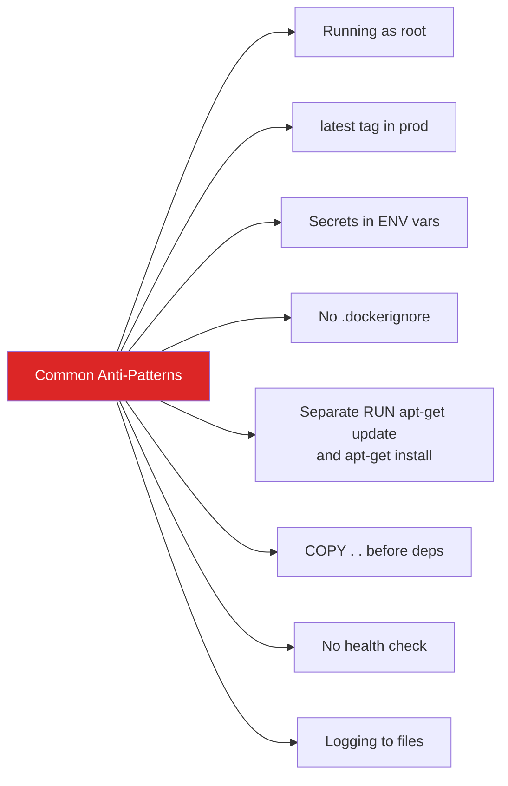

# Module 15 — Docker Best Practices

## The Gap Between Working and Production-Ready

A Dockerfile that works is not the same as a Dockerfile that's production-ready. Working means the app starts. Production-ready means the image is small, fast to pull, secure, observable, and consistent across environments.

This module is about the gap between the two. Most of these practices are small decisions — one line in a Dockerfile, one flag in a command — but they compound. An engineer who consistently applies them produces images that deploy faster, fail less, and are easier to debug at 3am.

---

## 📌 Learning Priority

**Must Learn** — core concepts, needed to understand the rest of this file:
[Layer Optimization](#2-layer-optimization-combine-run-commands) · [Cache Busting](#3-cache-busting-copy-dependencies-before-source-code) · [.dockerignore](#4-dockerignore-always-include-it)

**Should Learn** — important for real projects and interviews:
[Image Size: Right Base](#1-image-size-start-with-the-right-base) · [One Process Per Container](#5-one-process-per-container) · [Health Checks](#7-health-checks-in-dockerfiles)

**Good to Know** — useful in specific situations, not needed daily:
[Explicit Tags](#6-explicit-tags-never-use-latest-in-production) · [Logging to stdout/stderr](#8-logging-write-to-stdoutstderr) · [Configuration via Env Vars](#9-configuration-via-environment-variables)

**Reference** — skim once, look up when needed:
[Common Anti-Patterns Table](#10-common-anti-patterns-table) · [Security Checklist Before Pushing](#security-checklist-before-pushing)

---

## 1. Image Size: Start With the Right Base

The base image you choose is the floor of your image size. Everything you add is on top of it.

```dockerfile
# Avoid: full Debian — 120 MB, hundreds of packages, many CVEs
FROM python:3.12

# Better: slim variant — 30 MB, minimal OS packages
FROM python:3.12-slim

# Best for static binaries (Go): no OS at all
FROM scratch

# Google's distroless: no shell, no package manager, minimal attack surface
FROM gcr.io/distroless/python3-debian12

# Alpine: ~5 MB, musl libc, good for most use cases
FROM python:3.12-alpine
# Caveat: some Python packages with C extensions have build issues on Alpine
```

Size comparison for a Python app:

| Base Image | Size |
|---|---|
| `python:3.12` | ~1.02 GB |
| `python:3.12-slim` | ~130 MB |
| `python:3.12-alpine` | ~55 MB |
| `gcr.io/distroless/python3` | ~50 MB |

---

## 2. Layer Optimization: Combine RUN Commands

Every `RUN` instruction creates a new layer. Layers add overhead and can accidentally preserve files you tried to delete.

```dockerfile
# BAD: 3 separate layers, apt cache kept in layer 2
RUN apt-get update
RUN apt-get install -y curl
RUN rm -rf /var/lib/apt/lists/*

# GOOD: One layer, everything done together
# The cache cleanup happens in the SAME layer as the install
RUN apt-get update && \
    apt-get install -y --no-install-recommends \
        curl \
        ca-certificates && \
    rm -rf /var/lib/apt/lists/*
```

The key insight: if you delete a file in a later layer, it disappears from the final image — but the data still exists in the earlier layer. To truly eliminate something, delete it in the same `RUN` instruction that created it.

---

## 3. Cache Busting: Copy Dependencies Before Source Code

Docker rebuilds layers from the first changed line onward. Exploit this by copying things that change rarely before things that change often:

```dockerfile
# BAD: source code copied first — deps reinstall on EVERY code change
COPY . .
RUN pip install -r requirements.txt

# GOOD: dependency manifest first — only reinstall when deps change
COPY requirements.txt .
RUN pip install --no-cache-dir -r requirements.txt
COPY . .     # Source code here — only invalidates the layers below

# Node.js pattern
COPY package.json package-lock.json ./
RUN npm ci
COPY . .

# Go pattern
COPY go.mod go.sum ./
RUN go mod download
COPY . .
```

This one change can turn a 3-minute CI build into a 20-second build when only source files changed.

---

## 4. .dockerignore: Always Include It

`.dockerignore` prevents files from being sent to the Docker build context. Without it, `docker build` sends your entire project directory — including node_modules, .git, test fixtures, and any local config files — to the Docker daemon. This slows builds and risks baking sensitive files into images.

```dockerignore
# Version control
.git
.gitignore

# Dependencies (reinstalled inside the image)
node_modules
vendor

# Environment and secrets
.env
.env.*
*.pem
*.key
secrets/

# Test and CI files (not needed in production image)
**/__tests__
**/*.test.*
**/*.spec.*
.github
.circleci
coverage

# Build artifacts (if generated outside Docker)
dist
build
*.pyc
__pycache__
.pytest_cache

# IDE and OS
.idea
.vscode
.DS_Store
Thumbs.db

# Documentation
*.md
docs
```

Always create `.dockerignore` before the first `docker build`. Add to it as your project grows.

---

## 5. One Process Per Container

Each container should run one process (or one concern). This principle enables:
- Independent scaling: scale the web tier without scaling the background worker
- Independent restarts: a crashed worker doesn't take down the API
- Clear observability: logs come from exactly one service
- Clean shutdown: container lifecycle maps directly to process lifecycle

```dockerfile
# WRONG: Running multiple services in one container with supervisord
CMD ["supervisord", "-c", "/etc/supervisord.conf"]
# Now you have nginx + app + celery in one container with a process manager

# RIGHT: Three separate containers, each with one responsibility
# web:     CMD ["gunicorn", "app:create_app()"]
# worker:  CMD ["celery", "-A", "tasks", "worker"]
# nginx:   CMD ["nginx", "-g", "daemon off;"]
```

If you genuinely need multiple processes (init + app), use `tini` or `dumb-init` as PID 1 to properly handle signals and zombie reaping — not a full process supervisor.

---

## 6. Explicit Tags: Never Use `latest` in Production

```dockerfile
# BAD: "latest" changes under you
FROM nginx:latest

# GOOD: exact version
FROM nginx:1.25.5

# BEST: exact digest (immutable even if the tag is overwritten)
FROM nginx:1.25.5@sha256:a3b1c2d3...
```

In your own image tags, the same rule applies: deploy `app:v1.2.3` or `app:a3f9b2c` — never `app:latest`. If you need to track "most recent on main branch," use a branch tag like `app:main` explicitly, knowing it's mutable by design.

---

## 7. Health Checks in Dockerfiles

Without a health check, Docker only knows if the process is running — not if the app is actually healthy and ready to serve traffic. Add one:

```dockerfile
# HTTP health check
HEALTHCHECK --interval=30s --timeout=5s --start-period=10s --retries=3 \
    CMD curl -f http://localhost:8080/health || exit 1

# TCP health check (for databases or TCP services)
HEALTHCHECK --interval=30s --timeout=5s \
    CMD nc -z localhost 5432 || exit 1

# App-defined health check
HEALTHCHECK --interval=15s --timeout=3s \
    CMD python -c "import urllib.request; urllib.request.urlopen('http://localhost/health')" || exit 1
```

- `--interval`: how often to run the check (default: 30s)
- `--timeout`: how long to wait for a response (default: 30s)
- `--start-period`: grace period on startup before failures count (default: 0s)
- `--retries`: how many consecutive failures before marking unhealthy (default: 3)

In Kubernetes, Docker's HEALTHCHECK is ignored in favor of `readinessProbe`/`livenessProbe`. But for Docker Compose and Swarm, it's essential.

---

## 8. Logging: Write to stdout/stderr

Containers should not write logs to files. Write to stdout and stderr, and let the container runtime handle log collection:

```dockerfile
# WRONG: writing to a log file
CMD ["python", "app.py", "--log-file", "/var/log/app.log"]

# RIGHT: write to stdout/stderr
CMD ["python", "app.py"]   # app writes print()/logging to stdout
```

For languages/frameworks that default to file logging, configure them:

```dockerfile
# Python: unbuffered output
ENV PYTHONUNBUFFERED=1

# Node.js: just use console.log() — it goes to stdout

# Nginx: configured in nginx.conf
# access_log /dev/stdout;
# error_log  /dev/stderr warn;
```

Docker captures stdout/stderr and makes them available via `docker logs`. In Kubernetes, the same logs flow to your logging system (CloudWatch, Datadog, Loki) automatically.

---

## 9. Configuration via Environment Variables

Don't bake environment-specific configuration into your image. The same image should run in dev, staging, and production — differentiated only by environment variables at runtime:

```dockerfile
# BAD: hard-coded config baked into the image
ENV DATABASE_URL=postgres://prod-db.internal:5432/myapp
ENV LOG_LEVEL=warning

# GOOD: sensible defaults only, override at runtime
ENV DATABASE_URL=postgres://localhost:5432/myapp
ENV LOG_LEVEL=info
ENV PORT=8080
```

At runtime:
```bash
# Development
docker run -e DATABASE_URL=postgres://localhost/dev -e LOG_LEVEL=debug my-app

# Production
docker run -e DATABASE_URL=postgres://prod-db/myapp -e LOG_LEVEL=warning my-app
```

The 12-Factor App principles (https://12factor.net) formalize this: config belongs in the environment, not the code or image.

---

## 10. Common Anti-Patterns Table



| Anti-Pattern | Why It's Bad | What To Do Instead |
|---|---|---|
| `FROM ubuntu:latest` | Non-deterministic, unfixed CVEs | `FROM ubuntu:22.04` pinned version |
| No `USER` — runs as root | Container escape = host root | `RUN useradd... && USER appuser` |
| Secrets in `ENV` | Visible in `docker inspect` | Use mounted files or Docker secrets |
| No `.dockerignore` | Slow builds, risk of leaking files | Always create `.dockerignore` |
| `apt-get update` on its own line | Cached stale package list | Combine with install in one `RUN` |
| `COPY . .` before dep install | Deps reinstall on every code change | Copy dep manifests first |
| `latest` tag in production | Non-deterministic, no rollback | Use semver or git SHA |
| Logging to files | Not visible, not collected | Log to `stdout`/`stderr` |
| Multiple services in one container | Tight coupling, hard to scale | One service per container |
| No health check | Docker can't tell if app is healthy | Add `HEALTHCHECK` instruction |
| Build tools in production image | Bloated image, more CVEs | Use multi-stage builds |
| Hard-coded config in image | Image can't be promoted across envs | Use environment variables |

---

## Security Checklist Before Pushing

Quick checklist to run through before every image push:

```
[ ] Using a specific version tag for the base image (not latest)
[ ] Non-root USER defined in Dockerfile
[ ] .dockerignore exists and excludes secrets/.env/node_modules
[ ] No secrets or API keys in Dockerfile or ENV instructions
[ ] Multi-stage build used (if applicable) to minimize image size
[ ] trivy image <myimage> passed with no CRITICAL/HIGH CVEs
[ ] HEALTHCHECK defined
[ ] Logging configured to stdout/stderr
[ ] Only necessary packages installed (--no-install-recommends)
[ ] Package manager cache cleaned in same RUN layer
```


---

## 📝 Practice Questions

- 📝 [Q81 · scenario-production-architecture](../docker_practice_questions_100.md#q81--design--scenario-production-architecture)


---

## 📂 Navigation

| | Link |
|---|---|
| Previous | [14 · Docker in CI/CD](../14_Docker_in_CICD/Theory.md) |
| Cheatsheet | [Best Practices Cheatsheet](./Cheatsheet.md) |
| Interview Q&A | [Best Practices Interview Q&A](./Interview_QA.md) |
| Next | [Section 03 — Docker → K8s Bridge](../../03_Docker_to_K8s/01_Docker_vs_K8s/Theory.md) |
| Section Home | [Docker Section](../README.md) |
