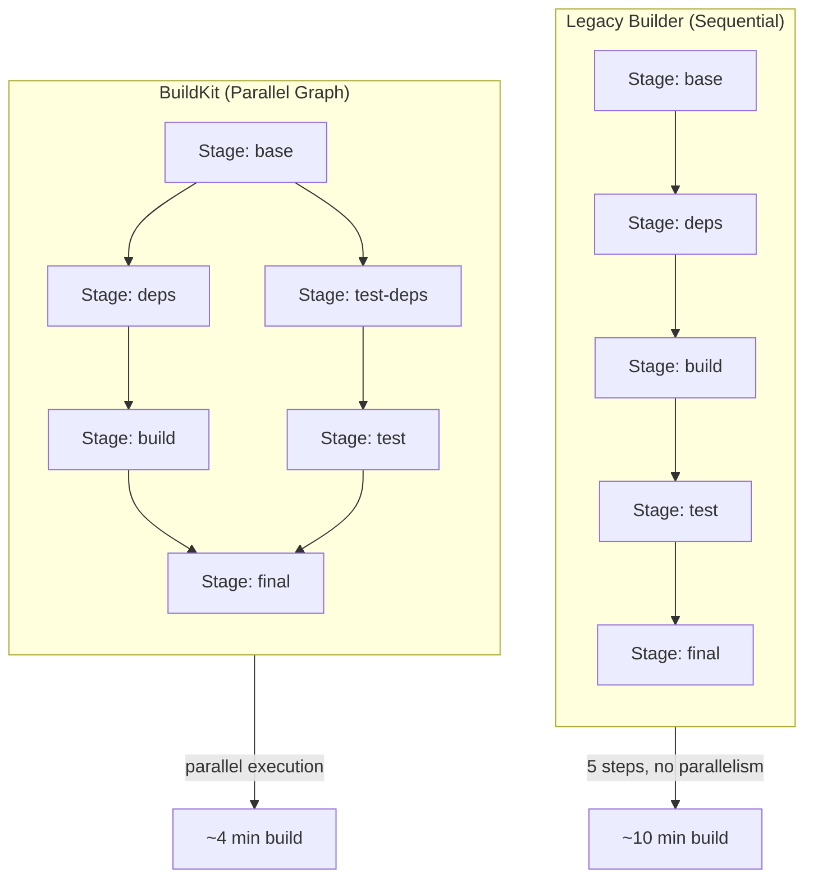

# Module 16 — BuildKit and Docker Scout

## The Build Engine That Nobody Talked About

For years, Docker builds ran on a single-threaded engine that worked like a checkout line at a grocery store. One customer, one cashier, one item at a time. You'd define a multi-stage Dockerfile with five independent stages and Docker would still process them in strict order, one after another, even if stages had nothing to do with each other.

Developers noticed. Build times in CI pipelines were ballooning. A monorepo with multiple services meant waiting ten minutes for builds that were logically parallelizable. Cache invalidation was brittle. There was no safe way to use secrets during a build without baking them into a layer forever.

In 2018, Docker introduced BuildKit as an experimental alternative. By Docker 23 (released 2023), BuildKit became the **default build engine** — no flags required. If you've run `docker build` in the last two years, you've already been using it.

This module explains what changed, why it matters, and how to take full advantage of it.

---

## 📌 Learning Priority

**Must Learn** — core concepts, needed to understand the rest of this file:
[What BuildKit Is](#what-buildkit-is) · [BuildKit Cache Mounts](#buildkit-cache-mounts-keeping-cache-out-of-layers) · [Secret Mounts](#secret-mounts-never-bake-secrets-into-layers)

**Should Learn** — important for real projects and interviews:
[Build Cache](#build-cache-the-problem-it-solves) · [Docker Scout](#docker-scout-software-supply-chain-security) · [Multi-Platform Builds](#multi-platform-builds)

**Good to Know** — useful in specific situations, not needed daily:
[SSH Mounts](#ssh-mounts-private-git-repos-during-build) · [Heredoc Syntax](#heredoc-syntax-in-dockerfiles) · [Docker Build Cloud](#docker-build-cloud)

**Reference** — skim once, look up when needed:
[DOCKER_BUILDKIT=1 and buildx](#docker_buildkit1-and-buildx) · [Summary](#summary) · [Alternative Tools](#alternative-tools)

---

## What BuildKit Is

BuildKit is a complete rewrite of the Docker build backend. It is maintained as a separate open-source project (`moby/buildkit`) and handles everything that happens after you type `docker build`: parsing the Dockerfile, managing the layer cache, coordinating build steps, and producing the final image.

The key architectural shift: BuildKit builds a **dependency graph** from your Dockerfile, then executes independent nodes in parallel. It also introduces a new category of mount types that keep sensitive data and large caches out of image layers entirely.



The legacy builder had no understanding of which stages depended on which. BuildKit reads the `COPY --from=stagename` and `FROM stagename AS name` relationships and builds a directed acyclic graph. Stages without dependencies on each other run simultaneously.

---

## DOCKER_BUILDKIT=1 and buildx

Before Docker 23, you had to opt into BuildKit explicitly:

```bash
# Old way to enable BuildKit
DOCKER_BUILDKIT=1 docker build -t myapp .
```

Since Docker 23, this is no longer necessary — BuildKit is on by default. The environment variable still works and is still common in older CI scripts, but it's now redundant.

`docker buildx` is the CLI frontend for BuildKit. It exposes features that the classic `docker build` command didn't have:

```bash
# Standard build (uses BuildKit by default)
docker build -t myapp .

# buildx build — same engine, more options exposed
docker buildx build -t myapp .

# List available builders
docker buildx ls

# Create a new builder instance
docker buildx create --name mybuilder --use

# Inspect the active builder
docker buildx inspect --bootstrap

# Remove a builder
docker buildx rm mybuilder
```

`buildx` is most useful when you need multi-platform builds, remote builders, or fine-grained cache configuration — all covered below.

---

## Build Cache: The Problem It Solves

Imagine you're developing a Python application. Every time you change a single line of application code, your CI pipeline runs `pip install -r requirements.txt` from scratch — downloading the same 200 MB of packages it downloaded yesterday, and the day before, and every day for six months.

BuildKit's cache system solves this at multiple levels.

### Inline Cache

The simplest form: embed cache metadata directly into the pushed image.

```bash
# Build and push with inline cache metadata
docker buildx build \
  --cache-to type=inline \
  --push \
  -t registry.example.com/myapp:latest .

# On another machine, pull cache from that image
docker buildx build \
  --cache-from registry.example.com/myapp:latest \
  -t myapp:local .
```

Inline cache is convenient but limited — it only stores the final image's cache, not intermediate stages.

### Registry Cache

Registry cache stores build cache separately from the image itself, preserving all intermediate stage layers:

```bash
# Push cache to a dedicated cache repository
docker buildx build \
  --cache-to type=registry,ref=registry.example.com/myapp:cache,mode=max \
  --push \
  -t registry.example.com/myapp:latest .

# Pull that cache on the next build
docker buildx build \
  --cache-from type=registry,ref=registry.example.com/myapp:cache \
  --push \
  -t registry.example.com/myapp:latest .
```

`mode=max` caches every intermediate layer, not just the final image. This is the mode you want in CI.

### GitHub Actions Cache

When running in GitHub Actions, BuildKit can use the GitHub Actions cache backend directly:

```bash
docker buildx build \
  --cache-from type=gha \
  --cache-to type=gha,mode=max \
  -t myapp:latest .
```

This requires the `docker/setup-buildx-action` and `docker/build-push-action` in your workflow — shown in the Code_Example.md.

---

## BuildKit Cache Mounts: Keeping Cache Out of Layers

Here is a problem that burned every developer at least once: you install packages inside a Docker build, Docker caches the result in a layer, and your image is 300 MB larger than it needs to be because it contains the pip download cache or the apt package lists.

The traditional advice was to chain commands and delete caches in the same `RUN` statement:

```dockerfile
# Old pattern — ugly, fragile
RUN pip install -r requirements.txt && \
    rm -rf /root/.cache/pip
```

BuildKit cache mounts solve this cleanly. A cache mount is a directory that persists between builds on the same machine, but is **never written into image layers**:

```dockerfile
# syntax=docker/dockerfile:1

# Cache pip downloads across builds — never in the image
RUN --mount=type=cache,target=/root/.cache/pip \
    pip install -r requirements.txt

# Cache apt lists and downloaded .deb files
RUN --mount=type=cache,target=/var/cache/apt,sharing=locked \
    --mount=type=cache,target=/var/lib/apt,sharing=locked \
    apt-get update && apt-get install -y curl build-essential
```

What happens here:
- On the first build: packages are downloaded normally and stored in the cache mount
- On subsequent builds: pip/apt finds the packages already in the cache directory and skips the download
- The cache directory never appears in any image layer — it exists only on the build host

The `sharing=locked` flag prevents concurrent builds from corrupting the apt cache if you have parallel builds running.

---

## Secret Mounts: Never Bake Secrets Into Layers

This is one of the most important security improvements in BuildKit.

The problem: you need a private package registry token, a GitHub personal access token, or an `.npmrc` file during the build. The naive approach:

```dockerfile
# DANGEROUS — secret is permanently stored in this layer
COPY .npmrc /root/.npmrc
RUN npm install
```

Even if you later delete the file with `RUN rm /root/.npmrc`, the file still exists in the preceding layer. Anyone with access to the image can extract the secret with `docker history` or by exporting the layer.

BuildKit secret mounts make the secret available **only during the `RUN` step** and never write it to any layer:

```dockerfile
# syntax=docker/dockerfile:1

# Secret is available at /run/secrets/npmrc during this step only
RUN --mount=type=secret,id=npmrc,target=/root/.npmrc \
    npm install
```

Build command:
```bash
docker buildx build \
  --secret id=npmrc,src=.npmrc \
  -t myapp .
```

The `.npmrc` file on your host is passed into the build context as a secret. The `RUN` step can read it at `/run/secrets/npmrc` (or the `target` you specify). After the step completes, the secret is gone — not in any layer, not in any cache.

---

## SSH Mounts: Private Git Repos During Build

If your application depends on private GitHub repositories, you need to authenticate during `npm install` or `go get`. Secret mounts work, but SSH agent forwarding is the cleaner solution:

```dockerfile
# syntax=docker/dockerfile:1
FROM node:20

WORKDIR /app
COPY package.json .

# Forward your local SSH agent into the build
RUN --mount=type=ssh \
    npm install
```

Build command:
```bash
# Start ssh-agent and add your key
eval $(ssh-agent)
ssh-add ~/.ssh/id_ed25519

# Pass the agent socket into the build
docker buildx build --ssh default -t myapp .
```

The SSH agent socket is forwarded into the build environment. Git operations authenticate through it. No private keys are stored anywhere in the image.

---

## Heredoc Syntax in Dockerfiles

Docker 1.4 of the Dockerfile specification (enabled with `# syntax=docker/dockerfile:1`) introduced heredoc syntax. Before this, multi-command `RUN` steps required backslash continuation, which was noisy and hard to read:

```dockerfile
# Old style — backslash continuation
RUN apt-get update && \
    apt-get install -y curl wget git && \
    rm -rf /var/lib/apt/lists/*
```

With heredoc syntax:

```dockerfile
# syntax=docker/dockerfile:1

# Much cleaner
RUN <<EOF
apt-get update
apt-get install -y curl wget git
rm -rf /var/lib/apt/lists/*
EOF
```

You can also write scripts inline:

```dockerfile
RUN <<'EOF'
#!/bin/bash
set -e
curl -fsSL https://get.helm.sh/helm-v3.14.0-linux-amd64.tar.gz | tar xz
mv linux-amd64/helm /usr/local/bin/helm
rm -rf linux-amd64
EOF
```

And create files with heredoc syntax:

```dockerfile
COPY <<EOF /etc/nginx/conf.d/default.conf
server {
    listen 80;
    location / {
        proxy_pass http://localhost:8080;
    }
}
EOF
```

The `# syntax=docker/dockerfile:1` line at the top is called a **parser directive**. It pins the Dockerfile syntax version and enables features that aren't in the default parser. Always include it when using BuildKit-specific features.

---

## Multi-Platform Builds

As Apple Silicon Macs (arm64) became common and AWS Graviton instances (also arm64) became popular for cost savings, developers needed to build images that run on both architectures.

Without BuildKit, this required a separate CI pipeline per architecture or emulation hacks. With `docker buildx`, multi-platform builds are a single command:

```bash
# Build for both Intel (amd64) and Apple/Graviton (arm64)
docker buildx build \
  --platform linux/amd64,linux/arm64 \
  --push \
  -t registry.example.com/myapp:latest .
```

The `--push` flag is required for multi-platform builds because Docker's local image store can only hold a single architecture. The result is a **manifest list** (also called an image index) pushed to the registry — when you pull the image, Docker automatically downloads the correct variant for your architecture.

Your Dockerfile doesn't need changes for most applications. BuildKit handles cross-compilation or QEMU-based emulation automatically. For performance-sensitive builds, you can use `BUILDPLATFORM` and `TARGETPLATFORM` build args:

```dockerfile
# syntax=docker/dockerfile:1
FROM --platform=$BUILDPLATFORM golang:1.22 AS build
ARG TARGETARCH
RUN GOARCH=$TARGETARCH go build -o /server .

FROM gcr.io/distroless/static
COPY --from=build /server /server
```

---

## Docker Build Cloud

Docker Build Cloud (introduced 2024) is a service that runs BuildKit builders remotely on Docker's infrastructure. Instead of building on your laptop or a CI runner, the build happens on a fast remote machine with a shared cache.

```bash
# Create a cloud builder (requires Docker account with Build Cloud subscription)
docker buildx create --driver cloud ORG/BUILDERNAME

# Use it for a build
docker buildx build \
  --builder cloud-ORG-BUILDERNAME \
  --platform linux/amd64,linux/arm64 \
  --push \
  -t registry.example.com/myapp:latest .
```

Key benefits:
- **Shared cache**: every developer and CI run shares the same BuildKit cache — first build might be slow, subsequent builds are fast for everyone
- **No local resources**: cross-compilation doesn't eat your laptop's CPU
- **Faster CI**: CI runners don't need to be large just to run builds

---

## Docker Scout: Software Supply Chain Security

Shipping an image is no longer just about whether your application works. It's about whether the packages inside your image have known vulnerabilities. A 2024 survey found that over 80% of container images in production contain at least one known CVE.

Docker Scout was introduced as a first-party tool built directly into the Docker CLI. It replaces the need to install and learn separate tools for basic vulnerability scanning, though it complements them.

### What Scout Does

Scout scans your image's contents, identifies every package and library (creating a Software Bill of Materials, or SBOM), then checks each one against known vulnerability databases (CVE databases, OSV, GitHub Advisory Database). It tells you:

- What vulnerabilities exist and their severity
- Which packages introduced them
- Whether a fix is available
- Which base image version would eliminate the most vulnerabilities

### Core Scout Commands

```bash
# Instant summary: total CVEs by severity, base image info
docker scout quickview nginx:1.24

# Full CVE list with details
docker scout cves nginx:1.24

# Filter to only show fixable critical/high CVEs
docker scout cves --only-severity critical,high --only-fixed nginx:1.24

# Scout suggests a better base image version
docker scout recommendations nginx:1.24

# Compare two images: what changed in terms of vulnerabilities?
docker scout compare nginx:1.24 nginx:1.25

# Generate a full SBOM (Software Bill of Materials)
docker scout sbom nginx:1.24

# Export SBOM in SPDX format
docker scout sbom --format spdx nginx:1.24 > sbom.spdx.json
```

### Understanding the quickview Output

Running `docker scout quickview myapp:latest` produces output like:

```
  Target              │  myapp:latest
    digest            │  sha256:abc123...
    platform          │  linux/amd64
    vulnerabilities   │    0C     2H    12M     3L
    size              │  45 MB
    packages          │  98

  Base image          │  python:3.11-slim-bookworm
    vulnerabilities   │    0C     0H    10M     2L
    available updates │  python:3.12-slim-bookworm
```

The columns are `C`ritical, `H`igh, `M`edium, `L`ow. The tool immediately flags that 2 High vulnerabilities come from your application code (not the base image) and suggests upgrading Python.

### Scout Policies

In team and enterprise settings, Scout policies let you define thresholds — for example, "fail CI if any Critical CVE is present" or "warn on High CVEs but don't block":

```bash
# View configured policies
docker scout policy myapp:latest

# Evaluate against a specific policy
docker scout policy myapp:latest --org myorg
```

Policies are configured in the Docker Scout dashboard and applied per repository or organization. This lets platform teams set standards that application teams can't accidentally bypass.

### Integration with CI

Scout is designed to run in CI pipelines, fail builds on policy violations, and post results as PR comments:

```bash
# Exit non-zero if critical CVEs exist (useful for CI gate)
docker scout cves --exit-code --only-severity critical myapp:latest
```

The `--exit-code` flag makes the command exit with a non-zero status if any CVEs matching the filter are found, enabling CI pipelines to fail the build.

### SBOM: Software Bill of Materials

An SBOM is a complete list of every software component in your image — every package, library, and transitive dependency, with versions and licenses. Increasingly required by enterprise customers and government contracts (US Executive Order 14028 on software supply chain security specifically requires SBOMs for software sold to the US government).

```bash
# Generate SBOM in SPDX JSON format
docker scout sbom --format spdx-json myapp:latest > sbom.spdx.json

# Generate in CycloneDX format (another common standard)
docker scout sbom --format cyclonedx myapp:latest > sbom.cyclonedx.json
```

### Alternative Tools

Docker Scout is convenient because it's built in, but the ecosystem has excellent alternatives:

| Tool | Strength |
|------|----------|
| **Trivy** (Aqua Security) | Open-source, fast, scans images + filesystems + git repos + IaC |
| **Grype** (Anchore) | Open-source CVE scanner, pairs well with Syft for SBOM |
| **Syft** (Anchore) | SBOM generation only, outputs multiple formats |
| **Snyk** | Commercial, deep IDE and CI integration, developer-focused |

Trivy is the most widely deployed open-source alternative:

```bash
# Install trivy
brew install trivy  # macOS

# Scan an image
trivy image nginx:1.25

# Output as JSON
trivy image --format json nginx:1.25 > results.json

# Generate SBOM
trivy image --format cyclonedx nginx:1.25 > sbom.json
```

---

## Putting It Together: A Secure, Efficient Build Pipeline

The features in this module combine naturally:

1. Use **BuildKit cache mounts** to skip re-downloading packages on every build
2. Use **secret mounts** to authenticate to private registries during `npm install` or `pip install`
3. Use **SSH mounts** to clone private repos during the build
4. Push to a registry with **registry cache** so CI builds stay fast
5. Run **Docker Scout** after every push to catch new CVEs before deployment
6. Set **Scout policies** to block deployments with Critical vulnerabilities

This is what a modern, production-grade Docker build pipeline looks like in 2024-2025.

---

## Summary

| Feature | Problem Solved | How |
|---------|---------------|-----|
| BuildKit parallel execution | Slow sequential builds | Dependency graph, concurrent stages |
| Cache mounts | Package re-downloads on every build | `--mount=type=cache` |
| Secret mounts | Secrets baked into layers | `--mount=type=secret` |
| SSH mounts | Private repo auth during build | `--mount=type=ssh` |
| Registry cache | Cold cache in CI | `--cache-from/--cache-to` |
| Multi-platform builds | arm64 + amd64 from one command | `--platform` flag |
| Docker Scout | Unknown CVEs in production images | CVE scanning + SBOM generation |
| Scout policies | Manual security reviews | Automated CI gates |


---

## 📝 Practice Questions

- 📝 [Q58 · buildkit-cache-mounts](../docker_practice_questions_100.md#q58--thinking--buildkit-cache-mounts)
- 📝 [Q59 · docker-contexts](../docker_practice_questions_100.md#q59--thinking--docker-contexts)


---

## 📂 Navigation

| | |
|---|---|
| **Previous** | [15_Best_Practices](../15_Best_Practices/Theory.md) |
| **Next** | [17_Docker_Init_and_Debug](../17_Docker_Init_and_Debug/Theory.md) |
| **Cheatsheet** | [Cheatsheet.md](./Cheatsheet.md) |
| **Interview Q&A** | [Interview_QA.md](./Interview_QA.md) |
| **Code Examples** | [Code_Example.md](./Code_Example.md) |
| **Module Index** | [01_Docker README](../README.md) |
