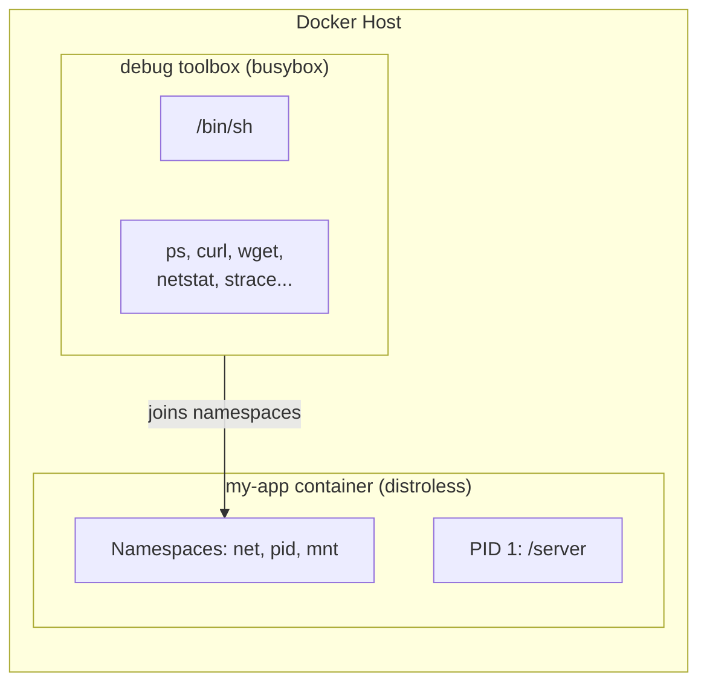
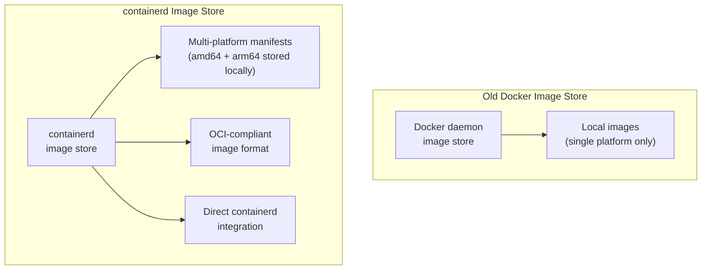

# Module 17 — docker init and docker debug

## The "Where Do I Start?" Problem

Picture this: a developer joins a new team. Their job is to containerize a Python FastAPI service. They've read about Docker. They know they need a Dockerfile. So they search for "python dockerfile" and find a Stack Overflow answer from 2017. They copy it. The Dockerfile uses Python 2, runs as root, has no .dockerignore, no multi-stage build, no healthcheck, and no one catches it because it works.

This is how most Dockerfiles were written until 2023.

The second problem: a different developer has a distroless container in production — a minimal image with no shell, no package manager, nothing. Their application crashes. They type `docker exec -it mycontainer sh` and get an error: no such file. They have no idea how to debug inside a container that has no tools.

This module covers the Docker CLI features introduced in 2023-2024 that address both problems.

---

## 📌 Learning Priority

**Must Learn** — core concepts, needed to understand the rest of this file:
[docker init](#docker-init-scaffolding-that-actually-knows-what-its-doing) · [docker debug](#docker-debug-the-shell-thats-always-there)

**Should Learn** — important for real projects and interviews:
[Quality of Generated Dockerfiles](#the-quality-of-generated-dockerfiles) · [What docker debug Does](#what-docker-debug-does) · [containerd Image Store](#containerd-image-store)

**Good to Know** — useful in specific situations, not needed daily:
[When to Use docker init vs Not](#when-to-use-docker-init-vs-not) · [docker debug vs kubectl debug](#docker-debug-vs-kubectl-debug) · [Docker Extensions](#docker-extensions)

**Reference** — skim once, look up when needed:
[Supported Project Types](#supported-project-types) · [Summary: What Changed and Why It Matters](#summary-what-changed-and-why-it-matters)

---

## docker init: Scaffolding That Actually Knows What It's Doing

`docker init` was released in Docker Desktop 4.19 (April 2023) and reached general availability with Docker Desktop 4.25 (November 2023). It is an interactive wizard that inspects your project and generates production-ready Docker configuration files.

### What It Generates

Running `docker init` in your project directory produces up to three files:
- **Dockerfile** — multi-stage build, non-root user, healthcheck included
- **.dockerignore** — sensible defaults for your language/framework
- **compose.yaml** — a working Docker Compose configuration

These aren't toy examples. The generated Dockerfiles implement the best practices that experienced Docker users spend years learning: pinned base image versions, separate dependency installation step for cache efficiency, non-root user, `HEALTHCHECK`, minimal final stage.

### Supported Project Types

`docker init` detects your project type automatically by looking for signature files:

| Runtime | Detection File | Since |
|---------|---------------|-------|
| Python | `requirements.txt`, `pyproject.toml`, `Pipfile` | 4.19 |
| Node.js | `package.json` | 4.19 |
| Go | `go.mod` | 4.19 |
| Rust | `Cargo.toml` | 4.19 |
| ASP.NET | `*.csproj`, `*.sln` | 4.19 |
| PHP | `composer.json` | 4.25 |
| Java | `pom.xml` (Maven), `build.gradle` (Gradle) | 4.25 |

If it can't detect the type, it asks you to select manually.

### The Interactive Wizard

```bash
$ docker init

Welcome to the Docker Init CLI!

This utility will walk you through creating the following files with
sensible defaults for your project:
  - .dockerignore
  - Dockerfile
  - compose.yaml

Let's get started!

? What application platform does your project use?  [Use arrows to move, type to filter]
> Python
  Go
  Java
  Node
  PHP
  Rust
  ASP.NET Core
  Other

? What version of Python do you want to use? (3.12.2)

? What port does your server listen on? (8000)

? What is the command to run your app? (gunicorn 'app:create_app()' --bind=0.0.0.0:8000)

CREATED: .dockerignore
CREATED: Dockerfile
CREATED: compose.yaml
```

The wizard asks just a few questions and sensible defaults are shown in parentheses. You can press Enter to accept defaults for every question.

### The Quality of Generated Dockerfiles

This is where `docker init` earns its reputation. A generated Python Dockerfile looks like this:

```dockerfile
# syntax=docker/dockerfile:1

ARG PYTHON_VERSION=3.12.2
FROM python:${PYTHON_VERSION}-slim as base

# Prevents Python from writing pyc files.
ENV PYTHONDONTWRITEBYTECODE=1

# Keeps Python from buffering stdout and stderr.
ENV PYTHONUNBUFFERED=1

WORKDIR /app

# Create a non-privileged user that the app will run under.
ARG UID=10001
RUN adduser \
    --disabled-password \
    --gecos "" \
    --home "/nonexistent" \
    --shell "/sbin/nologin" \
    --no-create-home \
    --uid "${UID}" \
    appuser

# Download dependencies as a separate step to take advantage of Docker's caching.
# Leverage a cache mount to /root/.cache/pip to speed up subsequent builds.
# Leverage a bind mount to requirements.txt so we don't have to COPY it.
RUN --mount=type=cache,target=/root/.cache/pip \
    --mount=type=bind,source=requirements.txt,target=requirements.txt \
    python -m pip install -r requirements.txt

USER appuser

COPY . .

EXPOSE 8000

CMD gunicorn 'app:create_app()' --bind=0.0.0.0:8000
```

Notice what's included without you having to ask for it:
- `# syntax=docker/dockerfile:1` parser directive (BuildKit features enabled)
- `PYTHONDONTWRITEBYTECODE` and `PYTHONUNBUFFERED` (best practice env vars)
- Non-root user (`appuser`) created before switching to it
- Dependency installation in a separate step using a **BuildKit cache mount** and a **bind mount** (requirements.txt is not copied into the image, just mounted during the install step)
- Parameterized Python version via `ARG`

A developer copy-pasting from Stack Overflow would not produce this. A developer who has containerized dozens of applications might.

### When to Use docker init vs Not

**Use it:**
- Starting a new project and want a production-ready baseline immediately
- Onboarding a project that has no Docker configuration yet
- Learning what a good Dockerfile for your language looks like
- Quickly containerizing a simple service

**Don't use it (or use it as a starting point to modify):**
- Your application has unusual structure (monorepo, multiple services, non-standard entry points)
- You need custom base images
- You have complex multi-stage requirements beyond what the template provides
- You're containerizing an application with specialized build requirements (native extensions, GPU support, etc.)

The generated files are meant to be edited. They include comments explaining each decision. Treat them as a well-informed starting point, not a final answer.

---

## docker debug: The Shell That's Always There

### The Distroless Problem

Distroless images (from Google) and scratch-based images are minimal container images that contain only the application binary and its runtime dependencies. They have no shell, no package manager, no `ps`, no `curl`, no `ls`. A distroless Go application image might be 5 MB.

The security benefit is real: no shell means an attacker who gains code execution in your container has no tools to work with. No `bash` to spawn, no `curl` to download payloads, no `apt` to install utilities.

The operational cost is equally real: when something goes wrong, you can't get a shell.

```bash
# This fails completely on a distroless container
$ docker exec -it my-distroless-app sh
OCI runtime exec failed: exec failed: unable to start container process:
exec: "sh": executable file not found in $PATH
```

Before `docker debug`, the common workaround was to maintain two Dockerfiles: one for production (distroless) and one for debugging (full image). Some teams just gave up on distroless because it was too painful.

### What docker debug Does

`docker debug` was introduced in Docker Desktop 4.27 (March 2024). It attaches a **toolbox container** to a running container's Linux namespaces — process namespace, network namespace, and filesystem — without requiring anything to be installed in the target container.



The debug toolbox joins the target container's namespaces. From inside the toolbox, you can:
- See all processes in the target container (`ps aux`)
- Browse the target container's filesystem (`ls /proc/1/root/`)
- Make network requests from the target's network namespace (`curl localhost:8080`)
- Inspect environment variables, open files, and socket connections

### Basic Usage

```bash
# Debug a running container by name or ID
docker debug my-container

# You get a shell immediately
# (busybox sh by default)
root@my-container:/#

# Inside the debug shell:
root@my-container:/# ps aux
PID   USER     TIME  COMMAND
    1 root      0:00 /server
root@my-container:/# ls /proc/1/root/
server  etc  ...

root@my-container:/# curl localhost:8080/health
{"status": "ok"}
```

### Using a Custom Debug Image

The default toolbox is busybox-based. For more advanced debugging, specify a custom image:

```bash
# netshoot has everything: tcpdump, nmap, dig, iperf, strace, etc.
docker debug --image nicolaka/netshoot my-container

# Or use a full Ubuntu for apt access
docker debug --image ubuntu:22.04 my-container
```

The `nicolaka/netshoot` image is the standard choice for network debugging — it includes `tcpdump`, `nmap`, `dig`, `nslookup`, `netstat`, `ss`, `iperf3`, `traceroute`, and many more tools.

### What You Can Do Inside docker debug

```bash
# Check what process is running
ps aux

# Inspect the application's filesystem
ls -la /proc/1/root/

# Check network connections
ss -tulpn

# Make HTTP requests to the app (from inside its network namespace)
curl -v http://localhost:8080/api/health

# DNS resolution test (from inside the container's network namespace)
dig api.external-service.com

# Read environment variables of PID 1
cat /proc/1/environ | tr '\0' '\n'

# Check open files
ls -la /proc/1/fd/

# View logs if they're written to a file
tail -f /proc/1/root/var/log/app.log
```

### docker debug vs kubectl debug

If you've worked with Kubernetes, you may know `kubectl debug` — it adds an **ephemeral container** to a running pod. Both tools solve the same problem, but differently:

| | `docker debug` | `kubectl debug` |
|---|---|---|
| Target | Docker containers | Kubernetes pods |
| Mechanism | Attaches toolbox to container namespaces | Injects ephemeral container into pod spec |
| Requires Kubernetes | No | Yes |
| Modifies the pod/container | No | Adds ephemeral container (visible in `kubectl get pod`) |
| Availability | Docker Desktop 4.27+ | Kubernetes 1.23+ (stable) |
| Custom debug image | Yes (`--image`) | Yes (`--image`) |

`docker debug` is for local development and debugging in Docker. `kubectl debug` is for Kubernetes. They're complementary.

### The Old Way vs The New Way

Before `docker debug`, teams had several painful workarounds:

1. **Add a shell to prod images** — defeats the purpose of distroless, increases attack surface
2. **Maintain a separate debug Dockerfile** — doubled maintenance burden
3. **Commit and rebuild with debugging tools added** — slow, disruptive
4. **Read container logs and hope for the best** — not always sufficient

`docker debug` eliminates all of these. You keep your minimal production image and get full debugging capabilities when needed without modifying anything.

---

## containerd Image Store

### Two Image Stores

Docker Desktop 4.12 (2023) introduced the option to switch from Docker's traditional image store to a **containerd-based image store**. This was made the default in Docker Desktop 4.34 (late 2024).

The old image store was Docker's proprietary implementation. The containerd image store uses the same image backend that Kubernetes uses — bringing Docker's local image storage into alignment with the rest of the container ecosystem.



### Key Benefits

**Multi-platform images stored locally**: With the old store, `docker pull` on an amd64 machine would only pull the amd64 variant, discarding the manifest list. With the containerd store, you can pull and store multi-platform manifests locally, inspect them, and push them without needing a registry.

**OCI compliance**: The OCI (Open Container Initiative) image specification defines a standard format for container images. The containerd store is fully OCI-compliant, meaning images work interchangeably with other OCI-compatible tools (containerd, Podman, Buildah).

**Better Kubernetes integration**: Since Kubernetes uses containerd as its runtime, images in Docker's containerd store are in the same format and can be used directly without conversion.

### Enabling the containerd Image Store

In Docker Desktop (pre-4.34):
1. Open Docker Desktop
2. Go to Settings → General
3. Enable "Use containerd for pulling and storing images"
4. Apply and restart

After enabling:
```bash
# Pull a multi-platform image
docker pull --platform linux/arm64 nginx:latest

# Inspect the local manifest (works with containerd store, not old store)
docker buildx imagetools inspect nginx:latest

# List images with platform info
docker image ls --format "table {{.Repository}}\t{{.Tag}}\t{{.Platform}}"
```

### OCI Image Spec: What It Means for Portability

The OCI image spec defines three things:
1. **Image format**: how layers and metadata are stored
2. **Distribution spec**: how images are pushed/pulled from registries
3. **Runtime spec**: how containers are started from images

An OCI-compliant image works with Docker, containerd, Podman, cri-o, and any other OCI-compatible runtime. This matters increasingly as organizations run containers outside of Docker — on Kubernetes (which uses containerd directly) or with alternative tools.

---

## Docker Extensions

### What Extensions Are

Docker Desktop 4.8 (2022) introduced Extensions — a plugin system for Docker Desktop that allows third-party tools to integrate directly into the Docker Desktop UI and CLI.

Extensions are Docker images that contain:
- A backend service (optional)
- A UI built with React that appears in Docker Desktop's sidebar
- CLI commands accessed via `docker extension`

```bash
# List installed extensions
docker extension ls

# Install an extension from Docker Hub
docker extension install portainer/portainer-docker-extension:latest

# Remove an extension
docker extension rm portainer/portainer-docker-extension

# Update an extension
docker extension update portainer/portainer-docker-extension
```

### Notable Extensions

| Extension | Purpose |
|-----------|---------|
| **Portainer** | Full container management UI — manage containers, volumes, networks, stacks |
| **Disk Usage** | Visual breakdown of Docker's disk usage — identify which images/volumes are consuming space |
| **Logs Explorer** | Search and filter logs across all containers with a UI |
| **Snyk** | Security scanning integrated into Docker Desktop |
| **Grafana k6** | Load testing from within Docker Desktop |
| **MinIO** | Local S3-compatible object storage for development |

### When Extensions Help

Extensions are most useful for:
- Teams who want a GUI for container management without running a full orchestrator
- Developers who need to debug disk usage (`docker system df` is good, the Disk Usage extension visualizes it)
- Quick security scans without leaving Docker Desktop

Extensions are an optional quality-of-life improvement, not a core workflow component. Heavy CLI users often skip them entirely.

---

## Summary: What Changed and Why It Matters

| Feature | Introduced | Problem Solved |
|---------|-----------|---------------|
| `docker init` | Docker Desktop 4.19 (2023) | Bad Dockerfiles copied from Stack Overflow |
| `docker debug` | Docker Desktop 4.27 (2024) | No shell in distroless/scratch images |
| containerd image store | Docker Desktop 4.12 (2023), default in 4.34 (2024) | Single-platform local store, OCI non-compliance |
| Docker Extensions | Docker Desktop 4.8 (2022) | No plugin ecosystem for Desktop |

The theme across all of these: Docker is closing the gap between "what Docker experts know to do" and "what Docker gives you by default." `docker init` generates expert Dockerfiles automatically. `docker debug` makes minimal production images debuggable. The containerd store aligns Docker with the Kubernetes ecosystem.


---

## 📝 Practice Questions

- 📝 [Q69 · docker-init](../docker_practice_questions_100.md#q69--thinking--docker-init)
- 📝 [Q70 · docker-debug](../docker_practice_questions_100.md#q70--thinking--docker-debug)


---

## 📂 Navigation

| | |
|---|---|
| **Previous** | [16_BuildKit_and_Docker_Scout](../16_BuildKit_and_Docker_Scout/Theory.md) |
| **Next** | *(End of Docker Module)* |
| **Cheatsheet** | [Cheatsheet.md](./Cheatsheet.md) |
| **Interview Q&A** | [Interview_QA.md](./Interview_QA.md) |
| **Code Examples** | [Code_Example.md](./Code_Example.md) |
| **Module Index** | [01_Docker README](../README.md) |
