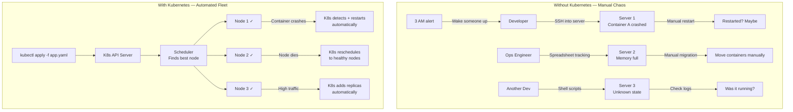

# Module 01 — What is Kubernetes?

## The Problem: Containers at Scale

Imagine you work at a company that runs an online store. Your application is split into several
microservices: a web frontend, a cart service, a payment service, an inventory service, and a
database. You containerized everything — great move! Each service now runs in a Docker container
and you can start it reliably on any machine.

Now your boss says: "We need to run this across 10 servers for high availability."

Suddenly you are facing questions like:

- Which container runs on which machine?
- What happens when a container crashes at 3 AM? Who restarts it?
- How do the services discover each other's IP addresses when they move around?
- How do you deploy a new version of the payment service without downtime?
- How do you scale the cart service to 20 copies during Black Friday, then back to 2 copies?
- What if a server dies? How do you move its containers to healthy machines?

Multiply this across 100 containers on 10 machines, and you now have a full-time job just keeping
things running. You're essentially managing a mini data center by hand, with spreadsheets and
shell scripts and post-it notes on your monitor.

This is the problem Kubernetes (often abbreviated **K8s** — the 8 stands for the 8 letters between
K and s) was built to solve.

---

## Kubernetes as the "Data Center Operating System"

Think about what an operating system does for a single computer: it abstracts the hardware, decides
which processes run on which CPU cores, manages memory allocation, handles crashes, and provides
a standard API so applications don't care about the underlying hardware details.

Kubernetes does the same thing, but for a **fleet of machines**. It treats your collection of
servers as a single pool of compute resources and decides where to run your containers, how many
copies to maintain, and how to handle failures — all automatically.

You don't say "run container X on server 7." You say "I need 5 copies of container X, each with
512 MB RAM and 0.5 CPU." Kubernetes figures out the rest.

This is the **declarative model**: you declare the desired state, and Kubernetes continuously works
to make reality match that declaration.

---

## The Core Promises of Kubernetes

### 1. Self-Healing
If a container crashes, Kubernetes restarts it. If a server dies, Kubernetes reschedules its
containers onto healthy servers. You define what "healthy" looks like (via health checks), and
Kubernetes enforces it around the clock.

### 2. Auto-Scaling
Kubernetes can watch CPU and memory usage and automatically add or remove container replicas based
on load. Scale up for traffic spikes, scale down to save money during quiet periods.

### 3. Service Discovery and Load Balancing
Every group of containers gets a stable DNS name and virtual IP address. When you add more
replicas, traffic automatically spreads across them. When containers move to new servers, the DNS
name still works.

### 4. Rolling Updates and Rollbacks
Deploy a new version of your application by gradually replacing old containers with new ones.
If something goes wrong, roll back to the previous version with a single command. Zero downtime
by design.

### 5. Secret and Configuration Management
Store passwords, API keys, and configuration separately from your container images. Inject them
as environment variables or files at runtime.

### 6. Storage Orchestration
Automatically mount storage systems — local drives, cloud volumes, network file systems — to your
containers, and keep data safe even when containers move between servers.

---

## A Brief History

### Google Borg (2003–2014)
Google ran billions of containers per week long before Docker existed. They built an internal
system called **Borg** to manage this at planetary scale. Borg taught Google that declarative
configuration, health-checking, and automated scheduling were the keys to operating containers
reliably.

### Kubernetes (2014)
Three Google engineers — Joe Beda, Brendan Burns, and Craig McLuckie — took the lessons from Borg
and rewrote them as an open-source project called Kubernetes (Greek for "helmsman" or "pilot" —
the person who steers a ship). It was announced at DockerCon 2014.

### CNCF (2016)
Google donated Kubernetes to the **Cloud Native Computing Foundation (CNCF)**, a vendor-neutral
home for cloud-native open-source projects. This prevented any single company from controlling it
and accelerated adoption across the industry.

### Today
Kubernetes is the de facto standard for container orchestration. Every major cloud provider offers
a managed Kubernetes service: Amazon EKS, Google GKE, Azure AKS. Thousands of companies run
production workloads on it.

---

## Without K8s vs. With K8s



---

## The Declarative Model Explained

Most traditional systems are **imperative**: you tell them *how* to do something step by step.

```bash
# Imperative — telling the system what to do, step by step
ssh server1 "docker run -d nginx"
ssh server2 "docker run -d nginx"
ssh server3 "docker run -d nginx"
# Now what if server2 crashes? You do it all again manually.
```

Kubernetes is **declarative**: you tell it *what you want*, and it figures out how to get there.

```yaml
# Declarative — telling the system what state you want
apiVersion: apps/v1
kind: Deployment
metadata:
  name: nginx
spec:
  replicas: 3        # I want 3 copies
  selector:
    matchLabels:
      app: nginx
  template:
    spec:
      containers:
      - name: nginx
        image: nginx:1.25
```

You apply this once. Kubernetes runs 3 copies. One crashes? Kubernetes notices the actual state
(2 running) doesn't match the desired state (3 running) and creates a new one. You never told it
to — it just does it. This constant reconciliation between desired and actual state is the heartbeat
of Kubernetes.

---

## When NOT to Use Kubernetes

Kubernetes is powerful but it comes with real complexity. It is not always the right tool:

| Situation | Recommendation |
|-----------|---------------|
| You have 1–3 services | Docker Compose is simpler and sufficient |
| Team of 1–3 engineers | K8s operational overhead will slow you down |
| Batch script or cron job | Use a VM or serverless function |
| Startup finding product-market fit | Managed PaaS (Heroku, Render, Railway) first |
| Regulated environment with strict control | Consider whether managed K8s fits compliance |
| Stateful apps with complex data needs | Evaluate whether K8s storage meets your needs |

The rule of thumb: if you don't need self-healing, auto-scaling, or complex networking across
many services, you probably don't need Kubernetes yet. Start simple and graduate to K8s when
the pain of manual operations becomes real.

---

## Key Vocabulary Summary

| Term | Plain-English Definition |
|------|--------------------------|
| Container | A lightweight, isolated process with its own filesystem |
| Container Orchestration | Automating the deployment, scaling, and management of containers |
| Kubernetes (K8s) | The leading open-source container orchestration system |
| Cluster | A set of machines (nodes) managed by Kubernetes |
| Node | A single machine in the cluster (physical or virtual) |
| Pod | The smallest deployable unit in K8s (wraps one or more containers) |
| Declarative | Describing desired state rather than step-by-step instructions |
| CNCF | Cloud Native Computing Foundation — home of K8s and 100+ cloud-native projects |
| kubectl | The command-line tool for talking to a Kubernetes cluster |

---

## What's Next

You now understand *why* Kubernetes exists. In the next module, we'll open the hood and look at
how K8s is actually built — the control plane, worker nodes, and how a simple `kubectl apply`
command turns into a running container on a machine somewhere in your cluster.

---

## Navigation

| File | Description |
|------|-------------|
| [Theory.md](./Theory.md) | You are here — What is Kubernetes? |
| [Cheatsheet.md](./Cheatsheet.md) | Quick reference commands |
| [Interview_QA.md](./Interview_QA.md) | Common interview questions and answers |

**Previous:** [01_Docker (Container Engineering root)](../../01_Docker/) |
**Next:** [02_K8s_Architecture](../02_K8s_Architecture/Theory.md)
