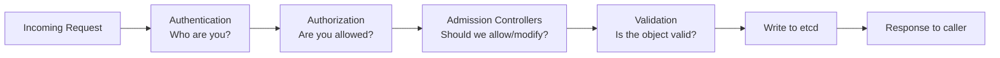
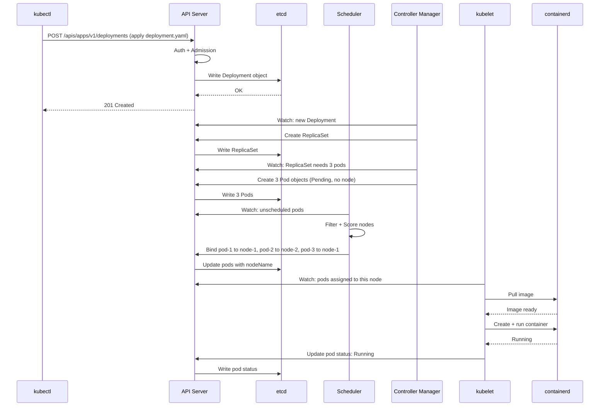

# Module 02 — Architecture Deep Dive

## Introduction

This document goes deeper on each Kubernetes component. Read Theory.md first for the big picture.
Here we cover the internal mechanics that help you diagnose problems, answer advanced interview
questions, and understand why Kubernetes behaves the way it does.

---

## API Server Deep Dive

### It's Just a REST API

The Kubernetes API server exposes a RESTful HTTP API. Every Kubernetes object — pods, deployments,
services, configmaps — is a REST resource with standard CRUD operations:

```
GET    /api/v1/namespaces/default/pods          # list pods
GET    /api/v1/namespaces/default/pods/my-pod   # get specific pod
POST   /api/v1/namespaces/default/pods          # create pod
PUT    /api/v1/namespaces/default/pods/my-pod   # replace pod
PATCH  /api/v1/namespaces/default/pods/my-pod   # partial update
DELETE /api/v1/namespaces/default/pods/my-pod   # delete pod
```

`kubectl` is just a CLI wrapper around these HTTP calls. You can make the same calls with `curl`
if you want to see the raw API.

### The Request Lifecycle

Every request to the API server passes through a pipeline:



**Authentication**: Kubernetes supports multiple auth methods:
- Client certificates (the default for admin kubectl access)
- Bearer tokens (used by service accounts inside pods)
- OIDC (OAuth2 — used to integrate with your company's identity provider)
- Webhook (delegate auth to an external service)

**Authorization**: Most clusters use RBAC (Role-Based Access Control). A Role or ClusterRole
defines what verbs (get, list, create, delete) are allowed on which resources. A RoleBinding
connects a user/service-account to a role.

**Admission Controllers**: These are plugins that intercept requests *after* auth but *before*
persistence. They can:
- **Mutate**: modify the object (e.g., inject sidecar containers, set default values)
- **Validate**: reject objects that don't meet policy (e.g., require resource limits, enforce
  naming conventions)

Important built-in admission controllers:
- `LimitRanger`: enforces default resource limits
- `ResourceQuota`: enforces namespace resource quotas
- `PodSecurity`: enforces pod security standards
- `MutatingWebhookConfiguration` / `ValidatingWebhookConfiguration`: call external webhooks

Istio, Kyverno, OPA/Gatekeeper all use webhook admission controllers.

### Watch Mechanism

Instead of polling, Kubernetes components use HTTP long-polling (watches). A component sends:

```
GET /api/v1/pods?watch=true&resourceVersion=12345
```

The API server holds the connection open and streams events (ADDED, MODIFIED, DELETED) as
they happen. This is how the scheduler, controller manager, and kubelet all learn about changes
in real time without constantly polling.

---

## etcd Deep Dive

### Raft Consensus Algorithm

etcd uses the Raft distributed consensus algorithm to ensure all nodes agree on the same data.

Key Raft concepts:
- **Leader election**: one node is elected leader and handles all writes
- **Log replication**: the leader sends every write to a majority of followers before confirming
- **Quorum**: a majority of nodes must be available for writes to succeed

For an etcd cluster of N nodes, you need (N/2 + 1) nodes available:
- 1 node: tolerates 0 failures (not HA)
- 3 nodes: tolerates 1 failure (standard production)
- 5 nodes: tolerates 2 failures (high-stakes production)

Always run an odd number of etcd nodes. An even number (like 4) gives you no extra fault tolerance
over 3 nodes, but costs more.

### What's Stored in etcd

Everything you see via `kubectl get` is a serialized object in etcd. The keys follow a pattern:

```
/registry/pods/default/my-pod
/registry/deployments/apps/default/my-deployment
/registry/secrets/default/my-secret
/registry/configmaps/default/my-configmap
/registry/services/specs/default/my-service
```

### Backup and Restore

Backing up etcd means taking a snapshot:

```bash
# Take an etcd snapshot
ETCDCTL_API=3 etcdctl snapshot save /backup/etcd-snapshot.db \
  --endpoints=https://127.0.0.1:2379 \
  --cacert=/etc/kubernetes/pki/etcd/ca.crt \
  --cert=/etc/kubernetes/pki/etcd/server.crt \
  --key=/etc/kubernetes/pki/etcd/server.key

# Verify the snapshot
ETCDCTL_API=3 etcdctl snapshot status /backup/etcd-snapshot.db

# Restore from snapshot
ETCDCTL_API=3 etcdctl snapshot restore /backup/etcd-snapshot.db \
  --data-dir=/var/lib/etcd-restored
```

In managed Kubernetes (EKS, GKE, AKS), etcd backup is handled by the cloud provider.

---

## Scheduler Deep Dive

### Filtering Phase

The scheduler first eliminates nodes that *cannot* run the pod. Reasons a node is filtered out:

| Filter | Reason |
|--------|--------|
| `NodeResourcesFit` | Node doesn't have enough CPU/memory |
| `NodeName` | Pod has `spec.nodeName` set to a different node |
| `NodeSelector` | Pod's `nodeSelector` doesn't match node labels |
| `NodeAffinity` | Pod's affinity rules don't match |
| `TaintToleration` | Node has taints the pod doesn't tolerate |
| `PodTopologySpread` | Placing pod here would violate spread constraints |
| `VolumeBinding` | Required PVC can't be bound on this node |

If no nodes pass filtering, the pod stays in `Pending` with an event like
"0/3 nodes are available: 3 Insufficient memory."

### Scoring Phase

Remaining nodes are scored 0–100 by multiple plugins, then weighted and summed:

| Scorer | What it prefers |
|--------|----------------|
| `NodeResourcesBalancedAllocation` | nodes where CPU and memory use is balanced |
| `NodeResourcesFit (LeastAllocated)` | nodes with most available resources |
| `InterPodAffinity` | nodes co-located with or away from specific pods |
| `NodeAffinity` | nodes matching preferred affinity rules |
| `TaintToleration` | nodes with fewer taints |

### Custom Scheduling

You can run multiple schedulers and assign pods to them via `spec.schedulerName`. This lets you
implement custom placement logic for specific workloads.

---

## Controller Manager Deep Dive

### The Reconciliation Loop

Every controller in Kubernetes runs the same basic pattern:

```
loop forever:
    desired  = read desired state from API server
    actual   = read actual state (from API or the real world)
    if desired != actual:
        take action to make actual match desired
    sleep a bit
    repeat
```

This is called a **control loop** or **reconciliation loop**. It is idempotent — running it
multiple times produces the same result. Even if a controller crashes and restarts, it re-reads
state and continues where it left off.

### Key Controllers

**ReplicaSet Controller**
- Watches ReplicaSets and their owned Pods
- If `replicas: 5` but only 4 pods exist → creates 1 more pod
- If 6 pods exist → deletes 1 pod
- Owns pods via `metadata.ownerReferences`

**Deployment Controller**
- Manages ReplicaSets to implement rolling updates
- When you change a Deployment's pod template, it creates a new ReplicaSet and scales it up
  while scaling down the old ReplicaSet
- Stores revision history to enable rollbacks

**Node Controller**
- Monitors node heartbeats (kubelet updates node status every 10 seconds by default)
- If a node stops responding, marks it as `NotReady`
- After `--pod-eviction-timeout` (default 5 minutes), evicts pods from the dead node

**Endpoints/EndpointSlice Controller**
- Watches Services and their matching Pods
- Maintains the list of healthy pod IP:port pairs for each service
- kube-proxy reads this list to program routing rules

---

## kubelet Deep Dive

### Pod Spec to Running Container

When kubelet receives a pod assigned to its node, it:

1. Pulls the container image (calls containerd's image pull API)
2. Creates pod sandbox (network namespace, cgroup)
3. Calls CNI (Container Network Interface) plugins to set up pod networking
4. Creates containers in the sandbox
5. Starts containers
6. Runs health probes (liveness, readiness, startup)
7. Reports status back to API server

### Static Pods

kubelet can also run "static pods" — pods defined as YAML files in a local directory
(default: `/etc/kubernetes/manifests/`). The control plane components themselves (API server,
etcd, scheduler, controller manager) run as static pods on control plane nodes in kubeadm-based
clusters.

Static pods always have the node name appended to their name (e.g., `kube-apiserver-node-1`).

### Node Registration

When a new node joins the cluster, kubelet automatically registers itself with the API server,
reporting its capacity (CPU, memory, disk), OS info, and labels.

---

## kube-proxy Deep Dive

### The Service Problem

Kubernetes Services have a virtual IP (ClusterIP) that doesn't belong to any actual network
interface. When a pod sends traffic to a ClusterIP, something must intercept that traffic and
redirect it to a real pod IP.

### iptables Mode (default in most clusters)

kube-proxy programs iptables DNAT (Destination Network Address Translation) rules. When a packet
arrives at a node destined for a ClusterIP, iptables intercepts it in the PREROUTING chain and
randomly selects one of the service's backend pod IPs, rewriting the destination.

Downside: iptables rules are O(n) to evaluate. With thousands of services, rule evaluation
becomes slow.

### IPVS Mode (better at scale)

IPVS (IP Virtual Server) is a Linux kernel load balancer. kube-proxy in IPVS mode creates a
virtual server for each Service and adds real servers for each pod. IPVS uses hash tables — O(1)
lookup regardless of number of services.

Enable IPVS mode by setting `mode: ipvs` in the kube-proxy ConfigMap.

### eBPF Mode (modern — used by Cilium)

Cilium (a CNI plugin) replaces kube-proxy entirely with eBPF programs that are more efficient and
provide better observability. This is increasingly common in modern clusters.

---

## End-to-End Pod Creation Sequence



---

## 📂 Navigation

| File | Description |
|------|-------------|
| [Theory.md](./Theory.md) | Architecture overview |
| [Architecture_Deep_Dive.md](./Architecture_Deep_Dive.md) | You are here — component deep dives |
| [Cheatsheet.md](./Cheatsheet.md) | Quick reference commands |
| [Interview_QA.md](./Interview_QA.md) | Interview questions and answers |

**Previous:** [01_What_is_Kubernetes](../01_What_is_Kubernetes/Theory.md) |
**Next:** [03_Installation_and_Setup](../03_Installation_and_Setup/Theory.md)
