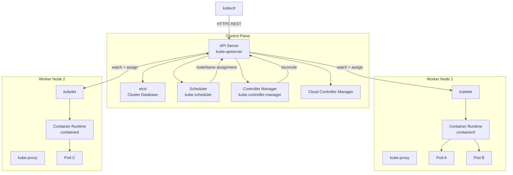
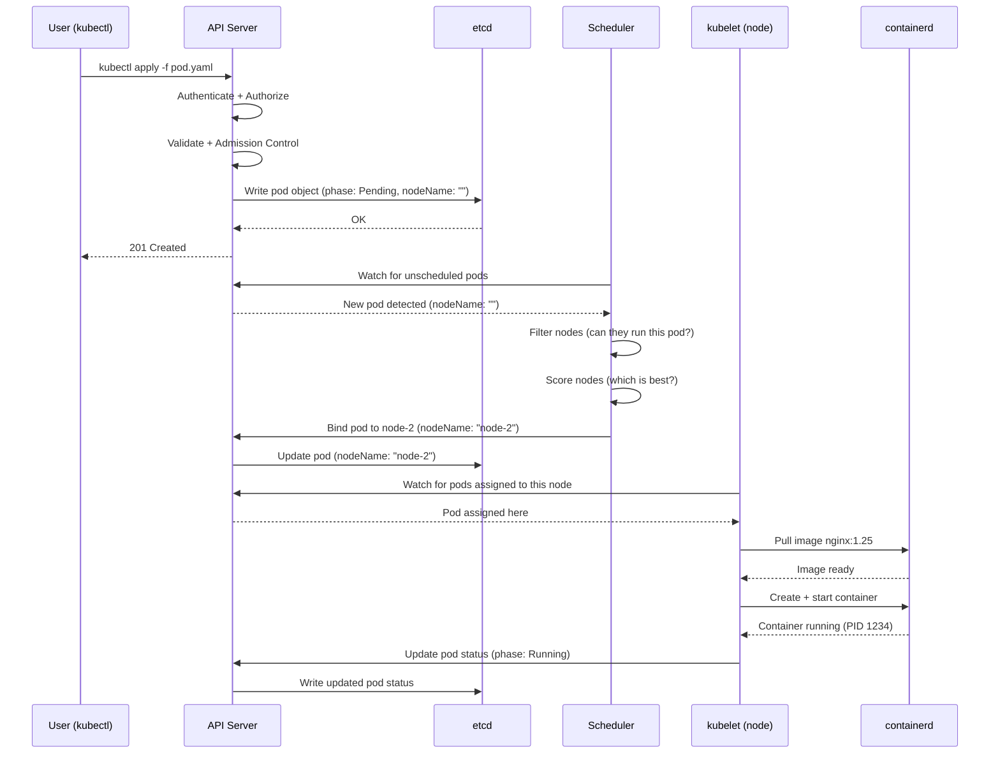
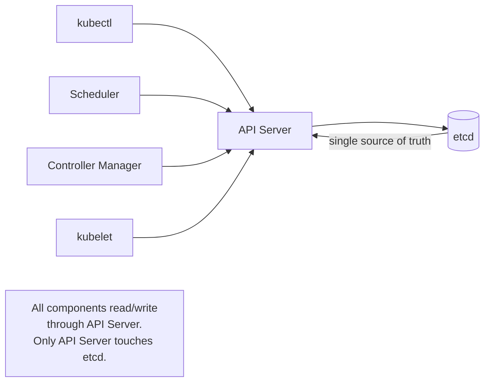

# Module 02 — Kubernetes Architecture

## Starting with a Story

You run `kubectl apply -f my-app.yaml`. A few seconds later, your application is running on a
server somewhere in your cluster. But what actually happened in those few seconds?

A request traveled through multiple components, each with a specific responsibility. Understanding
this journey is the foundation of diagnosing problems, tuning performance, and building confidence
with Kubernetes. Let's walk through it.

---

## The Two Halves: Control Plane and Worker Nodes

A Kubernetes cluster is divided into two logical layers:

1. **The Control Plane** — the brain. It makes decisions about the cluster (scheduling, detecting
   failures, managing state). You don't run application workloads here.

2. **Worker Nodes** — the muscle. These are the machines where your application containers
   actually run.

In production, you typically have 3 or 5 control plane nodes (for high availability) and many
worker nodes.

---

## Control Plane Components

### API Server (kube-apiserver)

The API Server is the **front door** of Kubernetes. Every interaction — from `kubectl` commands
to internal component communication — goes through the API server. It is the only component that
talks directly to etcd.

Responsibilities:
- Authenticate and authorize incoming requests
- Validate the request (is this YAML valid?)
- Run admission controllers (should this request be allowed/modified?)
- Read and write cluster state to etcd
- Notify other components about changes via a watch mechanism

The API server is stateless — it stores nothing itself. All state lives in etcd.

### etcd

etcd is a **distributed key-value store** that serves as Kubernetes' single source of truth. Every
object you create (pods, deployments, configmaps, secrets) is stored here as a serialized YAML/JSON
object.

Key properties:
- Uses the **Raft consensus algorithm** to ensure data consistency across multiple etcd nodes
- All writes go through the leader node; reads can come from any node
- Data is append-only — etcd keeps a history of changes
- If etcd is lost and you have no backup, your cluster state is gone forever

This is why etcd backup is the most critical operational task in Kubernetes.

### Scheduler (kube-scheduler)

The scheduler's job is to answer one question: **"Which node should this pod run on?"**

When you create a pod, it starts as "Pending" — it has no node assigned. The scheduler watches for
pending pods and runs a two-phase algorithm:

1. **Filtering**: eliminate nodes that cannot run the pod (not enough CPU, wrong architecture,
   node is tainted, node selector doesn't match)
2. **Scoring**: rank the remaining nodes by how good a fit they are (most available resources,
   node affinity rules, spread across availability zones)

The scheduler assigns the highest-scoring node to the pod by writing the node name to the pod
spec in etcd. It does not start the container — that is kubelet's job.

### Controller Manager (kube-controller-manager)

The controller manager is a collection of **controllers** — each one is a control loop that watches
some part of cluster state and takes action when actual state diverges from desired state.

Key controllers:
- **ReplicaSet controller**: ensures the right number of pod replicas are running
- **Deployment controller**: manages rolling updates by creating/deleting ReplicaSets
- **Node controller**: detects when nodes stop responding and evicts their pods
- **Job controller**: creates pods for batch jobs and tracks completion
- **Endpoints controller**: maintains the list of healthy pod IPs behind each Service
- **Namespace controller**: handles namespace deletion cleanup

Each controller runs an independent reconciliation loop: observe → compare → act.

### Cloud Controller Manager

This component bridges Kubernetes with cloud provider APIs (AWS, GCP, Azure). It handles:
- Creating cloud load balancers when you create a `LoadBalancer` service
- Attaching cloud volumes when you create a `PersistentVolumeClaim`
- Labeling nodes with cloud metadata (region, availability zone, instance type)

If you run Kubernetes on bare metal, you don't have a cloud controller manager.

---

## Worker Node Components

### kubelet

The kubelet is an **agent** running on every worker node. It is the bridge between the API server
and the container runtime.

Its job:
1. Watch the API server for pods that have been assigned to its node
2. Pull the container images (if not cached)
3. Tell the container runtime to start the containers
4. Monitor the containers and run health checks
5. Report pod status back to the API server

Importantly, kubelet does *not* manage containers it didn't create — if you start a Docker
container manually on a node, kubelet ignores it.

### kube-proxy

kube-proxy runs on every node and implements **Service networking**. When you create a Kubernetes
Service, kube-proxy programs network rules (iptables or IPVS) on each node so that traffic
destined for the service's virtual IP gets forwarded to one of the healthy backing pods.

Think of it as a continuously-updated local routing table that reflects the current state of
all services and their endpoints.

### Container Runtime

This is the software that actually runs containers. Kubernetes uses the **Container Runtime
Interface (CRI)** to talk to container runtimes, so you can swap them out.

Common runtimes:
- **containerd**: the default runtime in most modern clusters (extracted from Docker)
- **CRI-O**: a lightweight runtime maintained by Red Hat
- Docker (via cri-dockerd shim — deprecated, rarely used now)

When kubelet says "start this container," it calls the container runtime via CRI.

---

## How a Pod Gets Scheduled — The Full Journey

The entire journey typically takes 1–5 seconds on a healthy cluster with a cached image.

---

## etcd as the Single Source of Truth

All cluster state lives in etcd. This is worth repeating because it has operational consequences:

- The API server caches data in memory but writes always go to etcd
- If the API server restarts, it re-reads everything from etcd — no state is lost
- Controllers (scheduler, controller manager) maintain their own in-memory watches, but
  authoritative state is always etcd
- Losing etcd without a backup = losing the cluster configuration entirely

---

## High Availability Topology

In production, you run multiple control plane nodes so that the failure of one node doesn't
take down cluster management:

- **3 etcd nodes**: can tolerate 1 failure (Raft needs majority)
- **3 API server nodes**: load-balanced behind a virtual IP or cloud load balancer
- **3 scheduler / controller-manager nodes**: only one is "leader" at a time (leader election
  via etcd locks), others are on standby

Worker nodes can be added or removed at will. The control plane is the part that needs care.

---

## Key Architecture Concepts Summary

| Component | Where It Runs | What It Does |
|-----------|---------------|--------------|
| kube-apiserver | Control Plane | REST API; all cluster operations go through here |
| etcd | Control Plane | Key-value store; the cluster database |
| kube-scheduler | Control Plane | Assigns pods to nodes |
| kube-controller-manager | Control Plane | Runs reconciliation loops |
| cloud-controller-manager | Control Plane | Talks to cloud provider APIs |
| kubelet | Every Node | Starts/stops containers; reports status |
| kube-proxy | Every Node | Implements Service networking |
| Container Runtime | Every Node | Actually runs containers (containerd, CRI-O) |

---

## Navigation

| File | Description |
|------|-------------|
| [Theory.md](./Theory.md) | You are here — architecture overview |
| [Architecture_Deep_Dive.md](./Architecture_Deep_Dive.md) | Per-component deep dives |
| [Cheatsheet.md](./Cheatsheet.md) | Quick reference commands |
| [Interview_QA.md](./Interview_QA.md) | Interview questions and answers |

**Previous:** [01_What_is_Kubernetes](../01_What_is_Kubernetes/Theory.md) |
**Next:** [03_Installation_and_Setup](../03_Installation_and_Setup/Theory.md)
