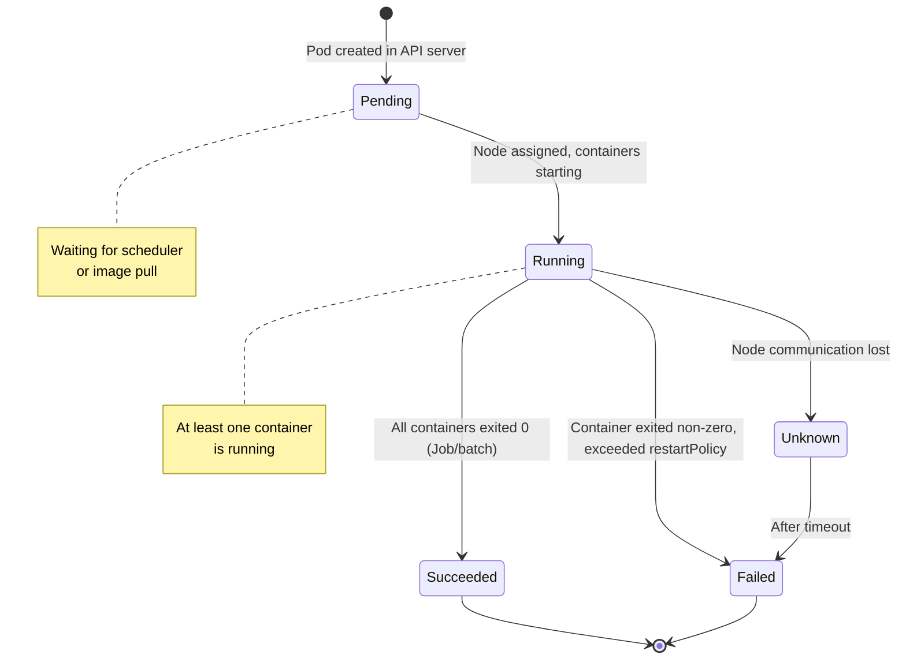

# Module 04 — Pods

## The Smallest Deployable Unit

In Docker, the unit of work is a container. In Kubernetes, the unit of work is a **Pod**.

A Pod is a wrapper around one or more containers that should always run together on the same
machine. Pods are how Kubernetes thinks about work — not individual containers.

Why introduce this extra layer? Because in the real world, some closely coupled processes need
to share resources directly. Rather than complicating the container abstraction, Kubernetes
creates a shared environment at the Pod level.

> **🐳 Coming from Docker?**
>
> In Docker, the smallest unit is a container — `docker run nginx` runs one container. In Kubernetes, the smallest unit is a Pod, which wraps one or more containers that always run together on the same machine. A single-container Pod is like a single `docker run`. A multi-container Pod is like `docker-compose` for containers that are inseparably linked — they share the same network interface (same localhost) and can share volumes directly. You don't usually create Pods directly, just like you don't usually run containers directly in production Docker.

---

## 📌 Learning Priority

**Must Learn** — core concepts, needed to understand the rest of this file:
[Why Pods](#why-pods----not-containers) · [Pod Lifecycle](#pod-lifecycle) · [Pod YAML Anatomy](#pod-yaml-anatomy)

**Should Learn** — important for real projects and interviews:
[Probes Health Checking](#probes-health-checking) · [Why Not Bare Pods](#why-you-rarely-create-pods-directly)

**Good to Know** — useful in specific situations, not needed daily:
[Multi-Container Patterns](#multi-container-pod-patterns) · [Static Pods](#static-pods)

**Reference** — skim once, look up when needed:
[Requests vs Limits](#resources-requests-vs-limits)

---

## Why Pods — Not Containers?

When you put containers inside a Pod, they get:

### Shared Network Namespace
All containers in a Pod share the same IP address and port space. Container A and Container B
in the same Pod can talk to each other via `localhost`. From outside the Pod, you see one IP.

This is implemented using a special `pause` container (the "sandbox" container) that holds the
network namespace while application containers come and go.

### Shared Storage (Volumes)
Containers in a Pod can mount the same volume. This is how sidecar patterns work — a log
collector container reads from a directory that the application writes to.

### Co-scheduling
Kubernetes always schedules all containers in a Pod onto the same node. If you have a web server
and a configuration sidecar that must be on the same machine, they belong in the same Pod.

---

## Multi-Container Pod Patterns

Putting multiple containers in a Pod is a deliberate design choice. Three patterns are recognized:

### Sidecar Pattern
A helper container that augments the main container without modifying it.

**Example**: Your app writes logs to `/var/log/app.log`. A sidecar container (Fluentd, Filebeat)
reads from that volume and ships logs to Elasticsearch. The app developer doesn't need to know
about the logging infrastructure — the sidecar handles it.

```
Pod:
  [Main App] ──writes──> /var/log/ <──reads── [Log Shipper Sidecar]
```

### Ambassador Pattern
A proxy container that handles network communication on behalf of the main container.

**Example**: Your app connects to `localhost:6379` thinking it's talking to Redis directly.
The ambassador container is actually a proxy that handles connection pooling, TLS, or routing
to the right Redis instance. The main app code never changes.

```
Pod:
  [Main App] ──localhost:6379──> [Redis Proxy Ambassador] ──> External Redis
```

### Adapter Pattern
A container that transforms the main container's output into a format expected by external systems.

**Example**: Your legacy app exposes metrics in a proprietary format. An adapter container
reads those metrics and converts them to Prometheus format. The monitoring system sees standard
Prometheus, the app is unchanged.

```
Pod:
  [Legacy App] ──/metrics (proprietary)──> [Adapter] ──> Prometheus scrape endpoint
```

---

## Pod Lifecycle

A Pod moves through defined phases from creation to termination:



### Pod Phase vs Container State

The **Pod phase** is a summary of the Pod as a whole (Pending, Running, Succeeded, Failed, Unknown).
Each **container** inside the Pod has its own state (Waiting, Running, Terminated).

Container states within a running Pod:
- `Waiting`: not yet started (waiting for image pull, or waiting after a crash before restart)
- `Running`: actively executing
- `Terminated`: exited, with an exit code

### Restart Policy

The `spec.restartPolicy` field controls what happens when a container exits:
- `Always` (default): always restart — good for long-running services
- `OnFailure`: restart only if exit code is non-zero — good for batch jobs
- `Never`: never restart — run-once jobs

---

## Pod YAML Anatomy

Every Kubernetes YAML has the same top-level structure:

```yaml
apiVersion: v1             # Kubernetes API version for this resource type
kind: Pod                  # The type of resource
metadata:                  # Data about the resource (name, labels, annotations)
  name: my-pod
  namespace: default
  labels:
    app: my-app
    version: "1.0"
spec:                      # The desired state of the resource
  containers:
  - name: main
    image: nginx:1.25
    ports:
    - containerPort: 80
    resources:
      requests:
        memory: "64Mi"     # Minimum guaranteed memory
        cpu: "250m"        # 250 millicores = 0.25 CPU
      limits:
        memory: "128Mi"    # Hard cap — OOM killed if exceeded
        cpu: "500m"        # Throttled if exceeded (not killed)
    env:
    - name: ENV_VAR
      value: "hello"
    volumeMounts:
    - name: config-volume
      mountPath: /etc/config
  volumes:
  - name: config-volume
    configMap:
      name: my-configmap
```

### Resources: Requests vs Limits

**Requests** are what the container is *guaranteed*. The scheduler uses requests to decide if
a node has enough capacity. If you request 512 MB, the scheduler only places the Pod on a node
with 512 MB available.

**Limits** are the *maximum* the container can use. If a container exceeds its memory limit,
it is OOM (Out Of Memory) killed. If it exceeds its CPU limit, it is throttled (slowed down)
but not killed.

Always set both requests and limits. Without requests, the scheduler can't make good decisions.
Without limits, one runaway container can starve everything else on the node.

---

## Static Pods

Static pods are defined by YAML files placed in a directory on a node (default:
`/etc/kubernetes/manifests/`). kubelet watches this directory and runs whatever pods are defined
there, without going through the API server's scheduler.

The control plane components themselves (API server, etcd, scheduler, controller manager) run
as static pods in kubeadm clusters. They appear in `kubectl get pods -n kube-system` but with
the node name suffix.

---

## Why You Rarely Create Pods Directly

If a Pod is deleted, crashes, or its node dies, it is gone forever. There is no self-healing
at the Pod level. That is intentional — higher-level objects handle that:

| Object | What it adds over bare Pods |
|--------|----------------------------|
| **Deployment** | Desired number of replicas + rolling updates + rollback history |
| **StatefulSet** | Stable identity (persistent hostname, ordered scaling) for databases |
| **DaemonSet** | One pod per node (for node-level tools like log collectors) |
| **Job** | Run-to-completion: retry on failure, track success count |
| **CronJob** | Scheduled jobs |

Think of bare Pods like manually created EC2 instances — powerful to understand, but you use
Auto Scaling Groups (Deployments) in practice.

---

## Probes: Health Checking

kubelet can run three types of probes against containers:

| Probe | Purpose | On failure |
|-------|---------|-----------|
| **Liveness** | Is the container alive? | Restart the container |
| **Readiness** | Is the container ready to receive traffic? | Remove from Service endpoints |
| **Startup** | Has the container finished starting up? | Block liveness/readiness checks |

Use startup probes for apps that take a long time to initialize (prevents liveness from killing
them before they've even started).


---

## 📝 Practice Questions

- 📝 [Q9 · pods-basics](../kubernetes_practice_questions_100.md#q9--normal--pods-basics)
- 📝 [Q10 · pod-lifecycle](../kubernetes_practice_questions_100.md#q10--normal--pod-lifecycle)
- 📝 [Q11 · pod-spec](../kubernetes_practice_questions_100.md#q11--debug--pod-spec)
- 📝 [Q76 · explain-pods-junior](../kubernetes_practice_questions_100.md#q76--interview--explain-pods-junior)
- 📝 [Q94 · debug-imagepullbackoff](../kubernetes_practice_questions_100.md#q94--debug--debug-imagepullbackoff)
- 📝 [Q100 · edge-case-termination](../kubernetes_practice_questions_100.md#q100--critical--edge-case-termination)


---

## 📂 Navigation

| File | Description |
|------|-------------|
| [Theory.md](./Theory.md) | You are here — Pods explained |
| [Cheatsheet.md](./Cheatsheet.md) | Quick reference commands |
| [Interview_QA.md](./Interview_QA.md) | Interview questions and answers |
| [Code_Example.md](./Code_Example.md) | Working YAML examples |

**Previous:** [03_Installation_and_Setup](../03_Installation_and_Setup/Theory.md) |
**Next:** [05_Deployments_and_ReplicaSets](../05_Deployments_and_ReplicaSets/Theory.md)
