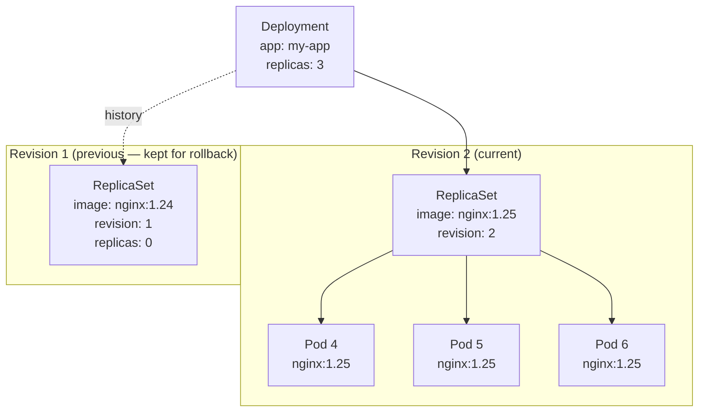
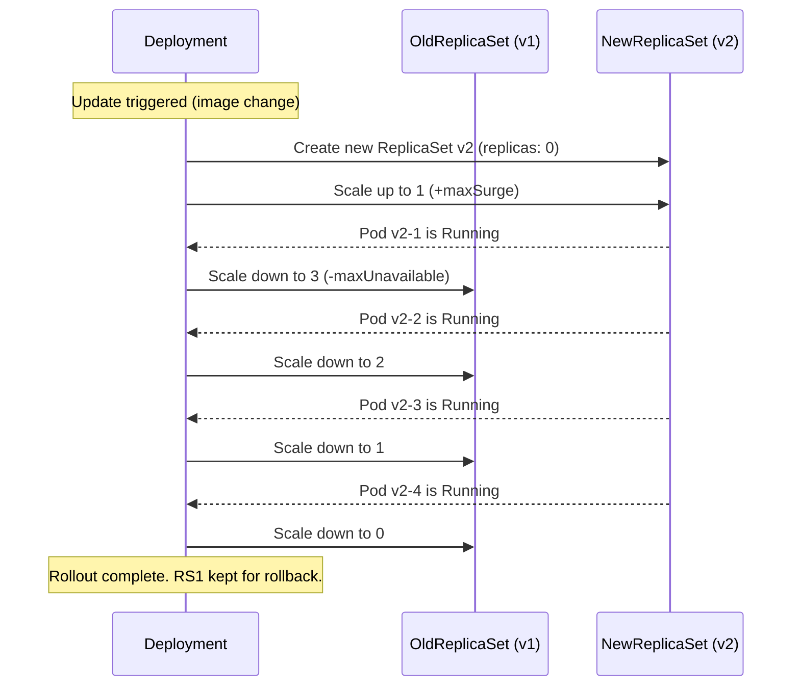

# Module 05 — Deployments and ReplicaSets

## The Rubber Duck Analogy

Imagine you run a rubber duck manufacturing plant. The factory manager has one rule: "There must
always be exactly 5 rubber ducks on the shelf."

If a duck falls off and breaks → the manager orders a new one made immediately.
If someone adds extra ducks → the manager removes the extras.
If you want to update to a new duck design → the manager gradually replaces old ducks
with new ones, one at a time, so the shelf never has fewer than 4 ducks.

This is exactly what Deployments and ReplicaSets do for your containers.

> **🐳 Coming from Docker?**
>
> In Docker, if you want 3 copies of your app, you run `docker run` three times manually and pray they stay up. In Docker Swarm, `docker service create --replicas 3` gets you close. In Kubernetes, a Deployment is the standard way: declare `replicas: 3`, and Kubernetes ensures 3 pods are always running — it restarts crashed ones, rolls out updates without downtime, and lets you rollback with one command. Deployments are to pods what Docker Swarm services are to containers, but far more powerful.

---

## ReplicaSet: "Always Keep N Copies Running"

A **ReplicaSet** is a Kubernetes object that says: "I want exactly N pods with these
characteristics running at all times."

It works through the reconciliation loop:
1. Count pods matching its label selector
2. If count < desired: create more pods
3. If count > desired: delete excess pods
4. Repeat forever

ReplicaSets own their pods via `ownerReferences` — you can see this in `kubectl get pod
<name> -o yaml`. If you delete the ReplicaSet, it deletes all its pods. If you delete a pod
owned by a ReplicaSet, the ReplicaSet immediately creates a replacement.

**Key limitation**: ReplicaSets have no knowledge of pod history or versions. If you update the
pod template in a ReplicaSet, existing pods are NOT updated — only new pods use the new template.
That's why you almost never use ReplicaSets directly.

---

## Deployment: "Manage ReplicaSets with Version History"

A **Deployment** is a higher-level abstraction that manages ReplicaSets. When you update a
Deployment's pod template (e.g., change the container image), the Deployment:

1. Creates a **new ReplicaSet** with the new template
2. Gradually scales up the new ReplicaSet
3. Gradually scales down the old ReplicaSet
4. Keeps both ReplicaSets around as history (configurable via `revisionHistoryLimit`)

This gives you:
- **Rolling updates**: seamless transitions with no downtime
- **Rollback**: revert to any previous ReplicaSet with one command
- **Pause/Resume**: make multiple changes before rolling out



---

## Rolling Update Strategy

When you update a Deployment, Kubernetes uses the **RollingUpdate** strategy by default.
Two parameters control how it rolls:

- **maxUnavailable**: how many pods can be unavailable during the update (default: 25%)
- **maxSurge**: how many pods above the desired count can exist during the update (default: 25%)

With 4 replicas, `maxUnavailable: 1` and `maxSurge: 1`:
- Max running at any time: 5 pods (4 desired + 1 surge)
- Min running at any time: 3 pods (4 desired - 1 unavailable)



---

## Deployment YAML Anatomy

```yaml
apiVersion: apps/v1
kind: Deployment
metadata:
  name: my-app
  labels:
    app: my-app
spec:
  replicas: 3                              # How many pod copies to maintain

  selector:                                # Which pods does this Deployment own?
    matchLabels:
      app: my-app                          # Must match template labels

  strategy:
    type: RollingUpdate                    # or Recreate
    rollingUpdate:
      maxUnavailable: 1                    # At most 1 pod down at a time
      maxSurge: 1                          # At most 1 extra pod during update

  revisionHistoryLimit: 5                  # Keep 5 old ReplicaSets for rollback

  progressDeadlineSeconds: 600            # Fail the rollout if not done in 10 min

  template:                               # Pod template — what pods to create
    metadata:
      labels:
        app: my-app                        # MUST match spec.selector.matchLabels
    spec:
      containers:
      - name: app
        image: nginx:1.25
        ports:
        - containerPort: 80
        resources:
          requests:
            memory: "64Mi"
            cpu: "100m"
          limits:
            memory: "128Mi"
            cpu: "200m"
```

### The selector Field

The `spec.selector.matchLabels` field is immutable after creation. It tells the Deployment which
pods it owns. The `spec.template.metadata.labels` must include all the labels in `matchLabels`
(it can have more, but must have at least those). A mismatch between selector and template labels
causes an immediate error.

---

## Key Rollout Commands

### Trigger a Rolling Update

```bash
# Update the image (most common trigger)
kubectl set image deployment/my-app app=nginx:1.26

# Or edit the deployment YAML and apply
kubectl edit deployment my-app
# Change image: nginx:1.25 to nginx:1.26, save and exit

# Or update via apply (recommended in production)
# Edit deployment.yaml then:
kubectl apply -f deployment.yaml
```

### Monitor the Rollout

```bash
# Watch rollout progress
kubectl rollout status deployment/my-app

# See all pods during transition
kubectl get pods -w

# View rollout history (shows revision numbers)
kubectl rollout history deployment/my-app

# View what changed in a specific revision
kubectl rollout history deployment/my-app --revision=2
```

### Rollback

```bash
# Roll back to previous version
kubectl rollout undo deployment/my-app

# Roll back to a specific revision
kubectl rollout undo deployment/my-app --to-revision=1
```

### Pause and Resume

Pause lets you make multiple changes and then trigger a single rollout instead of rolling out
after each change:

```bash
# Pause rollout
kubectl rollout pause deployment/my-app

# Make multiple changes
kubectl set image deployment/my-app app=nginx:1.26
kubectl set resources deployment/my-app -c=app --limits=memory=256Mi

# Resume — triggers a single rollout with all changes combined
kubectl rollout resume deployment/my-app
```

---

## Recreate Strategy

The other deployment strategy is `Recreate`. It deletes ALL old pods first, then creates new ones.
This causes downtime but is sometimes necessary for apps that can't run two versions simultaneously
(e.g., apps that hold exclusive database locks):

```yaml
spec:
  strategy:
    type: Recreate   # No RollingUpdate block needed
```

---

## Scaling

```bash
# Scale to 10 replicas
kubectl scale deployment my-app --replicas=10

# Scale via file
# Edit replicas in deployment.yaml then:
kubectl apply -f deployment.yaml
```

---

## Navigation

| File | Description |
|------|-------------|
| [Theory.md](./Theory.md) | You are here — Deployments and ReplicaSets |
| [Cheatsheet.md](./Cheatsheet.md) | Quick reference commands |
| [Interview_QA.md](./Interview_QA.md) | Interview questions and answers |
| [Code_Example.md](./Code_Example.md) | Working YAML examples |

**Previous:** [04_Pods](../04_Pods/Theory.md) |
**Next:** [06_Services](../06_Services/Theory.md)
