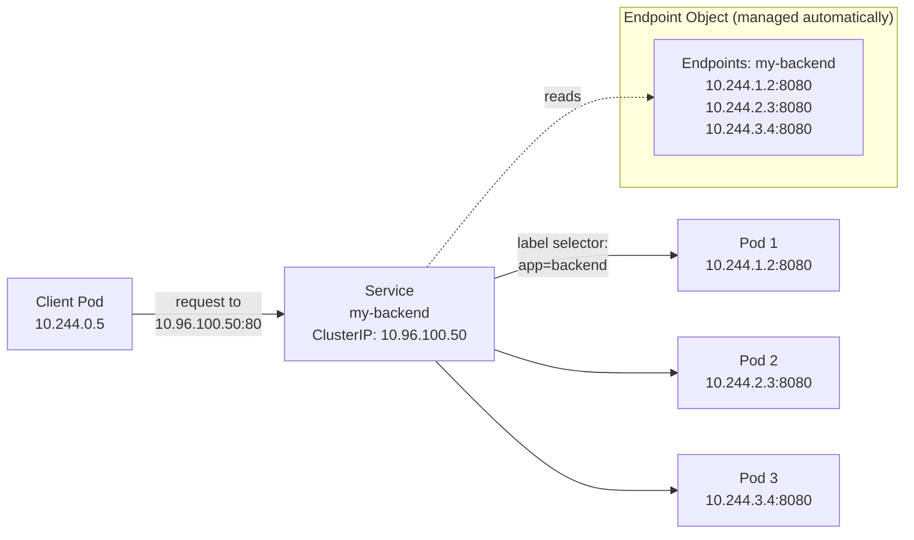

# Module 06 — Services

## The Problem: Pod IPs Change

Every pod gets a unique IP address when it starts. Great — you can send traffic directly to pods.

But pods are ephemeral. When a pod crashes and restarts, it gets a *new* IP address. When you
scale a Deployment from 2 to 5 replicas, you now have 5 different IP addresses. When you do a
rolling update, old pod IPs disappear and new ones appear.

If your frontend sends requests to hardcoded pod IPs, it breaks every time the pods change.
You need a stable address that acts as a proxy for a group of pods — something that survives
pod restarts, scale events, and updates.

That stable address is a **Service**.

> **🐳 Coming from Docker?**
>
> In Docker, you expose a container with `-p 8080:80` — one port, one container, one IP. If the container restarts, it might get a different IP but the port mapping stays. In Kubernetes, pod IPs change constantly as pods are replaced. A Service gives your pods a stable virtual IP and DNS name that never changes, and it load-balances across all matching pods automatically. It's like having an nginx reverse proxy permanently in front of your containers, maintained by Kubernetes itself — you never configure it manually.

---

## What is a Service?

A Service is a Kubernetes object that provides:
1. A **stable virtual IP** (ClusterIP) that never changes
2. A **stable DNS name** (`my-service.my-namespace.svc.cluster.local`)
3. **Load balancing** across all healthy pods that match its label selector

The Service doesn't forward traffic to pods by name — it uses **label selectors** to find
matching pods. When pods come and go, the Service automatically updates its routing targets
(via the Endpoints object managed by the Endpoints controller).



---

## Service Types

### ClusterIP (default)

A ClusterIP Service gets a virtual IP that is only routable from within the cluster. External
clients cannot reach it directly.

**Use for**: internal service-to-service communication. Backend services that the frontend
calls. Databases, caches, message queues.

```yaml
apiVersion: v1
kind: Service
metadata:
  name: backend
spec:
  type: ClusterIP           # Default — can omit this line
  selector:
    app: backend
  ports:
  - port: 80                # Port the Service listens on
    targetPort: 8080        # Port on the pod to forward to
```

Access from within the cluster: `http://backend` or `http://backend.default.svc.cluster.local`

### NodePort

A NodePort Service is accessible from outside the cluster by calling any node's IP on a specific
port (30000–32767). Kubernetes opens that port on every node and routes traffic to the pods.

**Use for**: local development, internal tools, exposing services on clusters without a cloud
load balancer. Not recommended for production public traffic.

```yaml
spec:
  type: NodePort
  selector:
    app: my-app
  ports:
  - port: 80              # ClusterIP port (internal)
    targetPort: 8080      # Pod port
    nodePort: 30080       # External port on each node (optional — auto-assigned if omitted)
```

Access: `http://<any-node-ip>:30080`

### LoadBalancer

A LoadBalancer Service is the standard way to expose a service externally in cloud environments.
Kubernetes asks the cloud provider to provision an external load balancer (AWS ELB/ALB, GCP LB,
Azure LB) and routes traffic through it to the service.

**Use for**: production internet-facing services. The service gets a real public IP/hostname.

```yaml
spec:
  type: LoadBalancer
  selector:
    app: my-app
  ports:
  - port: 80
    targetPort: 8080
```

After creation, `kubectl get service my-app` shows an `EXTERNAL-IP`. In minikube, you need
`minikube tunnel` to get an external IP.

**Downside**: each LoadBalancer service costs money (one cloud LB per service). Use Ingress
(module 09) to share one LB across many services.

### ExternalName

ExternalName is a DNS alias — it maps a service name to an external DNS name. No proxy or
load balancing happens; it's purely a DNS CNAME.

**Use for**: accessing external services from pods using Kubernetes DNS (keeps pod config
portable). Migrating external dependencies into the cluster gradually.

```yaml
spec:
  type: ExternalName
  externalName: my-database.example.com  # Resolves to this external DNS
```

Inside the cluster: `nslookup my-external-db` returns `my-database.example.com`.

---

## How Services Find Pods: Label Selectors

The `spec.selector` in a Service must match the pod labels. If you have a Deployment creating
pods with `labels: {app: backend, tier: api}`, your service selector can be:

```yaml
selector:
  app: backend        # matches all pods with this label
```
or
```yaml
selector:
  app: backend
  tier: api           # more specific — both labels must match
```

If no pods match the selector, the Service has no endpoints and requests fail.

```bash
# See which pods a service is routing to
kubectl describe service my-service
# Look at "Endpoints:" — this shows the pod IPs + ports

# Or get the Endpoints object directly
kubectl get endpoints my-service
```

---

## kube-proxy: How Services Actually Work

kube-proxy runs on every node and implements Service routing using OS-level networking:

**iptables mode (default)**: kube-proxy programs iptables DNAT rules. When a pod on any node
sends a packet to the ClusterIP, iptables intercepts it and randomly selects a backend pod IP,
rewriting the packet's destination. The selection is statistically random across all healthy
endpoints (no session affinity by default).

**IPVS mode**: uses Linux kernel IPVS load balancer with more sophisticated algorithms (round
robin, least connections, source hashing). Better performance at scale.

---

## DNS for Services

CoreDNS runs in `kube-system` and provides DNS resolution for services. Every service gets a
DNS name:

```
<service-name>.<namespace>.svc.cluster.local
```

From a pod in the same namespace, you can use just the service name:
```
http://backend:80
```

From a different namespace, you need:
```
http://backend.production.svc.cluster.local:80
```

---

## Headless Services

A headless service has `clusterIP: None`. Instead of a virtual IP, DNS queries return the
individual pod IPs directly. This lets clients talk directly to specific pods (needed for
StatefulSets where each pod has a unique identity).

```yaml
spec:
  clusterIP: None        # Makes it headless
  selector:
    app: my-stateful-app
```

DNS query for a headless service returns all pod IPs, not a single virtual IP.

---

## Service Port Terminology

```
port        = the port the Service listens on (what clients use)
targetPort  = the port on the pod to forward traffic to
nodePort    = the port on each node (NodePort services only)
protocol    = TCP (default), UDP, or SCTP
```

A service can have multiple ports:
```yaml
ports:
- name: http
  port: 80
  targetPort: 8080
- name: https
  port: 443
  targetPort: 8443
```

When a service has multiple ports, you must name each one.

---

## Navigation

| File | Description |
|------|-------------|
| [Theory.md](./Theory.md) | You are here — Services explained |
| [Cheatsheet.md](./Cheatsheet.md) | Quick reference commands |
| [Interview_QA.md](./Interview_QA.md) | Interview questions and answers |
| [Code_Example.md](./Code_Example.md) | Working YAML examples |

**Previous:** [05_Deployments_and_ReplicaSets](../05_Deployments_and_ReplicaSets/Theory.md) |
**Next:** [07_ConfigMaps_and_Secrets](../07_ConfigMaps_and_Secrets/Theory.md)
