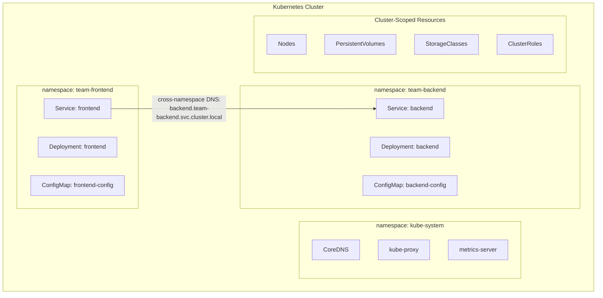

# Module 08 — Namespaces

Think about a large office building shared by multiple companies. Each company has its own floor
— their own printers, meeting rooms, and employee lists. They can use the building's shared
infrastructure (elevators, parking, power), but they can't wander into each other's spaces.
Kubernetes Namespaces work the same way: multiple teams sharing one cluster, each with their
own isolated space.

Just like two companies can both have an "HR Department" without conflict because they're on
different floors, two teams can both have a Deployment named "backend" without collision because
they're in different namespaces. And just like a building manager can set a maximum number of
desks per floor to prevent one company from taking over, a cluster admin can set ResourceQuotas
per namespace to prevent one team from consuming all the CPU and memory.

Namespaces are Kubernetes's answer to multi-tenancy on a shared cluster. They give you isolation
for names, access controls, and resource limits — all without the cost of spinning up separate
clusters for every team or environment.

> **🐳 Coming from Docker?**
>
> Docker doesn't have namespaces at the logical level — if you run 10 containers for your app and 10 for your colleague's app, they all live in the same flat list from `docker ps`. Kubernetes Namespaces let you create virtual clusters within one physical cluster. Your app's pods, services, and configs live in the `team-a` namespace; your colleague's live in `team-b`. They can't accidentally collide with each other's resource names, you can set separate CPU/memory budgets per namespace, and RBAC permissions can be scoped so each team only sees their own namespace.

---

## 📌 Learning Priority

**Must Learn** — core concepts, needed to understand the rest of this file:
[What is a Namespace](#what-is-a-namespace) · [Default Namespaces](#default-namespaces) · [kubectl with Namespaces](#kubectl-with-namespaces)

**Should Learn** — important for real projects and interviews:
[Namespace Strategies](#common-namespace-strategies) · [Resource Quotas](#resource-quotas-per-namespace)

**Good to Know** — useful in specific situations, not needed daily:
[Cross-Namespace Communication](#cross-namespace-communication) · [LimitRange](#limitrange-default-limits-for-pods)

**Reference** — skim once, look up when needed:
[What Is NOT Namespaced](#what-is-not-namespaced) · [Terminating State](#namespace-lifecycle-and-terminating-state)

---

## What is a Namespace?

A namespace is a **virtual partition** within a cluster — a logical boundary that provides
isolated scope for:
- Resource names (same name can exist in different namespaces)
- RBAC permissions (grant access to one namespace without exposing others)
- Resource quotas (limit how much CPU/memory a namespace can use)
- Network policies (optionally restrict cross-namespace traffic)



---

## Default Namespaces

Every Kubernetes cluster starts with four namespaces:

| Namespace | Purpose |
|-----------|---------|
| `default` | Resources created without specifying a namespace land here |
| `kube-system` | Kubernetes system components: CoreDNS, kube-proxy, metrics-server, CNI plugins |
| `kube-public` | Publicly readable (even by unauthenticated users): contains `cluster-info` ConfigMap |
| `kube-node-lease` | Node heartbeat Lease objects — kubelet updates these to signal liveness |

**Never deploy application workloads into `kube-system`.**

---

## Common Namespace Strategies

### Environment Separation

```
dev        → team deploys freely, experiments allowed
staging    → mirrors production, used for integration testing
production → locked down, requires approval for changes
```

**Trade-off**: sharing a cluster means a noisy-neighbor in staging can affect production.
For true isolation, separate clusters are better. Many organizations use namespaces for
dev/staging and a dedicated cluster for production.

### Team Isolation

```
team-frontend
team-backend
team-data-engineering
team-platform
```

Each team gets their own namespace with RBAC permissions to deploy within it and resource
quotas so they can't starve other teams.

### Functional Separation

```
monitoring      (Prometheus, Grafana)
logging         (Elasticsearch, Fluentd)
ingress         (nginx-ingress controller)
cert-manager    (TLS certificate management)
my-application  (the actual business app)
```

Keeps infrastructure tooling separate from application workloads.

---

## Cross-Namespace Communication

Services are namespaced objects. To call a service in a *different* namespace, you use the
fully qualified DNS name:

```
<service-name>.<namespace>.svc.cluster.local
```

Examples:
```
# From any namespace, reach the database in the "data" namespace:
postgres.data.svc.cluster.local:5432

# From any namespace, reach the API in "backend":
api.backend.svc.cluster.local:8080

# Short form works only within the same namespace:
api:8080                          # Only works if you're in the backend namespace
```

There is no network restriction by default — any pod can talk to any service in any namespace.
Network Policies (module 20) can restrict this.

---

## What Is NOT Namespaced

Some Kubernetes objects are **cluster-scoped** (not tied to any namespace):

| Cluster-Scoped Resource | Why |
|------------------------|-----|
| `Node` | Physical/virtual machines — cluster-wide resource |
| `PersistentVolume` | Storage objects that outlive any namespace |
| `StorageClass` | Defines storage types, used cluster-wide |
| `ClusterRole` | RBAC roles that span namespaces |
| `ClusterRoleBinding` | RBAC bindings that span namespaces |
| `Namespace` | Namespaces themselves are cluster-scoped |
| `IngressClass` | Defines which ingress controller to use |
| `CustomResourceDefinition` | Schema for custom resources |

```bash
# See all cluster-scoped resources
kubectl api-resources --namespaced=false

# See all namespaced resources
kubectl api-resources --namespaced=true
```

---

## Resource Quotas per Namespace

ResourceQuota objects limit how much compute a namespace can consume:

```yaml
apiVersion: v1
kind: ResourceQuota
metadata:
  name: team-quota
  namespace: team-backend
spec:
  hard:
    pods: "20"                     # Max 20 pods in this namespace
    requests.cpu: "4"              # Total CPU requests: 4 cores
    requests.memory: 8Gi           # Total memory requests: 8 GB
    limits.cpu: "8"                # Total CPU limits: 8 cores
    limits.memory: 16Gi            # Total memory limits: 16 GB
    configmaps: "20"               # Max 20 ConfigMaps
    secrets: "30"                  # Max 30 Secrets
    services: "10"                 # Max 10 Services
    persistentvolumeclaims: "5"    # Max 5 PVCs
```

Once a quota is set, any pod without resource requests/limits is rejected. This enforces
good hygiene — teams must specify how much resources they need.

---

## LimitRange: Default Limits for Pods

LimitRange sets default resource requests/limits for pods in a namespace that don't specify them:

```yaml
apiVersion: v1
kind: LimitRange
metadata:
  name: default-limits
  namespace: team-backend
spec:
  limits:
  - type: Container
    default:
      cpu: "200m"
      memory: "256Mi"
    defaultRequest:
      cpu: "100m"
      memory: "128Mi"
    max:
      cpu: "2"
      memory: "2Gi"
    min:
      cpu: "50m"
      memory: "64Mi"
```

With this LimitRange, any container without explicit resource settings gets the defaults applied
automatically, and any container requesting more than the max is rejected.

---

## kubectl with Namespaces

```bash
# Always specify namespace with -n (or --namespace)
kubectl get pods -n team-backend

# Set default namespace for the current context (saves typing)
kubectl config set-context --current --namespace=team-backend

# After setting default, these are equivalent:
kubectl get pods
kubectl get pods -n team-backend

# Query all namespaces at once
kubectl get pods -A
kubectl get pods --all-namespaces

# Create a namespace
kubectl create namespace team-backend

# Delete a namespace — this deletes ALL resources inside it!
kubectl delete namespace team-backend
```

---

## Namespace Lifecycle and Terminating State

When you delete a namespace, Kubernetes enters a **Terminating** state and deletes all
resources inside it. If any resource has a finalizer that doesn't complete (e.g., a stuck
custom resource), the namespace can get stuck in Terminating forever.

Fix a stuck namespace (last resort — forces removal):
```bash
kubectl get namespace stuck-ns -o json \
  | jq '.spec.finalizers = []' \
  | kubectl replace --raw /api/v1/namespaces/stuck-ns/finalize -f -
```


---

## 📝 Practice Questions

- 📝 [Q21 · namespaces](../kubernetes_practice_questions_100.md#q21--normal--namespaces)
- 📝 [Q22 · namespace-isolation](../kubernetes_practice_questions_100.md#q22--thinking--namespace-isolation)
- 📝 [Q90 · scenario-multi-tenant](../kubernetes_practice_questions_100.md#q90--design--scenario-multi-tenant)


---

## 📂 Navigation

| File | Description |
|------|-------------|
| [Theory.md](./Theory.md) | You are here — Namespaces explained |
| [Cheatsheet.md](./Cheatsheet.md) | Quick reference commands |
| [Interview_QA.md](./Interview_QA.md) | Interview questions and answers |

---

⬅️ **Prev:** [ConfigMaps and Secrets](../07_ConfigMaps_and_Secrets/Theory.md) &nbsp;&nbsp;&nbsp; ➡️ **Next:** [Ingress](../09_Ingress/Theory.md)
