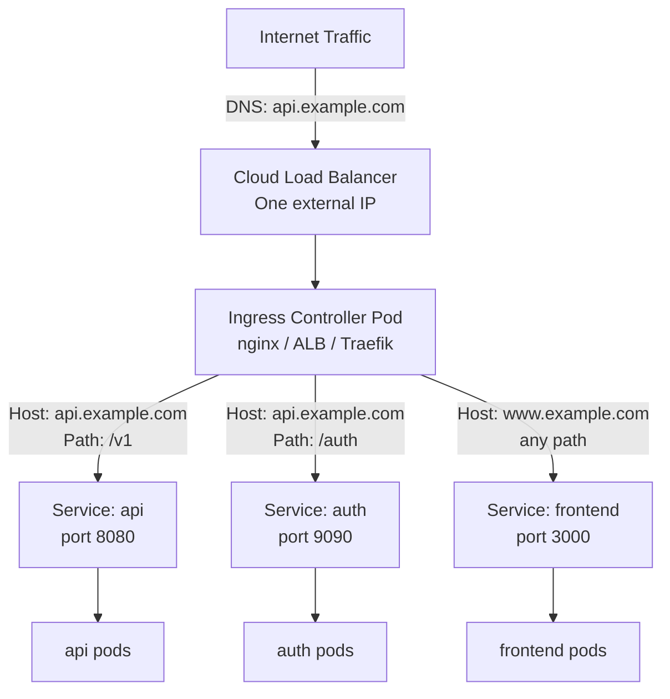

# Module 09 — Ingress

Your company has three web apps: a customer portal at myapp.com, an admin panel at
myapp.com/admin, and an API at api.myapp.com. Without Ingress, you'd need three separate
LoadBalancer services — three cloud load balancers, three IP addresses, three monthly bills.
Each LoadBalancer can cost $15–30/month on major cloud providers, and that's before traffic
costs. For a small company with a dozen services, that adds up fast.

Ingress is the single front door that routes traffic to the right service based on hostname
or URL path. One load balancer, one IP address, one bill — and a set of routing rules that
say "requests for myapp.com go to the portal service, requests for api.myapp.com go to the
API service." It's like a hotel receptionist who directs guests to the right room instead of
every room having its own separate entrance from the street.

Beyond cost savings, Ingress centralizes concerns that every HTTP service needs: TLS
termination (one place to manage your SSL certificates), rate limiting, authentication
headers, and URL rewrites. Without Ingress, every service would need to handle all of this
independently.

> **🐳 Coming from Docker?**
>
> In Docker, you expose a container externally with `-p 80:80` — one port, one container. If you have three web apps, you'd need three different ports or manually set up an nginx reverse proxy container yourself. Kubernetes Ingress is that nginx reverse proxy, but managed by Kubernetes: you declare routing rules in YAML (`/api` → service-a, `/admin` → service-b) and the Ingress controller handles the reverse proxying automatically. One cloud load balancer, one IP, and routing to as many services as you need — all defined declaratively.

---

## 📌 Learning Priority

**Must Learn** — core concepts, needed to understand the rest of this file:
[Resource vs Controller](#ingress-resource-vs-ingress-controller) · [Path-Based Routing](#path-based-routing) · [Host-Based Routing](#host-based-routing)

**Should Learn** — important for real projects and interviews:
[TLS Termination](#tls-termination) · [IngressClass](#ingressclass)

**Good to Know** — useful in specific situations, not needed daily:
[nginx Annotations](#annotations-for-nginx-ingress) · [cert-manager TLS](#cert-manager-for-automatic-tls)

**Reference** — skim once, look up when needed:
[pathType Values](#pathtype-values)

---

## Ingress Resource vs Ingress Controller

This is a common confusion. They are two different things:

**Ingress Resource** (`kind: Ingress`): a Kubernetes object where you *declare* your routing
rules — "send requests for `api.example.com/v1` to the `api-service` on port 8080."

**Ingress Controller**: the actual software that reads Ingress resources and implements the
routing. It runs as a pod in your cluster and does the actual traffic forwarding. Kubernetes
does not include an Ingress controller — you must install one.

Popular Ingress controllers:
- **nginx-ingress** (most popular, feature-rich)
- **AWS ALB Ingress Controller** (uses AWS Application Load Balancer natively)
- **Traefik** (auto-discovers services, great UI)
- **Istio Gateway** (part of the Istio service mesh)
- **HAProxy Ingress** (high-performance option)



---

## Path-Based Routing

Route different URL paths to different services. All running under the same hostname:

```yaml
apiVersion: networking.k8s.io/v1
kind: Ingress
metadata:
  name: my-app-ingress
spec:
  ingressClassName: nginx                  # Which Ingress controller handles this
  rules:
  - host: app.example.com
    http:
      paths:
      - path: /api
        pathType: Prefix                   # Matches /api, /api/v1, /api/users, etc.
        backend:
          service:
            name: api-service
            port:
              number: 8080
      - path: /
        pathType: Prefix                   # Catch-all — routes everything else to frontend
        backend:
          service:
            name: frontend-service
            port:
              number: 3000
```

### pathType Values

- `Prefix`: matches the path and any path starting with it (`/api` matches `/api/v1`)
- `Exact`: matches the path exactly (`/api` does NOT match `/api/v1`)
- `ImplementationSpecific`: behavior defined by the Ingress controller

---

## Host-Based Routing

Route different hostnames to different services (virtual hosting):

```yaml
spec:
  rules:
  - host: api.example.com                 # All traffic to this hostname
    http:
      paths:
      - path: /
        pathType: Prefix
        backend:
          service:
            name: api-service
            port:
              number: 8080

  - host: www.example.com                 # Different hostname → different service
    http:
      paths:
      - path: /
        pathType: Prefix
        backend:
          service:
            name: frontend-service
            port:
              number: 3000
```

Both `api.example.com` and `www.example.com` point to the same external IP (the Ingress
controller). The controller inspects the `Host` HTTP header to route appropriately.

---

## TLS Termination

The Ingress controller can terminate HTTPS, decrypt the traffic, and forward plain HTTP
to backend services. This means your backend services don't need to handle TLS:

```yaml
spec:
  tls:
  - hosts:
    - api.example.com
    - www.example.com
    secretName: my-tls-secret            # K8s Secret with tls.crt and tls.key
  rules:
  - host: api.example.com
    http:
      paths:
      - path: /
        pathType: Prefix
        backend:
          service:
            name: api-service
            port:
              number: 8080
```

The TLS Secret must be of type `kubernetes.io/tls` with `tls.crt` and `tls.key` keys.

### cert-manager for Automatic TLS

Manually managing TLS certificates is error-prone. **cert-manager** is a Kubernetes operator
that automatically provisions and renews certificates from Let's Encrypt (or other CAs):

```yaml
metadata:
  annotations:
    cert-manager.io/cluster-issuer: letsencrypt-prod  # cert-manager annotation
spec:
  tls:
  - hosts:
    - api.example.com
    secretName: api-tls-cert             # cert-manager creates this Secret automatically
```

cert-manager watches for this annotation, requests a certificate from Let's Encrypt, and
creates the Secret. It renews it automatically before expiry.

---

## Annotations for nginx-ingress

The nginx Ingress controller supports many behaviors via annotations:

```yaml
metadata:
  annotations:
    nginx.ingress.kubernetes.io/rewrite-target: /         # Strip path prefix before forwarding
    nginx.ingress.kubernetes.io/ssl-redirect: "true"      # Redirect HTTP to HTTPS
    nginx.ingress.kubernetes.io/proxy-body-size: "50m"    # Max upload size
    nginx.ingress.kubernetes.io/proxy-connect-timeout: "30"
    nginx.ingress.kubernetes.io/proxy-send-timeout: "120"
    nginx.ingress.kubernetes.io/proxy-read-timeout: "120"
    nginx.ingress.kubernetes.io/rate-limit: "100"         # Rate limiting
    nginx.ingress.kubernetes.io/whitelist-source-range: "10.0.0.0/8"  # IP allowlist
    nginx.ingress.kubernetes.io/use-regex: "true"         # Use regex path matching
```

---

## IngressClass

IngressClass tells Kubernetes which Ingress controller should handle a given Ingress resource.
Useful when you have multiple Ingress controllers (e.g., nginx for most services, AWS ALB for
specific high-traffic services):

```yaml
# In Ingress spec:
spec:
  ingressClassName: nginx        # or "alb", "traefik", etc.
```

You can also set a default IngressClass (handles Ingress resources with no class annotation).


---

## 📝 Practice Questions

- 📝 [Q23 · ingress-basics](../kubernetes_practice_questions_100.md#q23--normal--ingress-basics)
- 📝 [Q24 · ingress-controller](../kubernetes_practice_questions_100.md#q24--normal--ingress-controller)
- 📝 [Q25 · tls-ingress](../kubernetes_practice_questions_100.md#q25--normal--tls-ingress)


---

## 📂 Navigation

| File | Description |
|------|-------------|
| [Theory.md](./Theory.md) | You are here — Ingress explained |
| [Cheatsheet.md](./Cheatsheet.md) | Quick reference commands |
| [Interview_QA.md](./Interview_QA.md) | Interview questions and answers |
| [Code_Example.md](./Code_Example.md) | Working YAML examples |

🚀 **Apply this:** Add Ingress to a full-stack deployment → [Project 04 — Full-Stack App on K8s](../../05_Capstone_Projects/04_Full_Stack_on_K8s/01_MISSION.md)
---

⬅️ **Prev:** [Namespaces](../08_Namespaces/Theory.md) &nbsp;&nbsp;&nbsp; ➡️ **Next:** [Persistent Volumes](../10_Persistent_Volumes/Theory.md)
