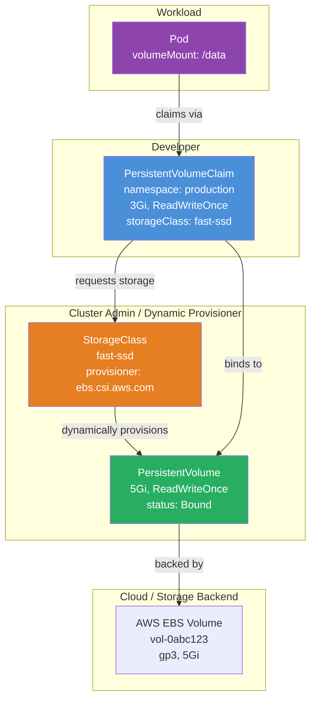

# Module 10: Persistent Volumes

## The Story: The Hotel Without Storage Lockers

Imagine a hotel with no storage lockers. Every guest checks in, uses the hotel, and when they check out, everything they brought disappears with them. Their notes, their documents, their belongings — gone. The next guest who checks into the same room finds it empty and reset. Now imagine the hotel adds storage lockers — guests can leave their luggage, come back tomorrow, and it's still there. A different guest can even use the same locker if the first guest hands over the key. Kubernetes Persistent Volumes are those storage lockers: data that survives beyond the life of any single pod.

This matters because pods are ephemeral by nature. They are scheduled, run, crash, get evicted, and are replaced. Anything stored inside a pod's filesystem disappears with it. For stateless applications like web servers this is fine — they do not need to remember anything. But for databases, message queues, file storage systems, or any application that needs to write and read data across restarts, you need storage that is decoupled from the pod's lifecycle.

Kubernetes solves this with a two-object model: the **PersistentVolume** (the actual storage resource) and the **PersistentVolumeClaim** (a request to use some of that storage). This separation keeps the concerns of cluster administrators (who provision storage) cleanly separated from the concerns of developers (who request storage for their applications).

> **🐳 Coming from Docker?**
>
> In Docker, you create a persistent volume with `docker volume create mydata` and mount it with `-v mydata:/data`. That volume lives on the machine where Docker is running — it's tied to that one host. In Kubernetes, pods can be rescheduled to any node in the cluster, so volumes must be network-attached storage that any node can access. PersistentVolumes are like Docker volumes that work cluster-wide: you request storage (PVC), and Kubernetes provisions it from whatever storage backend your cluster supports — AWS EBS, GCP Persistent Disk, NFS, or anything via CSI drivers.

---

## 📌 Learning Priority

**Must Learn** — core concepts, needed to understand the rest of this file:
[Three Core Objects](#the-three-core-objects) · [PV/PVC/StorageClass Relationship](#the-pvpvcstorageclass-relationship) · [Using PVC in a Pod](#using-a-pvc-in-a-pod)

**Should Learn** — important for real projects and interviews:
[Access Modes](#access-modes) · [Reclaim Policies](#reclaim-policies) · [Static vs Dynamic](#static-vs-dynamic-provisioning)

**Good to Know** — useful in specific situations, not needed daily:
[CSI Drivers](#csi-drivers----container-storage-interface) · [Volume Binding Modes](#volume-binding-modes)

**Reference** — skim once, look up when needed:
[VolumeSnapshots](#volumesnapshots) · [Troubleshooting](#common-troubleshooting)

---

## Ephemeral vs Persistent Storage

Before diving into PVs, it helps to understand what Kubernetes offers for temporary storage:

| Storage Type | Survives pod restart? | Survives pod deletion? | Use case |
|---|---|---|---|
| Container filesystem | No | No | Temp files during the container's life |
| `emptyDir` | Yes (within the pod) | No | Sharing data between containers in a pod |
| `hostPath` | Yes (on that node) | Yes (but node-specific) | DaemonSets, node-level tooling |
| PersistentVolume | Yes | Yes | Databases, state, user data |

An `emptyDir` volume lives as long as the pod lives — it survives container crashes within the pod, but not pod deletion. A PersistentVolume outlives the pod entirely.

---

## The Three Core Objects

### PersistentVolume (PV)

A PersistentVolume is a piece of storage in the cluster that has been provisioned by an administrator or dynamically provisioned via a StorageClass. It is a cluster-level resource — not namespaced. Think of it as the actual storage locker itself.

A PV describes:
- How much storage is available (e.g., `5Gi`)
- The access mode (how it can be mounted)
- The reclaim policy (what happens when it is released)
- The storage backend (NFS, AWS EBS, GCE PD, local disk, etc.)

```yaml
apiVersion: v1
kind: PersistentVolume
metadata:
  name: my-pv
spec:
  capacity:
    storage: 5Gi
  accessModes:
    - ReadWriteOnce
  reclaimPolicy: Retain
  storageClassName: standard
  hostPath:
    path: /data/my-pv   # simple example; use a real backend in production
```

### PersistentVolumeClaim (PVC)

A PersistentVolumeClaim is a request for storage by a user or application. It is namespaced. Think of it as the locker key, or the reservation ticket. A PVC says: "I need 3Gi of storage that I can read and write."

```yaml
apiVersion: v1
kind: PersistentVolumeClaim
metadata:
  name: my-pvc
  namespace: production
spec:
  accessModes:
    - ReadWriteOnce
  resources:
    requests:
      storage: 3Gi
  storageClassName: standard
```

### StorageClass

A StorageClass defines a type or "class" of storage. It is what enables dynamic provisioning — when a PVC is created and no matching PV exists, Kubernetes uses the StorageClass to automatically create one. Different StorageClasses can offer different performance tiers (fast SSDs, slow spinning disks), replication policies, or geographic zones.

```yaml
apiVersion: storage.k8s.io/v1
kind: StorageClass
metadata:
  name: fast-ssd
provisioner: ebs.csi.aws.com
parameters:
  type: gp3
  encrypted: "true"
reclaimPolicy: Delete
volumeBindingMode: WaitForFirstConsumer
```

---

## The PV/PVC/StorageClass Relationship



---

## Static vs Dynamic Provisioning

### Static Provisioning

An administrator manually creates PersistentVolume objects ahead of time. A PVC then binds to an existing PV that matches its requirements.

**When to use**: On-premises environments, bare metal, or when you need exact control over which physical volume is used.

**Workflow**: Admin creates PV → Developer creates PVC → Kubernetes binds them.

### Dynamic Provisioning

A StorageClass provisioner automatically creates a PV when a PVC is submitted. The developer only creates the PVC — they never think about the underlying storage.

**When to use**: Cloud environments (AWS, GCP, Azure) where storage can be created on demand. This is the standard approach in modern Kubernetes clusters.

**Workflow**: Developer creates PVC → StorageClass provisioner creates PV → Kubernetes binds them.

---

## Access Modes

Access modes describe how a volume can be mounted across nodes:

| Access Mode | Short Code | Meaning |
|---|---|---|
| `ReadWriteOnce` | RWO | Mounted read-write by a single node. One node can mount it. |
| `ReadOnlyMany` | ROX | Mounted read-only by many nodes simultaneously. |
| `ReadWriteMany` | RWX | Mounted read-write by many nodes simultaneously. |
| `ReadWriteOncePod` | RWOP | Mounted read-write by a single pod only (Kubernetes 1.22+). |

**Important**: Access modes describe what is allowed, not what is enforced at the OS level. The backend storage type determines what is actually possible:

| Storage Backend | RWO | ROX | RWX |
|---|---|---|---|
| AWS EBS | Yes | No | No |
| GCE Persistent Disk | Yes | Yes | No |
| NFS | Yes | Yes | Yes |
| Azure Files | Yes | Yes | Yes |
| Local disk | Yes | No | No |

If your application needs multiple pods to write to the same volume simultaneously, you must use a backend that supports RWX — and many common backends (like EBS) do not.

---

## Reclaim Policies

When a PVC is deleted, the reclaim policy determines what happens to the underlying PV and its data:

| Policy | What happens | When to use |
|---|---|---|
| `Retain` | PV stays, marked as `Released`. Data is preserved. Admin must manually reclaim. | Production databases — never lose data accidentally |
| `Delete` | PV and the underlying storage are deleted automatically. | Ephemeral test environments, scratch storage |
| `Recycle` | **Deprecated.** Contents are deleted (`rm -rf`), PV is made `Available` again. | Do not use in new clusters |

For production workloads, `Retain` is the safe default. With `Delete`, losing a PVC by accident (e.g., `helm uninstall`) permanently destroys the data.

---

## Volume Binding Modes

The `volumeBindingMode` on a StorageClass controls when binding happens:

| Mode | Behavior |
|---|---|
| `Immediate` | PV is provisioned and bound as soon as the PVC is created |
| `WaitForFirstConsumer` | PV is not provisioned until a pod that uses the PVC is scheduled |

`WaitForFirstConsumer` is the better default for cloud environments. With `Immediate`, a volume might be provisioned in zone `us-east-1a` before the pod is scheduled — and if the pod ends up on a node in `us-east-1b`, the volume is unreachable. Waiting for the pod to be scheduled ensures the volume is created in the correct availability zone.

---

## Lifecycle of a PersistentVolume

A PV moves through these phases:

```
Available → Bound → Released → (Retain: manual cleanup) or (Delete: auto-deleted)
```

| Phase | Meaning |
|---|---|
| `Available` | PV exists, not yet bound to any PVC |
| `Bound` | PV is bound to a specific PVC |
| `Released` | The PVC was deleted, but the PV has not been reclaimed yet |
| `Failed` | Automatic reclamation failed |

---

## Using a PVC in a Pod

Once a PVC is bound, you reference it in a pod spec using a `persistentVolumeClaim` volume:

```yaml
apiVersion: v1
kind: Pod
metadata:
  name: database-pod
spec:
  containers:
    - name: postgres
      image: postgres:15
      volumeMounts:
        - mountPath: /var/lib/postgresql/data
          name: postgres-storage
  volumes:
    - name: postgres-storage
      persistentVolumeClaim:
        claimName: my-pvc   # references the PVC by name
```

The pod does not know or care whether the PVC was backed by EBS, NFS, or a local disk — this abstraction is the whole point.

---

## CSI Drivers — Container Storage Interface

The Container Storage Interface (CSI) is the standard plugin interface for storage systems to integrate with Kubernetes. Before CSI, storage drivers were built into the Kubernetes core ("in-tree" drivers). CSI moved them out of the Kubernetes source code into separate, independently versioned plugins.

Every major cloud and storage vendor now provides a CSI driver:

| Storage | CSI Driver |
|---|---|
| AWS EBS | `ebs.csi.aws.com` |
| AWS EFS | `efs.csi.aws.com` |
| Google Persistent Disk | `pd.csi.storage.gke.io` |
| Azure Disk | `disk.csi.azure.com` |
| Azure File | `file.csi.azure.com` |
| Rook/Ceph | `rook-ceph.rbd.csi.ceph.com` |
| Longhorn | `driver.longhorn.io` |

CSI drivers handle the three main storage operations:
- **Provision**: Create the underlying storage resource
- **Attach**: Attach the storage to the correct node
- **Mount**: Mount the storage into the container's filesystem

---

## VolumeSnapshots

VolumeSnapshots allow you to take a point-in-time copy of a PersistentVolumeClaim — similar to taking a snapshot of an EBS volume. This is useful for backups, disaster recovery, and creating test environments from production data.

The snapshot API has three objects:

| Object | Role |
|---|---|
| `VolumeSnapshotClass` | Defines the snapshot driver and parameters (like StorageClass for volumes) |
| `VolumeSnapshot` | A request to take a snapshot of a PVC (like PVC is to PV) |
| `VolumeSnapshotContent` | The actual snapshot resource (like PV is to PVC) |

```yaml
# Take a snapshot
apiVersion: snapshot.storage.k8s.io/v1
kind: VolumeSnapshot
metadata:
  name: postgres-backup-2024-01-15
spec:
  volumeSnapshotClassName: csi-aws-vsc
  source:
    persistentVolumeClaimName: my-pvc

---
# Restore from a snapshot into a new PVC
apiVersion: v1
kind: PersistentVolumeClaim
metadata:
  name: postgres-restored
spec:
  dataSource:
    name: postgres-backup-2024-01-15
    kind: VolumeSnapshot
    apiGroup: snapshot.storage.k8s.io
  accessModes:
    - ReadWriteOnce
  resources:
    requests:
      storage: 5Gi
```

---

## Common Troubleshooting

| Symptom | Likely cause | Fix |
|---|---|---|
| PVC stuck in `Pending` | No matching PV available | Check StorageClass name, create a PV manually, or check CSI driver |
| Pod stuck in `ContainerCreating` | PVC not yet bound | `kubectl describe pvc <name>` to see events |
| PV stuck in `Released` | Reclaim policy is `Retain` | Manually delete or recycle the PV |
| `Multi-Attach error` | Two pods on different nodes mounting an RWO volume | Use RWX storage or ensure pods are on the same node |
| `FailedMount` | Volume in wrong availability zone | Use `WaitForFirstConsumer` binding mode |


---

## 📝 Practice Questions

- 📝 [Q26 · persistent-volumes](../kubernetes_practice_questions_100.md#q26--normal--persistent-volumes)
- 📝 [Q27 · pvc](../kubernetes_practice_questions_100.md#q27--debug--pvc)
- 📝 [Q28 · storage-classes](../kubernetes_practice_questions_100.md#q28--normal--storage-classes)
- 📝 [Q83 · scenario-pvc-pending](../kubernetes_practice_questions_100.md#q83--design--scenario-pvc-pending)


---

🚀 **Apply this:** Use PVCs in a full-stack deployment → [Project 04 — Full-Stack App on K8s](../../05_Capstone_Projects/04_Full_Stack_on_K8s/01_MISSION.md)
## 📂 Navigation

⬅️ **Prev:** [Ingress](../09_Ingress/Interview_QA.md) &nbsp;&nbsp;&nbsp; ➡️ **Next:** [RBAC and Security](../11_RBAC/Theory.md)

| | Link |
|---|---|
| Cheatsheet | [Cheatsheet.md](./Cheatsheet.md) |
| Interview Q&A | [Interview_QA.md](./Interview_QA.md) |
| Module Home | [10_Persistent_Volumes](../) |
