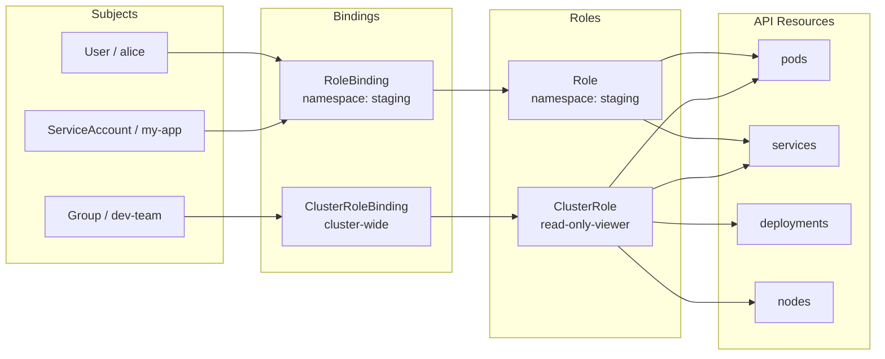

# Module 11: RBAC — Role-Based Access Control

## The Story: Who Can Do What?

Imagine you have just joined a large company. On day one, you do not get a key to every room in the building. You get keys to *your* office, *your* team's shared kitchen, and the front door. This is the principle of least privilege: give people (and programs) only the permissions they actually need — nothing more.

In Kubernetes, RBAC (Role-Based Access Control) is the security system that answers two questions for every API request:

1. **Who are you?** (Authentication)
2. **Are you allowed to do this?** (Authorization via RBAC)

Before RBAC existed (pre-1.6), Kubernetes had simpler, coarser authorization modes. RBAC was introduced as a way to grant fine-grained, auditable permissions. Today it is the standard approach and is enabled by default on every major Kubernetes distribution.

---

## Why RBAC Matters

Consider a cluster shared by three teams:

- **Team Alpha** runs a payment service — highly sensitive
- **Team Beta** runs a frontend — can restart their own pods
- **Team Gamma** is a monitoring tool — needs read-only access to everything

Without RBAC, any service account or team member could accidentally (or maliciously) delete another team's resources, read secrets from other namespaces, or modify cluster-level configs. RBAC lets you enforce boundaries without running separate clusters.

---

## The Four Core Components

RBAC in Kubernetes is built from four object types. Think of it as: **who** gets **which permissions** on **which resources**.

### 1. Subjects — The "Who"

A subject is the entity requesting access. There are three kinds:

| Subject Type     | Description                                              | Example                        |
|------------------|----------------------------------------------------------|--------------------------------|
| `User`           | A human user, typically from an external identity system | `alice`, `bob@company.com`     |
| `Group`          | A collection of users                                    | `system:masters`, `dev-team`   |
| `ServiceAccount` | An identity for a pod or workload running inside K8s     | `default`, `prometheus-scraper`|

Kubernetes does not manage user accounts itself — users come from external identity providers (certificates, OIDC, LDAP). ServiceAccounts, however, are Kubernetes objects you create directly.

### 2. Roles and ClusterRoles — The "What"

A **Role** defines a set of permissions within a **specific namespace**. A **ClusterRole** defines permissions that apply **cluster-wide** or can be reused across namespaces.

Permissions are expressed as combinations of:
- **Verbs**: `get`, `list`, `watch`, `create`, `update`, `patch`, `delete`, `deletecollection`, `impersonate`
- **Resources**: `pods`, `services`, `deployments`, `secrets`, `configmaps`, `nodes`, `namespaces`, etc.
- **API Groups**: `""` (core), `apps`, `batch`, `rbac.authorization.k8s.io`, etc.

### 3. RoleBindings and ClusterRoleBindings — The "Grant"

A **RoleBinding** attaches a Role or ClusterRole to a subject, within a specific namespace. A **ClusterRoleBinding** attaches a ClusterRole to a subject cluster-wide.

### 4. ServiceAccounts — Pod Identities

Every pod runs with a ServiceAccount. By default, the `default` ServiceAccount is used, which has minimal permissions. For production workloads, always create dedicated ServiceAccounts with exactly the permissions needed.

---

## RBAC Authorization Flow



---

## Namespaced vs Cluster-Wide Resources

This is one of the most important distinctions in RBAC:

| Resource Type | Examples | Use Role or ClusterRole? |
|---------------|----------|--------------------------|
| Namespaced    | pods, services, deployments, secrets, configmaps | Role (scoped) or ClusterRole (reusable) |
| Cluster-wide  | nodes, persistentvolumes, namespaces, clusterroles | ClusterRole only |

A **ClusterRole** can be bound with a **RoleBinding** — this lets you reuse a role definition across namespaces without duplicating it. For example, define a `pod-reader` ClusterRole once, then use RoleBindings in each namespace to grant it.

---

## Built-in Default ClusterRoles

Kubernetes ships with several useful default ClusterRoles:

| ClusterRole     | What it grants                                    |
|-----------------|---------------------------------------------------|
| `cluster-admin` | Full superuser access to everything               |
| `admin`         | Full access within a namespace                    |
| `edit`          | Read/write access to most resources in a namespace, no RBAC |
| `view`          | Read-only access to most resources in a namespace |

These are aggregated ClusterRoles — they automatically include permissions from matching labels. Avoid `cluster-admin` for regular workloads; use it only for cluster administrators.

---

## Common RBAC Verbs Reference

| Verb              | HTTP method equivalent | Meaning                       |
|-------------------|------------------------|-------------------------------|
| `get`             | GET (single resource)  | Read one resource             |
| `list`            | GET (collection)       | List all resources of a type  |
| `watch`           | GET with `?watch=true` | Stream changes in real time   |
| `create`          | POST                   | Create a new resource         |
| `update`          | PUT                    | Replace an existing resource  |
| `patch`           | PATCH                  | Partially update a resource   |
| `delete`          | DELETE                 | Remove a resource             |
| `deletecollection`| DELETE (collection)    | Delete multiple resources     |

For read-only access, grant: `["get", "list", "watch"]`
For full management, grant all seven verbs.

---

## Aggregated ClusterRoles

Kubernetes allows ClusterRoles to be automatically aggregated from other ClusterRoles that have matching labels. The built-in `view`, `edit`, and `admin` ClusterRoles use this mechanism.

When you install a custom controller (like cert-manager), it can add rules to the `view` ClusterRole automatically by labeling its own ClusterRole with:

```yaml
labels:
  rbac.authorization.k8s.io/aggregate-to-view: "true"
```

This means any user with the `view` role can now also see cert-manager resources — without you needing to manually update every namespace.

---

## Debugging RBAC: kubectl auth can-i

The most useful RBAC debugging command is `kubectl auth can-i`. It lets you test permissions from the perspective of any user or service account.

```bash
# Can I delete pods in the default namespace?
kubectl auth can-i delete pods

# Can the monitoring service account list nodes?
kubectl auth can-i list nodes \
  --as=system:serviceaccount:monitoring:prometheus

# Can alice create deployments in the production namespace?
kubectl auth can-i create deployments \
  --as=alice \
  --namespace=production

# List all actions alice can perform in the staging namespace
kubectl auth can-i --list --as=alice --namespace=staging
```

---

## Common RBAC Mistakes

1. **Using `cluster-admin` everywhere**: Convenient but dangerous. Always scope permissions.
2. **Forgetting the default ServiceAccount**: Pods use it automatically. If your controller reads secrets, bind a dedicated ServiceAccount.
3. **Namespace mismatch**: A RoleBinding in namespace A does not grant access to namespace B.
4. **Wildcards in production**: `resources: ["*"]` and `verbs: ["*"]` mean everything — avoid this for non-admin roles.
5. **Not checking effective permissions**: Use `kubectl auth can-i --list` to audit what a subject can do.

---

## Security Best Practices

- Create a dedicated ServiceAccount for every application that calls the Kubernetes API
- Grant the minimum verbs needed — most apps only need `get`, `list`, `watch`
- Use namespaced Roles instead of ClusterRoles when the app only lives in one namespace
- Regularly audit bindings: `kubectl get rolebindings,clusterrolebindings -A`
- Never mount the default service account token if the app doesn't need it: `automountServiceAccountToken: false`

---

## 📂 Navigation

| | Link |
|---|---|
| Previous | [10_Storage_and_PersistentVolumes](../10_Storage_and_PersistentVolumes/Theory.md) |
| Next | [12_Custom_Resources](../12_Custom_Resources/Theory.md) |
| Cheatsheet | [Cheatsheet.md](./Cheatsheet.md) |
| Interview Q&A | [Interview_QA.md](./Interview_QA.md) |
| Code Example | [Code_Example.md](./Code_Example.md) |
