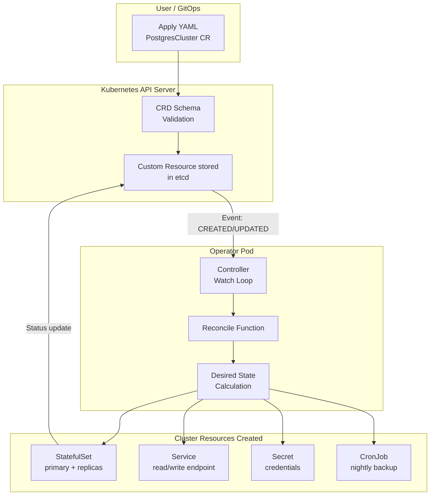

# Module 12: Custom Resources — Extending Kubernetes

## The Story: Teaching Kubernetes New Tricks

Out of the box, Kubernetes knows how to manage Pods, Services, Deployments, ConfigMaps, and a handful of other resource types. These built-in types are powerful, but they were never meant to cover every possible application pattern.

Imagine you need Kubernetes to manage a PostgreSQL cluster — with automated failover, backups, and point-in-time recovery. None of those concepts exist as native Kubernetes resources. You could try to express them as combinations of Deployments, StatefulSets, and CronJobs with a mountain of scripts, but it would be fragile and hard to operate.

This is exactly the problem Custom Resources solve. They let you teach Kubernetes to understand entirely new resource types — and pair them with controllers that know how to operate them.

> **🐳 Coming from Docker?**
>
> Docker is not extensible at the API level — you can't add a "Database" resource type to Docker and have Docker manage databases as a first-class concept. Kubernetes can be extended with Custom Resource Definitions (CRDs). When you install a database operator like CloudNativePG, it adds a `Postgresql` resource type to your cluster. You write YAML like `kind: Postgresql` and the operator manages creating pods, configuring replication, and handling failover — just like built-in Kubernetes resources. This is why the Kubernetes ecosystem is so rich: every tool adds its own resource types.

---

## What is a Custom Resource Definition (CRD)?

A **Custom Resource Definition (CRD)** is a Kubernetes API extension that registers a new resource type with the API server. Once a CRD is created, you can create, list, update, and delete instances of the new type just like any built-in resource — using kubectl, the API, or GitOps tools.

Think of it this way:
- A CRD is like a **schema** or **class definition**: it says "there is a resource type called `PostgresCluster` with these fields"
- A **Custom Resource (CR)** is an **instance** of that CRD: "here is a specific PostgreSQL cluster with 3 replicas and 100GB storage"

```
CRD (Class)           →  Custom Resource (Instance)
────────────────────────────────────────────────────
Deployment definition →  my-web-app Deployment
PostgresCluster CRD   →  my-prod-db PostgresCluster
Certificate CRD       →  api.example.com Certificate
Kafka CRD             →  events-cluster Kafka
```

---

## Creating a CRD

A CRD is itself a Kubernetes YAML manifest:

```yaml
apiVersion: apiextensions.k8s.io/v1
kind: CustomResourceDefinition
metadata:
  name: widgets.example.com    # must be <plural>.<group>
spec:
  group: example.com           # API group
  versions:
    - name: v1
      served: true
      storage: true
      schema:
        openAPIV3Schema:       # validation schema for instances
          type: object
          properties:
            spec:
              type: object
              properties:
                replicas:
                  type: integer
  scope: Namespaced            # or Cluster
  names:
    plural: widgets
    singular: widget
    kind: Widget
    shortNames: ["wgt"]        # kubectl get wgt
```

Once applied, you can run `kubectl get widgets` just like `kubectl get pods`.

---

## The Operator Pattern

A CRD alone is just a data structure stored in etcd — it does nothing on its own. The magic happens when you pair a CRD with a **custom controller** (also called an **operator**).

An **operator** is a piece of software running inside the cluster that:
1. **Watches** for custom resource events (created, updated, deleted)
2. **Reconciles** the current state of the cluster with the desired state declared in the custom resource
3. **Acts**: creates/updates/deletes Kubernetes resources (Pods, Services, ConfigMaps, Secrets) to match the spec

This is called the **reconcile loop** or **control loop** — the same mechanism Kubernetes itself uses internally for Deployments, ReplicaSets, and every other built-in type.

---

## How the Operator Pattern Works



The operator continuously watches the desired state (the CR) and the actual state (running resources). Any divergence triggers a reconcile — the operator brings reality back in line with the spec.

---

## Real-World Operator Examples

Operators exist for virtually every popular stateful application. The [OperatorHub.io](https://operatorhub.io) registry lists hundreds.

| Operator | CRD(s) it provides | What it automates |
|---|---|---|
| **cert-manager** | `Certificate`, `Issuer`, `ClusterIssuer` | TLS certificate issuance and renewal from Let's Encrypt |
| **prometheus-operator** | `Prometheus`, `ServiceMonitor`, `AlertmanagerConfig` | Prometheus deployment, scrape config, alerting rules |
| **Strimzi** | `Kafka`, `KafkaTopic`, `KafkaUser` | Full Kafka cluster lifecycle on Kubernetes |
| **CloudNativePG** | `Cluster` | PostgreSQL HA with automatic failover and backups |
| **Argo CD** | `Application`, `AppProject` | GitOps deployment pipelines |
| **Crossplane** | `Composition`, provider-specific resources | Provision cloud resources (RDS, S3, etc.) from K8s |

---

## Operator Maturity Levels

The Operator Framework defines five maturity levels:

| Level | Capability |
|-------|-----------|
| 1 — Basic Install | Automated installation and configuration |
| 2 — Seamless Upgrades | Patch and minor version upgrades |
| 3 — Full Lifecycle | App lifecycle: backup, failure recovery |
| 4 — Deep Insights | Metrics, alerts, log processing |
| 5 — Auto Pilot | Horizontal/vertical scaling, auto-config tuning |

A Level 1 operator is essentially a sophisticated Helm chart. A Level 5 operator is a fully autonomous operations system.

---

## When to Write an Operator vs Use Helm

This is one of the most common architectural decisions in platform engineering:

| Scenario | Use Helm | Write an Operator |
|---|---|---|
| Stateless apps with simple config | Yes | Overkill |
| One-time installation of off-the-shelf software | Yes | Overkill |
| Stateful apps needing ongoing lifecycle management | No | Yes |
| Need to react to cluster events at runtime | No | Yes |
| Complex day-2 operations (backup, restore, scaling) | Partial | Yes |
| App state needs custom health checks | No | Yes |
| Team has Go/Python/Java expertise | — | Yes |
| Time-to-market is the priority | Yes | Later |

**Rule of thumb**: If your app's operations can be expressed as "apply these manifests once," Helm is sufficient. If your app needs ongoing, reactive, event-driven management, write an operator.

---

## Writing Operators: Frameworks and Tools

You do not write operators from scratch. Popular frameworks:

| Framework | Language | Notes |
|---|---|---|
| **controller-runtime** / **kubebuilder** | Go | Official, most widely used |
| **Operator SDK** | Go, Ansible, Helm | Red Hat's framework, wraps controller-runtime |
| **kopf** | Python | Simple Python operators |
| **Java Operator SDK** | Java | For Java shops |
| **shell-operator** | Shell scripts | Quick-and-dirty operators |

The reconcile function pattern is the same across all frameworks: receive an event, calculate the desired state, apply changes, update status.

---

## CRD Versioning and Conversion

As your operator matures, you will need to evolve the CRD schema. CRDs support multiple versions (e.g., `v1alpha1` → `v1beta1` → `v1`) with:
- **`served: true/false`**: whether this version accepts API requests
- **`storage: true`**: which version is stored in etcd (only one can be storage)
- **Conversion webhooks**: automatically convert between versions

This lets you make breaking schema changes without disrupting existing users.

---

## Status Subresource

Custom Resources should use the **status subresource** to report current state back to users. This separates the desired state (spec) from the observed state (status):

```yaml
status:
  phase: Running
  readyReplicas: 3
  currentPrimary: postgres-cluster-1
  conditions:
    - type: Ready
      status: "True"
      lastTransitionTime: "2025-01-01T00:00:00Z"
```

Users should never need to manually edit status — the operator owns it.

---

## 📂 Navigation

| | Link |
|---|---|
| Previous | [11_RBAC](../11_RBAC/Theory.md) |
| Next | [13_DaemonSets_and_StatefulSets](../13_DaemonSets_and_StatefulSets/Theory.md) |
| Cheatsheet | [Cheatsheet.md](./Cheatsheet.md) |
| Interview Q&A | [Interview_QA.md](./Interview_QA.md) |
