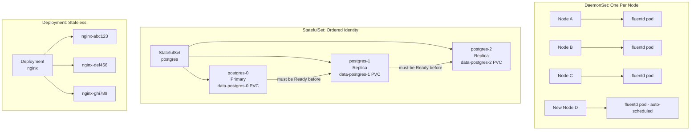

# Module 13: DaemonSets and StatefulSets

## The Story: Two Scheduling Problems, Two Solutions

Kubernetes Deployments are excellent for stateless applications — just say "run 3 replicas" and Kubernetes figures out where. But two common infrastructure patterns break that simple model:

1. **Every node needs a helper**: You want a log collector or monitoring agent on *every* single node — including nodes added in the future. A Deployment with 3 replicas won't help when you have 20 nodes.

2. **Pods have identities**: Your database cluster has a primary node (pod-0) and two read replicas (pod-1, pod-2). If pod-1 crashes, it needs to come back as pod-1 — with the same hostname, the same storage, and the same identity. Random replacement doesn't work.

DaemonSets solve problem 1. StatefulSets solve problem 2.

> **🐳 Coming from Docker?**
>
> Docker Compose has no concept of "run exactly one container per machine" — that's a DaemonSet. And Docker Compose has no concept of "containers that need stable names and ordered startup" — that's a StatefulSet. In Docker, if you need a log shipper on every VM, you configure it outside Docker entirely. In Kubernetes, a DaemonSet does this automatically: add a node, the pod appears; remove the node, the pod is gone. StatefulSets solve the problem of databases in containers: `postgres-0`, `postgres-1`, `postgres-2` always get the same names and the same storage volumes, so replication config doesn't break on restarts.

---

## 📌 Learning Priority

**Must Learn** — core concepts, needed to understand the rest of this file:
[DaemonSets: One Per Node](#daemonsets-one-pod-per-node) · [StatefulSets: Identity-Stable Pods](#statefulsets-identity-stable-pods) · [Comparison Table](#daemonset-vs-statefulset-vs-deployment)

**Should Learn** — important for real projects and interviews:
[Headless Service](#headless-service) · [VolumeClaimTemplates](#volumeclaimtemplates----per-pod-storage) · [When NOT to Use StatefulSet](#when-not-to-use-statefulset)

**Good to Know** — useful in specific situations, not needed daily:
[Node Selectors and Tolerations](#node-selectors-and-tolerations) · [StatefulSet Update Strategies](#statefulset-update-strategies)

**Reference** — skim once, look up when needed:
[Common StatefulSet Gotchas](#common-statefulset-gotchas)

---

## DaemonSets: One Pod Per Node

A **DaemonSet** ensures that exactly one copy of a pod runs on every node in the cluster (or a selected subset of nodes). When a new node is added, the DaemonSet automatically schedules the pod onto it. When a node is removed, the pod is garbage collected.

### Classic DaemonSet Use Cases

| Use Case | Examples |
|---|---|
| Log collection | Fluentd, Fluent Bit, Filebeat |
| Node monitoring | Prometheus Node Exporter, Datadog Agent |
| Network plugins | Calico, Cilium, Flannel (CNI plugins) |
| Storage plugins | Ceph CSI driver |
| Security agents | Falco, Aqua Security agent |
| GPU device plugins | NVIDIA device plugin |

### Node Selectors and Tolerations

By default, a DaemonSet runs on all nodes. You can restrict it:

```yaml
spec:
  template:
    spec:
      nodeSelector:
        role: worker        # only schedule on nodes labeled role=worker

      tolerations:          # allow scheduling on tainted nodes
        - key: node-role.kubernetes.io/control-plane
          effect: NoSchedule
          operator: Exists
```

This is how system DaemonSets (like `kube-proxy`) run on control-plane nodes which are normally tainted to prevent workload scheduling.

### DaemonSet Update Strategy

DaemonSets support two update strategies:

| Strategy | Behavior |
|---|---|
| `RollingUpdate` (default) | Updates pods one at a time across nodes |
| `OnDelete` | Pods are only updated when manually deleted |

The `maxUnavailable` field in `RollingUpdate` controls how many nodes can be updating simultaneously. Setting it to `1` means one node's DaemonSet pod is updated at a time — safe for logging agents where brief gaps are acceptable.

---

## StatefulSets: Identity-Stable Pods

A **StatefulSet** is for applications that require:
- **Stable, unique network identities** (pod-0, pod-1, pod-2 — not random names)
- **Stable persistent storage** (each pod gets its own PVC that survives restarts)
- **Ordered, graceful deployment and scaling** (pod-0 must be Ready before pod-1 starts)
- **Ordered, graceful termination** (pod-2 deleted before pod-1 before pod-0)

### Stable Network Identity

Each pod in a StatefulSet gets a predictable hostname:
```
<statefulset-name>-<ordinal>.<service-name>.<namespace>.svc.cluster.local
```

For a StatefulSet named `postgres` with a headless service named `postgres`:
- `postgres-0.postgres.default.svc.cluster.local`
- `postgres-1.postgres.default.svc.cluster.local`
- `postgres-2.postgres.default.svc.cluster.local`

These DNS names are stable — they survive pod rescheduling. If postgres-1 dies and is rescheduled to a different node, it gets the same DNS name and the same PVC.

### Headless Service

StatefulSets require a **headless service** (`clusterIP: None`). A headless service does not get a virtual IP. Instead, DNS queries for the service return the individual pod IPs directly, enabling clients to address specific pods (e.g., "connect to the primary").

```yaml
apiVersion: v1
kind: Service
metadata:
  name: postgres
spec:
  clusterIP: None      # headless — no VIP, returns pod IPs directly
  selector:
    app: postgres
  ports:
    - port: 5432
```

### VolumeClaimTemplates — Per-Pod Storage

The key StatefulSet feature is `volumeClaimTemplates`. Instead of sharing one PVC across all pods (which would be a disaster for databases), each pod gets its own PVC automatically created from the template:

```
Pod postgres-0  →  PVC data-postgres-0  →  10Gi of storage
Pod postgres-1  →  PVC data-postgres-1  →  10Gi of storage
Pod postgres-2  →  PVC data-postgres-2  →  10Gi of storage
```

If postgres-1 is deleted and rescheduled, Kubernetes reattaches `data-postgres-1` to the new pod. The data is preserved.

---

## DaemonSet vs StatefulSet vs Deployment



---

## StatefulSet Update Strategies

| Strategy | Behavior |
|---|---|
| `RollingUpdate` (default) | Updates pods from highest ordinal to lowest (2 → 1 → 0) |
| `OnDelete` | Only updates pods when manually deleted |
| `partition` | Only updates pods with ordinal >= partition value (canary releases) |

The `partition` field is powerful for StatefulSet canaries: set `partition: 2` and only pod-2 gets the new version, letting you test on one replica before rolling to all.

---

## When NOT to Use StatefulSet

StatefulSets are not a silver bullet. Avoid them when:

1. **A managed database service exists**: AWS RDS, Google Cloud SQL, and Azure Database are far easier to operate than a self-hosted StatefulSet database.
2. **The app can use shared storage**: If all pods can share a single NFS or S3 volume, a Deployment with a shared PVC is simpler.
3. **You don't actually need pod identity**: Some apps advertise needing StatefulSets but actually work fine as Deployments with proper readiness probes.
4. **You need very fast pod replacement**: StatefulSets' ordered startup/shutdown is slower than Deployment rolling updates.

**Golden rule**: Run databases in managed services. Use StatefulSets for Kafka, ZooKeeper, Elasticsearch, or applications where you genuinely need per-pod identity and storage.

---

## Common StatefulSet Gotchas

1. **PVCs are not deleted when you delete a StatefulSet**: You must manually delete them. This protects data but can leave storage orphaned.
2. **Scaling down removes the highest ordinal pod first**: If you scale from 3 to 1, pod-2 and pod-1 are deleted — pod-0 (usually the primary) survives.
3. **Pods won't start if their PVC can't be bound**: A StatefulSet pod stays Pending if its PVC cannot find a matching PersistentVolume.
4. **Headless service must exist before the StatefulSet**: Create the service first, or pods will have DNS issues at startup.


---

## 📝 Practice Questions

- 📝 [Q32 · daemonsets](../kubernetes_practice_questions_100.md#q32--normal--daemonsets)
- 📝 [Q33 · statefulsets](../kubernetes_practice_questions_100.md#q33--normal--statefulsets)
- 📝 [Q77 · compare-deployment-statefulset](../kubernetes_practice_questions_100.md#q77--interview--compare-deployment-statefulset)


---

## 📂 Navigation

| | Link |
|---|---|
| Previous | [12_Custom_Resources](../12_Custom_Resources/Theory.md) |
| Next | [14_Health_Probes](../14_Health_Probes/Theory.md) |
| Cheatsheet | [Cheatsheet.md](./Cheatsheet.md) |
| Interview Q&A | [Interview_QA.md](./Interview_QA.md) |
| Code Example | [Code_Example.md](./Code_Example.md) |
