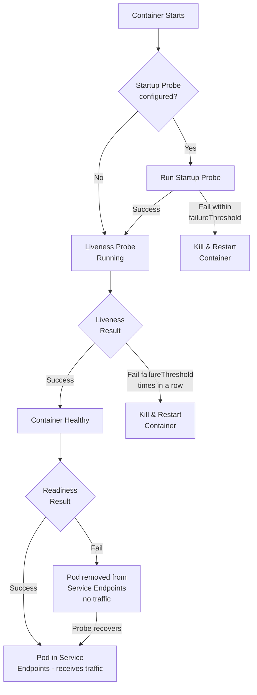

# Module 14: Health Probes

## The Story: The Pod That Lied

Imagine a web server running inside a Kubernetes pod. The container is up, the process is running, and from Kubernetes' perspective, everything looks fine. But the application inside is stuck in a deadlock — it accepted too many connections, ran out of memory for its connection pool, and is now silently returning 500 errors to every request. The node's traffic keeps flowing to this broken pod.

Without health probes, Kubernetes has no way to know the difference between a healthy pod and a pod that is technically running but completely broken. Health probes are the mechanism that closes this gap.

> **🐳 Coming from Docker?**
>
> Docker has a basic `HEALTHCHECK` instruction in Dockerfiles — one command, runs periodically, container is marked healthy or unhealthy. Kubernetes health probes are far more powerful: there are THREE types (liveness to kill and restart, readiness to stop sending traffic, startup for slow-starting apps), each independently configurable. Docker's healthcheck only marks a container unhealthy — it doesn't restart it unless you add extra configuration. Kubernetes liveness probes automatically restart pods that fail. Readiness probes are something Docker has no equivalent for — they prevent traffic from reaching pods that aren't ready yet, even if the process is running.

---

## 📌 Learning Priority

**Must Learn** — core concepts, needed to understand the rest of this file:
[Three Types of Probes](#three-types-of-probes) · [Probe Decision Flow](#probe-decision-flow) · [Key Configuration Parameters](#key-configuration-parameters)

**Should Learn** — important for real projects and interviews:
[Common Mistakes](#common-mistakes) · [Probe Parameters Tuning](#probe-parameters-tuning-guide)

**Good to Know** — useful in specific situations, not needed daily:
[Four Probe Mechanisms](#four-probe-mechanisms)

**Reference** — skim once, look up when needed:
[gRPC Probes](#grpc)

---

## Three Types of Probes

Kubernetes offers three distinct probe types, each answering a different question:

### 1. Liveness Probe — "Is it still alive?"

**Question**: Should Kubernetes restart this container?

A liveness probe detects when an application has entered an unrecoverable state — deadlock, infinite loop, corrupted internal state. If the liveness probe fails, Kubernetes kills the container and restarts it according to the pod's `restartPolicy`.

**When to use**: Any application that can get stuck and needs an automated recovery mechanism.

**Common mistake**: Setting the liveness probe too aggressively (very low `timeoutSeconds`, very high `failureThreshold: 1`). This causes unnecessary restarts during normal transient slowness, creating a restart loop that makes things worse.

### 2. Readiness Probe — "Is it ready to receive traffic?"

**Question**: Should this pod be included in the Service's endpoint list?

A readiness probe detects when a pod is temporarily unable to serve traffic — it might be warming up its cache, loading a large model, establishing database connections, or processing a backlog. If the readiness probe fails, the pod is removed from the Service endpoint list. Traffic stops flowing to it. When it recovers, it is added back automatically.

**Critical distinction from liveness**: Failing readiness does NOT restart the container. The pod keeps running — it just gets no traffic until it recovers.

**When to use**: Every single production web service or API. Missing readiness probes means traffic is sent to pods that are not yet ready, causing 5xx errors during deployments.

### 3. Startup Probe — "Has it finished starting up?"

**Question**: Has the application finished its initialization?

Some applications take a long time to start — JVM warm-up, large model loading, database schema migrations. If you use a liveness probe directly on a slow-starting app, Kubernetes might kill it before it even finishes starting.

The startup probe solves this: while the startup probe is running, the liveness probe is disabled. Only after the startup probe succeeds does Kubernetes begin evaluating the liveness probe.

**When to use**: Applications with slow startup times (Java apps, Python ML models, databases). Set `failureThreshold` high enough to cover the maximum startup time.

---

## Four Probe Mechanisms

Each probe type can use any of these four mechanisms to test the application:

### HTTP GET

Sends an HTTP GET request to a specified path and port. A status code between 200 and 399 is considered success. Any other code, or a connection failure, is a failure.

```yaml
httpGet:
  path: /healthz      # the health endpoint
  port: 8080
  httpHeaders:        # optional: add headers (e.g., for authentication)
    - name: X-Health-Check
      value: "true"
```

This is the most common probe for web services. Most frameworks provide a `/healthz` or `/health` endpoint.

### TCP Socket

Opens a TCP connection to the specified port. Success means the connection was accepted. This is useful for databases or services that don't have HTTP endpoints.

```yaml
tcpSocket:
  port: 5432
```

### Exec Command

Runs a command inside the container. Exit code 0 is success; anything else is failure.

```yaml
exec:
  command:
    - /bin/sh
    - -c
    - "pg_isready -U postgres"
```

Useful when the app exposes a CLI health check tool but no HTTP endpoint.

### gRPC

Calls a gRPC health check endpoint (requires the app to implement the standard gRPC health protocol).

```yaml
grpc:
  port: 50051
  service: ""          # "" = overall server health
```

---

## Probe Decision Flow



---

## Key Configuration Parameters

| Parameter | Default | Meaning |
|---|---|---|
| `initialDelaySeconds` | 0 | Wait this long after container start before first probe |
| `periodSeconds` | 10 | How often to run the probe |
| `timeoutSeconds` | 1 | Timeout for each probe attempt |
| `failureThreshold` | 3 | Consecutive failures before action is taken |
| `successThreshold` | 1 | Consecutive successes to return to healthy (readiness can be >1) |

**Time to detect failure**: `periodSeconds × failureThreshold` seconds in the worst case.

For a liveness probe with `periodSeconds: 10, failureThreshold: 3`, a dead app will be detected and restarted within ~30 seconds.

---

## Probe Parameters Tuning Guide

### For liveness probes:
- `initialDelaySeconds`: Set to be longer than your app's worst-case startup time (or use a startup probe instead)
- `failureThreshold`: At least 3 — a single slow response should not restart the container
- `timeoutSeconds`: 1-5 seconds, depending on how fast your health endpoint should respond

### For readiness probes:
- `initialDelaySeconds`: A few seconds — just enough for the port to be open
- `periodSeconds`: 5-10 seconds for fast recovery
- `failureThreshold`: 3 is common
- `successThreshold`: Can be higher (e.g., 3) if you want to ensure sustained recovery before re-adding to load balancer

### For startup probes:
- Calculate: `failureThreshold × periodSeconds` must be > your app's maximum startup time
- Example: App takes up to 3 minutes → `failureThreshold: 36, periodSeconds: 5` (3 minutes of runway)

---

## Common Mistakes

1. **No readiness probe**: Traffic hits pods during deployment before they're ready. You see 5xx errors during rollouts.
2. **Liveness = Readiness**: Using the same probe for both. Readiness should be more sensitive (remove from LB quickly). Liveness should be conservative (don't restart unless truly broken).
3. **Readiness probe checks downstream dependencies**: If your readiness probe calls your database, and the database is slow, Kubernetes removes your pod from the load balancer. Now your users get connection errors instead of slow responses. Keep readiness probes local — check local state only.
4. **initialDelaySeconds too short**: App gets killed before it finishes starting. Use a startup probe instead.
5. **timeoutSeconds too short**: The health endpoint takes 2 seconds but `timeoutSeconds: 1` means it always times out, triggering restarts.


---

## 📝 Practice Questions

- 📝 [Q34 · health-probes](../kubernetes_practice_questions_100.md#q34--normal--health-probes)
- 📝 [Q35 · liveness-readiness](../kubernetes_practice_questions_100.md#q35--normal--liveness-readiness)
- 📝 [Q36 · startup-probe](../kubernetes_practice_questions_100.md#q36--normal--startup-probe)
- 📝 [Q81 · scenario-pod-crashloop](../kubernetes_practice_questions_100.md#q81--design--scenario-pod-crashloop)
- 📝 [Q91 · predict-pod-restart](../kubernetes_practice_questions_100.md#q91--logical--predict-pod-restart)


---

## 📂 Navigation

| | Link |
|---|---|
| Previous | [13_DaemonSets_and_StatefulSets](../13_DaemonSets_and_StatefulSets/Theory.md) |
| Next | [15_Deployment_Strategies](../15_Deployment_Strategies/Theory.md) |
| Cheatsheet | [Cheatsheet.md](./Cheatsheet.md) |
| Interview Q&A | [Interview_QA.md](./Interview_QA.md) |
| Code Example | [Code_Example.md](./Code_Example.md) |
