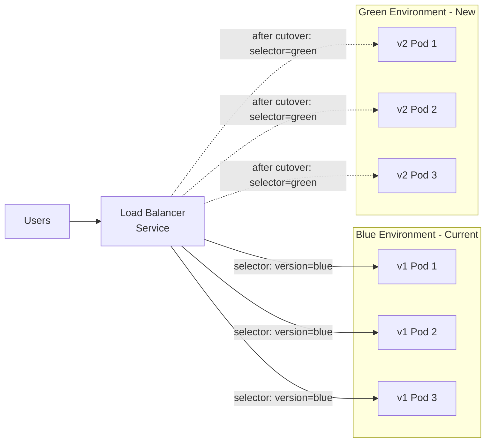
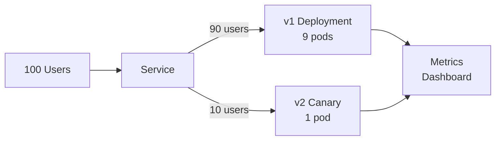
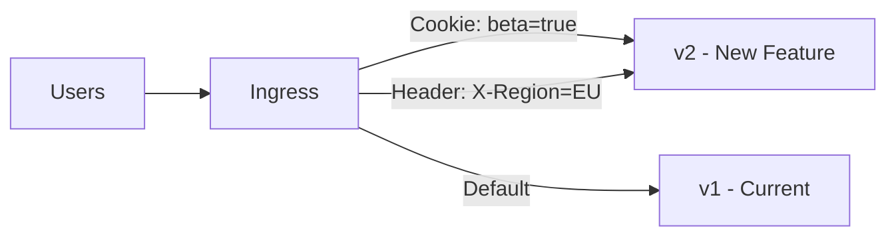

# Module 15: Deployment Strategies

## The Story: How Netflix Deploys Without Anyone Noticing

Netflix deploys code hundreds of times per day. Their engineers ship changes — new features, bug fixes, experiments — while millions of users are actively streaming. The users never notice. There are no maintenance windows, no "we'll be back soon" pages, no scheduled downtime.

How? They use a combination of deployment strategies, each suited to a different level of risk and complexity. Understanding these strategies is one of the most impactful things you can learn as a platform engineer.

> **🐳 Coming from Docker?**
>
> In Docker (or Swarm), updating an app means either stopping the old container and starting the new one (brief downtime) or manually orchestrating a rolling swap yourself. Kubernetes bakes deployment strategies into the Deployment resource: Rolling Update (default — replace pods gradually with zero downtime), Recreate (stop all, start all — for apps that can't run two versions simultaneously), Blue/Green (run both versions, switch traffic), and Canary (send 5% of traffic to new version, ramp up if healthy). These strategies that you'd have to build yourself with Docker are declarative YAML settings in Kubernetes.

---

## 📌 Learning Priority

**Must Learn** — core concepts, needed to understand the rest of this file:
[RollingUpdate Strategy](#strategy-2-rollingupdate-kubernetes-default) · [Blue/Green Strategy](#strategy-3-bluegreen-instant-cutover) · [Strategy Comparison](#strategy-comparison-table)

**Should Learn** — important for real projects and interviews:
[Canary Strategy](#strategy-4-canary-small--first) · [Recreate Strategy](#strategy-1-recreate-simple-but-destructive)

**Good to Know** — useful in specific situations, not needed daily:
[A/B Testing](#strategy-5-ab-testing-route-by-user-attribute) · [Flagger and Argo Rollouts](#advanced-flagger-and-argo-rollouts)

**Reference** — skim once, look up when needed:
[Why Strategy Matters](#why-deployment-strategy-matters)

---

## Why Deployment Strategy Matters

The naive approach to updating software:
1. Take it offline
2. Replace it
3. Bring it back online

This works fine for a personal blog. It does not work for a payment gateway processing thousands of transactions per second. Every second of downtime has a real cost: lost revenue, failed user interactions, SLA violations.

Modern deployment strategies solve this by making change **gradual**, **reversible**, and **observable**.

---

## Strategy 1: Recreate (Simple but Destructive)

**How it works**: Delete all old pods first, then create new pods.

**Behavior**:
- Old version: terminated immediately
- Gap period: zero pods running (downtime)
- New version: starts up fresh

```mermaid
gantt
    title Recreate Strategy
    dateFormat HH:mm
    section v1 Pods
    v1 Pod A   :active, a1, 00:00, 00:05
    v1 Pod B   :active, b1, 00:00, 00:05
    v1 Pod C   :active, c1, 00:00, 00:05
    section DOWNTIME
    No pods    :crit, d1, 00:05, 00:08
    section v2 Pods
    v2 Pod A   :active, a2, 00:08, 00:15
    v2 Pod B   :active, b2, 00:08, 00:15
    v2 Pod C   :active, c2, 00:08, 00:15
```

**When to use**:
- Development environments (fast and simple)
- Applications that cannot run two versions simultaneously (schema migrations requiring full cutover)
- When the old and new versions conflict at the database or file level

**Trade-offs**:
- Causes downtime (proportional to pod startup time)
- Simple to understand and debug
- Fast — no gradual rollout overhead

---

## Strategy 2: RollingUpdate (Kubernetes Default)

**How it works**: Gradually replace old pods with new ones, a few at a time. Controlled by `maxSurge` (how many extra pods can exist during rollout) and `maxUnavailable` (how many pods can be unavailable).

```mermaid
gantt
    title Rolling Update (maxSurge=1, maxUnavailable=0)
    dateFormat HH:mm
    section Version 1
    v1-A :active, 00:00, 00:06
    v1-B :active, 00:00, 00:09
    v1-C :active, 00:00, 00:12
    section Version 2
    v2-A :active, 00:04, 00:15
    v2-B :active, 00:07, 00:15
    v2-C :active, 00:10, 00:15
```

**Key parameters**:

| Parameter | Default | Meaning |
|---|---|---|
| `maxSurge` | 25% | Max pods above desired count during rollout |
| `maxUnavailable` | 25% | Max pods below desired count during rollout |

Setting `maxUnavailable: 0` means no pod is removed until its replacement is healthy (readiness probe passing). This ensures full capacity is maintained throughout.

**When to use**: Most production workloads. It is the default for a reason.

**Trade-offs**:
- No downtime (with proper readiness probes)
- Both versions run simultaneously during rollout (must ensure backward compatibility)
- Rollback takes time (another rolling update, not instant)

---

## Strategy 3: Blue/Green (Instant Cutover)

**How it works**: Maintain two full, identical environments. "Blue" is current production. "Green" is the new version. When green is tested and ready, switch the Service selector from blue to green. Instant cutover.

In Kubernetes, this is implemented by changing the Service's `selector`. No YAML changes to the pods themselves — just one field in the Service.

**When to use**:
- When you need instant, clean cutover
- When you need instant rollback (just flip selector back)
- When old and new versions cannot coexist (database schema changes)

**Trade-offs**:
- Requires 2x infrastructure cost during the transition
- Requires careful state management (sessions, database connections)
- Ideal rollback: instant (change selector back)

---

## Strategy 4: Canary (Small % First)

**How it works**: Deploy the new version to a small subset of pods (say 5-10%). Monitor metrics (error rate, latency, business KPIs). If all looks good, gradually increase the percentage until 100%. If something looks wrong, roll back only the canary.

In Kubernetes, the simplest canary is two separate Deployments (same label, different version) behind one Service. Traffic distribution is proportional to pod count.

**When to use**:
- High-risk changes where you want early signal from real traffic
- A/B style experimentation with real users
- Gradual confidence building before full rollout

**Trade-offs**:
- Requires both versions to run simultaneously
- Traffic splitting by pod count is imprecise
- For precise percentages, use Ingress-level traffic splitting or a service mesh (Istio)
- Monitoring and metrics alerting are essential — you need to know if the canary is bad

---

## Strategy 5: A/B Testing (Route by User Attribute)

**How it works**: Route specific users to specific versions based on attributes — HTTP headers, cookies, user ID ranges, geographic region. Unlike canary (random % of traffic), A/B routes specific cohorts deterministically.

Requires Ingress-level routing (NGINX Ingress canary annotations, Istio VirtualService rules, or a dedicated A/B testing platform like Unleash or LaunchDarkly).

**When to use**:
- Testing UI changes with a specific user segment
- Gradual feature rollout to beta users
- Geographic testing (launch in one region first)

**Trade-offs**:
- Requires sticky session management (users shouldn't switch versions mid-session)
- Analysis requires careful experimental design to avoid bias
- More complex infrastructure than canary

---

## Advanced: Flagger and Argo Rollouts

For production-grade canary and blue/green deployments with automated metric-based promotion:

| Tool | What it does |
|---|---|
| **Flagger** | Progressive delivery operator: automatically promotes canaries based on Prometheus metrics, Datadog, or Dynatrace signals. Supports Istio, NGINX, Linkerd. |
| **Argo Rollouts** | Extends Kubernetes Deployments with Canary and BlueGreen strategies. Integrates with Argo CD for GitOps workflows. |

Both tools implement automated canary analysis: if the error rate on the canary exceeds a threshold, automatically roll back. If it stays healthy for N minutes, automatically promote.

---

## Strategy Comparison Table

| Strategy | Downtime | Rollback Speed | Resource Cost | Complexity |
|---|---|---|---|---|
| Recreate | Yes | Fast | 1x | Low |
| RollingUpdate | No | Minutes | 1.25x | Low |
| Blue/Green | No | Instant | 2x | Medium |
| Canary | No | Fast | 1.1-1.5x | Medium-High |
| A/B Testing | No | Fast | 1.1-1.5x | High |

---

## 📝 Practice Questions

- 📝 [Q37 · deployment-strategies](../kubernetes_practice_questions_100.md#q37--normal--deployment-strategies)
- 📝 [Q38 · blue-green-canary](../kubernetes_practice_questions_100.md#q38--normal--blue-green-canary)
- 📝 [Q89 · scenario-zero-downtime-deploy](../kubernetes_practice_questions_100.md#q89--design--scenario-zero-downtime-deploy)

---

## 📂 Navigation

| | Link |
|---|---|
| Previous | [14_Health_Probes](../14_Health_Probes/Theory.md) |
| Next | [16_Sidecar_Containers](../16_Sidecar_Containers/Theory.md) |
| Cheatsheet | [Cheatsheet.md](./Cheatsheet.md) |
| Interview Q&A | [Interview_QA.md](./Interview_QA.md) |
