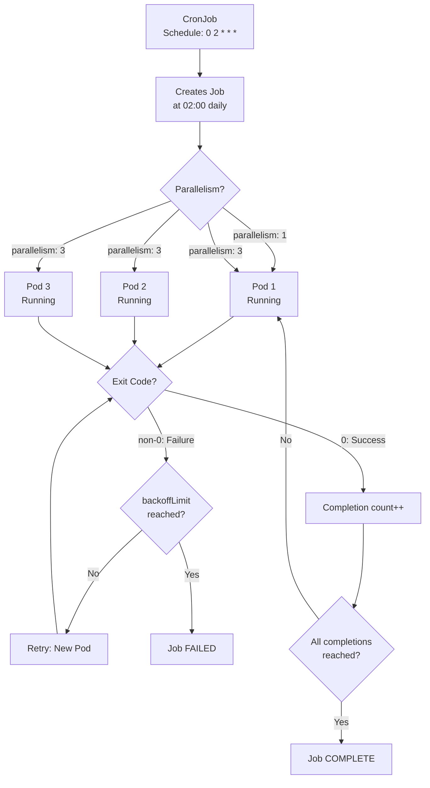

# Module 17: Jobs and CronJobs

## The Story: Not Everything Runs Forever

A Kubernetes Deployment is designed to run forever — if a pod dies, it gets replaced. But what about work that is supposed to finish? A database migration, a nightly report, a batch ETL process that runs through one million records and then stops — these are not long-running services. They are tasks.

Trying to run batch jobs as Deployments creates a mess: the job finishes, the pod exits with code 0, Kubernetes sees a "crashed" pod and restarts it, the job runs again, and again, forever. That is not what you want.

Kubernetes Jobs and CronJobs are designed specifically for finite, scheduled work.

> **🐳 Coming from Docker?**
>
> In Docker, a one-off task is just `docker run myimage python migrate.py` — it runs, finishes, exits. There's no tracking of success/failure, no automatic retries, no record in the system. In Docker Compose, there's no concept of a scheduled job at all — you'd use the host's cron with `docker exec`. Kubernetes Jobs track whether a task completed successfully, retry it a configured number of times if it fails, and keep a record of the run. CronJobs replace host-level cron entirely: the schedule lives in Kubernetes, runs containerized, and participates in all the normal RBAC, resource limits, and namespace isolation of your cluster.

---

## Jobs: Run to Completion

A **Job** creates one or more pods and ensures that a specified number of them successfully complete. Once the desired completions are reached, the Job is considered done — it does not restart.

### Basic Job Behavior

1. Job creates a pod
2. Pod runs the task and exits with code 0 (success)
3. Job marks itself as Complete
4. Pods are retained (not deleted) so you can inspect logs

If the pod exits with a non-zero code (failure), the Job creates a new pod to retry, up to `backoffLimit` times.

### Job Parallelism

Jobs support parallel execution for batch workloads:

| Parameter | Meaning |
|---|---|
| `completions` | Total number of successful pod completions needed |
| `parallelism` | Maximum pods running at the same time |
| `backoffLimit` | Max pod failures before Job fails overall |
| `activeDeadlineSeconds` | Kill the Job if it runs longer than this |

Common patterns:

- **Single run**: `completions: 1, parallelism: 1` (default) — one pod, one run
- **Fixed completion count**: `completions: 10, parallelism: 3` — run 10 tasks, 3 at a time
- **Work queue**: `completions` not set, `parallelism: 5` — pods pull from a queue, Job ends when a pod exits cleanly with nothing left

### Job Failure Handling

`backoffLimit` (default: 6) controls how many times a failed pod is retried. The backoff time between retries doubles: 10s, 20s, 40s, up to 6 minutes. Set `activeDeadlineSeconds` to cap total Job runtime.

`restartPolicy` on the pod spec must be `Never` or `OnFailure` (never `Always` — that would fight with the Job controller).

---

## CronJobs: Scheduled Jobs

A **CronJob** creates Jobs on a schedule using standard cron syntax. It is the Kubernetes equivalent of Unix cron.

### Cron Syntax Reminder

```
┌──────── minute (0-59)
│  ┌───── hour (0-23)
│  │  ┌── day of month (1-31)
│  │  │  ┌─ month (1-12)
│  │  │  │  ┌ day of week (0-7, 0 and 7 are Sunday)
│  │  │  │  │
*  *  *  *  *
```

Common examples:

| Schedule | Meaning |
|---|---|
| `0 2 * * *` | Every day at 2:00 AM |
| `*/5 * * * *` | Every 5 minutes |
| `0 0 * * 0` | Every Sunday at midnight |
| `0 9-17 * * 1-5` | Every hour from 9 AM to 5 PM, weekdays |
| `@hourly` | Shorthand for `0 * * * *` |
| `@daily` | Shorthand for `0 0 * * *` |

### CronJob Parameters

| Parameter | Default | Meaning |
|---|---|---|
| `concurrencyPolicy` | Allow | What to do if previous Job is still running |
| `successfulJobsHistoryLimit` | 3 | Keep last N successful Jobs |
| `failedJobsHistoryLimit` | 1 | Keep last N failed Jobs |
| `startingDeadlineSeconds` | — | How late a Job can start before being skipped |
| `suspend` | false | Pause the CronJob without deleting it |

### CronJob Concurrency Policy

| Policy | Behavior |
|---|---|
| `Allow` | Create new Job even if previous is still running (default) |
| `Forbid` | Skip new Job if previous is still running |
| `Replace` | Cancel the running Job and start the new one |

`Forbid` is the safest choice for idempotent jobs. `Replace` is useful for "latest wins" semantics. `Allow` can cause runaway job accumulation if jobs run longer than their schedule interval.

---

## Job Lifecycle



---

## Use Cases

| Use Case | Job or CronJob? | Notes |
|---|---|---|
| Database migration at deploy time | Job | Run as a pre-deploy hook or init Job |
| Nightly report generation | CronJob | `0 2 * * *` |
| Process a fixed batch of records | Job with completions | parallelism for speed |
| Cleanup old files/records | CronJob | `0 3 * * *` with `Forbid` |
| Send scheduled email digest | CronJob | `0 8 * * 1` |
| One-time data import | Job | Run manually, check logs |
| Drain a work queue | Job with work queue mode | Pods exit when queue empty |

---

## CronJob vs Deployment for Always-On Tasks

If a task genuinely needs to run continuously in a loop (polling a queue every second), use a **Deployment**, not a CronJob. CronJobs have minimum resolution of 1 minute. For sub-minute polling, use a Deployment with a loop in the container.

If a task runs periodically (every 5 minutes or less frequently), use a CronJob — it is cleaner and provides better history/auditability.

---

## 📂 Navigation

| | Link |
|---|---|
| Previous | [16_Sidecar_Containers](../16_Sidecar_Containers/Theory.md) |
| Next | [18_HPA_VPA_Autoscaling](../18_HPA_VPA_Autoscaling/Theory.md) |
| Cheatsheet | [Cheatsheet.md](./Cheatsheet.md) |
| Interview Q&A | [Interview_QA.md](./Interview_QA.md) |
| Code Example | [Code_Example.md](./Code_Example.md) |
