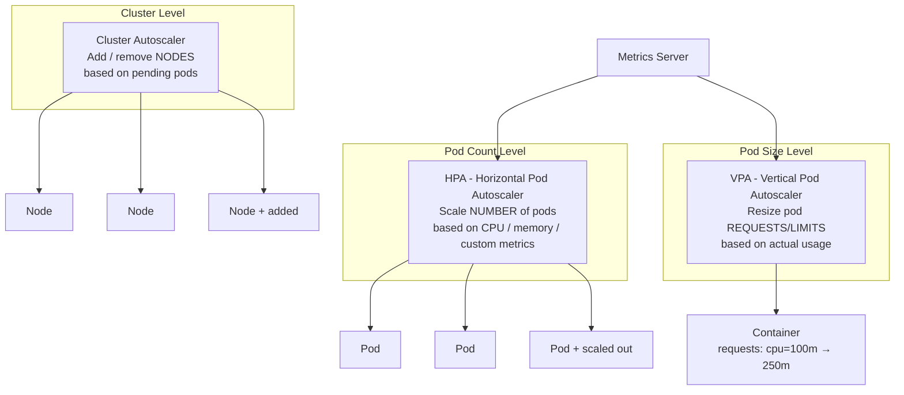

# Module 18: HPA, VPA, and Autoscaling

## The Story: Traffic That Never Sleeps

It is 11:58 PM on Black Friday. Your e-commerce platform is handling its normal 1,000 requests per second. In two minutes, a promotional email goes out to 5 million subscribers. You are about to see 50,000 requests per second.

You have two choices:
1. **Manual scaling**: SSH into the cluster, run `kubectl scale`, and pray you're fast enough.
2. **Autoscaling**: Let Kubernetes automatically add pods (and nodes) based on real-time metrics.

Option 2 is what keeps engineers asleep on Black Friday.

Kubernetes has three autoscaling mechanisms, each operating at a different level:

> **🐳 Coming from Docker?**
>
> Docker has zero built-in autoscaling. If traffic spikes, you manually `docker service scale app=10` in Swarm — and you probably aren't watching at 3 AM when it happens. Kubernetes HPA watches CPU (or custom metrics) and automatically increases or decreases the number of pod replicas. VPA goes further: it analyzes actual CPU/memory usage and recommends (or automatically applies) the right resource requests for each container. This is the operational maturity gap between Docker and Kubernetes — K8s can adapt to load without human intervention.

---

## The Three Autoscaling Dimensions



---

## HPA — Horizontal Pod Autoscaler

The HPA watches a metric and adjusts the number of pod replicas in a Deployment (or StatefulSet, ReplicaSet). It is the primary autoscaling mechanism for production workloads.

### How it Works

1. The metrics-server (or custom metrics adapter) collects CPU/memory usage from pods
2. The HPA controller compares actual usage to the target
3. It calculates the desired replica count: `desiredReplicas = ceil(currentReplicas * (currentMetric / desiredMetric))`
4. It updates the Deployment's replica count

HPA checks every 15 seconds by default. Scale-up is fast (1-2 minutes), scale-down is deliberately slow (5 minutes default) to prevent thrashing.

### HPA Configuration

```yaml
apiVersion: autoscaling/v2
kind: HorizontalPodAutoscaler
metadata:
  name: web-app-hpa
spec:
  scaleTargetRef:
    apiVersion: apps/v1
    kind: Deployment
    name: web-app
  minReplicas: 2
  maxReplicas: 20
  metrics:
    - type: Resource
      resource:
        name: cpu
        target:
          type: Utilization
          averageUtilization: 70   # target 70% CPU utilization
```

### HPA Scaling Behavior

Kubernetes 1.18+ allows customizing the scale-up and scale-down behavior:

```yaml
behavior:
  scaleUp:
    stabilizationWindowSeconds: 60    # wait 60s before scaling up again
    policies:
      - type: Percent
        value: 100          # double pods at most per step
        periodSeconds: 60
  scaleDown:
    stabilizationWindowSeconds: 300   # wait 5 minutes before scaling down
    policies:
      - type: Pods
        value: 5            # remove at most 5 pods per 60s
        periodSeconds: 60
```

### HPA with Custom Metrics

Beyond CPU and memory, HPA can scale on any metric exposed to the Kubernetes metrics API:

| Metric type | Example | Use case |
|---|---|---|
| `Resource` | CPU utilization | Most web services |
| `Pods` | requests-per-second per pod | Custom app metrics |
| `Object` | Queue depth on a K8s object | Kafka lag, SQS depth |
| `External` | CloudWatch metrics | AWS SQS queue length |

For custom metrics, you need an adapter: **Prometheus Adapter** (exposes Prometheus metrics to HPA) or **KEDA** (event-driven autoscaling).

---

## VPA — Vertical Pod Autoscaler

The VPA analyzes actual pod resource usage over time and recommends (or automatically sets) appropriate `requests` and `limits`. Instead of running more pods (horizontal), it makes each pod bigger or smaller (vertical).

### VPA Modes

| Mode | Behavior |
|---|---|
| `Off` | Collect data, make recommendations, do NOT change anything |
| `Initial` | Set requests/limits only when pods are first created |
| `Auto` | Evict and recreate pods with updated resources (requires restart) |
| `Recreate` | Same as Auto (for backward compatibility) |

**Important**: VPA `Auto` mode requires pod restarts. It evicts the pod and the replacement starts with new resource values. This means a brief availability gap for single-replica deployments.

### VPA Recommendation Example

```
Actual CPU usage:  avg 120m, peak 340m
Current request:   50m
VPA recommendation: 200m request, 600m limit
```

Use `Off` mode in production at first to see recommendations without risk. Review them, apply them to your YAML, then consider `Auto` for non-critical workloads.

---

## HPA + VPA Together: The Conflict

**Do NOT use HPA on CPU together with VPA Auto on CPU**. They will fight each other:
- VPA increases CPU requests → pods get evicted and restarted with higher requests
- HPA sees CPU utilization drop (because requests are higher, utilization % drops) → HPA scales down
- Loop

Safe combinations:
- HPA on CPU + VPA on memory only (`resourcePolicy.containerPolicies.controlledResources: ["memory"]`)
- HPA on custom metrics + VPA in Auto mode (VPA handles resource sizing, HPA handles traffic scaling)
- VPA in `Off` mode (recommendations only) + HPA on CPU

---

## Cluster Autoscaler

The Cluster Autoscaler adds nodes when pods are Pending (not enough capacity) and removes underutilized nodes when they have been idle long enough.

**Scale-up trigger**: A pod enters `Pending` state because no node has enough resources. The Cluster Autoscaler provisions a new node from the cloud provider's node group.

**Scale-down trigger**: A node has been underutilized (below 50% by default) for 10 minutes, and all pods on it can be moved to other nodes.

**Requirements**: Must be running in a cloud environment with auto-scaling node groups (AWS ASG, GKE Node Pools, Azure VMSS).

---

## KEDA — Event-Driven Autoscaling

KEDA (Kubernetes Event-Driven Autoscaling) extends HPA with rich event sources. Where HPA scales on CPU/memory/custom metrics, KEDA scales on business events:

| KEDA Scaler | What it monitors |
|---|---|
| Kafka | Consumer group lag |
| RabbitMQ | Queue depth |
| AWS SQS | Number of messages in queue |
| Redis | List length |
| Prometheus | Any Prometheus metric |
| Azure Service Bus | Message count |
| Cron | Scale to zero at night, up during business hours |

KEDA can also scale to **zero replicas** — something native HPA cannot do (minimum is 1). This is valuable for event-driven workloads that should only run when there is work to do.

---

## Prerequisites

| Component | Required by |
|---|---|
| metrics-server | HPA (CPU/memory) |
| prometheus-adapter | HPA (custom metrics from Prometheus) |
| VPA controller | VPA |
| KEDA controller | KEDA scalers |
| Cloud provider node groups | Cluster Autoscaler |

---

## 📂 Navigation

| | Link |
|---|---|
| Previous | [17_Jobs_and_CronJobs](../17_Jobs_and_CronJobs/Theory.md) |
| Next | [19_Resource_Quotas_and_Limits](../19_Resource_Quotas_and_Limits/Theory.md) |
| Cheatsheet | [Cheatsheet.md](./Cheatsheet.md) |
| Interview Q&A | [Interview_QA.md](./Interview_QA.md) |
