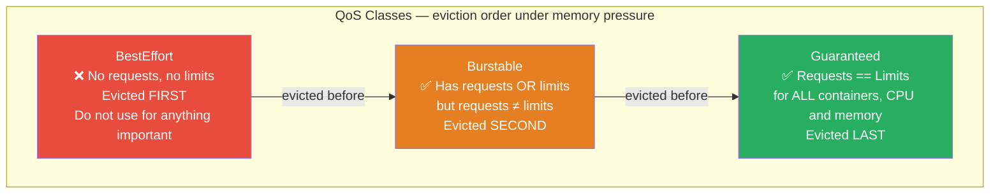

# Module 19: Resource Quotas and Limits

## The Story: The Shared Cluster Disaster

Your company has a shared Kubernetes cluster used by three teams: frontend, backend, and data. Everyone is getting along fine — until Tuesday afternoon. The data team kicks off a large machine learning training job. Within minutes, it consumes all available CPU and memory on the cluster. Suddenly the frontend team's pods cannot schedule. The backend API goes unresponsive. Your customer-facing website goes down, and the on-call engineer gets paged. The data team's job is not malicious — it just has no limits, so it takes everything it can.

This is why Kubernetes has Resource Quotas and Limits: to make sure no single team, namespace, or pod can hog the entire cluster. Like a shared office where everyone gets a designated desk and a storage cabinet — no one can claim the whole floor just because it was temporarily empty.

The solution has two layers. At the **pod level**, resource requests and limits define how much CPU and memory each container asks for and can consume. At the **namespace level**, LimitRanges set defaults so pods without explicit limits still get reasonable boundaries, and ResourceQuotas cap the total budget any single namespace can consume. Together, these tools turn a chaotic free-for-all into a predictable, fair, and stable shared environment.

> **🐳 Coming from Docker?**
>
> In Docker, resource limits are per-container flags: `docker run --memory 512m --cpus 0.5 myapp`. There's no cluster-wide budget or namespace-level cap — one runaway container can starve all others on the host. Kubernetes adds two layers: resource requests/limits on each container (like Docker's flags, but the scheduler uses requests to place pods intelligently), and ResourceQuotas at the namespace level (a total budget for an entire team's namespace). A team's dev environment can be capped at 4 CPUs and 8GB total, while production gets 40 CPUs — enforced automatically by the cluster.

---

## 📌 Learning Priority

**Must Learn** — core concepts, needed to understand the rest of this file:
[Requests vs Limits](#cpu-and-memory-requests-vs-limits) · [QoS Classes](#qos-classes) · [LimitRange vs ResourceQuota](#limitrange-vs-resourcequota----side-by-side)

**Should Learn** — important for real projects and interviews:
[OOMKilled Explained](#oomkilled-explained) · [ResourceQuota: Namespace Budget](#resourcequota----namespace-budget) · [LimitRange: Namespace Defaults](#limitrange----namespace-defaults)

**Good to Know** — useful in specific situations, not needed daily:
[CPU Throttling Explained](#cpu-throttling-explained) · [ResourceQuota Object Counts](#resourcequota-and-object-counts)

**Reference** — skim once, look up when needed:
[CPU and Memory Units](#cpu-units-and-memory-units-reference)

---

## CPU and Memory: Requests vs Limits

Every container in Kubernetes can specify two resource numbers for each resource type (CPU and memory):

### Requests

A **request** is what the container is guaranteed. The Kubernetes scheduler uses requests to decide where to place a pod — it will only schedule a pod on a node that has enough unallocated resources to satisfy the request.

Think of a request as a reservation at a restaurant. You are guaranteed your table. Other diners cannot take it.

### Limits

A **limit** is the maximum a container is allowed to consume. If a container tries to use more than its limit:
- **CPU**: The container is **throttled** — its CPU access is rate-limited so it cannot exceed the limit. The container continues running, just slower.
- **Memory**: The container is **OOMKilled** — the Linux kernel's Out-Of-Memory killer terminates the process because it exceeded its memory limit. Kubernetes will restart the container.

Think of a limit as the maximum food you are allowed to order. Ordering more results in being cut off.

### The Critical Difference

| | Request | Limit |
|---|---|---|
| Used for scheduling? | Yes | No |
| Guaranteed to the container? | Yes | No (it is a cap) |
| What happens if exceeded? | N/A | CPU throttling / OOMKill |
| Affects QoS class? | Yes | Yes |

---

## A Concrete Example

```yaml
resources:
  requests:
    cpu: "250m"      # guaranteed 0.25 CPU cores
    memory: "256Mi"  # guaranteed 256 MiB of RAM
  limits:
    cpu: "1000m"     # cannot use more than 1 CPU core
    memory: "512Mi"  # cannot use more than 512 MiB — OOMKilled if exceeded
```

This container is guaranteed 0.25 CPU cores and 256 MiB RAM. Under normal load it will be fine. Under heavy load it can burst up to 1 full CPU core and 512 MiB. If its memory usage exceeds 512 MiB even for a moment, the kernel kills it.

---

## OOMKilled Explained

OOMKilled (Out Of Memory Killed) is one of the most common failure modes in Kubernetes. It happens when a container's memory usage exceeds its memory limit. The Linux kernel's OOM killer selects the process exceeding the limit and terminates it.

In Kubernetes, you can see this in the pod status:

```bash
kubectl describe pod <name>
# Last State: Terminated
#   Reason: OOMKilled
#   Exit Code: 137
```

Exit code 137 means the process was killed by signal 9 (SIGKILL). Common causes:
- Memory limit is set too low for the workload's actual needs
- A memory leak in the application
- A sudden spike in data being processed (e.g., a large query result loaded into RAM)

The fix is to either increase the memory limit, fix the memory leak, or use streaming/pagination to avoid loading large datasets at once.

---

## CPU Throttling Explained

CPU throttling is more subtle than OOMKill — the container keeps running but performs poorly. When a container's CPU usage hits its limit, the Linux kernel uses CFS (Completely Fair Scheduler) bandwidth control to rate-limit it. The container is allowed to use CPU for a burst period, then paused until the next quota period (100ms by default).

Signs of CPU throttling:
- High latency despite low CPU utilization readings
- `container_cpu_cfs_throttled_seconds_total` metric increasing in Prometheus
- Application feels "jittery" or slow despite pods appearing healthy

CPU throttling is often caused by limits set too tightly. Unlike memory, the container does not crash — it just slows down.

---

## QoS Classes

Kubernetes assigns every pod one of three Quality of Service (QoS) classes based on the resource configuration of its containers. This class determines the pod's priority when the node runs out of memory.



### Guaranteed

All containers in the pod have requests and limits set, and they are equal for both CPU and memory:

```yaml
resources:
  requests:
    cpu: "500m"
    memory: "256Mi"
  limits:
    cpu: "500m"
    memory: "256Mi"
```

The pod gets exactly what it asks for — no more, no less. It is the last to be evicted under memory pressure. Use this for latency-sensitive production services.

### Burstable

At least one container has a request or limit set, but they are not all equal:

```yaml
resources:
  requests:
    cpu: "100m"
    memory: "128Mi"
  limits:
    cpu: "500m"
    memory: "512Mi"
```

The pod can burst beyond its requests when spare capacity is available. It is evicted after BestEffort pods under memory pressure. This is the most common class in practice.

### BestEffort

No container in the pod sets any requests or limits:

```yaml
# No resources block at all — BestEffort class assigned
containers:
  - name: app
    image: myapp:latest
```

The pod gets whatever CPU and memory is left over. It is the first to be evicted when the node runs out of memory. Never use BestEffort for production workloads.

---

## LimitRange — Namespace Defaults

A LimitRange is a namespace-scoped policy that sets default requests and limits for containers that do not specify their own. It also enforces minimum and maximum bounds.

Without a LimitRange, a developer who forgets to set resource limits gets a BestEffort pod that can consume the entire node. With a LimitRange, any container missing limits gets sane defaults applied automatically by the admission controller.

```yaml
apiVersion: v1
kind: LimitRange
metadata:
  name: default-limits
  namespace: production
spec:
  limits:
    - type: Container
      default:          # applied if no limits are set
        cpu: "500m"
        memory: "256Mi"
      defaultRequest:   # applied if no requests are set
        cpu: "100m"
        memory: "128Mi"
      max:              # containers cannot request more than this
        cpu: "2"
        memory: "2Gi"
      min:              # containers must request at least this
        cpu: "50m"
        memory: "64Mi"
```

LimitRange also supports `type: Pod` (limits applied to the sum of all containers in a pod) and `type: PersistentVolumeClaim` (limits on PVC storage size).

---

## ResourceQuota — Namespace Budget

A ResourceQuota sets a total budget for a namespace — limiting the total resources all pods and objects in that namespace can consume combined.

This is the tool that solves the shared cluster problem from the story: even if the data team has a LimitRange, they could still run 1,000 small jobs that together consume the cluster. ResourceQuota caps the total.

```yaml
apiVersion: v1
kind: ResourceQuota
metadata:
  name: team-data-quota
  namespace: data-team
spec:
  hard:
    requests.cpu: "20"         # total CPU requests across all pods: 20 cores
    requests.memory: "40Gi"    # total memory requests: 40 GiB
    limits.cpu: "40"           # total CPU limits: 40 cores
    limits.memory: "80Gi"      # total memory limits: 80 GiB
    pods: "50"                 # maximum number of pods: 50
    persistentvolumeclaims: "10"   # maximum number of PVCs
    requests.storage: "500Gi"      # total storage requested by PVCs
```

Once the quota is exhausted, new pods in the namespace will fail to create — the API server rejects the request with a `Forbidden: exceeded quota` error.

**Important gotcha**: Once a ResourceQuota is applied to a namespace, all pod creation requests **must** include resource requests and limits, or they will be rejected. Use LimitRange alongside ResourceQuota to ensure defaults are set automatically.

---

## LimitRange vs ResourceQuota — Side by Side

| | LimitRange | ResourceQuota |
|---|---|---|
| Scope | Per container / pod | Per namespace (total) |
| Purpose | Default and bound individual resources | Cap total namespace consumption |
| What it prevents | Pods without resource specs / runaway containers | Namespace from consuming too much |
| Works on | Containers, pods, PVCs | Pods, PVCs, services, secrets, configmaps, and more |
| Enforced at | Pod admission (per pod) | Namespace aggregate |

They are complementary. Use both: LimitRange ensures every pod has limits (so nothing becomes BestEffort), and ResourceQuota ensures the namespace as a whole stays within budget.

---

## ResourceQuota and Object Counts

ResourceQuota can also limit the count of Kubernetes objects, not just resource consumption:

```yaml
spec:
  hard:
    pods: "100"
    services: "20"
    secrets: "50"
    configmaps: "50"
    services.loadbalancers: "5"    # expensive: limits load balancer creation
    count/deployments.apps: "20"
    count/cronjobs.batch: "10"
```

This is useful for multi-tenant clusters where you want to prevent runaway object creation (e.g., a CronJob bug that creates thousands of Jobs, filling up etcd).

---

## Why Setting Resources is Mandatory for Production

Running pods without resource requests and limits in production causes:

1. **Unpredictable scheduling**: The scheduler cannot make good decisions without knowing how much CPU/memory a pod needs.
2. **BestEffort QoS**: Pods are first to be evicted when nodes are under pressure.
3. **Noisy neighbor problems**: One pod can starve all others on the same node.
4. **HPA failure**: HPA requires CPU requests to calculate utilization percentages. Without requests, HPA cannot function.
5. **ResourceQuota blocks**: If a namespace has a ResourceQuota, pods without requests/limits are rejected.

Production clusters should enforce resource requirements via LimitRange defaults and admission controllers (OPA/Gatekeeper, Kyverno) that block pods without explicit resource specs.

---

## CPU Units and Memory Units Reference

| CPU | Meaning |
|---|---|
| `1` | 1 full CPU core |
| `500m` | 0.5 CPU cores (500 millicores) |
| `100m` | 0.1 CPU cores (100 millicores) |
| `0.25` | 0.25 CPU cores |

| Memory | Meaning |
|---|---|
| `128Mi` | 128 mebibytes (1 Mi = 1,048,576 bytes) |
| `1Gi` | 1 gibibyte (1 Gi = 1,073,741,824 bytes) |
| `512M` | 512 megabytes (1 M = 1,000,000 bytes) — slightly less than 512Mi |

Use `Mi` and `Gi` (binary units) — they match how the Linux kernel reports memory.


---

## 📝 Practice Questions

- 📝 [Q44 · resource-quotas](../kubernetes_practice_questions_100.md#q44--normal--resource-quotas)
- 📝 [Q45 · resource-limits](../kubernetes_practice_questions_100.md#q45--normal--resource-limits)
- 📝 [Q96 · debug-oomkilled](../kubernetes_practice_questions_100.md#q96--debug--debug-oomkilled)


---

## 📂 Navigation

⬅️ **Prev:** [HPA/VPA Autoscaling](../18_HPA_VPA_Autoscaling/Interview_QA.md) &nbsp;&nbsp;&nbsp; ➡️ **Next:** [Network Policies](../20_Network_Policies/Theory.md)

| | Link |
|---|---|
| Cheatsheet | [Cheatsheet.md](./Cheatsheet.md) |
| Interview Q&A | [Interview_QA.md](./Interview_QA.md) |
| Module Home | [19_Resource_Quotas_and_Limits](../) |
