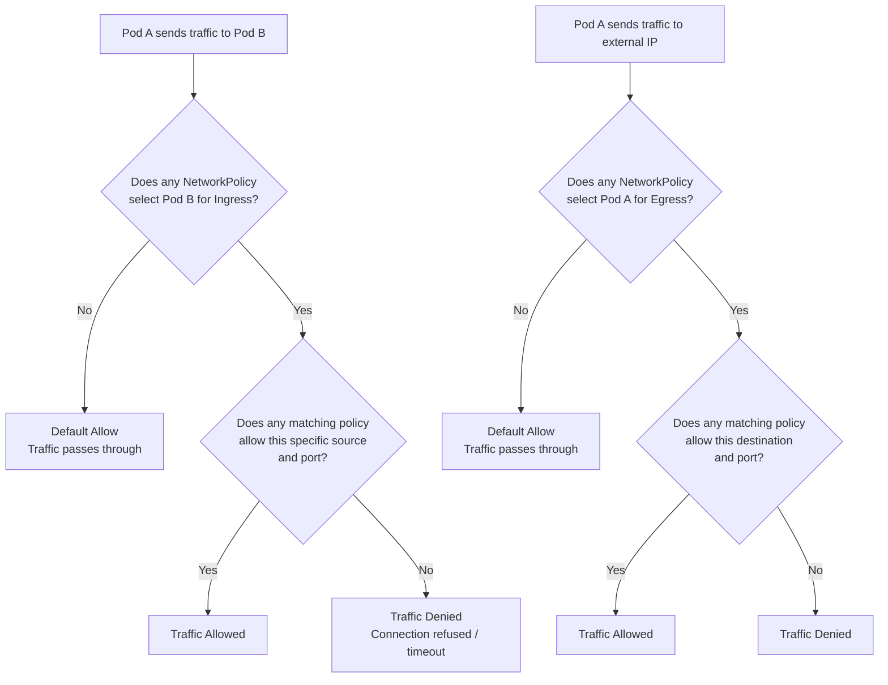

# Module 20 — Network Policies

## The Story: Keys to Every Room

By default, every pod in your Kubernetes cluster can talk to every other pod — like an office building where all employees have keys to every room. That's fine for a tiny startup, but imagine your payment processing service can be reached directly by any container on the cluster, including one that's been compromised. NetworkPolicies are the internal firewall rules that say "only the checkout service can talk to payments, nothing else."

Think of it like a hospital. In an unsecured hospital, any staff member from any department could walk into the pharmacy and grab medication. So hospitals install badge-controlled doors: only pharmacists enter the pharmacy, only surgeons enter the operating room. NetworkPolicies are those badge-controlled doors for your Kubernetes network — they define exactly which pods are allowed to send traffic to which other pods.

The important twist: by default, Kubernetes does NOT enforce any of this. Every pod is fully reachable from every other pod. You have to deliberately create NetworkPolicy objects to start restricting traffic. This is a design decision that prioritizes ease of getting started — but in production, you almost always want to lock things down.

> **🐳 Coming from Docker?**
>
> In Docker, all containers on the same bridge network can freely talk to each other — there's no firewall between them by default. You can use separate networks to isolate containers, but it's coarse-grained. Kubernetes NetworkPolicies are per-pod firewall rules: you can say "only the `frontend` pod can reach `backend` on port 8080, nothing else." Importantly, NetworkPolicies only work if your CNI plugin supports them (Calico, Cilium yes; the default kubenet does not). Think of them as iptables rules for pods, written in YAML and enforced by the network layer.

---

## 📌 Learning Priority

**Must Learn** — core concepts, needed to understand the rest of this file:
[What Is a NetworkPolicy](#what-is-a-networkpolicy) · [NetworkPolicy Spec Anatomy](#networkpolicy-spec-anatomy) · [The Deny-All Pattern](#the-deny-all-pattern)

**Should Learn** — important for real projects and interviews:
[Selectors: pod, namespace, ipBlock](#selectors-podselector-namespaceselector-ipblock) · [Policy Enforcement Flow](#policy-enforcement-flow) · [CNI Plugin Requirement](#cni-plugin-requirement)

**Good to Know** — useful in specific situations, not needed daily:
[Allow-Specific Patterns](#allow-specific-patterns) · [Debugging Network Policies](#debugging-networkpolicy-issues)

**Reference** — skim once, look up when needed:
[NetworkPolicy vs Service Mesh](#networkpolicy-vs-service-mesh)

---

## The Default: Flat Network, No Restrictions

Out of the box, Kubernetes operates with a **default-allow** model:

- Any pod can send traffic to any other pod across any namespace
- Any pod can receive traffic from any other pod
- There are no built-in network firewalls between pods

This is fine for learning and development. In production, this means a compromised frontend pod could make direct database queries, read secrets from another team's namespace, or probe internal services.

```
Without NetworkPolicy:

  [frontend] --> [backend]         OK
  [frontend] --> [database]        PROBLEM — should not be allowed
  [frontend] --> [payment-service] PROBLEM — very dangerous
  [random-pod] --> [secrets-api]   PROBLEM
```

---

## What Is a NetworkPolicy?

A NetworkPolicy is a Kubernetes resource that selects a group of pods and defines rules about which traffic is allowed to reach them (ingress) and which traffic they are allowed to send (egress).

Key things to understand:

1. **A NetworkPolicy applies to pods matched by a selector** — it does not apply globally
2. **Once any NetworkPolicy selects a pod, that pod switches to default-deny** for that traffic direction — only explicitly allowed traffic gets through
3. **Pods with no NetworkPolicy selecting them remain fully open**

This is subtle but critical: the act of creating a NetworkPolicy that selects a pod changes that pod's behavior from "allow all" to "allow only what the policy permits."

---

## NetworkPolicy Spec Anatomy

```yaml
apiVersion: networking.k8s.io/v1
kind: NetworkPolicy
metadata:
  name: allow-checkout-to-payments
  namespace: production
spec:
  podSelector:           # Which pods this policy applies TO
    matchLabels:
      app: payment-service
  policyTypes:
    - Ingress            # Control inbound traffic
    - Egress             # Control outbound traffic
  ingress:
    - from:
        - podSelector:   # Allow from pods with this label
            matchLabels:
              app: checkout-service
      ports:
        - protocol: TCP
          port: 8080
  egress:
    - to:
        - namespaceSelector:   # Allow outbound to monitoring namespace
            matchLabels:
              kubernetes.io/metadata.name: monitoring
      ports:
        - protocol: TCP
          port: 9090
```

### podSelector

Selects which pods in the current namespace this policy applies to. An empty `podSelector: {}` selects ALL pods in the namespace.

### policyTypes

Declares which directions this policy controls:
- `Ingress` — controls inbound traffic to the selected pods
- `Egress` — controls outbound traffic from the selected pods

If you specify `policyTypes: [Ingress]` but include no `ingress` rules, the result is: **deny all inbound traffic** to those pods.

### ingress / egress Rules

Each rule has two parts:
- **from / to**: which sources or destinations are allowed
- **ports**: which ports and protocols are allowed

---

## Selectors: podSelector, namespaceSelector, ipBlock

### podSelector (same namespace)

```yaml
ingress:
  - from:
      - podSelector:
          matchLabels:
            app: frontend
```

Allows traffic only from pods with `app: frontend` in the **same namespace** as the policy.

### namespaceSelector (cross-namespace)

```yaml
ingress:
  - from:
      - namespaceSelector:
          matchLabels:
            kubernetes.io/metadata.name: monitoring
```

Allows traffic from any pod in namespaces labeled `kubernetes.io/metadata.name: monitoring`. Since Kubernetes 1.21, this label is auto-applied to every namespace using its own name — very handy.

### Combined podSelector + namespaceSelector

```yaml
ingress:
  - from:
      - namespaceSelector:         # Same list item = AND
          matchLabels:
            environment: production
        podSelector:
          matchLabels:
            app: frontend
```

When both appear in the same `from` list item (no extra dash), they are ANDed — the source must be in a production namespace AND have `app: frontend`. If they are separate list items (each with its own dash), they are ORed.

### ipBlock (external traffic)

```yaml
ingress:
  - from:
      - ipBlock:
          cidr: 10.0.0.0/8
          except:
            - 10.0.10.0/24
```

Allows traffic from a CIDR range, optionally excluding sub-ranges. Useful for allowing traffic from a load balancer or VPN.

---

## The Deny-All Pattern

The most important pattern. Apply this to a namespace first, then selectively open traffic.

```yaml
# Deny ALL ingress to all pods in a namespace
apiVersion: networking.k8s.io/v1
kind: NetworkPolicy
metadata:
  name: default-deny-ingress
  namespace: production
spec:
  podSelector: {}        # Selects ALL pods
  policyTypes:
    - Ingress
  # No ingress rules = deny all inbound
```

```yaml
# Deny ALL traffic (both directions) — maximum isolation
apiVersion: networking.k8s.io/v1
kind: NetworkPolicy
metadata:
  name: default-deny-all
  namespace: production
spec:
  podSelector: {}
  policyTypes:
    - Ingress
    - Egress
  # No rules = deny everything
```

After applying deny-all, you add specific allow policies for exactly the flows you need.

---

## Policy Enforcement Flow



---

## Allow-Specific Patterns

### Allow DNS (Do This Before Anything Else)

When you apply egress restrictions, DNS breaks immediately unless you allow it. DNS runs on port 53 UDP/TCP to CoreDNS in `kube-system`.

```yaml
apiVersion: networking.k8s.io/v1
kind: NetworkPolicy
metadata:
  name: allow-dns-egress
  namespace: production
spec:
  podSelector: {}
  policyTypes:
    - Egress
  egress:
    - to:
        - namespaceSelector:
            matchLabels:
              kubernetes.io/metadata.name: kube-system
          podSelector:
            matchLabels:
              k8s-app: kube-dns
      ports:
        - protocol: UDP
          port: 53
        - protocol: TCP
          port: 53
```

### Isolate a Namespace (Intra-Namespace Only)

```yaml
apiVersion: networking.k8s.io/v1
kind: NetworkPolicy
metadata:
  name: allow-same-namespace
  namespace: team-alpha
spec:
  podSelector: {}
  policyTypes:
    - Ingress
  ingress:
    - from:
        - podSelector: {}   # Any pod in the same namespace only
```

### Allow Monitoring Scraping

```yaml
apiVersion: networking.k8s.io/v1
kind: NetworkPolicy
metadata:
  name: allow-prometheus-scraping
  namespace: production
spec:
  podSelector:
    matchLabels:
      monitoring: "true"
  policyTypes:
    - Ingress
  ingress:
    - from:
        - namespaceSelector:
            matchLabels:
              kubernetes.io/metadata.name: monitoring
          podSelector:
            matchLabels:
              app: prometheus
      ports:
        - protocol: TCP
          port: 9090
```

### Tiered Application (Frontend → Backend → Database)

```yaml
# Database: only the backend tier may connect
apiVersion: networking.k8s.io/v1
kind: NetworkPolicy
metadata:
  name: database-allow-backend
  namespace: production
spec:
  podSelector:
    matchLabels:
      tier: database
  policyTypes:
    - Ingress
  ingress:
    - from:
        - podSelector:
            matchLabels:
              tier: backend
      ports:
        - protocol: TCP
          port: 5432
```

---

## CNI Plugin Requirement

**NetworkPolicies are only enforced if your CNI plugin supports them.** The NetworkPolicy API is standard Kubernetes, but enforcement is left to the network plugin.

| CNI Plugin | NetworkPolicy Support | L7 Support | Notes |
|------------|----------------------|------------|-------|
| **Calico** | Full | No (base) | Most popular for self-managed clusters |
| **Cilium** | Full | Yes (L7 HTTP/gRPC) | eBPF-based, most powerful option |
| **Weave Net** | Full | No | Simpler setup |
| **Antrea** | Full | No | VMware-backed |
| **Flannel** | None | No | Popular but NO NetworkPolicy support |
| **Canal** | Full | No | Flannel + Calico combined |
| **AWS VPC CNI** | Via Calico add-on | No | EKS default needs Calico for policies |

**Critical:** If you create NetworkPolicies on a cluster running Flannel, they are silently ignored. Traffic continues to flow as if no policies exist. Always verify your CNI supports enforcement.

```bash
# Check which CNI is installed
kubectl get pods -n kube-system | grep -E "calico|cilium|weave|flannel|antrea"
```

---

## Debugging NetworkPolicy Issues

```bash
# Test connectivity between pods
kubectl exec -it <pod-a> -n <namespace> -- curl http://<pod-b-ip>:8080

# List all policies in a namespace
kubectl get networkpolicies -n <namespace>
kubectl describe networkpolicy <policy-name> -n <namespace>

# Check pod labels match your selector
kubectl get pod <pod-name> -n <namespace> --show-labels

# Cilium: inspect policy enforcement per endpoint
kubectl exec -n kube-system ds/cilium -- cilium endpoint list
kubectl exec -n kube-system ds/cilium -- cilium policy get

# Calico: inspect policies
calicoctl get networkpolicy -n <namespace>
```

Common mistakes:
1. **Applying egress deny-all without allowing DNS** — pods cannot resolve service names and everything appears broken
2. **Forgetting `namespaceSelector` for cross-namespace rules** — `podSelector` alone only matches pods within the policy's own namespace
3. **Wrong label on pods** — always verify with `kubectl get pod --show-labels`
4. **CNI does not support policies** — policies exist in etcd but are silently not enforced

---

## NetworkPolicy vs Service Mesh

NetworkPolicies work at L3/L4 (IP addresses and ports). A service mesh like Istio or Linkerd adds L7 capabilities:

| Feature | NetworkPolicy | Service Mesh (Istio/Linkerd) |
|---------|--------------|------------------------------|
| L3/L4 filtering | Yes | Yes |
| L7 (HTTP paths, headers) | No (Cilium only) | Yes |
| Mutual TLS (mTLS) | No | Yes |
| Traffic observability | No | Yes (traces, metrics) |
| Complexity | Low | High |

For most teams, NetworkPolicies are enough. Service meshes add significant operational overhead — adopt them only when you need mTLS or L7 control.

---

## Security Best Practices

- Start with `default-deny-all` in every production namespace, then open specific flows
- Always add a DNS egress allowance before applying egress restrictions
- Label namespaces using `kubernetes.io/metadata.name` for reliable cross-namespace selectors (auto-set in K8s 1.21+)
- Use NetworkPolicies alongside RBAC — NetworkPolicies control network, RBAC controls API access
- For L7 rules (HTTP path, JWT auth), use Cilium's `CiliumNetworkPolicy` or a service mesh


---

## 📝 Practice Questions

- 📝 [Q46 · network-policies](../kubernetes_practice_questions_100.md#q46--normal--network-policies)


---

🚀 **Apply this:** Lock down a production cluster → [Project 06 — Production K8s Cluster](../../05_Capstone_Projects/06_Production_K8s_Cluster/01_MISSION.md)
## 📂 Navigation

⬅️ **Prev:** [Resource Quotas and Limits](../19_Resource_Quotas_and_Limits/Interview_QA.md) &nbsp;&nbsp;&nbsp; ➡️ **Next:** [Service Accounts](../21_Service_Accounts/Theory.md)

| | Link |
|---|---|
| Cheatsheet | [Cheatsheet.md](./Cheatsheet.md) |
| Interview Q&A | [Interview_QA.md](./Interview_QA.md) |
