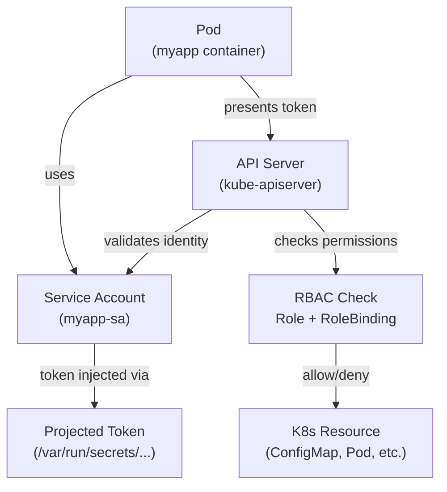

# Module 21 — Service Accounts

## The Story: Who Are You, and What Are You Allowed To Do?

Imagine a large office building with a strict security desk. Every person — employee, contractor, or delivery driver — must show an ID badge before entering or accessing any resources. The security desk checks your badge against a list of permissions: can you enter the server room? Can you access the HR database? Can you even get past the front door?

Kubernetes works exactly the same way. Every request to the API server — whether it comes from a human using `kubectl`, or from a Pod running inside the cluster — must carry an identity. That identity is checked against RBAC rules to determine what it's allowed to do.

Kubernetes has two categories of identities:

**User Accounts** — for humans. A developer running `kubectl apply`. A CI/CD pipeline calling the API. These identities are managed externally (certificates, OIDC, LDAP) — Kubernetes does not store user accounts itself.

**Service Accounts** — for processes inside the cluster. A Pod that needs to call the API server. An operator controller that watches for CRDs. Prometheus scraping metrics. These are Kubernetes-native objects, stored in etcd.

This module is about Service Accounts — the identity system for workloads.

---

## The Default Service Account Problem

Every Namespace gets a `default` Service Account automatically. And here is the dangerous default behavior: **every Pod gets the `default` Service Account token auto-mounted inside it**, at `/var/run/secrets/kubernetes.io/serviceaccount/token`.

What does this mean? Every pod, unless you say otherwise, has a credential inside it that can talk to the API server. If that pod is compromised, the attacker has an API token.

Now, the `default` Service Account has no special permissions by default — but in some cluster setups, overly permissive ClusterRoleBindings grant it broad access. Even if it only has read access to certain resources, that's still information an attacker can use.

The golden rule: **create a dedicated Service Account for each application, grant it only the permissions it needs, and disable auto-mounting on all pods that don't need API access.**

---

## How Service Account Tokens Work

### Old Way: Long-Lived Secrets (Pre-1.21)

Before Kubernetes 1.21, when you created a Service Account, Kubernetes automatically created a Secret containing a long-lived JWT token. This token:
- Never expired (unless you deleted the Secret)
- Was stored in etcd as a Secret
- Was bound to the Service Account but not to any specific Pod

This was a security problem — leaked tokens stayed valid forever.

### New Way: Projected Volumes and Short-Lived Tokens (1.21+)

Since Kubernetes 1.21, the default token is a **projected volume token** — a short-lived JWT that:
- Expires after a configurable duration (default: 1 hour)
- Is automatically rotated by the kubelet
- Is bound to the specific Pod (audience, expiry, Pod UID)
- Is not stored as a Secret in etcd

The kubelet handles the rotation transparently. Your application reads the same file path and always gets a valid token (the kubelet refreshes it before expiry).

If you still need a long-lived token (for external services, scripts), you can explicitly create one:

```yaml
apiVersion: v1
kind: Secret
metadata:
  name: myapp-sa-token
  annotations:
    kubernetes.io/service-account.name: myapp-sa
type: kubernetes.io/service-account-token
```

But prefer the projected volume approach whenever possible.

---

## Creating and Using Service Accounts

### Step 1: Create the Service Account

```yaml
apiVersion: v1
kind: ServiceAccount
metadata:
  name: myapp-sa
  namespace: production
```

### Step 2: Create a Role (what it can do)

```yaml
apiVersion: rbac.authorization.k8s.io/v1
kind: Role
metadata:
  name: myapp-role
  namespace: production
rules:
- apiGroups: [""]
  resources: ["configmaps"]
  verbs: ["get", "list"]
- apiGroups: [""]
  resources: ["pods"]
  verbs: ["get", "list", "watch"]
```

### Step 3: Bind the Role to the Service Account

```yaml
apiVersion: rbac.authorization.k8s.io/v1
kind: RoleBinding
metadata:
  name: myapp-rolebinding
  namespace: production
subjects:
- kind: ServiceAccount
  name: myapp-sa
  namespace: production
roleRef:
  kind: Role
  name: myapp-role
  apiGroup: rbac.authorization.k8s.io
```

### Step 4: Use the Service Account in a Pod

```yaml
apiVersion: v1
kind: Pod
metadata:
  name: myapp
  namespace: production
spec:
  serviceAccountName: myapp-sa   # <-- use dedicated SA
  containers:
  - name: app
    image: myapp:1.0
```

---

## Disabling Auto-Mount

For pods that absolutely do not need API access (most application pods), disable the auto-mount:

**On the Service Account level (applies to all pods using it):**
```yaml
apiVersion: v1
kind: ServiceAccount
metadata:
  name: myapp-sa
automountServiceAccountToken: false
```

**On the Pod level (overrides the SA setting):**
```yaml
spec:
  automountServiceAccountToken: false
```

Pods that don't need the API server token have a smaller attack surface. This is a security best practice.

---

## IRSA: IAM Roles for Service Accounts (AWS EKS)

On Amazon EKS, you can go further and link a Kubernetes Service Account to an AWS IAM Role. This allows pods to assume an AWS IAM role and call AWS APIs (S3, DynamoDB, SQS, etc.) — without storing AWS credentials as Secrets.

This is called **IRSA (IAM Roles for Service Accounts)**.

How it works:
1. EKS sets up an OIDC identity provider for the cluster
2. You create an IAM Role with a trust policy that allows the K8s Service Account to assume it
3. You annotate the Service Account with the IAM Role ARN
4. When the pod starts, the AWS SDK automatically picks up the projected token and exchanges it for temporary AWS credentials

```yaml
apiVersion: v1
kind: ServiceAccount
metadata:
  name: s3-reader-sa
  namespace: production
  annotations:
    eks.amazonaws.com/role-arn: arn:aws:iam::123456789012:role/MyS3ReaderRole
```

The pod code uses the normal AWS SDK — it just works, with no hardcoded credentials.

---

## Workload Identity (GKE)

Google Kubernetes Engine has an equivalent called **Workload Identity**. It links a Kubernetes Service Account to a Google Cloud Service Account (GSA), allowing pods to call Google Cloud APIs (GCS, BigQuery, Pub/Sub, etc.) without downloading service account key files.

```yaml
apiVersion: v1
kind: ServiceAccount
metadata:
  name: gcs-reader-sa
  namespace: production
  annotations:
    iam.gke.io/gcp-service-account: gcs-reader@my-project.iam.gserviceaccount.com
```

You also need to bind the Kubernetes SA to the Google SA with a GCP IAM binding, but the concept is identical to IRSA: federated identity, no secrets stored in the cluster.

---

## The Flow: Pod to API Server



---

## Token Inspection

You can decode a Service Account token (it is a JWT) to inspect its contents:

```bash
# Get the token from inside a pod
cat /var/run/secrets/kubernetes.io/serviceaccount/token

# Decode the JWT (base64 decode the middle section)
kubectl exec -it mypod -- cat /var/run/secrets/kubernetes.io/serviceaccount/token | \
  cut -d'.' -f2 | base64 -d 2>/dev/null | python3 -m json.tool
```

The decoded token shows:
```json
{
  "iss": "https://kubernetes.default.svc",
  "sub": "system:serviceaccount:production:myapp-sa",
  "aud": ["https://kubernetes.default.svc"],
  "exp": 1710000000,
  "iat": 1709996400,
  "kubernetes.io": {
    "namespace": "production",
    "pod": {"name": "myapp-7d4f9b-xxx", "uid": "..."},
    "serviceaccount": {"name": "myapp-sa", "uid": "..."}
  }
}
```

The `sub` field is the identity string used in RBAC.

---

## Service Account Best Practices Summary

| Practice | Why |
|---|---|
| Create one SA per application | Least privilege; breach of one app doesn't affect others |
| `automountServiceAccountToken: false` on pods without API needs | Reduces attack surface |
| Never rely on the `default` SA for anything | No control over what else is using it |
| Use IRSA / Workload Identity for cloud API access | No static credentials stored as Secrets |
| Grant only the minimum required verbs/resources | Limit blast radius of a compromised token |
| Audit SA permissions regularly | Permissions accumulate over time |
| Use short-lived projected tokens (1.21+) | Reduces window of token misuse if leaked |

---

## Common Commands

```bash
# List service accounts
kubectl get serviceaccounts -n production

# Describe a service account
kubectl describe serviceaccount myapp-sa -n production

# Create a service account imperatively
kubectl create serviceaccount myapp-sa -n production

# Check what permissions an SA has (via auth can-i)
kubectl auth can-i list pods \
  --as=system:serviceaccount:production:myapp-sa \
  -n production

# Get a token for a service account (temporary, for debugging)
kubectl create token myapp-sa -n production

# Create a token with custom expiry
kubectl create token myapp-sa --duration=8h -n production
```

---

## 📂 Navigation

| | Link |
|---|---|
| Previous | [20 — Network Policies](../20_Network_Policies/Theory.md) |
| Cheatsheet | [Service Accounts Cheatsheet](./Cheatsheet.md) |
| Interview Q&A | [Service Accounts Interview Q&A](./Interview_QA.md) |
| Next | [22 — Monitoring and Logging](../22_Monitoring_and_Logging/Theory.md) |
