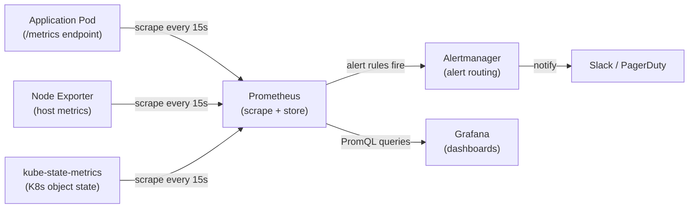
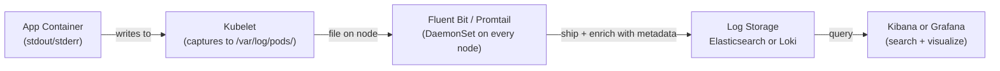

# Module 22 — Monitoring and Logging

## The Story: You Can't Fix What You Can't See

Imagine running a fleet of cargo ships across the ocean with no radio, no GPS, and no weather sensors. You know ships left port and you hope they arrive — but if something goes wrong halfway across, you have no idea until the cargo doesn't show up.

That was the state of software before modern observability. Applications ran, and you hoped they worked. When they didn't, you were left guessing.

Kubernetes changes the game — but only if you set up the right tools. The platform itself generates a firehose of data: CPU and memory per pod, HTTP request rates, error counts, pod restarts, node pressure events, application logs from every container. The challenge is capturing it, storing it, and making sense of it — fast enough to act on it.

> **🐳 Coming from Docker?**
>
> With Docker, you check logs with `docker logs mycontainer` — one container at a time. For monitoring, you'd install something like Portainer or use `docker stats`. In Kubernetes, with potentially thousands of containers spread across dozens of nodes, you need cluster-wide solutions. Prometheus scrapes metrics from all pods automatically. Grafana visualizes them. Loki or the EFK stack (Elasticsearch-Fluentd-Kibana) aggregates logs from every container into one searchable system. What was a simple `docker logs` command becomes a full observability platform — but one that actually scales.

This module covers two fundamental pillars of observability:

1. **Metrics** — numerical time-series data: request rate, error rate, latency, CPU usage
2. **Logs** — text events emitted by your applications and Kubernetes components

And we'll briefly touch on the third pillar: **Traces** — following a request through multiple services.

---

## 📌 Learning Priority

**Must Learn** — core concepts, needed to understand the rest of this file:
[Four Golden Signals](#the-four-golden-signals) · [Prometheus and Grafana](#metrics-stack-prometheus--grafana--alertmanager) · [Logging Stack](#logging-stack)

**Should Learn** — important for real projects and interviews:
[Loki vs EFK](#loki--promtail--grafana-lightweight-alternative) · [kubectl Log Commands](#kubectl-logging-commands)

**Good to Know** — useful in specific situations, not needed daily:
[Distributed Tracing](#distributed-tracing-opentelemetry-and-jaeger) · [kube-prometheus-stack Setup](#setting-up-kube-prometheus-stack-quick-start)

**Reference** — skim once, look up when needed:
[Observability Summary](#observability-summary)

---

## The Four Golden Signals

Before choosing any tool, understand what to measure. Google SRE defined the **four golden signals** — the most important metrics for any production system:

| Signal | Question it answers | Example metric |
|---|---|---|
| **Latency** | How long are requests taking? | p50, p95, p99 response time |
| **Traffic** | How much demand is there? | Requests per second |
| **Errors** | How often are requests failing? | HTTP 5xx error rate |
| **Saturation** | How full is the system? | CPU %, memory %, queue depth |

Design your dashboards around these four. If all four look healthy, your users are probably happy.

---

## Metrics Stack: Prometheus + Grafana + Alertmanager

This is the de facto standard metrics stack for Kubernetes.

### Prometheus

Prometheus is a time-series database that works by **scraping** — it calls HTTP endpoints (`/metrics`) on your apps and infrastructure components on a configurable interval (typically 15 seconds) and stores the result.

The `/metrics` endpoint returns data in Prometheus format:
```
# HELP http_requests_total Total HTTP requests
# TYPE http_requests_total counter
http_requests_total{method="GET",status="200"} 1234
http_requests_total{method="GET",status="500"} 7
```

Prometheus stores all of this as time-series data and makes it queryable via **PromQL** (Prometheus Query Language).

Example PromQL queries:
```promql
# Request rate per second over last 5 minutes
rate(http_requests_total[5m])

# Error rate percentage
rate(http_requests_total{status=~"5.."}[5m])
/ rate(http_requests_total[5m]) * 100

# 95th percentile latency
histogram_quantile(0.95, rate(http_request_duration_seconds_bucket[5m]))
```

### Prometheus Operator and kube-prometheus-stack

Manually configuring Prometheus to scrape everything in a dynamic Kubernetes cluster (pods come and go constantly) is painful. The **Prometheus Operator** solves this with two CRDs:

- **ServiceMonitor**: tells Prometheus to scrape a Service (and therefore its backing pods)
- **PodMonitor**: tells Prometheus to scrape pods directly

```yaml
apiVersion: monitoring.coreos.com/v1
kind: ServiceMonitor
metadata:
  name: myapp-monitor
spec:
  selector:
    matchLabels:
      app: myapp
  endpoints:
  - port: metrics
    interval: 15s
```

The **kube-prometheus-stack** Helm chart deploys everything at once: Prometheus, Grafana, Alertmanager, Node Exporter, and kube-state-metrics. It is the recommended starting point.

### Key Metrics Sources

| Component | What it measures |
|---|---|
| **Node Exporter** | Host-level: CPU, memory, disk, network per node |
| **kube-state-metrics** | K8s object state: deployment replica counts, pod phases, job success/failure |
| **cAdvisor** (built into kubelet) | Container-level CPU, memory, network per pod |
| **Your application** | Business metrics: request counts, error rates, queue depths |

### Grafana

Grafana is the visualization layer — it queries Prometheus (or other datasources) and renders dashboards. Pre-built dashboards exist for:
- Kubernetes cluster overview
- Node metrics
- Pod metrics
- Namespace resource usage
- Your own apps (via custom dashboards)

### Alertmanager

Alertmanager receives alerts fired by Prometheus rules and routes them to destinations: Slack, PagerDuty, email, OpsGenie.

```yaml
# Prometheus alert rule
groups:
- name: myapp
  rules:
  - alert: HighErrorRate
    expr: rate(http_requests_total{status=~"5.."}[5m]) > 0.05
    for: 2m
    labels:
      severity: warning
    annotations:
      summary: "High error rate on {{ $labels.service }}"
```

---

## Metrics Pipeline Diagram



---

## Logging Stack

Kubernetes does not store logs permanently. The kubelet keeps recent logs on the node filesystem, accessible via `kubectl logs`. But when a pod is deleted or a node fails, those logs are gone.

For production, you need a **centralized logging system** that collects logs from all pods, ships them to a storage backend, and makes them searchable.

### The Standard: Write to stdout/stderr

Kubernetes logging best practice is simple: **write logs to stdout and stderr**. Don't write to files inside the container. The kubelet captures stdout/stderr from every container and stores it at `/var/log/pods/` on the node.

A log collector (Fluentd, Fluent Bit, Promtail) runs as a DaemonSet on every node and reads these log files, adds metadata (pod name, namespace, labels), and ships them to your log storage.

### EFK Stack: Elasticsearch + Fluentd/Fluent Bit + Kibana

The traditional choice for centralized logging:
- **Elasticsearch**: stores and indexes logs (powerful search, complex to operate)
- **Fluentd / Fluent Bit**: log collector DaemonSet (Fluent Bit is lighter, preferred for K8s)
- **Kibana**: web UI for searching and visualizing logs

EFK is powerful but resource-heavy. Elasticsearch clusters require careful capacity planning.

### Loki + Promtail + Grafana (Lightweight Alternative)

Grafana Labs' **Loki** is designed specifically for Kubernetes:
- **Loki**: stores logs by label (not full-text indexed) — much cheaper to run than Elasticsearch
- **Promtail**: log collector DaemonSet (similar role to Fluentd)
- **Grafana**: the same dashboard tool you already use for metrics — now also for logs

Loki's key insight: you query logs like you query Prometheus metrics (LogQL, similar to PromQL). And because you're already running Grafana for metrics, you get unified dashboards — metrics and logs side by side.

```
# LogQL example: show error logs from the myapp pod in production
{namespace="production", app="myapp"} |= "ERROR"

# Show log rate
rate({namespace="production", app="myapp"}[5m])
```

The tradeoff: Loki doesn't full-text index, so wildcard searches across log content are slower than Elasticsearch. For most teams, this is acceptable.

---

## Logging Pipeline Diagram



---

## kubectl Logging Commands

```bash
# Stream logs from a running pod
kubectl logs -f mypod -n production

# Show last 100 lines
kubectl logs --tail=100 mypod -n production

# Logs from a previous container restart (after crash)
kubectl logs --previous mypod -n production

# Logs from all containers in a pod (multi-container pod)
kubectl logs --all-containers=true mypod -n production

# Logs from all pods matching a label selector
kubectl logs -f -l app=myapp -n production --all-containers=true

# Logs since a timestamp
kubectl logs mypod --since=1h -n production
kubectl logs mypod --since-time="2024-01-15T10:00:00Z" -n production
```

---

## Distributed Tracing: OpenTelemetry and Jaeger

Metrics tell you something is broken. Logs tell you what the error message was. **Traces** tell you the journey a specific request took through your system.

In a microservices architecture, a single user request might touch 5–10 services. When the request is slow, which service caused it? Distributed tracing answers this by injecting trace IDs into requests and collecting timing data at each service hop.

**OpenTelemetry** is the open standard for instrumentation — SDKs for every major language that emit traces, metrics, and logs in a standard format.

**Jaeger** (and **Tempo** from Grafana Labs) are popular backends for storing and visualizing traces.

A trace looks like:
```
Request ID: abc-123
└── frontend (12ms)
    └── user-service (8ms)
    └── product-service (45ms)   ← this is the slow one
        └── database-query (40ms)
```

Tracing requires application-level instrumentation — your code must emit spans. This is a bigger investment than metrics/logging but essential for diagnosing latency in complex systems.

---

## Setting Up kube-prometheus-stack (Quick Start)

```bash
# Add the Helm repo
helm repo add prometheus-community https://prometheus-community.github.io/helm-charts
helm repo update

# Install the full monitoring stack
helm install kube-prometheus-stack \
  prometheus-community/kube-prometheus-stack \
  --namespace monitoring \
  --create-namespace

# Access Grafana UI (default creds: admin/prom-operator)
kubectl port-forward svc/kube-prometheus-stack-grafana \
  3000:80 -n monitoring

# Access Prometheus UI
kubectl port-forward svc/kube-prometheus-stack-prometheus \
  9090:9090 -n monitoring
```

---

## Observability Summary

| Pillar | Tool(s) | What it answers |
|---|---|---|
| Metrics | Prometheus + Grafana | Is the system healthy right now? What are the trends? |
| Logs | Loki + Grafana or EFK | What exactly happened? What did the error say? |
| Traces | OpenTelemetry + Jaeger/Tempo | Which service in this chain is slow? |

Production recommendation: start with Prometheus + Grafana for metrics, add Loki for logs. Tracing comes last — it requires app instrumentation.


---

## 📝 Practice Questions

- 📝 [Q50 · monitoring-logging](../kubernetes_practice_questions_100.md#q50--normal--monitoring-logging)


---

## 📂 Navigation

| | Link |
|---|---|
| Previous | [21 — Service Accounts](../21_Service_Accounts/Theory.md) |
| Cheatsheet | [Monitoring and Logging Cheatsheet](./Cheatsheet.md) |
| Interview Q&A | [Monitoring and Logging Interview Q&A](./Interview_QA.md) |
| Next | [23 — Security](../23_Security/Theory.md) |
