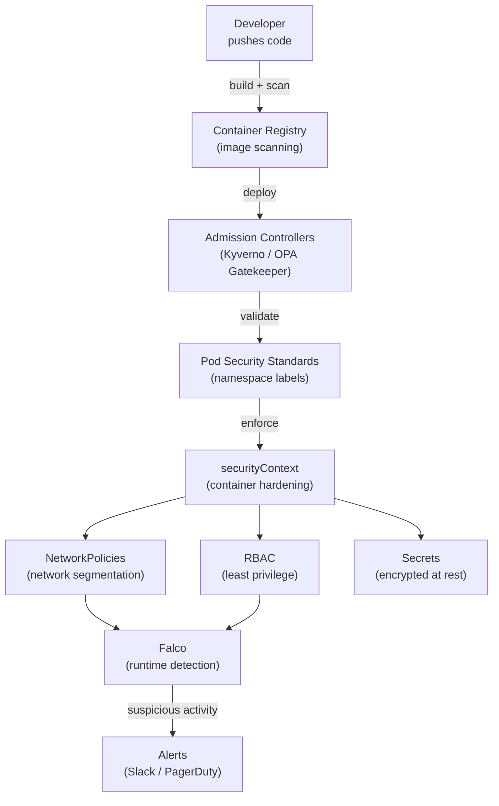

# Module 23 — Kubernetes Security

## The Story: Defense in Depth

Imagine a medieval castle. It didn't rely on a single wall for protection. It had a moat, an outer wall, an inner wall, a keep, and guards at every gate who checked credentials. Even if attackers breached the outer wall, they still faced five more layers of defense.

Kubernetes security works the same way. There is no single security feature you can turn on that makes a cluster "secure." Instead, you layer multiple controls, each of which limits what an attacker can do if they compromise one component.

This is called **defense in depth**. And in Kubernetes, it means:
- Limiting what processes can do inside containers (securityContext)
- Controlling what images can run (admission controllers, image policies)
- Encrypting sensitive data (Secrets encryption at rest)
- Restricting network communication (NetworkPolicies)
- Detecting threats at runtime (Falco)
- Enforcing organization-wide policies (OPA/Gatekeeper, Kyverno)

> **🐳 Coming from Docker?**
>
> Docker security is mainly about the image and runtime: non-root users, read-only filesystems, dropping capabilities with `--cap-drop`, scanning images with Scout or Trivy. Kubernetes security adds entire new layers: Pod Security Standards (cluster-level policies restricting what pods can do), Admission Controllers (gatekeepers that validate every API request before it's accepted), RBAC (who can do what), NetworkPolicies (what can talk to what), and Secrets encryption at rest. Security in Kubernetes is a layered system — each layer assumes the previous one can be bypassed, so multiple controls work together.

Let's build the castle, layer by layer.

---

## Layer 1: Pod Security Standards

For years, Kubernetes had **Pod Security Policies (PSP)** — a way to restrict what pods could do. PSPs were powerful but notoriously complex and confusing. They were deprecated in K8s 1.21 and removed in 1.25.

Their replacement is **Pod Security Standards (PSS)** — simpler, built into the admission controller, applied at the namespace level using labels.

Three policy levels:

| Level | Description | Use for |
|---|---|---|
| **Privileged** | No restrictions | System components (CNI, CSI, monitoring agents) |
| **Baseline** | Prevents known privilege escalations | Most workloads — good default |
| **Restricted** | Hardened, follows current best practices | Security-sensitive apps, production |

Apply to a namespace:
```yaml
apiVersion: v1
kind: Namespace
metadata:
  name: production
  labels:
    pod-security.kubernetes.io/enforce: restricted
    pod-security.kubernetes.io/audit: restricted
    pod-security.kubernetes.io/warn: restricted
```

Three modes:
- `enforce`: reject pods that violate the policy
- `audit`: log violations but allow the pod
- `warn`: warn in kubectl output but allow the pod

Use `audit` and `warn` first to understand the impact before enforcing.

---

## Layer 2: securityContext — Container-Level Hardening

The `securityContext` field lets you configure security settings for a pod or individual container.

### Container-Level Settings

```yaml
spec:
  containers:
  - name: app
    securityContext:
      runAsNonRoot: true           # refuse to run as root
      runAsUser: 1000              # run as UID 1000
      runAsGroup: 3000             # run as GID 3000
      readOnlyRootFilesystem: true # container filesystem is read-only
      allowPrivilegeEscalation: false  # cannot gain more privileges
      capabilities:
        drop:
        - ALL                      # drop all Linux capabilities
        add:
        - NET_BIND_SERVICE         # only add back what's needed
```

### Pod-Level Settings

```yaml
spec:
  securityContext:
    runAsNonRoot: true
    runAsUser: 1000
    fsGroup: 2000        # volume ownership for mounted volumes
    seccompProfile:
      type: RuntimeDefault  # enable default seccomp profile
```

### What Each Setting Does

| Setting | Threat it mitigates |
|---|---|
| `runAsNonRoot: true` | Prevents container processes from running as UID 0 |
| `readOnlyRootFilesystem: true` | Attacker cannot write malware to the container filesystem |
| `allowPrivilegeEscalation: false` | Prevents `sudo`-style privilege escalation inside the container |
| `capabilities: drop: ALL` | Removes Linux capabilities (raw network access, kernel modules, etc.) |
| `seccompProfile: RuntimeDefault` | Enables syscall filtering — blocks many kernel exploits |

---

## Layer 3: Image Security

Your container images are the delivery mechanism for your application — and for attackers if you're not careful.

### Principles

**Never use `:latest` in production.** Latest is a moving target — you don't know what you're deploying. Use immutable tags (SHA digests or semantic versions):
```yaml
image: myapp:1.4.2                                    # semantic version
image: myapp@sha256:abc123...                         # immutable digest
```

**Scan images before deploy.** Use tools like:
- **Trivy** — fast, open source, CLI and CI integration
- **Grype** — Anchore's scanner
- **Snyk** — commercial with IDE integration
- **AWS ECR / GCR / Docker Hub** — built-in scanning

```bash
# Scan an image with Trivy
trivy image myapp:1.4.2
trivy image --severity HIGH,CRITICAL myapp:1.4.2
```

**Use minimal base images.** `distroless` and `scratch` images have no shell, no package manager, no utilities for an attacker to use. If there's nothing to use, there's less to exploit.

**Set imagePullPolicy:**
```yaml
imagePullPolicy: Always    # always pull from registry (ensures no stale cached images)
```

---

## Layer 4: Admission Controllers

Admission controllers are plugins that intercept API server requests and can validate or modify them before resources are created/updated.

Two types:
- **Validating**: examine the request and either allow or reject it
- **Mutating**: modify the request (e.g., inject a sidecar, add default resource limits)

Built-in admission controllers include:
- `LimitRanger` — enforces default resource limits
- `ResourceQuota` — enforces namespace quotas
- `PodSecurity` — enforces Pod Security Standards

### OPA/Gatekeeper

**Open Policy Agent (OPA)** with **Gatekeeper** is a policy-as-code system for Kubernetes. You write policies in **Rego** (OPA's policy language) and define `ConstraintTemplate` CRDs.

Example: require all containers to have resource limits:
```yaml
apiVersion: constraints.gatekeeper.sh/v1beta1
kind: K8sRequiredResources
metadata:
  name: require-resource-limits
spec:
  match:
    kinds:
    - apiGroups: [""]
      kinds: ["Pod"]
```

### Kyverno

**Kyverno** is a Kubernetes-native alternative to OPA/Gatekeeper. Policies are written in YAML (no Rego required), making them more accessible.

```yaml
apiVersion: kyverno.io/v1
kind: ClusterPolicy
metadata:
  name: require-non-root
spec:
  rules:
  - name: check-runAsNonRoot
    match:
      resources:
        kinds: ["Pod"]
    validate:
      message: "Containers must not run as root"
      pattern:
        spec:
          containers:
          - securityContext:
              runAsNonRoot: true
```

Kyverno can also mutate (auto-add labels, inject sidecars) and generate resources (auto-create NetworkPolicies for new namespaces).

---

## Layer 5: Secrets Encryption at Rest

By default, Kubernetes Secrets are stored as base64-encoded strings in etcd — **not encrypted**. Anyone who can read etcd can read your Secrets.

Enable encryption at rest by configuring the API server with an `EncryptionConfiguration`:

```yaml
apiVersion: apiserver.config.k8s.io/v1
kind: EncryptionConfiguration
resources:
- resources:
  - secrets
  providers:
  - aescbc:
      keys:
      - name: key1
        secret: <base64-encoded-32-byte-key>
  - identity: {}    # fallback for reading unencrypted data
```

Better: use a **KMS provider** (AWS KMS, GCP KMS, Azure Key Vault) so the encryption key itself is managed by a dedicated key management service, not stored on the cluster.

Even with encryption at rest, consider external secret stores:
- **External Secrets Operator**: syncs secrets from AWS Secrets Manager, GCP Secret Manager, Vault into K8s Secrets
- **HashiCorp Vault**: full secret lifecycle management, dynamic credentials

---

## Layer 6: Runtime Security with Falco

All the previous controls are **preventive** — they stop bad things from happening. But what if something slips through? You need **detection**.

**Falco** (CNCF project) is a runtime security tool that monitors system calls from containers and alerts on suspicious behavior:

- A container spawned a shell (`/bin/bash`)
- A process opened a sensitive file (`/etc/shadow`, `/etc/kubernetes/admin.conf`)
- A process made an unexpected network connection
- A container was attached to interactively (`kubectl exec`)

Falco rules look like:
```yaml
- rule: Terminal shell in container
  desc: A shell was opened in a container
  condition: >
    spawned_process and container
    and shell_procs and proc.tty != 0
  output: >
    Shell opened (user=%user.name container=%container.name
    image=%container.image)
  priority: WARNING
```

Falco runs as a DaemonSet and alerts via syslog, Slack, Falcosidekick, or any webhook.

---

## Security Checklist

```
Container Security:
[ ] runAsNonRoot: true on all containers
[ ] readOnlyRootFilesystem: true where possible
[ ] allowPrivilegeEscalation: false on all containers
[ ] capabilities: drop: ALL, add only what's needed
[ ] No privileged: true unless absolutely required
[ ] seccompProfile: RuntimeDefault enabled

Image Security:
[ ] No :latest tags in production
[ ] Images scanned in CI before push
[ ] Minimal base images (distroless preferred)
[ ] imagePullPolicy: Always for non-digest tags

Cluster Configuration:
[ ] Pod Security Standards enforced (baseline minimum, restricted preferred)
[ ] Secrets encrypted at rest
[ ] RBAC: least privilege, no cluster-admin for apps
[ ] automountServiceAccountToken: false where not needed
[ ] NetworkPolicies applied to all namespaces
[ ] Admission controller policies (Kyverno or OPA)

Operations:
[ ] Runtime security monitoring (Falco)
[ ] Audit logging enabled on API server
[ ] Image registry scanning enabled
[ ] Regular permission audits
```

---

## Security Architecture Diagram



---

## 📂 Navigation

| | Link |
|---|---|
| Previous | [22 — Monitoring and Logging](../22_Monitoring_and_Logging/Theory.md) |
| Cheatsheet | [Security Cheatsheet](./Cheatsheet.md) |
| Interview Q&A | [Security Interview Q&A](./Interview_QA.md) |
| Next | [24 — Service Mesh](../24_Service_Mesh/Theory.md) |
