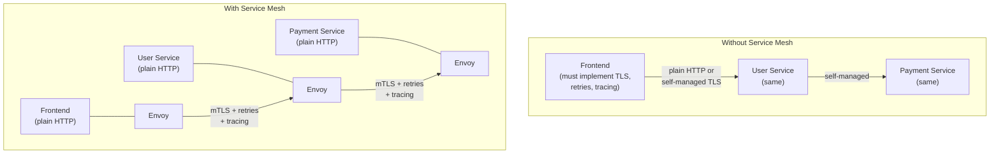

# Module 24 — Service Mesh

## The Story: The Problem Every Service Solves Twice

Picture a startup with three microservices: a frontend, a user service, and a payment service. Simple enough.

Now the team gets a security requirement: all communication between services must be encrypted (mTLS). The backend developer encrypts frontend ↔ user-service. Done.

Next, the reliability team asks for automatic retries on transient failures. The developer adds retry logic to the payment service client code.

Then the product team asks: can we do A/B testing by routing 10% of traffic to a new payment service version? The developer builds a custom routing layer.

Then operations wants distributed tracing across all services. Each service needs to be updated to propagate trace headers.

Now multiply this by 20 services. And 100 services. Every team implements the same networking concerns in different languages, with different bug rates, at different times.

**A service mesh solves this by moving all of that infrastructure logic out of application code and into the network layer itself** — specifically, into a sidecar proxy running alongside every pod.

> **🐳 Coming from Docker?**
>
> In Docker Compose, inter-container communication is plain HTTP or TCP with no encryption, no retries, and no visibility into what's happening at the network level. You'd have to add these features to every application manually. A service mesh adds them at the infrastructure level — every pod gets a sidecar proxy (Envoy for Istio, the same for Linkerd) that intercepts all network traffic. This proxy handles mTLS encryption, circuit breaking, retries, timeouts, and traffic metrics — without changing a single line of application code. It's the difference between configuring reliability features in your app vs having the network provide them automatically.

---

## What Is a Service Mesh?

A service mesh is an infrastructure layer that handles service-to-service communication. Instead of your application code implementing mTLS, retries, circuit breaking, and tracing, the mesh does it transparently.

The core pattern is the **sidecar proxy**: every pod gets an additional container (usually Envoy) injected automatically. All network traffic flows through this proxy rather than directly between application containers. The proxy is controlled by a central control plane.

```
Without mesh:
App A ─────────────────────────────────────────→ App B
       (App code handles: TLS, retries, auth)

With mesh:
App A → Envoy Sidecar ──(mTLS, retries, tracing)──→ Envoy Sidecar → App B
         (App code is clean — just HTTP)
```

Your application thinks it's making a plain HTTP call to `http://payment-service`. The sidecar intercepts, encrypts with mTLS, adds trace headers, applies retry policy, and forwards to the destination sidecar, which decrypts and passes it to the payment app. All transparent.

---

## Architecture: With and Without a Mesh



---

## Istio: The Feature-Rich Option

**Istio** is the most widely deployed service mesh. It has two main components:

### Control Plane: Istiod
The brain of the mesh. Istiod handles:
- **Pilot**: distributes configuration to all Envoy sidecars (routing rules, load balancing policies)
- **Citadel**: certificate authority — issues mTLS certificates to all services
- **Galley**: configuration validation and distribution

### Data Plane: Envoy Sidecars
The workers of the mesh. An Envoy proxy is injected into every pod (via a mutating admission webhook). All inbound and outbound traffic for the pod passes through this proxy.

### Key Istio Features

**1. mTLS (Mutual TLS)**
Every service-to-service connection is encrypted and both sides authenticate each other using certificates issued by Istiod. No code changes required. Enable with:
```yaml
apiVersion: security.istio.io/v1beta1
kind: PeerAuthentication
metadata:
  name: default
  namespace: production
spec:
  mtls:
    mode: STRICT   # only allow mTLS connections
```

**2. Traffic Splitting (Canary Deployments)**
Route 90% of traffic to stable, 10% to canary — at the mesh level:
```yaml
apiVersion: networking.istio.io/v1beta1
kind: VirtualService
metadata:
  name: payment-service
spec:
  hosts:
  - payment-service
  http:
  - route:
    - destination:
        host: payment-service
        subset: stable
      weight: 90
    - destination:
        host: payment-service
        subset: canary
      weight: 10
```

**3. Circuit Breaking**
Stop sending requests to a service that's failing, give it time to recover:
```yaml
apiVersion: networking.istio.io/v1beta1
kind: DestinationRule
metadata:
  name: payment-service
spec:
  host: payment-service
  trafficPolicy:
    outlierDetection:
      consecutive5xxErrors: 5
      interval: 30s
      baseEjectionTime: 30s
```

**4. Retries**
```yaml
http:
- retries:
    attempts: 3
    perTryTimeout: 2s
    retryOn: 5xx,reset,connect-failure
```

**5. Distributed Tracing**
Istio automatically generates trace spans for all service calls and sends them to Jaeger or Zipkin. You get a complete request trace without adding tracing code to your services (though propagating trace headers between services still requires minimal code).

**6. Observability**
Istio generates metrics for every service call: request rate, error rate, and latency — the golden signals — automatically, without app instrumentation. These integrate with Prometheus and Grafana via the Kiali dashboard.

---

## Linkerd: The Lightweight Alternative

**Linkerd** (CNCF graduated) is a lighter-weight service mesh focused on simplicity and low overhead. Key differences from Istio:

- **Micro-proxy in Rust** instead of Envoy — dramatically lower CPU and memory overhead
- **Simpler feature set** — mTLS, observability, load balancing, retries — no advanced traffic management
- **Easier to install and operate** — fewer moving parts
- **Automatic mTLS** — enabled by default, no configuration required

When to use Linkerd over Istio:
- You primarily want mTLS and basic observability
- You're resource-constrained (smaller clusters)
- You want simpler operations
- You don't need advanced traffic management (weights, fault injection, header routing)

---

## Service Mesh Overhead

A service mesh is not free. The Envoy sidecar adds:

| Cost | Typical impact |
|---|---|
| Latency | ~1–5ms per hop (varies by feature set) |
| Memory per pod | 50–200MB extra (Envoy) |
| CPU per pod | 5–30m CPU extra |
| Operational complexity | New CRDs, new debugging surface, new expertise needed |

For most production systems at scale, these costs are worth the benefits. For a 3-service startup with simple requirements, a service mesh might be overkill.

---

## When You Need a Mesh vs When It's Overkill

**Use a service mesh when:**
- You have many microservices and need consistent mTLS across all
- You need traffic splitting for safe deployments (canary, blue/green at mesh level)
- You need zero-code observability across all services
- Compliance requires encryption in transit between services
- You need circuit breaking and retries without code changes

**Skip the mesh when:**
- You have fewer than ~5 services
- A single monolith or simple 2-tier app
- Your team doesn't have bandwidth to learn mesh concepts
- Resource constraints make the overhead unacceptable
- You can solve your specific problem more simply (e.g., Ingress annotations for retries)

---

## Installing Istio

```bash
# Install Istio CLI
curl -L https://istio.io/downloadIstio | sh -
export PATH=$PWD/istio-*/bin:$PATH

# Install Istio on cluster (minimal profile)
istioctl install --set profile=demo -y

# Enable automatic sidecar injection for a namespace
kubectl label namespace production istio-injection=enabled

# Verify installation
istioctl verify-install

# Check sidecar injection status
kubectl get pods -n production   # pods should show 2/2 containers
```

---

## 📂 Navigation

| | Link |
|---|---|
| Previous | [23 — Security](../23_Security/Theory.md) |
| Cheatsheet | [Service Mesh Cheatsheet](./Cheatsheet.md) |
| Interview Q&A | [Service Mesh Interview Q&A](./Interview_QA.md) |
| Next | [25 — GitOps and CI/CD](../25_GitOps_and_CICD/Theory.md) |
