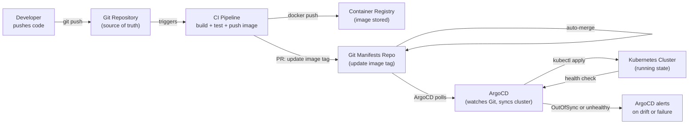

# Module 25 — GitOps and CI/CD

## The Story: The Problem with "Works on My Machine"

It's 3am. An alert fires — the payment service is down in production. You SSH into the cluster, run a few `kubectl apply` commands to patch things, and the service comes back up. Crisis averted.

Three days later, a colleague redeploys the payment service for an unrelated reason, and it goes down again. The patch you applied manually at 3am is gone — overwritten by the next deployment. Nobody knew it was there.

This is the problem with imperative cluster management: **the cluster becomes a snowflake**. What's actually running diverges from what anyone thinks is running. The cluster holds institutional knowledge that exists nowhere else.

**GitOps solves this by making Git the single source of truth for everything in the cluster.** If it's not in Git, it doesn't exist. The cluster should always match what Git says, and if it doesn't, that is automatically detected and corrected.

The 3am patch? Now you must commit it to Git (even in a hotfix branch), and it travels through the same review and deployment process as everything else. The change is recorded, reviewable, and permanent.

> **🐳 Coming from Docker?**
>
> A typical Docker CI/CD pipeline builds an image, pushes it to a registry, then SSHes into a server and runs `docker pull && docker restart`. It works, but the deployment step is imperative and stateful — there's no record of what's running, no easy rollback, and no diff between what's declared and what's actually running. GitOps flips this model: your Kubernetes manifests live in Git, and a tool (ArgoCD or Flux) continuously syncs the cluster to match Git. A deployment is just a Git commit. Rollback is `git revert`. Drift detection catches anything changed outside of Git. The Git repo becomes the single source of truth for your entire cluster state.

---

## 📌 Learning Priority

**Must Learn** — core concepts, needed to understand the rest of this file:
[GitOps Principles](#the-gitops-principles) · [Push vs Pull CI/CD](#push-based-vs-pull-based) · [ArgoCD Basics](#argocd-gitops-controller)

**Should Learn** — important for real projects and interviews:
[Secrets in GitOps](#secrets-in-gitops) · [Flux Alternative](#flux-the-cncf-alternative)

**Good to Know** — useful in specific situations, not needed daily:
[ApplicationSet Multi-Env](#argocd-applicationset-multi-cluster--multi-env) · [Environment Strategy](#environment-strategy-branches-vs-directories-vs-repos)

**Reference** — skim once, look up when needed:
[Full Pipeline Example](#cicd--gitops-full-pipeline)

---

## The GitOps Principles

1. **Declarative**: the entire desired system state is described declaratively (Kubernetes YAML)
2. **Versioned and immutable**: the desired state is stored in Git (version history, rollback, audit trail)
3. **Pulled automatically**: software agents (ArgoCD, Flux) automatically apply the desired state
4. **Continuously reconciled**: the agents continuously compare actual vs desired state and correct drift

---

## Push-Based vs Pull-Based

### Push-Based CI/CD (Traditional)

```
Developer → Git push → CI Pipeline → kubectl apply → Cluster
```

The CI/CD pipeline (GitHub Actions, Jenkins, GitLab CI) has cluster credentials and runs `kubectl apply` directly. The pipeline pushes changes to the cluster.

Downside: the pipeline has broad cluster access. If the pipeline is compromised, an attacker can deploy anything. Also: the pipeline only runs when code changes — if someone manually modifies the cluster, the drift is not detected until the next deployment.

### Pull-Based GitOps

```
Developer → Git push → GitOps Agent (in cluster) polls Git → applies changes
```

An agent running *inside* the cluster watches a Git repository. When it detects a difference between Git state and cluster state, it applies the changes. The pipeline never has cluster credentials — it only pushes to Git.

This is more secure (cluster credentials never leave the cluster) and enables drift detection (the agent continuously reconciles, not just on code changes).

---

## ArgoCD: GitOps Controller

ArgoCD is a declarative, GitOps continuous delivery tool for Kubernetes. It runs inside the cluster and watches Git repositories.

### Core Concepts

**Application**: an ArgoCD object that connects a Git source to a K8s destination:
```yaml
apiVersion: argoproj.io/v1alpha1
kind: Application
metadata:
  name: myapp
  namespace: argocd
spec:
  project: default
  source:
    repoURL: https://github.com/myorg/myapp-k8s
    targetRevision: main
    path: manifests/production
  destination:
    server: https://kubernetes.default.svc
    namespace: production
  syncPolicy:
    automated:
      prune: true       # delete resources removed from Git
      selfHeal: true    # correct manual changes to cluster
```

**Sync**: the act of making the cluster match Git state. Can be manual or automatic (`syncPolicy.automated`).

**Health**: ArgoCD tracks health status (Healthy, Degraded, Progressing, Suspended, Missing) for every resource.

**Drift detection**: ArgoCD continuously compares Git state vs live cluster state. When they diverge, it marks the app as `OutOfSync` and either alerts or auto-syncs depending on configuration.

---

## GitOps Feedback Loop



---

## Flux: The CNCF Alternative

**Flux** is another GitOps operator for Kubernetes, a CNCF graduated project. Key differences from ArgoCD:

- **CLI-first** vs ArgoCD's UI-first approach
- **Modular**: separate controllers for Git sources, Helm releases, image automation, notifications
- **ImageAutomation controller**: can automatically update the image tag in Git when a new image is pushed to the registry — fully automated GitOps without manual PR updates
- **Helm controller**: native support for managing Helm releases as GitOps resources (`HelmRelease` CRD)

```yaml
# Flux HelmRelease
apiVersion: helm.toolkit.fluxcd.io/v2beta1
kind: HelmRelease
metadata:
  name: myapp
  namespace: production
spec:
  interval: 5m
  chart:
    spec:
      chart: myapp
      version: '>=1.0.0 <2.0.0'
      sourceRef:
        kind: HelmRepository
        name: myapp-charts
  values:
    replicaCount: 3
    image:
      tag: 1.4.2
```

---

## ArgoCD ApplicationSet: Multi-Cluster / Multi-Env

ApplicationSet is an ArgoCD CRD for generating multiple Applications from a template. Essential for managing many environments or clusters.

```yaml
apiVersion: argoproj.io/v1alpha1
kind: ApplicationSet
metadata:
  name: myapp-environments
spec:
  generators:
  - list:
      elements:
      - env: staging
        cluster: staging-cluster
        namespace: staging
      - env: production
        cluster: production-cluster
        namespace: production
  template:
    metadata:
      name: 'myapp-{{env}}'
    spec:
      source:
        repoURL: https://github.com/myorg/myapp-k8s
        targetRevision: main
        path: 'environments/{{env}}'
      destination:
        server: '{{cluster}}'
        namespace: '{{namespace}}'
```

This creates one Application per environment, all from the same template.

---

## Secrets in GitOps

**Never store unencrypted secrets in Git.** But GitOps requires everything to be in Git. Solutions:

### Sealed Secrets
Encrypt secrets using a cluster-specific key (asymmetric encryption). The encrypted `SealedSecret` YAML is safe to commit to Git. The controller in the cluster decrypts it back into a regular Secret.

```bash
# Install kubeseal CLI
kubeseal --controller-name=sealed-secrets -o yaml \
  < secret.yaml > sealed-secret.yaml
# Commit sealed-secret.yaml to Git (safe)
```

### External Secrets Operator
Define a `ExternalSecret` resource in Git that references a secret in AWS Secrets Manager, GCP Secret Manager, or HashiCorp Vault. The operator syncs the actual secret value into a K8s Secret. The secret value never touches Git.

```yaml
apiVersion: external-secrets.io/v1beta1
kind: ExternalSecret
metadata:
  name: database-credentials
spec:
  secretStoreRef:
    name: aws-secrets-manager
    kind: SecretStore
  target:
    name: db-secret
  data:
  - secretKey: password
    remoteRef:
      key: production/db/password
```

---

## Environment Strategy: Branches vs Directories vs Repos

| Strategy | Structure | When to use |
|---|---|---|
| Branch per environment | `main` = prod, `staging` = staging | Small teams, few environments |
| Directory per environment | `/environments/staging/`, `/environments/prod/` | Recommended for most teams |
| Repo per environment | Separate Git repos | Strict access control needed |

**Recommended**: directory-per-environment in a single "gitops" repo. Promotes/diffs between environments are PR file copies, easy to see what changed. Base + overlay pattern with Kustomize works well here.

---

## CI/CD + GitOps Full Pipeline

```bash
# Step 1: Developer pushes code
git push origin feature/new-payment

# Step 2: CI pipeline (GitHub Actions) runs
# - Build Docker image
# - Run tests
# - docker build -t myapp:${GITHUB_SHA} .
# - docker push myapp:${GITHUB_SHA}

# Step 3: CI updates image tag in manifests repo
# - git clone gitops-repo
# - sed -i "s/image: myapp:.*/image: myapp:${GITHUB_SHA}/" deployment.yaml
# - git commit -m "Update myapp image to ${GITHUB_SHA}"
# - git push

# Step 4: ArgoCD detects change in Git
# Syncs new Deployment to cluster

# Step 5: ArgoCD monitors health
# If rollout fails → marks as Degraded → alerts
```


---

## 📝 Practice Questions

- 📝 [Q54 · gitops-cicd](../kubernetes_practice_questions_100.md#q54--normal--gitops-cicd)


---

🚀 **Apply this:** Build a CI/CD pipeline with GitOps → [Project 05 — CI/CD Build-Push-Deploy](../../05_Capstone_Projects/05_CICD_Build_Push_Deploy/01_MISSION.md)
## 📂 Navigation

| | Link |
|---|---|
| Previous | [24 — Service Mesh](../24_Service_Mesh/Theory.md) |
| Cheatsheet | [GitOps and CI/CD Cheatsheet](./Cheatsheet.md) |
| Interview Q&A | [GitOps and CI/CD Interview Q&A](./Interview_QA.md) |
| Next | [26 — Helm Charts](../26_Helm_Charts/Theory.md) |
