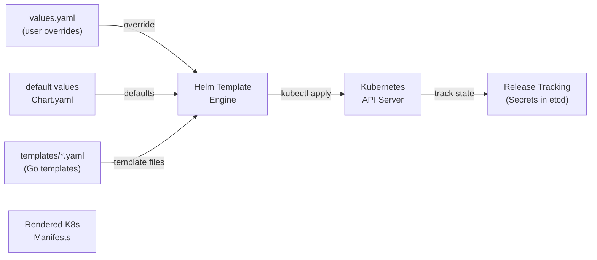

# Module 26 — Helm Charts

## The Story: The Package Manager for Kubernetes

Imagine you want to install Postgres on your Kubernetes cluster. Without Helm, you would need to create and apply: a Deployment, a Service, a ConfigMap for configuration, a Secret for credentials, a PersistentVolumeClaim for storage, a ServiceAccount, and maybe a NetworkPolicy. Seven files. And every time you want to deploy Postgres in a different namespace or with different settings, you'd manually copy, find-and-replace, and re-apply.

Now imagine you want to upgrade Postgres from 15 to 16. You need to track all the changes, apply them in the right order, and rollback if something goes wrong.

This is exactly the problem that package managers like `apt`, `brew`, and `npm` solve for system packages and code libraries. **Helm is the equivalent for Kubernetes applications.**

With Helm:
```bash
helm install my-postgres bitnami/postgresql \
  --set auth.postgresPassword=secret \
  --namespace databases
```

One command. Helm handles all the Kubernetes objects, injects your configuration, and tracks the release so you can upgrade or rollback.

> **🐳 Coming from Docker?**
>
> In Docker Compose, you might have different `docker-compose.yml` files for dev, staging, and prod — with lots of copy-pasted YAML and environment-specific overrides. There's no standard way to package a multi-service app for others to install. Helm is the Kubernetes package manager: a Chart bundles all the Kubernetes YAML for an app (Deployments, Services, Ingresses, ConfigMaps) into one installable unit with configurable values. Installing Prometheus becomes `helm install prometheus prometheus-community/prometheus` instead of applying 20 separate YAML files. Your own app can be packaged as a Chart so other teams can install it in any environment with one command and a values file.

---

## What Is a Helm Chart?

A Helm chart is a packaged collection of Kubernetes manifests with a template engine layered on top. It contains:

```
mychart/
├── Chart.yaml          ← chart metadata (name, version, description)
├── values.yaml         ← default configuration values
├── templates/          ← YAML templates with Go template syntax
│   ├── deployment.yaml
│   ├── service.yaml
│   ├── configmap.yaml
│   ├── _helpers.tpl    ← reusable template fragments
│   └── NOTES.txt       ← printed after install (user guidance)
└── charts/             ← subchart dependencies (other charts)
```

---

## Chart.yaml

Metadata about the chart:

```yaml
apiVersion: v2
name: mywebapp
description: A simple web application Helm chart
type: application
version: 1.2.0          # chart version (changes when chart structure changes)
appVersion: "3.0.1"     # application version (the app being packaged)
dependencies:
- name: redis
  version: "18.x.x"
  repository: https://charts.bitnami.com/bitnami
  condition: redis.enabled
```

---

## values.yaml — The Configuration Layer

The `values.yaml` file provides defaults for all configurable parameters. Users override these at install/upgrade time.

```yaml
# values.yaml
replicaCount: 2

image:
  repository: mywebapp
  tag: "3.0.1"
  pullPolicy: IfNotPresent

service:
  type: ClusterIP
  port: 80
  targetPort: 8080

ingress:
  enabled: false
  host: ""
  tls: false

resources:
  limits:
    cpu: 500m
    memory: 256Mi
  requests:
    cpu: 100m
    memory: 128Mi

redis:
  enabled: true
  auth:
    enabled: false
```

---

## Templates — Go Templating

Templates are standard Kubernetes YAML with Go template directives:

```yaml
# templates/deployment.yaml
apiVersion: apps/v1
kind: Deployment
metadata:
  name: {{ include "mywebapp.fullname" . }}
  labels:
    {{- include "mywebapp.labels" . | nindent 4 }}
spec:
  replicas: {{ .Values.replicaCount }}
  selector:
    matchLabels:
      {{- include "mywebapp.selectorLabels" . | nindent 6 }}
  template:
    metadata:
      labels:
        {{- include "mywebapp.selectorLabels" . | nindent 8 }}
    spec:
      containers:
      - name: {{ .Chart.Name }}
        image: "{{ .Values.image.repository }}:{{ .Values.image.tag }}"
        imagePullPolicy: {{ .Values.image.pullPolicy }}
        ports:
        - containerPort: {{ .Values.service.targetPort }}
        resources:
          {{- toYaml .Values.resources | nindent 10 }}
        {{- if .Values.redis.enabled }}
        env:
        - name: REDIS_HOST
          value: {{ include "mywebapp.fullname" . }}-redis-master
        {{- end }}
```

Key template syntax:
- `{{ .Values.X }}` — access values
- `{{ .Chart.Name }}` — access chart metadata
- `{{ .Release.Name }}` — access release name
- `{{- include "helper" . }}` — call a helper template
- `{{- if .Values.ingress.enabled }}` — conditional blocks
- `{{- range .Values.env }}` — loop over lists
- `| nindent 4` — indent output by 4 spaces (critical for YAML)

---

## _helpers.tpl — Reusable Fragments

```yaml
{{/*
Generate the fullname of the chart
*/}}
{{- define "mywebapp.fullname" -}}
{{- if .Values.fullnameOverride }}
{{- .Values.fullnameOverride | trunc 63 | trimSuffix "-" }}
{{- else }}
{{- printf "%s-%s" .Release.Name .Chart.Name | trunc 63 | trimSuffix "-" }}
{{- end }}
{{- end }}

{{/*
Common labels
*/}}
{{- define "mywebapp.labels" -}}
helm.sh/chart: {{ .Chart.Name }}-{{ .Chart.Version }}
app.kubernetes.io/name: {{ .Chart.Name }}
app.kubernetes.io/instance: {{ .Release.Name }}
app.kubernetes.io/version: {{ .Chart.AppVersion | quote }}
app.kubernetes.io/managed-by: {{ .Release.Service }}
{{- end }}
```

---

## Core Helm Commands

```bash
# --- Repositories ---
helm repo add bitnami https://charts.bitnami.com/bitnami
helm repo add stable https://charts.helm.sh/stable
helm repo update

# Search for charts
helm search repo bitnami/postgres
helm search hub nginx          # search Artifact Hub

# --- Installation ---
helm install <release-name> <chart>
helm install my-db bitnami/postgresql
helm install my-db bitnami/postgresql --namespace databases --create-namespace
helm install my-db bitnami/postgresql \
  --set auth.postgresPassword=mypassword \
  --set primary.persistence.size=50Gi

# Install with values file (recommended over --set for complex configs)
helm install my-db bitnami/postgresql -f my-values.yaml

# Dry run (show what would be applied)
helm install my-db bitnami/postgresql --dry-run

# Template rendering (output manifests without installing)
helm template my-db bitnami/postgresql -f my-values.yaml

# --- Upgrade ---
helm upgrade my-db bitnami/postgresql -f my-values.yaml
helm upgrade my-db bitnami/postgresql --set primary.persistence.size=100Gi
helm upgrade --install my-db bitnami/postgresql   # upgrade or install if not exists

# --- Rollback ---
helm rollback my-db         # rollback to previous release
helm rollback my-db 2       # rollback to revision 2
helm history my-db          # show release history

# --- Status and Inspection ---
helm list                   # list all releases
helm list -A                # all namespaces
helm status my-db
helm get values my-db       # show user-supplied values
helm get values my-db --all # show all values (including defaults)
helm get manifest my-db     # show rendered manifests

# --- Uninstall ---
helm uninstall my-db
helm uninstall my-db --keep-history  # keep history for potential rollback
```

---

## Releases: The Tracking Layer

A **release** is a specific instance of a chart deployed to a cluster. Helm tracks releases in Secrets in the same namespace:

```bash
# See the release tracking Secrets
kubectl get secrets -l owner=helm -n databases

# Each revision creates a new Secret
# helm.sh/chart: mywebapp-1.2.0, status: deployed, revision: 3
```

Because Helm tracks state, it knows:
- What was in revision 1, 2, 3...
- What changed between upgrades
- How to rollback to any previous state

---

## Helm Hooks

Hooks run Jobs or Pods at specific lifecycle points:

```yaml
apiVersion: batch/v1
kind: Job
metadata:
  name: {{ .Release.Name }}-db-migrate
  annotations:
    "helm.sh/hook": pre-upgrade          # run before upgrade
    "helm.sh/hook-weight": "-5"          # ordering (lower = earlier)
    "helm.sh/hook-delete-policy": before-hook-creation,hook-succeeded
spec:
  template:
    spec:
      restartPolicy: Never
      containers:
      - name: migrate
        image: myapp:{{ .Values.image.tag }}
        command: ["python", "manage.py", "migrate"]
```

Available hooks: `pre-install`, `post-install`, `pre-upgrade`, `post-upgrade`, `pre-rollback`, `post-rollback`, `pre-delete`, `post-delete`, `test`

---

## Subcharts and Dependencies

```bash
# After adding a dependency in Chart.yaml
helm dependency update   # download dependencies to charts/

# Check dependencies
helm dependency list

# Disable a dependency
helm install myapp . --set redis.enabled=false
```

---

## Helm Chart Structure Diagram



---

## Helmfile: Managing Multiple Charts

**Helmfile** is a declarative spec for multiple Helm releases:

```yaml
# helmfile.yaml
repositories:
- name: bitnami
  url: https://charts.bitnami.com/bitnami

releases:
- name: postgres
  namespace: databases
  chart: bitnami/postgresql
  version: 14.0.0
  values:
  - ./values/postgres-production.yaml

- name: redis
  namespace: databases
  chart: bitnami/redis
  version: 18.0.0
  values:
  - ./values/redis-production.yaml

- name: myapp
  namespace: production
  chart: ./charts/myapp
  values:
  - ./values/myapp-production.yaml
```

```bash
helmfile sync       # apply all releases
helmfile diff       # show what would change
helmfile destroy    # uninstall all
```

---

## 📂 Navigation

| | Link |
|---|---|
| Previous | [25 — GitOps and CI/CD](../25_GitOps_and_CICD/Theory.md) |
| Cheatsheet | [Helm Charts Cheatsheet](./Cheatsheet.md) |
| Interview Q&A | [Helm Charts Interview Q&A](./Interview_QA.md) |
| Code Example | [Helm Charts Code Example](./Code_Example.md) |
| Next | [27 — Advanced Scheduling](../27_Advanced_Scheduling/Theory.md) |
