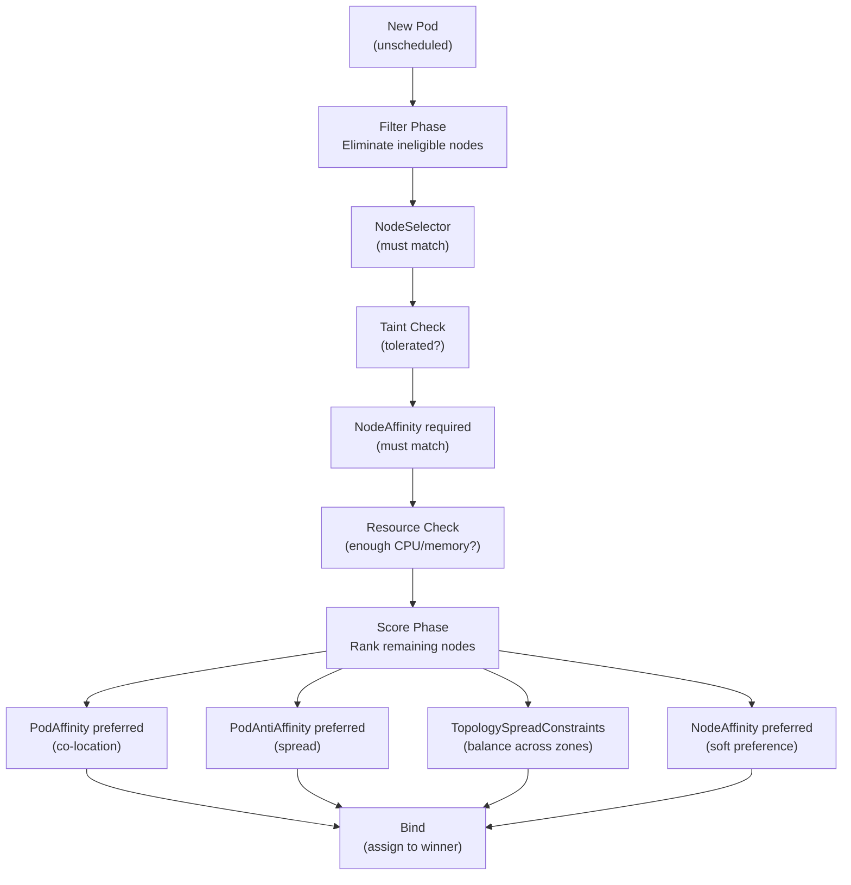

# Module 27 — Advanced Scheduling

## The Story: Placing the Right Work on the Right Machine

Imagine you're a logistics manager for a large warehouse. You have different types of workers: some are specialized for heavy lifting (high-CPU machines), some handle fragile items (SSD nodes), some work in cold storage (GPU nodes for ML). And you have rules: the accounting team's work must always be spread across multiple zones so a fire in one section doesn't halt operations. The new AI workload should only run on the GPU workers.

You also have VIP workers — certain machines designated for critical systems only — that reject general warehouse work unless the supervisor explicitly stamps the task "approved for VIP area" (tolerations).

Kubernetes scheduling works exactly this way. The scheduler places every pod on a node, but you have fine-grained control over that placement. This module covers all the tools Kubernetes gives you to control where pods land.

> **🐳 Coming from Docker?**
>
> In Docker, you decide which machine to run a container on manually — you SSH into the right server and run `docker run`. Docker Swarm adds basic placement constraints (`--constraint node.labels.type==gpu`). Kubernetes scheduling is far more sophisticated: nodeAffinity can express "prefer us-east-1a but allow us-east-1b", pod affinity can say "run near the cache pods for lower latency", pod anti-affinity can say "spread replicas across availability zones so one AZ failure doesn't take out all pods." TopologySpreadConstraints let you ensure even distribution without hard rules. This level of intelligent placement is simply not available in Docker.

---

## 📌 Learning Priority

**Must Learn** — core concepts, needed to understand the rest of this file:
[Taints and Tolerations](#taints-and-tolerations-dedicated-nodes) · [NodeAffinity](#nodeaffinity-flexible-node-matching) · [PodAntiAffinity](#podaffinity-and-podantiaffinity)

**Should Learn** — important for real projects and interviews:
[Topology Spread Constraints](#topology-spread-constraints) · [Priority and Preemption](#priority-classes-and-preemption)

**Good to Know** — useful in specific situations, not needed daily:
[NodeSelector](#nodeselector-simple-keyvalue-matching) · [HA App Example](#practical-example-ha-web-application)

**Reference** — skim once, look up when needed:
[When to Use What](#when-to-use-what)

---

## The Default Scheduler

Without any scheduling hints, the Kubernetes scheduler uses a scoring algorithm:

1. **Filter**: eliminate nodes that can't run the pod (insufficient CPU/memory, node not Ready, taints)
2. **Score**: rank remaining nodes by factors like available resources, pod spread, locality
3. **Bind**: assign the pod to the highest-scored node

This works well for generic workloads, but production systems need more control.

---

## NodeSelector: Simple Key=Value Matching

The simplest scheduling constraint. A pod only runs on nodes that have all the specified labels.

```yaml
# Label your nodes
kubectl label node worker-gpu-01 accelerator=gpu

# Use NodeSelector in pod spec
spec:
  nodeSelector:
    accelerator: gpu   # must have this label
```

Limitation: NodeSelector is an AND of exact matches only. No OR, no "prefer but don't require". For more flexibility, use NodeAffinity.

---

## NodeAffinity: Flexible Node Matching

NodeAffinity extends NodeSelector with richer operators and soft preferences.

### requiredDuringSchedulingIgnoredDuringExecution
Pod will only be scheduled on nodes matching this rule. Hard requirement.

```yaml
spec:
  affinity:
    nodeAffinity:
      requiredDuringSchedulingIgnoredDuringExecution:
        nodeSelectorTerms:
        - matchExpressions:
          - key: kubernetes.io/arch
            operator: In
            values:
            - amd64
            - arm64
          - key: node-type
            operator: NotIn
            values:
            - spot         # don't schedule on spot instances
```

### preferredDuringSchedulingIgnoredDuringExecution
Soft preference — scheduler tries to place here but will use other nodes if needed.

```yaml
spec:
  affinity:
    nodeAffinity:
      preferredDuringSchedulingIgnoredDuringExecution:
      - weight: 100    # higher weight = stronger preference
        preference:
          matchExpressions:
          - key: zone
            operator: In
            values:
            - us-east-1a    # prefer this AZ but don't require it
```

Available operators: `In`, `NotIn`, `Exists`, `DoesNotExist`, `Gt`, `Lt`

---

## PodAffinity and PodAntiAffinity

While NodeAffinity is about nodes, PodAffinity and PodAntiAffinity are about the relationship between pods.

### PodAffinity: Schedule Near Certain Pods

Use case: co-locate an application with its cache (reduced network latency).

```yaml
spec:
  affinity:
    podAffinity:
      requiredDuringSchedulingIgnoredDuringExecution:
      - labelSelector:
          matchLabels:
            app: redis-cache     # be on the same node as redis
        topologyKey: kubernetes.io/hostname
```

`topologyKey` defines the scope: `kubernetes.io/hostname` means "same node", `topology.kubernetes.io/zone` means "same availability zone".

### PodAntiAffinity: Spread Pods Apart

Use case: ensure replicas of the same deployment land on different nodes (HA).

```yaml
spec:
  affinity:
    podAntiAffinity:
      requiredDuringSchedulingIgnoredDuringExecution:
      - labelSelector:
          matchLabels:
            app: myapp          # don't be on the same node as another myapp pod
        topologyKey: kubernetes.io/hostname
```

**Soft anti-affinity** (preferred) is common for production — it spreads pods across nodes when possible but doesn't block scheduling if only one node is available:

```yaml
podAntiAffinity:
  preferredDuringSchedulingIgnoredDuringExecution:
  - weight: 100
    podAffinityTerm:
      labelSelector:
        matchLabels:
          app: myapp
      topologyKey: kubernetes.io/hostname
```

---

## Taints and Tolerations: Dedicated Nodes

**Taints** are applied to nodes and repel pods. Unless a pod has a matching **toleration**, it won't be scheduled on a tainted node.

Think of taints as a "Do Not Enter" sign on a node, and tolerations as the badge that lets certain pods enter anyway.

### Adding Taints to Nodes

```bash
# Taint syntax: key=value:effect
# Effects: NoSchedule | PreferNoSchedule | NoExecute

# Dedicated GPU node — only GPU workloads
kubectl taint node gpu-node-01 dedicated=gpu:NoSchedule

# Spot instances — prefer not to schedule here
kubectl taint node spot-node-01 spot=true:PreferNoSchedule

# Draining for maintenance
kubectl taint node worker-01 maintenance=true:NoExecute
```

Effects:
- `NoSchedule`: new pods won't be scheduled here (existing pods stay)
- `PreferNoSchedule`: scheduler tries to avoid this node (soft)
- `NoExecute`: new pods won't schedule here AND existing pods without toleration are evicted

### Tolerations in Pod Spec

```yaml
spec:
  tolerations:
  # Tolerate the GPU taint
  - key: dedicated
    operator: Equal
    value: gpu
    effect: NoSchedule

  # Tolerate spot instances (prefer but not required)
  - key: spot
    operator: Equal
    value: "true"
    effect: PreferNoSchedule

  # Tolerate ANY taint with this key (for maintenance)
  - key: maintenance
    operator: Exists
    effect: NoExecute
    tolerationSeconds: 60   # evict after 60 seconds even with toleration
```

Combine taints + tolerations with nodeAffinity for dedicated nodes: the node repels everyone (taint), and you also require that GPU workloads run on GPU nodes (nodeAffinity). Toleration alone would allow a pod to run on a GPU node but not guarantee it.

---

## Priority Classes and Preemption

Not all workloads are equal. When a cluster is under resource pressure, Kubernetes can evict lower-priority pods to make room for high-priority ones.

```yaml
# Define priority classes
apiVersion: scheduling.k8s.io/v1
kind: PriorityClass
metadata:
  name: critical-production
value: 1000000       # higher number = higher priority
globalDefault: false
description: "Critical production services - will preempt others"

---
apiVersion: scheduling.k8s.io/v1
kind: PriorityClass
metadata:
  name: batch-jobs
value: 100
globalDefault: false
description: "Batch workloads - can be preempted"
```

```yaml
# Use in pod spec
spec:
  priorityClassName: critical-production
```

When a critical pod can't be scheduled (insufficient resources), the scheduler finds a node where evicting lower-priority pods would free enough space, evicts them, and schedules the critical pod.

Built-in system priority classes:
- `system-cluster-critical` (2000000000) — for cluster components
- `system-node-critical` (2000001000) — for node-level components

---

## Topology Spread Constraints

Topology Spread Constraints provide fine-grained control over how pods are distributed across topology domains (zones, nodes, racks).

The goal: ensure even spread, not just "different nodes".

```yaml
spec:
  topologySpreadConstraints:
  # Spread across availability zones
  - maxSkew: 1              # max difference in pod count between any two zones
    topologyKey: topology.kubernetes.io/zone
    whenUnsatisfiable: DoNotSchedule  # or ScheduleAnyway
    labelSelector:
      matchLabels:
        app: myapp

  # Also spread across nodes within each zone
  - maxSkew: 2
    topologyKey: kubernetes.io/hostname
    whenUnsatisfiable: ScheduleAnyway  # soft constraint
    labelSelector:
      matchLabels:
        app: myapp
```

`maxSkew: 1` means the difference in pod count between the most and least populated zone can be at most 1. With 4 pods across 3 zones: 2-1-1 is acceptable (skew=1), but 3-1-0 is not (skew=3 between zones 1 and 3).

---

## Scheduling Decision Pipeline



---

## When to Use What

| Scenario | Tool |
|---|---|
| GPU pods on GPU nodes only | NodeSelector or NodeAffinity (required) |
| Prefer SSD nodes, fallback to HDD | NodeAffinity (preferred) |
| App replicas on different nodes | PodAntiAffinity (required) |
| Cache co-located with app | PodAffinity (preferred) |
| Dedicated nodes for one team | Taints + Tolerations + NodeAffinity |
| Spot instances for batch | Taints (PreferNoSchedule) + Tolerations |
| Even distribution across 3 AZs | TopologySpreadConstraints |
| Critical service preempts batch | PriorityClass |

---

## Practical Example: HA Web Application

```yaml
# 4 replicas spread across zones and not co-located on the same node
spec:
  replicas: 4
  template:
    spec:
      affinity:
        podAntiAffinity:
          # Hard: no two pods on the same node
          requiredDuringSchedulingIgnoredDuringExecution:
          - labelSelector:
              matchLabels:
                app: myapp
            topologyKey: kubernetes.io/hostname
      topologySpreadConstraints:
      # Soft: try to spread across zones
      - maxSkew: 1
        topologyKey: topology.kubernetes.io/zone
        whenUnsatisfiable: ScheduleAnyway
        labelSelector:
          matchLabels:
            app: myapp
      priorityClassName: critical-production
```


---

## 📝 Practice Questions

- 📝 [Q55 · advanced-scheduling](../kubernetes_practice_questions_100.md#q55--normal--advanced-scheduling)
- 📝 [Q56 · taints-tolerations](../kubernetes_practice_questions_100.md#q56--normal--taints-tolerations)
- 📝 [Q57 · node-affinity](../kubernetes_practice_questions_100.md#q57--normal--node-affinity)
- 📝 [Q95 · debug-pending-pod](../kubernetes_practice_questions_100.md#q95--debug--debug-pending-pod)


---

## 📂 Navigation

| | Link |
|---|---|
| Previous | [26 — Helm Charts](../26_Helm_Charts/Theory.md) |
| Cheatsheet | [Advanced Scheduling Cheatsheet](./Cheatsheet.md) |
| Interview Q&A | [Advanced Scheduling Interview Q&A](./Interview_QA.md) |
| Next | [28 — Cluster Management](../28_Cluster_Management/Theory.md) |
