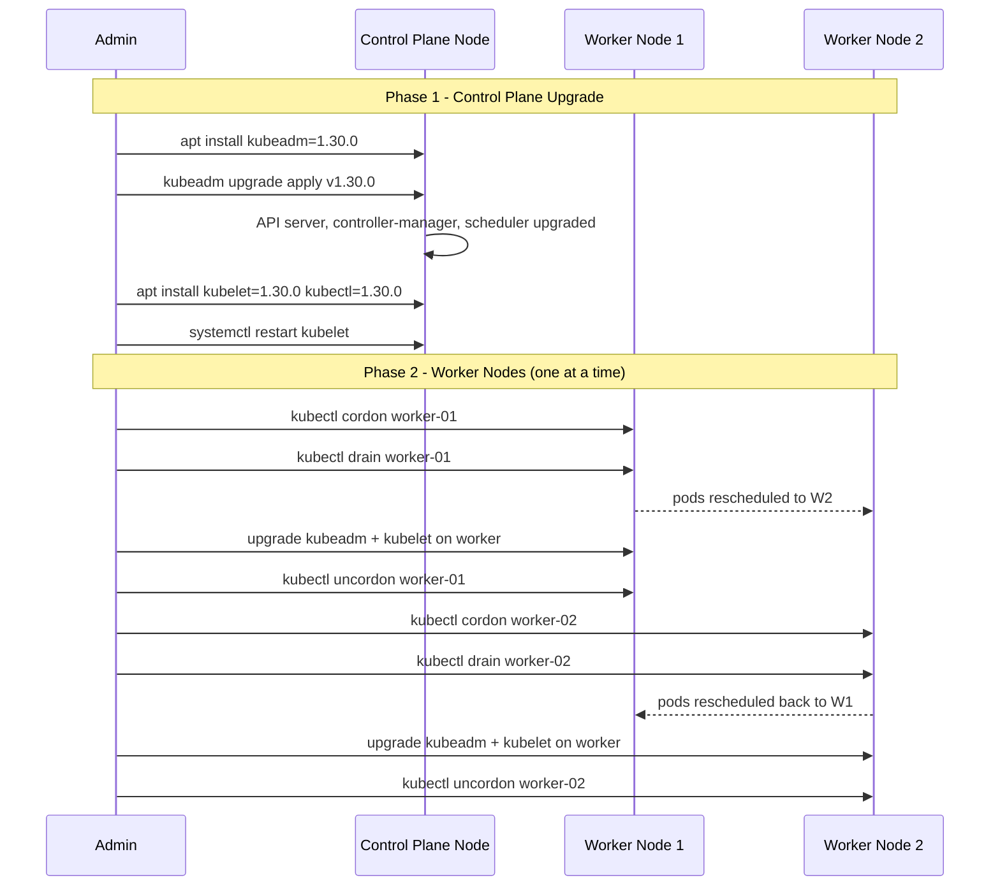

# Module 28 — Cluster Management

## The Story: The Fleet of Delivery Cars

Running a Kubernetes cluster in production is like managing a fleet of cars for a delivery company. You need to know when each car needs maintenance, when to retire old vehicles, when to add more, how to handle breakdowns without disrupting deliveries, and how to upgrade to newer models safely. Cluster management is everything you need to do AFTER you set up Kubernetes — to keep it healthy, current, and running smoothly.

A delivery company that never services its vehicles will eventually have cars breaking down in the field, blocking other routes, and causing missed deliveries. The same happens with Kubernetes: ignore it long enough and certificates expire, node OS vulnerabilities pile up, etcd fills with stale data, and one day a node goes offline during peak traffic with no backup. The difference between a company that thrives and one that struggles is having a disciplined maintenance routine.

The good news is that Kubernetes is designed for operational continuity. You can upgrade nodes one at a time while the fleet keeps delivering. You can replace failing hardware without dropping a single request. You can roll back a bad upgrade to last week's known-good state. This module covers the operational toolkit to keep your cluster healthy for years.

> **🐳 Coming from Docker?**
>
> With Docker on a single host, "cluster management" is just OS patching and Docker version upgrades — a few minutes of downtime. In Kubernetes, cluster management is a discipline in itself: upgrading the control plane and nodes in the right order, draining nodes safely before maintenance, rotating TLS certificates before they expire, backing up etcd (the entire cluster state), and monitoring component health. The operational surface area is larger, but so is what you're operating: a system that might run thousands of pods for dozens of teams, where a misconfigured upgrade can affect everyone.

---

## Node Lifecycle: Cordon, Drain, Uncordon

The three-command sequence for taking a node out of service safely.

### Cordon: No New Pods

Marking a node as unschedulable prevents new pods from landing there. Existing pods keep running.

```bash
kubectl cordon worker-03
```

The node gets a `node.kubernetes.io/unschedulable:NoSchedule` taint and shows `SchedulingDisabled` in `kubectl get nodes`. Use cordon when you're about to perform maintenance but don't need to evict existing workloads yet.

### Drain: Evict All Pods

Draining safely evicts all pods from a node while respecting PodDisruptionBudgets — it won't evict a pod if doing so would violate the PDB minimum availability guarantee.

```bash
kubectl drain worker-03 \
  --ignore-daemonsets \        # DaemonSet pods can't be evicted (they'd just come back)
  --delete-emptydir-data \     # allow eviction of pods using emptyDir volumes
  --grace-period=120 \         # give pods 120 seconds to terminate gracefully
  --timeout=300s               # give up after 5 minutes if stuck
```

Drain also implicitly cordons the node. Pods are evicted and their Deployments reschedule them on other nodes.

### Uncordon: Return to Service

After maintenance, return the node to normal scheduling:

```bash
kubectl uncordon worker-03
```

New pods can now be scheduled here again. Previously evicted pods that rescheduled elsewhere don't automatically move back.

---

## Cluster Upgrade Strategy

Kubernetes releases new minor versions approximately every 4 months. Support for each minor version lasts approximately 14 months. Running an unsupported version means no security patches.

### The Rule: Control Plane First, Then Nodes

Always upgrade the control plane before worker nodes. The API server version must be >= the kubelet version on workers. Kubernetes allows workers to be up to 2 minor versions behind the API server — never ahead.

### Cluster Upgrade Flow



### kubeadm Upgrade Commands

```bash
# --- Control Plane ---

# Step 1: Upgrade kubeadm
apt-mark unhold kubeadm
apt-get update && apt-get install -y kubeadm=1.30.0-00
apt-mark hold kubeadm

# Step 2: See what will change
kubeadm upgrade plan

# Step 3: Apply the upgrade
kubeadm upgrade apply v1.30.0

# Step 4: Upgrade kubelet and kubectl
apt-mark unhold kubelet kubectl
apt-get install -y kubelet=1.30.0-00 kubectl=1.30.0-00
apt-mark hold kubelet kubectl
systemctl daemon-reload && systemctl restart kubelet

# --- Worker Nodes (repeat for each worker) ---

# On management machine: cordon + drain
kubectl cordon worker-01
kubectl drain worker-01 --ignore-daemonsets --delete-emptydir-data

# On the worker node:
apt-mark unhold kubeadm && apt-get install -y kubeadm=1.30.0-00
kubeadm upgrade node
apt-mark unhold kubelet kubectl
apt-get install -y kubelet=1.30.0-00 kubectl=1.30.0-00
systemctl daemon-reload && systemctl restart kubelet

# On management machine: return to service
kubectl uncordon worker-01
kubectl get nodes   # verify worker-01 shows v1.30.0 and Ready
```

### Managed Cluster Upgrades

Cloud-managed Kubernetes handles control plane upgrades automatically:

```bash
# EKS
aws eks update-cluster-version \
  --name my-cluster --kubernetes-version 1.30

# Then upgrade node groups
aws eks update-nodegroup-version \
  --cluster-name my-cluster \
  --nodegroup-name workers --kubernetes-version 1.30

# GKE
gcloud container clusters upgrade my-cluster \
  --master --cluster-version 1.30
gcloud container clusters upgrade my-cluster \
  --node-pool default-pool --cluster-version 1.30

# AKS
az aks upgrade \
  --resource-group my-rg --name my-cluster \
  --kubernetes-version 1.30
```

---

## etcd Backup and Restore

etcd stores ALL Kubernetes cluster state — every Pod, Deployment, Service, Secret, ConfigMap, RBAC rule, and CRD object. If etcd is lost without a backup, **the entire cluster configuration is permanently gone**.

Regular etcd backups are non-negotiable for self-managed clusters.

### Take a Snapshot

```bash
# On the control plane node (as root)
ETCDCTL_API=3 etcdctl snapshot save \
  /backup/etcd-snapshot-$(date +%Y%m%d-%H%M%S).db \
  --endpoints=https://127.0.0.1:2379 \
  --cacert=/etc/kubernetes/pki/etcd/ca.crt \
  --cert=/etc/kubernetes/pki/etcd/server.crt \
  --key=/etc/kubernetes/pki/etcd/server.key

# Verify the snapshot is valid
ETCDCTL_API=3 etcdctl snapshot status \
  /backup/etcd-snapshot.db --write-out=table
```

### Restore from Snapshot

```bash
# Step 1: Stop the API server (prevent writes during restore)
mv /etc/kubernetes/manifests/kube-apiserver.yaml /tmp/

# Step 2: Restore snapshot to a new data directory
ETCDCTL_API=3 etcdctl snapshot restore \
  /backup/etcd-snapshot.db \
  --data-dir /var/lib/etcd-restore \
  --name master \
  --initial-cluster master=https://127.0.0.1:2380 \
  --initial-advertise-peer-urls https://127.0.0.1:2380

# Step 3: Update etcd manifest to use restored directory
# Edit /etc/kubernetes/manifests/etcd.yaml:
#   --data-dir=/var/lib/etcd-restore

# Step 4: Restart API server
mv /tmp/kube-apiserver.yaml /etc/kubernetes/manifests/
```

On managed clusters (EKS, GKE, AKS), etcd is managed by the cloud provider — use Velero to backup Kubernetes objects and persistent volumes instead.

---

## Certificate Rotation

kubeadm-managed certificates expire in 1 year by default. If they expire, the cluster becomes inaccessible.

```bash
# Check expiry dates for all certificates
kubeadm certs check-expiration

# Renew all certificates at once
kubeadm certs renew all

# Renew a specific certificate
kubeadm certs renew apiserver

# After renewal: restart control plane static pods
# kubelet will automatically restart them after killing the process
kill $(pidof kube-apiserver)
kill $(pidof kube-controller-manager)
kill $(pidof kube-scheduler)
```

**Pro tip**: if you run `kubeadm upgrade` at least once per year, it automatically renews certificates during the upgrade — so annual upgrades serve double duty.

---

## Node Replacement Strategy

For zero-downtime node replacement (hardware failure, OS migration, spot instance rotation):

```bash
# 1. Add replacement node to the cluster first
# (provision new VM, run kubeadm join, wait for Ready)

# 2. Cordon the old node
kubectl cordon old-worker-01

# 3. Drain the old node
kubectl drain old-worker-01 \
  --ignore-daemonsets --delete-emptydir-data

# 4. Verify old node is empty
kubectl get pods -A \
  --field-selector=spec.nodeName=old-worker-01

# 5. Remove from cluster
kubectl delete node old-worker-01

# 6. Terminate the underlying VM
```

Applications with `replicas >= 2` and proper PodDisruptionBudgets experience zero downtime. Single-replica apps will briefly be unavailable during the eviction window.

---

## Cluster Health Monitoring

### Key Components

**kube-state-metrics**: exposes Kubernetes object state as Prometheus metrics (deployment desired/ready replicas, pod phase, node conditions, etc.)

**node-problem-detector**: DaemonSet that watches node kernel logs and system logs for known issues (OOM kills, disk errors, network problems) and creates Kubernetes Node events and conditions.

**metrics-server**: provides CPU and memory metrics for `kubectl top nodes` and `kubectl top pods`. Required for HPA to work.

```bash
# Node and pod resource usage (requires metrics-server)
kubectl top nodes
kubectl top pods -A --sort-by=memory

# Node conditions (look for MemoryPressure, DiskPressure, PIDPressure)
kubectl describe node worker-01 | grep -A 10 Conditions:

# Recent cluster events (great first debugging step)
kubectl get events -A --sort-by='.lastTimestamp' | tail -30

# API server health endpoints
kubectl get --raw /healthz
kubectl get --raw /readyz

# etcd health check
ETCDCTL_API=3 etcdctl endpoint health \
  --endpoints=https://127.0.0.1:2379 \
  --cacert=/etc/kubernetes/pki/etcd/ca.crt \
  --cert=/etc/kubernetes/pki/etcd/server.crt \
  --key=/etc/kubernetes/pki/etcd/server.key
```

---

## Multi-Cluster Management

### ArgoCD App of Apps

ArgoCD can manage multiple clusters from a single control plane. Register clusters and deploy applications to each:

```bash
argocd cluster add production-us-east
argocd cluster add production-eu-west
argocd cluster list
```

The "App of Apps" pattern: create one ArgoCD Application that itself deploys other Applications. Useful for managing many clusters with GitOps.

### Rancher

Open-source multi-cluster management platform with a web UI. Manages cluster provisioning, upgrades, RBAC, and application deployment across many clusters. Can manage both Rancher-provisioned clusters and imported existing clusters.

### Fleet (Rancher Fleet)

GitOps-based continuous delivery for Kubernetes at scale. Manages deployment of workloads across hundreds of clusters using Git repositories as the source of truth.

### kubeconfig Multi-Cluster

```bash
# Switch between clusters with kubectl contexts
kubectl config get-contexts
kubectl config use-context production-eu-west

# Use a specific context for one command
kubectl --context=staging get pods -n my-app

# Merge multiple kubeconfig files
KUBECONFIG=~/.kube/config:~/.kube/prod-config kubectl config view --flatten
```

---

## etcd Quorum and Cluster Size

etcd uses the Raft consensus protocol and requires a quorum (majority) of members to function. For an N-member cluster, it can tolerate `(N-1)/2` failures.

| etcd members | Tolerated failures |
|-------------|-------------------|
| 1 | 0 — no HA |
| 3 | 1 — standard HA |
| 5 | 2 — higher resilience |
| 7 | 3 — rarely needed |

Always run an odd number of etcd members. Even numbers don't increase fault tolerance but do increase write latency.

---

## 📂 Navigation

⬅️ **Prev:** [Advanced Scheduling](../27_Advanced_Scheduling/Interview_QA.md) &nbsp;&nbsp;&nbsp; ➡️ **Next:** [Backup and DR](../29_Backup_and_DR/Theory.md)

| | Link |
|---|---|
| Cheatsheet | [Cheatsheet.md](./Cheatsheet.md) |
| Interview Q&A | [Interview_QA.md](./Interview_QA.md) |
