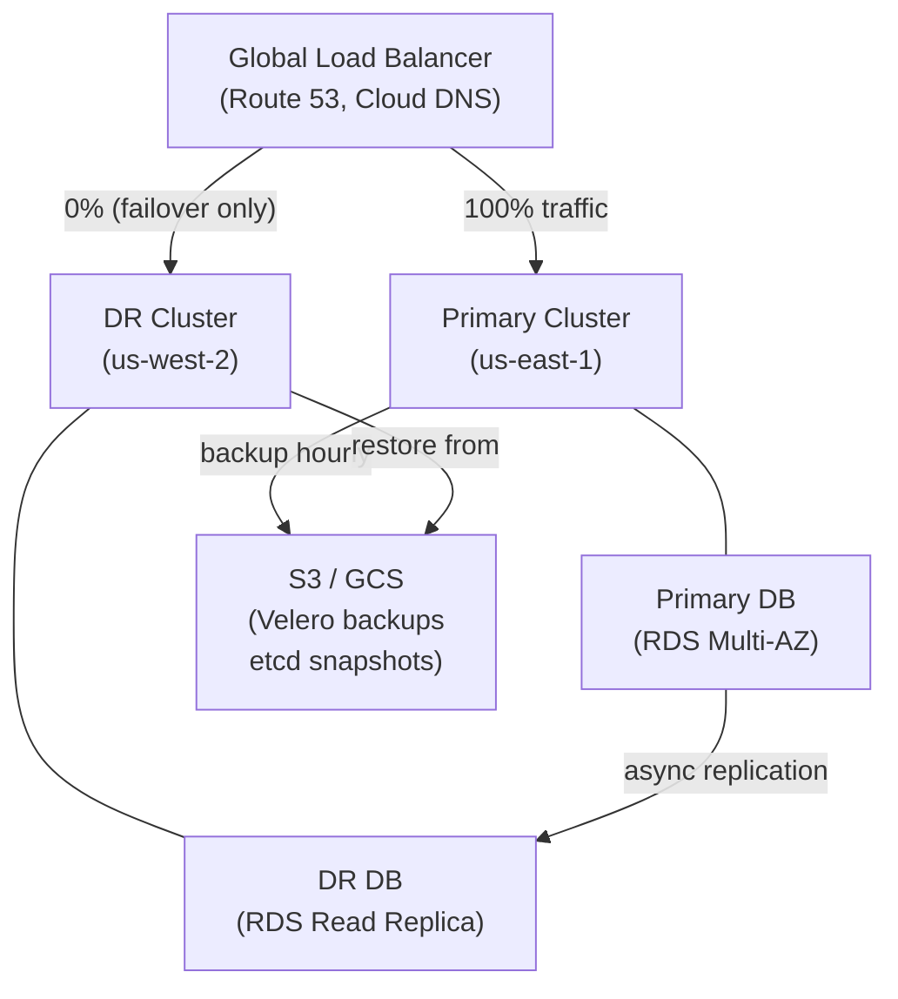

# Module 29 — Backup and Disaster Recovery

## The Story: The 3 AM Deletion

At 3 AM, you get a page: someone ran `kubectl delete namespace production` by accident. Your entire production environment — deployments, services, configmaps, secrets — is gone. Do you have a backup? This is the nightmare scenario that keeps SREs up at night, and it is completely avoidable with a proper backup and disaster recovery strategy.

This is not a hypothetical. Teams have lost entire production namespaces to fat-finger commands, runaway automation scripts, and corrupt cluster upgrades. The question is not whether something will go wrong — it is how long it takes you to recover when it does. A team with backups and a tested runbook restores in minutes. A team without backups rebuilds from memory over days, if they can rebuild at all.

Backup and disaster recovery in Kubernetes is a layered problem. Your application data lives in PersistentVolumes. Your cluster configuration — deployments, services, configmaps, RBAC policies — lives in etcd. Both need protection, and both require different tools. This module walks through what to back up, how to back it up, and how to prove your backups actually work before you need them.

> **🐳 Coming from Docker?**
>
> Docker has no built-in backup mechanism. If you run a Postgres container with a volume and the host dies, recovering that data depends entirely on what you set up manually — snapshot the volume with your cloud provider, use pg_dump, or hope you have a recent copy somewhere. Kubernetes makes the problem larger (now you have state spread across many nodes and a cluster configuration stored in etcd) but also more tractable: tools like Velero can back up every resource in your cluster plus all attached volumes on a schedule, and GitOps means your entire cluster configuration can be recreated from Git in minutes. The mindset shift is from "back up this one database" to "back up the entire system state."

---

## 📌 Learning Priority

**Must Learn** — core concepts, needed to understand the rest of this file:
[What Needs Backing Up](#what-needs-backing-up-in-kubernetes) · [Velero Basics](#velero-the-standard-backup-tool) · [RTO and RPO Planning](#rto-and-rpo-planning)

**Should Learn** — important for real projects and interviews:
[etcd Backup Deep Dive](#etcd-backup-deep-dive) · [DR Scenarios](#disaster-recovery-scenarios)

**Good to Know** — useful in specific situations, not needed daily:
[Velero Hooks](#velero-hooks-quiesce-before-backup) · [Multi-Region Architecture](#multi-region-k8s-architecture)

**Reference** — skim once, look up when needed:
[Testing Your Backups](#testing-your-backups)

---

## What Needs Backing Up in Kubernetes

### 1. etcd (Cluster State)

etcd stores every Kubernetes resource: Pods, Deployments, Services, Secrets, ConfigMaps, RBAC rules, CRDs, etc. If etcd is lost, the cluster loses all its state.

**Backup method**: `etcdctl snapshot save`
**Frequency**: hourly for production
**Storage**: external (S3, GCS) — never only on the control plane node

### 2. Persistent Volumes (Application Data)

StatefulSets, databases, and any workload using PVCs contain actual application data. Kubernetes doesn't know the semantics of this data — it's a raw block or filesystem.

**Backup method**: Velero with volume snapshots or restic
**Frequency**: application-specific (databases: hourly to daily; static content: daily)
**Consideration**: you may need to quiesce the application before backup to ensure consistency

### 3. Kubernetes Manifests (Application Configuration)

With GitOps, your Kubernetes YAML is already in Git — this is your backup of application configuration. Git history is your audit trail and your rollback mechanism.

**Backup method**: Git (already handled with GitOps)
**What this covers**: Deployments, Services, Ingresses, ConfigMaps, Helm values

The three categories together give you complete recovery capability.

---

## Velero: The Standard Backup Tool

Velero is the most widely used Kubernetes backup and restore solution. It can:
- Back up Kubernetes objects (any resource) to object storage (S3, GCS, Azure Blob)
- Back up persistent volumes using volume snapshots or file-level backup (restic/Kopia)
- Restore to the same or a different cluster
- Migrate workloads between clusters or cloud providers
- Schedule regular backups

### Installing Velero

```bash
# Install Velero CLI
brew install velero  # macOS

# Install Velero with AWS S3 backend
velero install \
  --provider aws \
  --plugins velero/velero-plugin-for-aws:v1.8.0 \
  --bucket my-velero-backups \
  --backup-location-config region=us-east-1 \
  --snapshot-location-config region=us-east-1 \
  --secret-file ./velero-credentials

# Verify
velero backup-location get
```

### Create a Backup

```bash
# Backup everything
velero backup create full-backup

# Backup a specific namespace
velero backup create production-backup \
  --include-namespaces production

# Backup with label selector
velero backup create myapp-backup \
  --selector app=myapp

# Backup including PVs (volume snapshots)
velero backup create full-with-pvs \
  --include-namespaces production \
  --snapshot-volumes

# Check backup status
velero backup get
velero backup describe full-backup
velero backup logs full-backup
```

### Schedule Regular Backups

```bash
# Daily backup at 2am UTC
velero schedule create daily-full \
  --schedule="0 2 * * *" \
  --include-namespaces production,staging \
  --ttl 720h    # keep for 30 days

# List schedules
velero schedule get
```

### Restore from Backup

```bash
# List available backups
velero backup get

# Restore a backup (to same or different cluster)
velero restore create --from-backup full-backup

# Restore a specific namespace
velero restore create \
  --from-backup full-backup \
  --include-namespaces production

# Restore to a different namespace
velero restore create \
  --from-backup production-backup \
  --namespace-mappings production:production-restored

# Check restore status
velero restore get
velero restore describe <restore-name>
velero restore logs <restore-name>
```

### Velero Hooks: Quiesce Before Backup

For databases, taking a backup of a running database mid-transaction can produce an inconsistent snapshot. Velero hooks allow you to run commands before and after a backup:

```yaml
# Add to pod annotations (Velero reads these)
annotations:
  pre.hook.backup.velero.io/container: postgres
  pre.hook.backup.velero.io/command: '["/bin/bash", "-c", "psql -U $POSTGRES_USER -c \"CHECKPOINT;\""]'
  post.hook.backup.velero.io/container: postgres
  post.hook.backup.velero.io/command: '["/bin/bash", "-c", "echo backup_complete"]'
```

For MySQL:
```yaml
pre.hook.backup.velero.io/command: >
  ["/bin/bash", "-c",
  "mysql -u root -p$MYSQL_ROOT_PASSWORD -e 'FLUSH TABLES WITH READ LOCK;'"]
post.hook.backup.velero.io/command: >
  ["/bin/bash", "-c",
  "mysql -u root -p$MYSQL_ROOT_PASSWORD -e 'UNLOCK TABLES;'"]
```

---

## etcd Backup Deep Dive

```bash
# Full etcd backup command
ETCDCTL_API=3 etcdctl snapshot save \
  /backup/etcd-$(date +%Y%m%d-%H%M%S).db \
  --endpoints=https://127.0.0.1:2379 \
  --cacert=/etc/kubernetes/pki/etcd/ca.crt \
  --cert=/etc/kubernetes/pki/etcd/server.crt \
  --key=/etc/kubernetes/pki/etcd/server.key

# Verify the snapshot
ETCDCTL_API=3 etcdctl snapshot status \
  /backup/etcd-20240115-020000.db

# Upload to S3
aws s3 cp /backup/etcd-20240115-020000.db \
  s3://my-etcd-backups/etcd-20240115-020000.db
```

CronJob for automated etcd backups:

```yaml
apiVersion: batch/v1
kind: CronJob
metadata:
  name: etcd-backup
  namespace: kube-system
spec:
  schedule: "0 * * * *"  # every hour
  jobTemplate:
    spec:
      template:
        spec:
          hostNetwork: true
          containers:
          - name: backup
            image: bitnami/etcd:3.5
            command:
            - /bin/sh
            - -c
            - |
              ETCDCTL_API=3 etcdctl snapshot save \
                /backup/etcd-$(date +%Y%m%d-%H%M%S).db \
                --endpoints=https://127.0.0.1:2379 \
                --cacert=/etc/kubernetes/pki/etcd/ca.crt \
                --cert=/etc/kubernetes/pki/etcd/server.crt \
                --key=/etc/kubernetes/pki/etcd/server.key
              aws s3 cp /backup/etcd-*.db s3://my-backups/etcd/
            volumeMounts:
            - name: etcd-certs
              mountPath: /etc/kubernetes/pki/etcd
            - name: backup
              mountPath: /backup
          restartPolicy: OnFailure
          volumes:
          - name: etcd-certs
            hostPath:
              path: /etc/kubernetes/pki/etcd
          - name: backup
            emptyDir: {}
```

---

## RTO and RPO Planning

**RTO (Recovery Time Objective)**: how long can we tolerate the system being down before recovery?
- Example: "We must be back online within 4 hours of a disaster"

**RPO (Recovery Point Objective)**: how much data loss is acceptable?
- Example: "We can lose at most 1 hour of data" → backups every hour

Planning your backup strategy:

| RPO | Backup frequency | Notes |
|---|---|---|
| 1 hour | Hourly backups | Standard for most production |
| 15 min | Continuous/WAL streaming | Databases with WAL archiving |
| 0 (no loss) | Synchronous replication | Active-active multi-region |
| 24 hours | Daily backups | Non-critical workloads |

Your RTO drives infrastructure decisions:
- 4-hour RTO: single-region, manual restore acceptable
- 1-hour RTO: automated restore scripts, warm standby
- 15-minute RTO: hot standby, automated failover

---

## Disaster Recovery Scenarios

### Scenario 1: Node Failure

A single worker node fails. Kubernetes automatically reschedules pods to healthy nodes (if resources available). No backup needed for stateless workloads with replicas >= 2.

For StatefulSets: PVs are detached and reattached to the new pod. Data survives if the underlying storage (EBS, GCE PD) is healthy.

### Scenario 2: AZ Failure (Partial Region Loss)

An entire availability zone goes down. Pods on those nodes are lost. Kubernetes reschedules to surviving AZs — if you've set up pod anti-affinity across zones.

With multi-AZ node groups and properly spread pods, this is transparent to users.

### Scenario 3: Full Cluster Loss (Region Failure)

The entire Kubernetes cluster is gone. Recovery steps:
1. Provision a new cluster in another region (Terraform/Pulumi for IaC)
2. Restore etcd snapshot (or redeploy from Git if using GitOps)
3. Restore persistent volumes from Velero backup
4. Point DNS to the new cluster endpoint

Time: typically 1-4 hours with tested procedures.

### Scenario 4: Accidental Data Deletion

Someone runs `kubectl delete namespace production` — all workloads and most resources deleted. With GitOps: redeploy from Git immediately. For persistent data: restore from Velero backup.

---

## Multi-Region K8s Architecture



---

## Testing Your Backups

A backup is worthless if you can't restore from it. Test regularly:

```bash
# Monthly: restore backup to a test cluster
kubectl config use-context test-cluster

velero restore create test-restore-$(date +%Y%m%d) \
  --from-backup production-daily-backup \
  --include-namespaces production

# Verify the restore
kubectl get pods -n production          # are pods running?
kubectl get pvc -n production           # are PVCs bound?
# Run smoke tests against the restored environment

# Cleanup test
kubectl config use-context test-cluster
kubectl delete namespace production

# Document the RTO: time from "disaster declared" to "system verified working"
```

**Backup Testing Checklist:**
- [ ] Monthly: full restore to isolated cluster, run smoke tests
- [ ] Quarterly: full DR drill (simulate region failure, measure RTO)
- [ ] After any infrastructure change: verify backups still work
- [ ] Alert on backup failure: if last backup is > 2 hours old, page on-call


---

## 📝 Practice Questions

- 📝 [Q59 · backup-dr](../kubernetes_practice_questions_100.md#q59--normal--backup-dr)


---

## 📂 Navigation

| | Link |
|---|---|
| Previous | [28 — Cluster Management](../28_Cluster_Management/Interview_QA.md) |
| Cheatsheet | [Backup and DR Cheatsheet](./Cheatsheet.md) |
| Interview Q&A | [Backup and DR Interview Q&A](./Interview_QA.md) |
| Next | [30 — Cost Optimization](../30_Cost_Optimization/Theory.md) |
