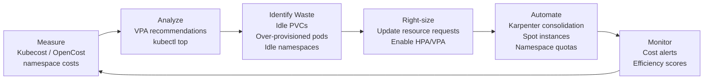

# Module 30 — Cost Optimization

## The Story: The Bill That Shocked Everyone

Your startup's AWS bill just hit $50,000/month and your CEO wants answers. You look at your Kubernetes cluster and discover: nodes running at 15% CPU utilization, dev and prod workloads mixed on expensive instance types, pods with requests set to `4 CPU, 8GB RAM` that actually use 0.1 CPU and 200MB. Kubernetes cost optimization is about finding and fixing these inefficiencies.

The frustrating part is that the platform is working exactly as designed. Kubernetes honored every resource request, provisioned every node the scheduler needed, and kept every pod running. The problem is that developers set requests without understanding their workload, and nobody noticed until the bill arrived.

The good news: once you can see where the waste is, fixing it is straightforward. This module covers the tools and techniques for understanding, measuring, and reducing Kubernetes costs — starting from the biggest wins and working down.

> **🐳 Coming from Docker?**
>
> With Docker, cost optimization is simple: shut down containers you're not using, choose a smaller VM. With Kubernetes, the cost surface is much larger — you might have 50 nodes, hundreds of pods, and terabytes of persistent volumes spread across availability zones. The good news is the optimization levers are also much more powerful: Karpenter can consolidate workloads onto fewer, cheaper nodes automatically; KEDA can scale to zero so idle workloads cost nothing; VPA recommendations help you right-size pod resources that nobody tuned correctly at deploy time. Cost optimization in Kubernetes is an ongoing practice, not a one-time task.

---

## Understanding Kubernetes Cost Drivers

### 1. Over-Provisioned Pods

The biggest source of waste. When developers set resource requests without understanding their workload:

```yaml
# What someone set (they wanted 400m CPU)
resources:
  requests:
    cpu: "4"        # 4 full CPU cores reserved per pod!
    memory: 2Gi

# What they actually needed
resources:
  requests:
    cpu: 400m
    memory: 256Mi
```

The Kubernetes scheduler allocates nodes based on **requests**, not actual usage. A pod requesting 4 CPUs reserves those cores on a node even if it uses 50m CPU at runtime. The node cannot schedule other pods in that space.

### 2. Idle Nodes

Nodes that are running but underutilized. Common in environments without proper autoscaling:
- Dev/staging clusters left running overnight and weekends
- Node groups that scale up but don't scale down
- Oversized node types for the workload

### 3. Expensive Storage

Persistent Volume Claims that nobody deleted. EBS volumes at $0.10/GB/month add up. 200 stale 20GB PVCs = $400/month for nothing.

### 4. Network Costs

- Cross-AZ traffic: data moving between availability zones costs money on most clouds
- Egress traffic: data leaving the cloud
- NAT Gateway charges: small but can compound at scale

---

## Right-Sizing: VPA Recommendations

The **Vertical Pod Autoscaler (VPA)** can run in recommendation mode — it watches actual pod CPU and memory usage and recommends better resource requests without making changes.

```bash
# Install VPA
kubectl apply -f https://github.com/kubernetes/autoscaler/releases/latest/download/vertical-pod-autoscaler.yaml

# Create VPA in Recommendation mode (no changes, just observe)
```

```yaml
apiVersion: autoscaling.k8s.io/v1
kind: VerticalPodAutoscaler
metadata:
  name: myapp-vpa
  namespace: production
spec:
  targetRef:
    apiVersion: apps/v1
    kind: Deployment
    name: myapp
  updatePolicy:
    updateMode: "Off"    # Off = recommendations only, no changes
```

```bash
# View recommendations
kubectl describe vpa myapp-vpa -n production
# Look for: "Recommendation:" section with Lower Bound, Target, Upper Bound
```

The Target is what VPA recommends you set as your resource requests. Lower Bound is the minimum observed. Upper Bound gives headroom.

---

## kubectl top: Real-Time Resource Usage

```bash
# Current CPU and memory usage by pod
kubectl top pods -n production
kubectl top pods -A --sort-by=cpu
kubectl top pods -A --sort-by=memory

# Node resource usage
kubectl top nodes

# Combined: see requests vs actual usage
kubectl resource-capacity  # if kube-capacity plugin installed
```

Comparing `kubectl top` output to `kubectl describe pod` resource requests reveals over-provisioning. If a pod requests `1 CPU` but uses `50m`, it's using 5% of what it reserved.

---

## Kubecost: Cost Visibility

**Kubecost** (and the CNCF project **OpenCost**) provide real-time cost visibility per namespace, deployment, label, and team.

```bash
# Install Kubecost
helm repo add kubecost https://kubecost.github.io/cost-analyzer/
helm install kubecost kubecost/cost-analyzer \
  --namespace kubecost \
  --create-namespace \
  --set kubecostToken="<token>"

# Access UI
kubectl port-forward deployment/kubecost-cost-analyzer 9090 -n kubecost
```

Kubecost shows:
- Cost per namespace/deployment/label
- Efficiency score (actual usage vs requests)
- Savings opportunities
- Right-sizing recommendations
- Cost trends over time

**OpenCost** is the CNCF open-source alternative — just the metrics/API, no dashboard.

---

## Spot / Preemptible Instances

Spot instances (AWS) or Preemptible instances (GCP) are unused cloud capacity offered at 60-90% discount. The tradeoff: they can be reclaimed with ~2 minutes notice.

Strategy: run fault-tolerant, non-critical workloads on spot:

```bash
# Label spot nodes (usually done by node group / Karpenter automatically)
kubectl label node spot-node-01 node.kubernetes.io/capacity-type=spot
```

```yaml
# Pod that can run on spot with graceful handling
spec:
  tolerations:
  - key: "kubernetes.azure.com/scalesetpriority"  # Azure example
    operator: "Equal"
    value: "spot"
    effect: "NoSchedule"

  affinity:
    nodeAffinity:
      preferredDuringSchedulingIgnoredDuringExecution:
      - weight: 100
        preference:
          matchExpressions:
          - key: node.kubernetes.io/capacity-type
            operator: In
            values: [spot]

  # Always have enough replicas that spot termination doesn't break the app
  terminationGracePeriodSeconds: 120

  priorityClassName: batch-low-priority
```

Good candidates for spot: batch jobs, CI/CD runners, dev environments, stateless services with >= 3 replicas.

Bad candidates for spot: databases, single-replica critical services, anything that can't tolerate 2-minute termination notices.

---

## Karpenter vs Cluster Autoscaler

### Cluster Autoscaler (CA)

Traditional node autoscaler. Works with pre-configured Node Groups — when a pod is Pending, CA checks if adding a node from an existing group would fix it. Scales down when nodes are underutilized.

Limitations:
- Slow to react (polling-based)
- Must pre-define all node groups and instance types
- Can't optimize instance selection per workload

### Karpenter

New AWS-native autoscaler (also on Azure/GCP). Provisions nodes dynamically in response to pending pod requirements:

1. Pod is Pending with resource requirements
2. Karpenter evaluates the pod's requirements (CPU, memory, AZ, spot/on-demand)
3. Karpenter selects the **optimal instance type** (cheapest that satisfies requirements)
4. Instance is provisioned directly (no pre-configured groups)
5. Pod schedules within 30-60 seconds

Karpenter also **consolidates** nodes — if workloads can fit on fewer nodes, it moves pods and terminates the excess.

```yaml
# Karpenter NodePool
apiVersion: karpenter.sh/v1beta1
kind: NodePool
metadata:
  name: default
spec:
  template:
    spec:
      requirements:
      - key: karpenter.sh/capacity-type
        operator: In
        values: ["spot", "on-demand"]
      - key: karpenter.k8s.aws/instance-category
        operator: In
        values: ["c", "m", "r"]    # compute, general, memory optimized
  limits:
    cpu: 1000                       # max cluster CPU
  disruption:
    consolidationPolicy: WhenUnderutilized
    consolidateAfter: 30s
```

---

## Cost Optimization Feedback Loop



---

## Namespace Resource Quotas

Prevent any single team from consuming unlimited resources:

```yaml
apiVersion: v1
kind: ResourceQuota
metadata:
  name: team-quota
  namespace: team-a
spec:
  hard:
    requests.cpu: "20"          # total CPU requests in namespace
    requests.memory: 40Gi       # total memory requests
    limits.cpu: "40"
    limits.memory: 80Gi
    pods: "50"                  # max pods
    persistentvolumeclaims: "20" # max PVCs
    requests.storage: 500Gi     # total storage
```

LimitRange sets per-pod defaults (prevents pods without requests from getting unlimited resources):

```yaml
apiVersion: v1
kind: LimitRange
metadata:
  name: default-limits
  namespace: team-a
spec:
  limits:
  - type: Container
    default:
      cpu: 200m
      memory: 256Mi
    defaultRequest:
      cpu: 50m
      memory: 64Mi
    max:
      cpu: "4"
      memory: 4Gi
```

---

## Cleanup: Delete Unused Resources

```bash
# Find PVCs not bound to any pod (candidates for deletion)
kubectl get pvc -A -o json | \
  jq '.items[] | select(.status.phase=="Released" or .status.phase=="Available") |
  {name:.metadata.name, ns:.metadata.namespace, storage:.spec.resources.requests.storage}'

# Find Deployments with 0 replicas
kubectl get deployments -A --field-selector=status.replicas=0

# Find old/unused namespaces (no pods for 30+ days)
# Use Kubecost or cloud-custodian for this

# Remove completed job pods
kubectl delete pods -A --field-selector=status.phase==Succeeded

# Clean up old Docker images in registry (use lifecycle policies in ECR/GCR)
```

---

## Cost Allocation with Labels

Tag every resource for cost allocation:

```yaml
metadata:
  labels:
    team: backend                # which team owns this
    product: payments            # which product
    environment: production      # prod vs dev cost separation
    cost-center: "engineering"   # finance tracking
```

Kubecost and OpenCost aggregate costs by these labels. This enables:
- Per-team chargebacks
- Per-product cost tracking
- Environment cost comparison (why does staging cost more than prod?)

---

## Image Size and Pull Costs

Large images increase:
- Time to start pods (slower deployments, slower autoscaling)
- Registry bandwidth costs
- Node disk usage

Optimize with:
```dockerfile
# Use minimal base images
FROM python:3.11-slim      # instead of python:3.11 (900MB vs 200MB)
FROM gcr.io/distroless/python3  # even smaller, no shell

# Multi-stage builds (don't include build tools in final image)
FROM node:18 AS builder
WORKDIR /app
COPY . .
RUN npm ci && npm run build

FROM node:18-alpine AS runtime  # small alpine image
WORKDIR /app
COPY --from=builder /app/dist ./dist
COPY --from=builder /app/node_modules ./node_modules
```

Smaller images = faster pod starts = faster autoscaling response = lower cost.

---

## 📂 Navigation

| | Link |
|---|---|
| ⬅️ Prev | [Backup and DR](../29_Backup_and_DR/Interview_QA.md) |
| Cheatsheet | [Cost Optimization Cheatsheet](./Cheatsheet.md) |
| Interview Q&A | [Cost Optimization Interview Q&A](./Interview_QA.md) |
| ➡️ Next | [Gateway API](../31_Gateway_API/Theory.md) |
