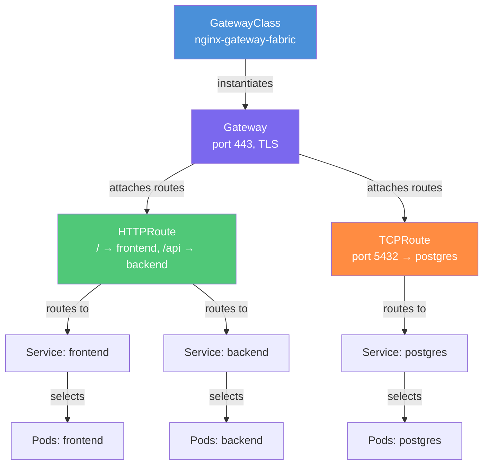

# Module 31: Kubernetes Gateway API

## The Story So Far

Imagine you are the platform engineer at a mid-sized company. Your developers are deploying microservices and they all need to expose their services to the internet. You reach for the obvious tool: **Ingress**. It works. For a while.

Then the requests start coming in.

"We need header-based routing for A/B testing." — You add twelve annotations.
"We need to split 10% of traffic to the canary." — More annotations. The YAML starts to look like a configuration file from a different era.
"We need to route raw TCP traffic for our database." — Silence. Ingress simply cannot do this.
"Our nginx Ingress controller annotations don't work on the ALB controller." — Of course not. They never did.

This was the lived experience of Kubernetes users for years. **Gateway API** is the answer the community built to escape it.

> **🐳 Coming from Docker?**
>
> In Docker, you expose a service with `-p 80:80` — one port, one container. For multiple services, you'd manually configure an nginx container as a reverse proxy. Kubernetes Ingress was the first attempt at a managed reverse proxy: declare routing rules in YAML, and an Ingress controller handles the nginx config for you. Gateway API is the next generation: it separates the "what cluster-level gateway exists" (platform team's job) from "what routes my app uses" (app team's job). It also natively supports traffic splitting for canary releases, header-based routing for A/B tests, and more protocols than just HTTP — things Ingress required messy, non-portable annotations to achieve.

---

## The Problem With Ingress

Kubernetes Ingress (introduced in 1.1, stable in 1.19) was designed as a minimal abstraction for HTTP/HTTPS routing. It got the job done for simple cases, but its limitations became glaring at scale:

| Problem | Details |
|---|---|
| **HTTP only** | No native TCP, UDP, or gRPC routing — you need separate CRDs per controller |
| **Non-standard annotations** | `nginx.ingress.kubernetes.io/canary-weight` only works on nginx; it means nothing to Traefik or ALB |
| **No role separation** | One `Ingress` resource mixes infrastructure config (TLS, certs) with app routing (paths) — a namespace admin can accidentally reconfigure the load balancer |
| **Limited traffic management** | No traffic splitting, header injection, request mirroring, or URL rewriting in the spec |
| **No cross-namespace routing** | A service in namespace `backend` cannot be referenced from an Ingress in namespace `frontend` |

The community workaround was an explosion of proprietary annotations — over 60 for nginx alone. Every controller invented its own vocabulary. Portability was essentially zero.

---

## Enter Gateway API

**Gateway API** is the official, graduated successor to Ingress. It reached **General Availability (GA) in Kubernetes 1.28 (October 2023)** and is now the recommended way to manage traffic entering a cluster.

It was designed from the ground up to solve every Ingress limitation:

- **Role-oriented**: Different resources for different teams
- **Expressive**: Traffic splitting, retries, redirects, header manipulation — all in the spec, no annotations
- **Protocol-aware**: HTTP, HTTPS, TCP, UDP, gRPC — all first-class citizens
- **Portable**: The same HTTPRoute works on nginx, Istio, Envoy Gateway, and AWS ALB
- **Cross-namespace**: Services can be referenced across namespaces with explicit grants

---

## Core Resources

Gateway API is built around four interconnected resources. Understanding their hierarchy is the key to understanding everything else.



### GatewayClass

`GatewayClass` is cluster-scoped (like `StorageClass`). It names the controller that will implement the gateway. The platform team creates this once.

```yaml
apiVersion: gateway.networking.k8s.io/v1
kind: GatewayClass
metadata:
  name: nginx
spec:
  controllerName: gateway.nginx.org/nginx-gateway-controller
```

Think of it like `StorageClass`: it defines *which implementation* to use, not *how* to configure it for a specific application.

### Gateway

`Gateway` is the actual listener — it defines which ports and protocols the load balancer or proxy will open. The platform team manages this. It can live in an `infra` namespace while application HTTPRoutes live in `dev` namespaces.

```yaml
apiVersion: gateway.networking.k8s.io/v1
kind: Gateway
metadata:
  name: prod-gateway
  namespace: infra
spec:
  gatewayClassName: nginx
  listeners:
  - name: https
    port: 443
    protocol: HTTPS
    tls:
      mode: Terminate
      certificateRefs:
      - name: prod-tls-cert
```

### HTTPRoute

`HTTPRoute` is where the application team lives. They define routing rules — which paths go to which services, how to split traffic, which headers to match. Crucially, they do not need to touch the Gateway to do this.

```yaml
apiVersion: gateway.networking.k8s.io/v1
kind: HTTPRoute
metadata:
  name: app-routes
  namespace: dev
spec:
  parentRefs:
  - name: prod-gateway
    namespace: infra
  rules:
  - matches:
    - path:
        type: PathPrefix
        value: /api
    backendRefs:
    - name: backend-svc
      port: 8080
  - matches:
    - path:
        type: PathPrefix
        value: /
    backendRefs:
    - name: frontend-svc
      port: 3000
```

### Non-HTTP Routes

| Route Type | Use Case | Stability |
|---|---|---|
| `TCPRoute` | Raw TCP (databases, Redis) | Experimental |
| `TLSRoute` | TLS passthrough | Experimental |
| `GRPCRoute` | gRPC services with method-level routing | GA (1.31) |
| `UDPRoute` | UDP services (DNS, syslog) | Experimental |

---

## Role Separation: A Key Design Principle

Gateway API was explicitly designed around three personas:

```
Infrastructure Provider  →  GatewayClass (cluster-scoped, once)
       |
Platform Engineer        →  Gateway (per cluster/env, in infra namespace)
       |
Application Developer    →  HTTPRoute (per service, in app namespace)
```

This is not just organizational tidiness — it has real security implications. In the Ingress world, any developer with namespace access could add annotations that changed load balancer behavior. With Gateway API, a developer can only modify routes within their own namespace. They cannot change TLS settings, ports, or the underlying controller configuration.

The attachment model (via `parentRefs`) explicitly links routes to gateways, and `ReferenceGrant` controls which namespaces a gateway will accept routes from.

---

## Key Features

### Traffic Splitting (Canary Deployments)

Split traffic between two versions by weight — no annotations, fully portable:

```yaml
rules:
- backendRefs:
  - name: app-stable
    port: 8080
    weight: 90
  - name: app-canary
    port: 8080
    weight: 10
```

### Header-Based Routing (A/B Testing)

Route users in a beta program to the new version:

```yaml
rules:
- matches:
  - headers:
    - name: X-Beta-User
      value: "true"
  backendRefs:
  - name: app-v2
    port: 8080
```

### Request Mirroring

Send 100% of traffic to production AND a copy to a shadow service for testing, without affecting users:

```yaml
rules:
- backendRefs:
  - name: app-production
    port: 8080
  filters:
  - type: RequestMirror
    requestMirror:
      backendRef:
        name: app-shadow
        port: 8080
```

### URL Rewriting

Strip path prefixes before forwarding to backends:

```yaml
filters:
- type: URLRewrite
  urlRewrite:
    path:
      type: ReplacePrefixMatch
      replacePrefixMatch: /
```

### Response Header Modification

Add security headers or CORS headers at the gateway level:

```yaml
filters:
- type: ResponseHeaderModifier
  responseHeaderModifier:
    add:
    - name: X-Frame-Options
      value: DENY
    - name: X-Content-Type-Options
      value: nosniff
```

---

## Supported Implementations

Gateway API is just a spec. The actual work is done by conformant controllers. As of 2024-2025, mature implementations include:

| Implementation | Notes |
|---|---|
| **NGINX Gateway Fabric** | Official NGINX implementation, production-ready |
| **Istio** | Full service mesh; Gateway API is its primary ingress model |
| **Envoy Gateway** | CNCF project; Envoy proxy with Gateway API control plane |
| **Traefik** | v3+ supports Gateway API natively |
| **AWS Load Balancer Controller** | ALB/NLB via Gateway API |
| **GKE Gateway Controller** | Google's implementation on GKE; uses Google Cloud LB |
| **Contour** | VMware-backed, strong Gateway API support |
| **Kong** | Enterprise gateway with full Gateway API support |

All of these share the same `HTTPRoute` syntax — your routing rules are portable across all of them.

---

## Migration from Ingress to Gateway API

Migration is not a flag you flip — it is a gradual process. The recommended path:

1. **Install a Gateway API-compliant controller** alongside your existing Ingress controller
2. **Create a GatewayClass and Gateway** that mirrors your existing Ingress configuration
3. **Translate Ingress rules to HTTPRoutes** — most path-based and host-based rules translate directly
4. **Test with canary traffic** before cutting over fully
5. **Decommission the Ingress resources** once HTTPRoutes are validated

Both Ingress and HTTPRoute can coexist in the same cluster during migration.

---

## Ingress vs Gateway API Comparison

| Feature | Ingress | Gateway API |
|---|---|---|
| Status | Stable (frozen) | GA in 1.28, actively developed |
| Protocol support | HTTP/HTTPS only | HTTP, HTTPS, TCP, UDP, gRPC |
| Traffic splitting | Via annotations (non-portable) | Native `weight` field |
| Header matching | Via annotations | Native `headers` match |
| URL rewriting | Via annotations | Native `URLRewrite` filter |
| Request mirroring | Not supported | Native `RequestMirror` filter |
| Cross-namespace routing | Not supported | Via `ReferenceGrant` |
| Role separation | None | GatewayClass / Gateway / Route |
| Portability | Low (annotation hell) | High (same YAML on all controllers) |
| gRPC routing | Not supported | `GRPCRoute` (GA in 1.31) |

---

## Getting Started

Install the Gateway API CRDs (required before any controller):

```bash
# Install standard channel CRDs (HTTPRoute, GatewayClass, Gateway, GRPCRoute)
kubectl apply -f https://github.com/kubernetes-sigs/gateway-api/releases/download/v1.2.0/standard-install.yaml

# Install experimental channel (TCPRoute, TLSRoute, UDPRoute)
kubectl apply -f https://github.com/kubernetes-sigs/gateway-api/releases/download/v1.2.0/experimental-install.yaml
```

Then install a controller (e.g., NGINX Gateway Fabric):

```bash
helm install ngf oci://ghcr.io/nginx/charts/nginx-gateway-fabric \
  --namespace nginx-gateway \
  --create-namespace
```

---

## Summary

Gateway API is not just an upgrade to Ingress — it is a fundamentally better model for managing traffic in Kubernetes. It separates concerns between teams, supports all protocols, brings traffic management features into the spec instead of annotations, and is portable across every major implementation. If you are building a new cluster today, Gateway API is where you start.

---

## 📂 Navigation

| | |
|---|---|
| Previous | [30_Cost_Optimization](../30_Cost_Optimization/) |
| Next | [32_KEDA_Event_Driven_Autoscaling](../32_KEDA_Event_Driven_Autoscaling/) |
| Up | [02_Kubernetes](../) |

**Files in this module:**
- [Theory.md](./Theory.md) — Concepts and architecture
- [Cheatsheet.md](./Cheatsheet.md) — Quick reference
- [Interview_QA.md](./Interview_QA.md) — Common interview questions
- [Code_Example.md](./Code_Example.md) — Working YAML examples
