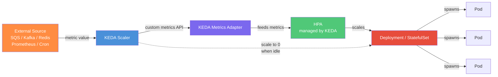

# Module 32: KEDA — Kubernetes Event Driven Autoscaling

## The Story: When CPU Metrics Lie

It is 2 AM. Your image processing service is backed by an SQS queue. A marketing campaign just dropped and 50,000 images are waiting to be resized. Your Horizontal Pod Autoscaler is watching CPU. The pods are idle — they are waiting on the queue, not burning CPU. HPA says: scale down.

By 3 AM, the backlog is so large that your pods are now thrashing. CPU spikes. HPA finally reacts. It takes three minutes to schedule and start new pods. By the time they are up, the user experience is already damaged.

The fundamental problem: **HPA scales on CPU and memory. Queue depth is neither.**

This is the problem KEDA was built to solve.

> **🐳 Coming from Docker?**
>
> Docker has no autoscaling at all. In Docker Swarm, `docker service scale app=10` is manual. Kubernetes HPA scales on CPU and memory — which is fine for web workloads but useless for a queue consumer (a queue might be empty but the processor is still sitting at 0% CPU). KEDA connects Kubernetes scaling directly to the things that actually represent work: a message in an SQS queue, a Kafka consumer lag, a Prometheus metric, a Redis list length. It can also scale to zero replicas — meaning idle workloads cost nothing. For event-driven architectures, KEDA is what makes Kubernetes autoscaling actually work.

---

## What Is KEDA?

**KEDA** (Kubernetes Event Driven Autoscaling) is a CNCF-graduated project that enables Kubernetes to scale workloads based on external event sources — not just CPU and memory.

Key characteristics:
- Graduated CNCF project (production-ready, vendor-neutral)
- Extends Kubernetes HPA rather than replacing it
- Supports 50+ event source scalers out of the box
- Can scale to **zero** pods when there are no events (impossible with standard HPA, which has a minimum of 1)
- Works with Deployments, StatefulSets, Jobs, and custom resources
- Version 2.x is the current stable release (2024)

---

## How KEDA Works

KEDA does not replace HPA — it augments it. When you create a `ScaledObject`, KEDA does two things:

1. Creates or manages an HPA resource on your behalf
2. Connects the HPA's external metrics to your chosen event source via the KEDA Metrics Adapter



The KEDA **Operator** watches `ScaledObject` and `ScaledJob` resources. When a trigger fires (queue depth crosses threshold), it updates the HPA's target metric, which then drives the Deployment to scale.

For scale-to-zero: KEDA bypasses HPA entirely and scales the Deployment directly to 0. When events resume, it scales back to 1 first (triggering HPA again), then HPA handles the rest.

---

## Architecture Components

KEDA installs two components in your cluster:

| Component | Role |
|---|---|
| **KEDA Operator** | Watches ScaledObjects/ScaledJobs, manages HPA, handles scale-to-zero |
| **KEDA Metrics Adapter** | Serves custom and external metrics to the Kubernetes Metrics API (used by HPA) |

Both run as Deployments in the `keda` namespace. They communicate with external sources (SQS, Kafka, etc.) using credentials you provide via Kubernetes Secrets.

---

## ScaledObject: The Core Resource

`ScaledObject` links a deployment to one or more triggers (scalers). It is the most commonly used KEDA resource.

```yaml
apiVersion: keda.sh/v1alpha1
kind: ScaledObject
metadata:
  name: worker-scaler
  namespace: production
spec:
  scaleTargetRef:
    name: image-worker          # the Deployment to scale
  minReplicaCount: 0            # scale to zero when idle
  maxReplicaCount: 50           # never exceed this
  pollingInterval: 30           # check the scaler every 30 seconds
  cooldownPeriod: 300           # wait 5 min before scaling to zero
  triggers:
  - type: aws-sqs-queue
    metadata:
      queueURL: https://sqs.us-east-1.amazonaws.com/123456789/my-queue
      queueLength: "10"         # target: 10 messages per pod
      awsRegion: us-east-1
```

When the queue has 100 messages and `queueLength` is 10, KEDA targets 10 pods. When the queue is empty, KEDA scales to zero after `cooldownPeriod` seconds.

### Key ScaledObject fields

| Field | Description |
|---|---|
| `scaleTargetRef.name` | Name of the Deployment/StatefulSet to scale |
| `minReplicaCount` | Minimum pods (0 = scale to zero) |
| `maxReplicaCount` | Maximum pods |
| `pollingInterval` | How often to check the scaler (seconds) |
| `cooldownPeriod` | How long idle before scaling to zero (seconds) |
| `triggers` | List of scalers (can have multiple — KEDA scales to the max) |

---

## Scale to Zero: KEDA's Killer Feature

Standard Kubernetes HPA has a hard minimum of 1 pod. This means your queue workers are always running, even at 3 AM when no messages arrive. In a large cluster with many services, this idle cost adds up fast.

KEDA breaks this limitation. With `minReplicaCount: 0`:

- When the queue is empty for longer than `cooldownPeriod`, KEDA scales the Deployment to 0 replicas
- Zero pods = zero cost (important for Spot/Fargate pricing models)
- When a new message arrives, KEDA detects it and scales from 0 → 1 (the "cold start")
- HPA then takes over and scales from 1 → N based on the metric

The trade-off is the cold start time: typically 10-30 seconds for a new pod to start and begin processing. For batch/async workloads, this is acceptable. For user-facing services, you usually keep `minReplicaCount: 1`.

---

## Supported Scalers (50+)

KEDA has a massive library of built-in scalers. The most commonly used:

| Category | Scalers |
|---|---|
| **Message Queues** | AWS SQS, Azure Service Bus, RabbitMQ, Google Pub/Sub, IBM MQ |
| **Streaming** | Apache Kafka (consumer lag), AWS Kinesis |
| **Caching** | Redis (list length, stream), Memcached |
| **Observability** | Prometheus (any PromQL query), Datadog, New Relic |
| **Databases** | PostgreSQL (query result), MySQL, MongoDB |
| **Storage** | AWS S3 (object count), Azure Blob Storage |
| **Scheduling** | Cron (scale on a schedule, e.g., business hours only) |
| **HTTP** | HTTP request rate (via KEDA HTTP Add-on) |
| **Cloud** | Azure Event Hub, Azure Monitor, AWS CloudWatch, GCP Cloud Tasks |

Full list: https://keda.sh/docs/scalers/

---

## ScaledJob: For Batch Workloads

`ScaledJob` is designed for workloads where **each message should be processed by its own pod**. Instead of scaling a long-running Deployment, it creates a new Kubernetes Job for each batch of messages.

Use when:
- Each queue message takes >30 seconds to process
- You want strict isolation between message processing runs
- You need to track completion status per message

```yaml
apiVersion: keda.sh/v1alpha1
kind: ScaledJob
metadata:
  name: batch-processor
spec:
  jobTargetRef:
    template:
      spec:
        containers:
        - name: processor
          image: myrepo/batch-processor:latest
  maxReplicaCount: 20
  triggers:
  - type: aws-sqs-queue
    metadata:
      queueURL: https://sqs.us-east-1.amazonaws.com/123456789/batch-queue
      queueLength: "1"          # 1 job per message
```

---

## TriggerAuthentication: Secure Credentials

KEDA needs credentials to query external sources. `TriggerAuthentication` keeps these separate from the ScaledObject, allowing reuse:

```yaml
apiVersion: keda.sh/v1alpha1
kind: TriggerAuthentication
metadata:
  name: sqs-auth
  namespace: production
spec:
  secretTargetRef:
  - parameter: awsAccessKeyID
    name: aws-credentials
    key: AWS_ACCESS_KEY_ID
  - parameter: awsSecretAccessKey
    name: aws-credentials
    key: AWS_SECRET_ACCESS_KEY
```

Reference it from a ScaledObject trigger:

```yaml
triggers:
- type: aws-sqs-queue
  authenticationRef:
    name: sqs-auth
  metadata:
    queueURL: https://sqs.us-east-1.amazonaws.com/...
```

For AWS EKS with IAM Roles for Service Accounts (IRSA), you can use pod identity instead of static credentials — the recommended approach in 2024.

---

## Multiple Triggers: Scale on the Most Demanding Metric

A single ScaledObject can have multiple triggers. KEDA evaluates all triggers and scales to the **maximum** of all trigger-recommended replica counts. This is useful for workloads that respond to multiple inputs:

```yaml
triggers:
- type: kafka
  metadata:
    topic: orders
    consumerGroup: order-processor
    lagThreshold: "50"
- type: prometheus
  metadata:
    serverAddress: http://prometheus:9090
    metricName: order_processing_errors_total
    threshold: "100"
    query: sum(rate(order_processing_errors_total[1m]))
```

If Kafka consumer lag says "you need 8 pods" but Prometheus error rate says "you need 12 pods", KEDA will scale to 12.

---

## Real Use Case: Image Processing Pipeline

```
User uploads image
       ↓
API Gateway → S3 bucket → S3 Event notification → SQS queue
                                                       ↓
                                            KEDA monitors queue depth
                                                       ↓
                                           0 messages → 0 worker pods
                                           100 messages → 10 worker pods
                                           1000 messages → 50 worker pods
```

Workers poll SQS, download from S3, resize image, upload result, delete message. When the campaign ends and the queue drains, workers scale back to zero. No idle cost overnight.

---

## KEDA vs HPA Comparison

| Feature | Standard HPA | KEDA |
|---|---|---|
| Scale on CPU/Memory | Yes | Yes (via Prometheus scaler) |
| Scale on queue depth | No | Yes (50+ queue scalers) |
| Scale to zero | No (minimum 1) | Yes |
| Multi-trigger scaling | No | Yes (max of all triggers) |
| Cron scheduling | No | Yes (Cron scaler) |
| Job-based scaling | No | Yes (ScaledJob) |
| Cloud vendor metrics | No | Yes (CloudWatch, Azure Monitor) |
| CNCF project | N/A (core K8s) | Graduated |

---

## Installation

```bash
# Install KEDA via Helm
helm repo add kedacore https://kedacore.github.io/charts
helm repo update
helm install keda kedacore/keda \
  --namespace keda \
  --create-namespace \
  --version 2.16.0

# Verify
kubectl get pods -n keda
# NAME                                      READY   STATUS    RESTARTS   AGE
# keda-operator-5d5d5b9b9-xxxxx            1/1     Running   0          1m
# keda-operator-metrics-apiserver-xxxxx    1/1     Running   0          1m
```

---

## Summary

KEDA solves the fundamental gap in Kubernetes autoscaling: HPA only knows about CPU and memory, but most real workloads scale based on business signals — queue depth, consumer lag, Prometheus metrics, or a cron schedule. KEDA connects these signals to the Kubernetes scaling machinery, adds the ability to scale to zero, and does so as a graduated CNCF project that is production-ready in 2024. If you run any queue-based, event-driven, or batch workloads on Kubernetes, KEDA should be in your toolkit.

---

## 📂 Navigation

| | |
|---|---|
| Previous | [31_Gateway_API](../31_Gateway_API/) |
| Next | [33_Karpenter_Node_Autoprovisioning](../33_Karpenter_Node_Autoprovisioning/) |
| Up | [02_Kubernetes](../) |

**Files in this module:**
- [Theory.md](./Theory.md) — Concepts and architecture
- [Cheatsheet.md](./Cheatsheet.md) — Quick reference
- [Interview_QA.md](./Interview_QA.md) — Common interview questions
- [Code_Example.md](./Code_Example.md) — Working YAML examples
