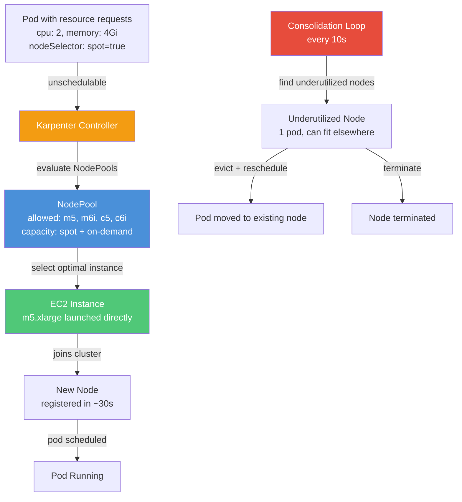

# Module 33: Karpenter — Next-Generation Node Autoprovisioning

## The Story: When Your Cluster Can't Get Out of Its Own Way

It is Black Friday. Your e-commerce platform is getting hammered. Pods are pending — not because of bugs, but because there are no nodes to run them on. Cluster Autoscaler is doing what it does: looking at the fixed set of Auto Scaling Groups you configured months ago, deciding which group to expand, waiting for the AWS API to acknowledge, waiting for the instance to boot, waiting for kubelet to register. Three minutes have passed. The pods are still pending.

Meanwhile, your Node Group is `m5.large` only — because that's what was in the Terraform. The pods need `m5.xlarge`. So Cluster Autoscaler cannot help them at all. It scales up more `m5.large` nodes that are too small, which then go to waste.

And at 2 AM when load drops, those oversized nodes sit idle. Cluster Autoscaler is conservative about scale-down. It does not want to disrupt running pods. The nodes drain slowly. Your cloud bill does not.

This is the world that **Karpenter** was designed to escape.

> **🐳 Coming from Docker?**
>
> In Docker, "adding more capacity" means manually provisioning a new VM and joining it to your Swarm. The Kubernetes Cluster Autoscaler automates this but is limited to pre-defined node groups — you declare what instance types are available, and it picks from those. Karpenter bypasses node groups entirely: it looks at what pods are pending, calculates exactly what instance type would pack them most efficiently, and provisions that specific instance from EC2 directly in about 30 seconds. It also runs continuously in the background, consolidating underutilized nodes — if 3 pods from a half-empty node could fit on an existing node, Karpenter moves them and terminates the empty node automatically.

---

## Cluster Autoscaler: The Limitations

Cluster Autoscaler (CA) has been the standard K8s node scaling tool since 2016. It works by monitoring unschedulable pods and expanding Auto Scaling Groups (ASGs). It has served well, but its architectural constraints create real operational pain:

| Limitation | Impact |
|---|---|
| **Fixed node groups** | You pre-define which ASGs exist. Karpenter creates nodes dynamically without pre-defined groups. |
| **One instance type per ASG** | You must create separate ASGs per instance type. CA cannot mix `m5.large` and `c5.large` in one decision. |
| **Slow to respond** | CA checks every 10s, then must select an ASG, then waits for the ASG to act. Total: 2-3 minutes. |
| **Weak pod understanding** | CA considers node capacity but does not deeply understand pod affinity, topology spread, or scheduling constraints when choosing node size. |
| **Passive consolidation** | CA `--scale-down` is slow and conservative. It does not proactively right-size the cluster. |
| **No Spot diversification** | CA can use Spot, but managing multiple Spot ASGs for capacity diversification is complex and manual. |

---

## Enter Karpenter

**Karpenter** is a next-generation node autoprovisioner built by AWS. It was open-sourced in 2021, donated to the CNCF in 2023, and reached **v1.0 in 2024**. It is now the recommended node autoscaler for EKS.

Core philosophy: **Just-in-time node provisioning.** Karpenter watches for unschedulable pods, computes exactly what node(s) those pods need, and launches them directly — bypassing ASGs entirely.

Key numbers:
- Launch time: ~**30 seconds** (vs 2-3 minutes for CA)
- Instance type flexibility: can evaluate **hundreds** of instance types in one decision
- Consolidation: proactively **right-sizes** the cluster by bin-packing and replacing nodes

---

## How Karpenter Works



Karpenter's lifecycle for a new node:
1. **Detect**: Scheduler marks pod as unschedulable (no existing node can fit it)
2. **Evaluate**: Karpenter examines the pod's requirements (resources, tolerations, nodeSelector, affinity)
3. **Select**: Karpenter evaluates all instance types allowed by the matching NodePool(s) and picks the most cost-efficient one that satisfies all pod requirements
4. **Launch**: Karpenter calls EC2 `RunInstances` API directly (no ASG required)
5. **Bootstrap**: Instance boots, kubelet registers, node becomes Ready in ~30 seconds
6. **Schedule**: kube-scheduler places the pending pod on the new node

---

## Core Concepts

### NodePool

`NodePool` replaces the concept of a fixed Auto Scaling Group. It defines the *constraints* of what nodes Karpenter can provision — which instance families, architectures, capacity types (spot/on-demand), and operating systems are allowed. Within those constraints, Karpenter makes the specific instance type decision at provision time.

```yaml
apiVersion: karpenter.sh/v1
kind: NodePool
metadata:
  name: general-purpose
spec:
  template:
    spec:
      nodeClassRef:
        group: karpenter.k8s.aws
        kind: EC2NodeClass
        name: default
      requirements:
      - key: karpenter.sh/capacity-type
        operator: In
        values: ["spot", "on-demand"]
      - key: karpenter.k8s.aws/instance-family
        operator: In
        values: ["m5", "m6i", "m6a", "c5", "c6i"]
      - key: kubernetes.io/arch
        operator: In
        values: ["amd64"]
  limits:
    cpu: 1000                   # stop provisioning at 1000 vCPUs total
    memory: 4000Gi
  disruption:
    consolidationPolicy: WhenEmptyOrUnderutilized
    consolidateAfter: 1m
```

### EC2NodeClass

`EC2NodeClass` is AWS-specific configuration: which AMI family to use, which subnets, which security groups, and any user data for bootstrapping. It is separated from NodePool because it contains AWS infrastructure details while NodePool contains scheduling logic.

```yaml
apiVersion: karpenter.k8s.aws/v1
kind: EC2NodeClass
metadata:
  name: default
spec:
  amiFamily: AL2023             # Amazon Linux 2023 (recommended for EKS 1.30+)
  role: KarpenterNodeRole       # IAM role for the EC2 instance
  subnetSelectorTerms:
  - tags:
      karpenter.sh/discovery: my-cluster
  securityGroupSelectorTerms:
  - tags:
      karpenter.sh/discovery: my-cluster
  tags:
    Environment: production
    ManagedBy: karpenter
```

---

## Consolidation: Karpenter's Underrated Feature

Consolidation is where Karpenter provides day-2 value that Cluster Autoscaler simply cannot match. It works in two modes:

### WhenEmpty
Remove nodes that have no running pods (ignoring daemonsets). This is the conservative mode — only deprovisioning genuinely empty nodes.

### WhenEmptyOrUnderutilized
Proactively evaluate whether running pods can be bin-packed onto fewer nodes. If so:
1. Evict pods from underutilized nodes (respecting PodDisruptionBudgets)
2. Wait for pods to reschedule on existing nodes
3. Terminate the now-empty node

Example: You have 10 nodes at 20% utilization. After a traffic drop, Karpenter might consolidate those pods onto 4 nodes and terminate 6, saving 60% of node costs automatically.

**Disruption controls**: You can budget how aggressively consolidation runs:

```yaml
disruption:
  consolidationPolicy: WhenEmptyOrUnderutilized
  consolidateAfter: 30s
  budgets:
  - nodes: "10%"               # never consolidate more than 10% of nodes at once
  - schedule: "0 9 * * 1-5"   # more permissive during business hours
    duration: 8h
    nodes: "20%"
```

---

## Spot Instance Handling

Karpenter makes Spot usage dramatically simpler than Cluster Autoscaler. Rather than managing multiple Spot ASGs, you specify Spot as an allowed capacity type in the NodePool. Karpenter handles:

1. **Instance diversification**: evaluates many instance families simultaneously, picking the best available Spot pool
2. **Automatic fallback**: if Spot capacity is unavailable, Karpenter falls back to on-demand for that specific pod
3. **Interruption handling**: Karpenter watches EC2 Spot interruption notices and begins draining the node before AWS terminates it (2-minute warning)
4. **Re-provisioning**: After a Spot interruption, Karpenter immediately provisions a replacement node

A common pattern is to label workloads by their Spot tolerance:

```yaml
# Stateless web workers — cheap on Spot
nodeSelector:
  karpenter.sh/capacity-type: spot

# Stateful services — must be on-demand
nodeSelector:
  karpenter.sh/capacity-type: on-demand
```

---

## Multi-Architecture: arm64 for Cost Savings

Graviton (arm64) instances are typically 20-40% cheaper per vCPU than equivalent x86 instances on AWS. Karpenter can provision Graviton nodes when pods are arm64-compatible:

```yaml
requirements:
- key: kubernetes.io/arch
  operator: In
  values: ["amd64", "arm64"]
- key: karpenter.k8s.aws/instance-family
  operator: In
  values: ["m7g", "c7g", "r7g"]   # Graviton 3 families
```

Pods must have multi-arch container images. Build with `docker buildx` for `linux/amd64,linux/arm64`.

---

## Karpenter vs Cluster Autoscaler

| Feature | Cluster Autoscaler | Karpenter |
|---|---|---|
| Node provisioning time | 2-3 minutes | ~30 seconds |
| Instance type flexibility | Fixed per ASG | Dynamic — evaluates hundreds at decision time |
| Spot management | Multiple ASGs required | Native, with interruption handling |
| Consolidation | Passive (scale-down only) | Proactive bin-packing |
| Multi-arch support | Manual ASG per arch | Native |
| ASG dependency | Required | Not required (direct EC2 API) |
| arm64/Graviton | Manual | Native |
| CNCF project | Yes (Kubernetes SIG) | Yes (donated 2023) |
| Cloud support | Multi-cloud | AWS (Azure preview, GCP community) |
| v1.0 stability | Stable | v1.0 in 2024 |

---

## Installation (EKS)

```bash
# Install Karpenter via Helm
helm upgrade --install karpenter oci://public.ecr.aws/karpenter/karpenter \
  --version "1.0.0" \
  --namespace karpenter \
  --create-namespace \
  --set "settings.clusterName=${CLUSTER_NAME}" \
  --set "settings.interruptionQueue=${KARPENTER_SQS_QUEUE}" \
  --set controller.resources.requests.cpu=1 \
  --set controller.resources.requests.memory=1Gi \
  --wait

# Verify
kubectl get pods -n karpenter
kubectl get nodepools
kubectl get ec2nodeclasses
```

---

## Protecting Workloads from Consolidation

PodDisruptionBudgets are Karpenter's primary mechanism for protection:

```yaml
apiVersion: policy/v1
kind: PodDisruptionBudget
metadata:
  name: api-pdb
spec:
  minAvailable: "50%"          # Karpenter will never evict below 50% available
  selector:
    matchLabels:
      app: api-service
```

You can also opt specific pods out of consolidation entirely:

```yaml
# Pod annotation to prevent Karpenter from evicting this pod for consolidation
metadata:
  annotations:
    karpenter.sh/do-not-disrupt: "true"
```

---

## Summary

Karpenter represents a fundamental rethinking of node autoscaling. Rather than managing fixed pools and waiting for ASGs, it computes ideal nodes on-demand and launches them in seconds. Its consolidation engine continuously right-sizes the cluster without human intervention. For any EKS cluster with variable workloads — especially those using Spot instances or multiple instance families — Karpenter is the modern standard as of 2024.

---

## 📂 Navigation

| | |
|---|---|
| Previous | [32_KEDA_Event_Driven_Autoscaling](../32_KEDA_Event_Driven_Autoscaling/) |
| Next | [34_eBPF_and_Cilium](../34_eBPF_and_Cilium/) |
| Up | [02_Kubernetes](../) |

**Files in this module:**
- [Theory.md](./Theory.md) — Concepts and architecture
- [Cheatsheet.md](./Cheatsheet.md) — Quick reference
- [Interview_QA.md](./Interview_QA.md) — Common interview questions
- [Code_Example.md](./Code_Example.md) — Working YAML examples
