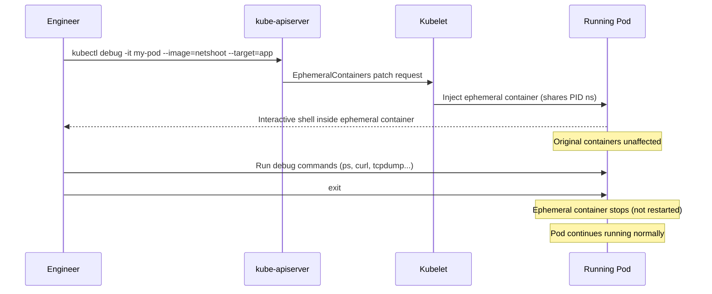
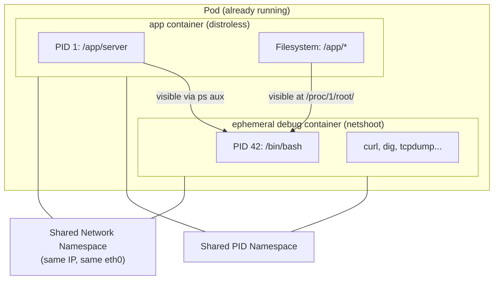

# Module 35 — Ephemeral Containers and Debugging

## The Story: Locked Out of Your Own House

You built a sleek, minimal app and packaged it into a distroless container image. No shell. No package manager. No debugging tools. The image is tiny, secure, and production-ready.

Then, at 2 AM, the pod starts crashing. You reach for the usual lifeline:

```bash
kubectl exec -it my-pod -- /bin/sh
```

And you get:

```
OCI runtime exec failed: exec failed: unable to start container process:
exec: "/bin/sh": stat /bin/sh: no such file or directory
```

No shell. No `curl`. No `ps`. You are locked out of your own house while the fire alarm is blaring.

This was the state of Kubernetes debugging for years. Teams faced a terrible tradeoff: keep images lean and secure (but undebuggable) OR add debugging tools to production images (defeating the purpose of distroless). Some engineers kept a "fat" debug image on standby and would swap out the running container — a disruptive, slow workaround that required restarting the pod and losing the crash state.

**Ephemeral containers** solve this problem entirely. They let you inject a temporary, fully-equipped debug container into a running pod — without restarting it, without modifying the original image, and without the debug container affecting the pod's production workload.

---

## What Are Ephemeral Containers?

An ephemeral container is a special type of container that can be added to an **already running pod** using `kubectl debug`. Unlike regular containers:

- They are **temporary** — not part of the pod spec, not restarted if they exit
- They **share namespaces** with the target container (PID, network, filesystem with volume mounts)
- They cannot have ports, liveness/readiness probes, or resource limits changed after creation
- Once added, they cannot be removed — the pod must be deleted to clean up

Ephemeral containers became **stable in Kubernetes 1.25** (late 2022) and have been the standard debugging approach since 1.26+.

---

## The Core Command

```bash
kubectl debug -it POD_NAME --image=busybox --target=CONTAINER_NAME
```

Breaking this down:

| Flag | Meaning |
|------|---------|
| `-it` | Interactive TTY (like `kubectl exec -it`) |
| `--image=busybox` | The image for the ephemeral container (has shell, basic tools) |
| `--target=CONTAINER_NAME` | Share the PID namespace with this specific container |

The `--target` flag is critical: it enables **process namespace sharing**. Without it, the ephemeral container gets its own PID namespace and can't see the target's processes. With it, you can run `ps aux` inside the ephemeral container and see all processes from the target container — including the crashing app.

---

## Process Namespace Sharing

When you use `--target`, Kubernetes configures the ephemeral container to share the target container's process namespace. This means:

```bash
# Inside the ephemeral container after kubectl debug --target=myapp
ps aux
# PID   USER     COMMAND
# 1     root     /app/myapp        ← the distroless app's process
# 42    root     /bin/sh           ← your debug shell
```

You can now:
- See what the app process is doing
- Inspect `/proc/1/fd` to see open file descriptors
- Attach to the process with strace (if strace is in your debug image)
- Check memory maps: `cat /proc/1/maps`

The target container's **filesystem** is accessible via `/proc/1/root/` — even though the container has no shell of its own.

---

## Ephemeral Container Lifecycle



---

## Common Debug Images

Choosing the right debug image matters. Here are the three most common:

### busybox
- Tiny (~1MB), has `sh`, `ls`, `cat`, `ps`, `wget`, basic networking
- Good for: quick filesystem inspection, simple connectivity tests
- Missing: `curl`, `dig`, `tcpdump`, `strace`

### nicolaka/netshoot
- The gold standard for network debugging (~300MB)
- Includes: `curl`, `wget`, `dig`, `nslookup`, `tcpdump`, `nmap`, `iperf3`, `ss`, `ip`, `traceroute`, `ping`, `strace`, `netstat`
- Good for: network issues, DNS problems, TLS debugging, performance analysis
- Use this when you don't know what's wrong yet

### ubuntu / debian
- Full apt-get ecosystem
- Good for: installing exactly the tools you need on the fly
- Larger, but flexible

---

## Debugging a Node

Sometimes the problem isn't in the pod — it's on the node itself: kubelet issues, node pressure, kube-proxy behavior, CNI problems. You can debug a node by creating a **privileged pod** that mounts the node's filesystem:

```bash
kubectl debug node/NODE_NAME --image=ubuntu --interactive --tty
```

This creates a pod on that node with:
- Host PID namespace enabled
- Host network namespace
- The node's root filesystem mounted at `/host`

```bash
# Inside the node debug pod
chroot /host          # enter the node's root filesystem
systemctl status kubelet
journalctl -u kubelet -f
crictl ps             # list containers via CRI (bypasses K8s API)
```

---

## Copying a Pod for Debugging

What if the pod crashes so fast you can't attach to it? Or the distroless container can't be exec'd into AND the pod doesn't support ephemeral containers (older K8s)?

You can **copy the pod** and replace its image with a debug image:

```bash
kubectl debug POD_NAME \
  --copy-to=debug-pod \
  --set-image='*=ubuntu' \
  --share-processes \
  -it -- bash
```

| What happens | Explanation |
|---|---|
| `--copy-to=debug-pod` | Creates a NEW pod named `debug-pod` |
| `--set-image='*=ubuntu'` | Replaces ALL container images with `ubuntu` |
| `--share-processes` | Enables PID namespace sharing between containers |

This is useful for:
- Debugging a pod that crashes immediately (before you can attach)
- Reproducing issues in a non-production copy
- Running the same environment with a different entrypoint

**Important**: the copy is a new pod — it won't have the live state of the original. But it will have the same volumes, environment variables, and configuration.

---

## Ephemeral Container Spec Constraints

When Kubernetes adds an ephemeral container, it uses a subset of the standard container spec. You **cannot** configure:

- `ports` — ephemeral containers cannot expose ports
- `livenessProbe`, `readinessProbe`, `startupProbe` — no probes
- `resources` — resource requests/limits **cannot be changed after creation**
- `lifecycle` — no preStop/postStart hooks

You **can** configure:
- `image` — any image from any registry
- `command` / `args` — what to run
- `env` / `envFrom` — environment variables
- `volumeMounts` — mount the same volumes as other containers

---

## Use Cases in Practice

### Debugging OOMKilled Pods

When a pod is OOMKilled, the container exits immediately. Before the pod is replaced:

```bash
kubectl debug -it my-pod --image=busybox --target=my-container
# Inside: check /proc/1/status for VmRSS (resident memory)
# Check what files are open: ls /proc/1/fd
# Look at container logs while it was running
```

### Network Connectivity Issues

```bash
kubectl debug -it my-pod --image=nicolaka/netshoot --target=my-container
# Inside:
curl -v http://other-service.namespace.svc.cluster.local
dig other-service.namespace.svc.cluster.local
tcpdump -i eth0 -w /tmp/capture.pcap
```

### Filesystem Inspection on Distroless

```bash
kubectl debug -it my-pod --image=busybox --target=my-container
# Inside:
ls /proc/1/root/   # browse the distroless container's filesystem
cat /proc/1/root/etc/ssl/certs/ca-certificates.crt
```

### Before Ephemeral Containers: The Security Anti-Pattern

Before ephemeral containers existed, teams would add `curl`, `bash`, `strace`, and other tools directly to production images — "just in case" debugging was needed. This:

- **Increased attack surface** — if an attacker gained code execution, they now had network tools
- **Bloated images** — adding 200MB of tools to a 20MB app
- **Violated least-privilege** — debug tools in production violate security best practices

Ephemeral containers eliminate this tradeoff entirely. Keep production images lean and distroless. Bring debug tools only when you need them, only into the running pod, for as long as you need them.

---

## Diagram: Ephemeral Container Joining Pod Namespaces



Both containers share the same:
- **Network namespace**: same IP address, same network interfaces — `curl localhost` from the ephemeral container hits the app's port
- **PID namespace** (when `--target` is set): same process tree
- **Volume mounts**: ephemeral container can mount the same volumes

---

## Summary: Which Debug Method to Use?

| Situation | Method |
|---|---|
| Pod is running, distroless | `kubectl debug -it POD --image=netshoot --target=CONTAINER` |
| Pod crashes immediately | `kubectl debug POD --copy-to=debug --set-image='*=ubuntu' -it -- bash` |
| Network issues | `kubectl debug -it POD --image=nicolaka/netshoot --target=CONTAINER` |
| Node-level problem | `kubectl debug node/NODE --image=ubuntu -it` |
| Need exact environment copy | `kubectl debug POD --copy-to=debug-pod --share-processes -it -- bash` |

---

## 📂 Navigation

| | Link |
|---|---|
| Previous | [34 — eBPF & Cilium](../34_eBPF_and_Cilium/Theory.md) |
| Next | [36 — ValidatingAdmissionPolicy](../36_ValidatingAdmissionPolicy/Theory.md) |
| Cheatsheet | [Ephemeral Containers Cheatsheet](./Cheatsheet.md) |
| Interview Q&A | [Ephemeral Containers Interview Q&A](./Interview_QA.md) |
| Code Examples | [Ephemeral Containers Code Examples](./Code_Example.md) |
