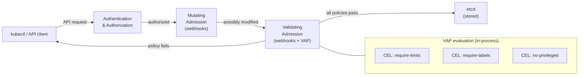

# Module 36 — ValidatingAdmissionPolicy

## The Story: The Security Guard Who Never Sleeps

Imagine a large company where every employee can submit requests for new IT resources: new servers, new accounts, new firewall rules. The security team wants to enforce policies: all servers must have resource limits, all accounts must have a team label, no one can request root access.

For years, the way to enforce this was to deploy an external system — a separate service that stood in the doorway and reviewed every request. OPA/Gatekeeper and Kyverno play this role in Kubernetes. They're powerful, but they come with a cost: you're adding a separate server into your admission pipeline. That server can have downtime. It adds latency to every API request. You need to maintain it, upgrade it, and manage its certificates.

Then Kubernetes 1.30 (April 2024) shipped **ValidatingAdmissionPolicy (VAP)** as GA. The security guard is now built into Kubernetes itself — no external server needed, no latency, no certificates to manage, no separate upgrade cycle.

> **🐳 Coming from Docker?**
>
> Docker has no policy system. Anyone with access to the Docker socket can run a privileged container, mount the host filesystem, or pull any image. Kubernetes had admission webhooks as the traditional way to enforce policies — an external HTTP server that Kubernetes calls before accepting any resource. The problem is that webhook server is now a critical dependency of your entire cluster: if it's down, no new pods can start. ValidatingAdmissionPolicy (GA in K8s 1.30) moves policy enforcement directly into the Kubernetes API server using CEL expressions — no external service, no network calls, no extra infrastructure to maintain. You write policy rules in YAML that run at the speed of the API server itself.

---

## 📌 Learning Priority

**Must Learn** — core concepts, needed to understand the rest of this file:
[VAP vs Webhooks](#validatingadmissionpolicy-policies-in-the-api-server) · [Core Resources](#core-resources) · [CEL Expressions](#cel-expression-language)

**Should Learn** — important for real projects and interviews:
[Validation Actions](#validation-actions-deny-warn-audit) · [VAP vs Kyverno vs OPA](#vap-vs-kyverno-vs-opagatekeeper) · [Parameterized Policies](#parameterized-policies-with-paramkind)

**Good to Know** — useful in specific situations, not needed daily:
[MatchConditions](#matchconditions-pre-filtering) · [Message Expressions](#message-expressions)

**Reference** — skim once, look up when needed:
[Admission Control Pipeline](#admission-control-pipeline) · [Old Webhook Approach](#the-old-way-webhook-based-admission-control)

---

## The Old Way: Webhook-Based Admission Control

Before VAP, policy enforcement required **admission webhooks**:

```
kubectl apply → API Server → Webhook call → External policy server → Allow/Deny → etcd
```

Both OPA/Gatekeeper and Kyverno work this way:

1. You deploy the policy engine as a pod in your cluster
2. The API server calls your pod's webhook endpoint for every relevant request
3. Your pod evaluates the policy and returns allow/deny
4. If your pod is unavailable, requests either fail (strict mode) or bypass the policy (permissive mode)

**Problems with the webhook approach:**
- Extra latency on every API call (network round-trip to the webhook pod)
- If the webhook pod crashes during a critical incident, you may be blocked from doing remediation
- Certificates must be managed (webhook servers need TLS)
- Separate deployment, upgrade, and operational burden
- RBAC for the webhook service accounts adds complexity

---

## ValidatingAdmissionPolicy: Policies in the API Server

VAP moves the policy evaluation engine **inside** the kube-apiserver using **CEL (Common Expression Language)** — a lightweight expression language originally developed by Google.

```
kubectl apply → API Server → CEL expression evaluated in-process → Allow/Deny → etcd
```

No network round-trip. No external service. No certificates. The policy runs as compiled code within the API server process itself.

VAP became **GA in Kubernetes 1.30** (April 2024).

---

## Core Resources

VAP uses two Kubernetes resources that work together:

### ValidatingAdmissionPolicy

Defines the **validation rule** using CEL expressions:

```yaml
apiVersion: admissionregistration.k8s.io/v1
kind: ValidatingAdmissionPolicy
metadata:
  name: require-resource-limits
spec:
  failurePolicy: Fail          # Fail or Ignore
  matchConstraints:
    resourceRules:
    - apiGroups: [""]
      apiVersions: ["v1"]
      operations: ["CREATE", "UPDATE"]
      resources: ["pods"]
  validations:
  - expression: >
      object.spec.containers.all(c,
        c.resources.limits.has('cpu') &&
        c.resources.limits.has('memory')
      )
    message: "All containers must have CPU and memory limits"
```

### ValidatingAdmissionPolicyBinding

**Binds** the policy to a scope (cluster-wide, specific namespaces, label selectors):

```yaml
apiVersion: admissionregistration.k8s.io/v1
kind: ValidatingAdmissionPolicyBinding
metadata:
  name: require-resource-limits-binding
spec:
  policyName: require-resource-limits   # references the VAP above
  validationActions: [Deny]             # Deny, Warn, or Audit
  matchResources:
    namespaceSelector:
      matchLabels:
        enforce-limits: "true"           # only apply to labeled namespaces
```

**The separation between policy and binding is intentional**: you write a policy once, then create multiple bindings to apply it to different scopes (dev namespace with Warn, production namespace with Deny, etc.).

---

## CEL Expression Language

CEL is a simple, safe expression language. It has no loops (prevents infinite loops) and no side effects. Every expression returns a boolean: `true` means valid, `false` means invalid.

### Key CEL Patterns for Kubernetes

```cel
# Check a field exists and has a value
object.metadata.labels.has('team')

# Check a field's value
object.spec.replicas <= 10

# Check all containers satisfy a condition
object.spec.containers.all(c,
  c.resources.limits.has('memory')
)

# Check NO containers are privileged
!object.spec.containers.exists(c,
  c.securityContext.privileged == true
)

# String operations
object.spec.containers.all(c,
  c.image.startsWith('registry.company.com/')
)

# Regex matching (K8s 1.28+)
object.spec.containers.all(c,
  c.image.matches('^registry\\.company\\.com/.*:[^latest].*$')
)

# Optional field access (safe navigation)
object.spec.?securityContext.?runAsNonRoot.orValue(false) == true
```

### CEL Built-in Functions for K8s

| Function | Example | Purpose |
|----------|---------|---------|
| `.all(var, expr)` | `containers.all(c, c.resources.limits.has('cpu'))` | All elements match |
| `.exists(var, expr)` | `containers.exists(c, c.image.contains('debug'))` | At least one matches |
| `.filter(var, expr)` | `containers.filter(c, c.image.startsWith('public'))` | Filter elements |
| `.has(field)` | `object.spec.has('securityContext')` | Field exists |
| `.startsWith(str)` | `image.startsWith('gcr.io/')` | String prefix |
| `.matches(regex)` | `image.matches('^gcr.io/.*$')` | Regex match |
| `size(list)` | `size(object.spec.containers) <= 5` | Collection size |

---

## Message Expressions

Static messages are limited. CEL allows **dynamic message expressions** that include the actual values that caused the failure:

```yaml
validations:
- expression: >
    object.spec.replicas <= params.maxReplicas
  messageExpression: >
    "Replicas " + string(object.spec.replicas) +
    " exceeds maximum of " + string(params.maxReplicas) +
    " for namespace " + object.metadata.namespace
```

A developer sees: `"Replicas 20 exceeds maximum of 10 for namespace team-a"` instead of a generic error.

---

## MatchConditions: Pre-filtering

`matchConditions` are CEL expressions that determine whether the policy should even run against a given object. They act as a pre-filter, reducing overhead and avoiding false positives:

```yaml
spec:
  matchConditions:
  # Only check containers in pods that have the app label
  - name: has-app-label
    expression: 'object.metadata.labels.has("app")'
  # Skip system namespaces
  - name: not-system-namespace
    expression: >
      !(object.metadata.namespace in
        ['kube-system', 'kube-public', 'kube-node-lease'])
```

If ANY match condition returns `false`, the policy is skipped entirely for that object.

---

## Parameterized Policies with ParamKind

Hard-coded limits don't scale across teams. `ParamKind` lets you make policies configurable: define the policy once, let each team provide their own parameter values.

```yaml
# The policy references a ConfigMap for parameters
apiVersion: admissionregistration.k8s.io/v1
kind: ValidatingAdmissionPolicy
metadata:
  name: max-replicas
spec:
  paramKind:
    apiVersion: v1
    kind: ConfigMap         # parameters come from a ConfigMap
  matchConstraints:
    resourceRules:
    - apiGroups: ["apps"]
      apiVersions: ["v1"]
      operations: ["CREATE", "UPDATE"]
      resources: ["deployments"]
  validations:
  - expression: >
      object.spec.replicas <=
      int(params.data.maxReplicas)
    messageExpression: >
      "Replicas " + string(object.spec.replicas) +
      " exceeds team maximum of " + params.data.maxReplicas
```

Now create a ConfigMap per team with different limits:

```yaml
# Team A: stricter limit
apiVersion: v1
kind: ConfigMap
metadata:
  name: team-a-limits
  namespace: team-a
data:
  maxReplicas: "10"
---
# Team B: larger limit for their workload
apiVersion: v1
kind: ConfigMap
metadata:
  name: team-b-limits
  namespace: team-b
data:
  maxReplicas: "50"
```

Bind the policy to each namespace with their respective ConfigMap:

```yaml
apiVersion: admissionregistration.k8s.io/v1
kind: ValidatingAdmissionPolicyBinding
metadata:
  name: max-replicas-team-a
spec:
  policyName: max-replicas
  validationActions: [Deny]
  paramRef:
    name: team-a-limits
    namespace: team-a
    parameterNotFoundAction: Deny
  matchResources:
    namespaceSelector:
      matchLabels:
        kubernetes.io/metadata.name: team-a
```

---

## Validation Actions: Deny, Warn, Audit

A binding's `validationActions` controls what happens when the policy fails:

| Action | Effect |
|--------|--------|
| `Deny` | The API request is rejected with an error. The resource is NOT created/updated. |
| `Warn` | The request succeeds, but a warning is returned to the caller (shown by kubectl). |
| `Audit` | The request succeeds, but a policy violation is recorded in the audit log. |

You can combine actions: `[Warn, Audit]` means the request goes through but warnings and audit events are generated. This is useful for policy rollout — audit first to understand the blast radius, then switch to Deny.

---

## VAP vs Kyverno vs OPA/Gatekeeper

| Feature | VAP (built-in) | Kyverno | OPA/Gatekeeper |
|---------|---------------|---------|----------------|
| GA since | K8s 1.30 (2024) | — (external) | — (external) |
| External deployment needed | No | Yes | Yes |
| Policy language | CEL | YAML-native | Rego |
| Validation | Yes | Yes | Yes |
| Mutation (change resources) | **No** | Yes | Yes |
| Generation (create resources) | No | Yes | No |
| Learning curve | Low (CEL is simple) | Low (YAML-native) | High (Rego is complex) |
| Latency | Near-zero (in-process) | Webhook round-trip | Webhook round-trip |
| Complex policies | Limited | High | Very high |

### When to Still Use Kyverno or OPA

**Use VAP when:**
- You only need validation (no mutation)
- You want zero operational overhead
- Your policies are expressible in CEL
- You're on K8s 1.30+

**Still use Kyverno when:**
- You need **mutation** (e.g., automatically inject sidecar containers, add labels, set default values)
- You need **resource generation** (e.g., automatically create a NetworkPolicy when a namespace is created)
- Your policies are complex and benefit from Kyverno's YAML-native syntax

**Still use OPA/Gatekeeper when:**
- You need **very complex policies** that require Rego's full expressiveness
- You need policy enforcement across multiple clusters with a centralized policy server
- Your team already has Rego expertise

---

## Admission Control Pipeline



VAP runs as part of the validating admission phase — after mutating webhooks (which can change objects) but before the object is persisted to etcd.

---

## Summary

ValidatingAdmissionPolicy represents the maturation of Kubernetes policy enforcement. By moving CEL-based validation directly into the API server, it eliminates the operational complexity of webhook servers for the most common use case (validation). For mutation and complex generation logic, Kyverno remains the practical choice.

For any new Kubernetes 1.30+ cluster, VAP should be the first tool you reach for when adding policy guardrails.


---

## 📝 Practice Questions

- 📝 [Q75 · validating-admission](../kubernetes_practice_questions_100.md#q75--thinking--validating-admission)


---

## 📂 Navigation

| | Link |
|---|---|
| Previous | [35 — Ephemeral Containers & Debug](../35_Ephemeral_Containers_and_Debug/Theory.md) |
| Next | [37 — Native Sidecar Containers](../37_Native_Sidecar_Containers/Theory.md) |
| Cheatsheet | [ValidatingAdmissionPolicy Cheatsheet](./Cheatsheet.md) |
| Interview Q&A | [ValidatingAdmissionPolicy Interview Q&A](./Interview_QA.md) |
| Code Examples | [ValidatingAdmissionPolicy Code Examples](./Code_Example.md) |
