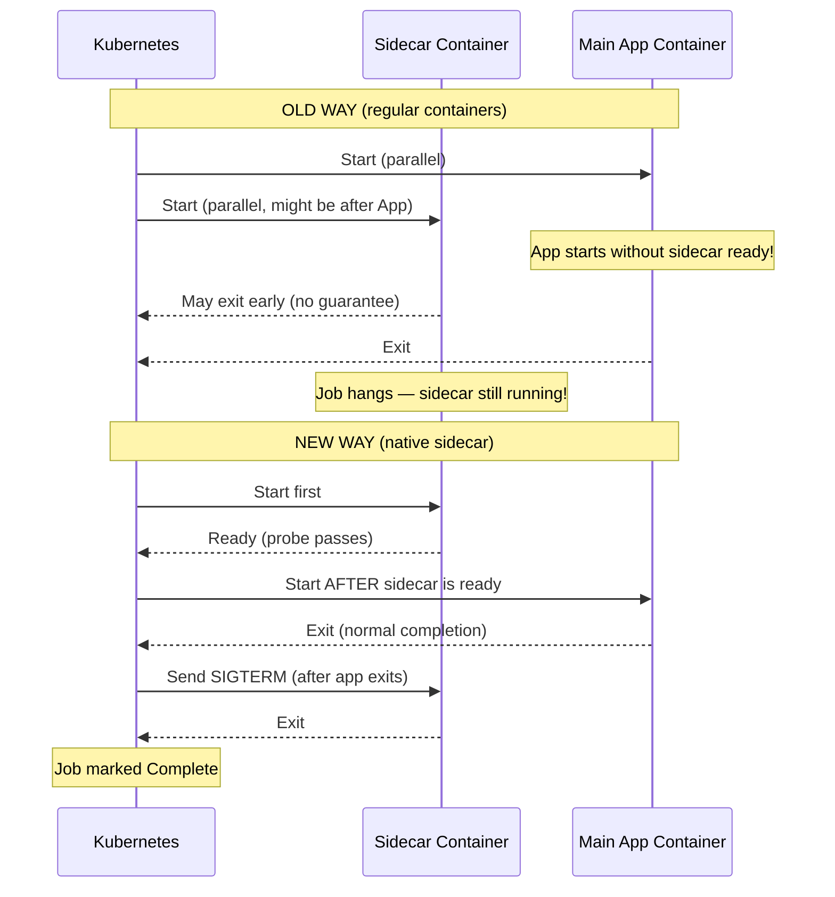
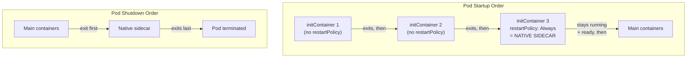

# Module 37 — Native Sidecar Containers

## The Story: The Convoy That Couldn't Stay Together

Imagine a military supply convoy. The main truck carries the goods. The escort vehicle rides alongside for protection. The logistics van brings up the rear. The whole point is that they move together, start together, and stop together.

Now imagine the old way Kubernetes handled sidecars: the escort might show up after the convoy already left. The logistics van might quit early, while the main truck is still moving. And if you needed them in a batch job (deliver goods to 10 locations, then everyone goes home), the escort might just keep driving around after the main truck parked.

That was the reality of sidecars in Kubernetes before version 1.29. The platform had containers, but it had no concept of "this container exists to support that container." Everything was equal, everything was unordered, and lifecycle management was left as an exercise for the developer.

**Native sidecar containers**, introduced in beta in K8s 1.29 and stabilized in K8s 1.33 (2025), finally give the platform the concept of a supporting container that starts before, runs alongside, and stops after the main application container.

> **🐳 Coming from Docker?**
>
> Docker Compose has multiple containers per service, but they're independent — each starts and stops on its own schedule. Kubernetes pods introduced sidecars that run alongside the main container, but pre-1.29 they were just regular containers with no guarantee about startup order, and they caused problems with Jobs (the sidecar kept running after the main container finished, so the Job never completed). Native sidecars (K8s 1.29+) add a formal contract: the sidecar starts before the main container, runs alongside it, and terminates after it. For Jobs, the sidecar finally exits cleanly when the main container finishes. This sounds subtle, but it's the difference between service meshes and log shippers being a reliable pattern vs. a fragile workaround.

---

## The Old Sidecar Problem (Pre-K8s 1.29)

Before native sidecars, developers had two bad choices:

### Option 1: Regular containers

You put your sidecar (Fluentd, Envoy, a secret refresher) as a regular container in the pod spec alongside the main app. Problems:

- **No startup ordering**: Kubernetes starts all regular containers in parallel. Your app might start before the Envoy proxy is ready, causing connection failures during startup.
- **No lifecycle guarantee**: the sidecar might exit before the main container finishes, leaving logs unshipped or the service mesh proxy gone.
- **Jobs**: if your batch job has a sidecar for log shipping, the Job never completes because the sidecar is still running even after the main container exits. The job hangs forever.

### Option 2: Init containers as pseudo-sidecars

Some teams tried to put sidecars in `initContainers` and use a sleep/blocking trick. But init containers have the opposite problem: they run **before** the main containers, sequentially, and they must **exit** before the main containers start. A sidecar in initContainers will finish and die before the main app even starts.

```yaml
# BROKEN: the "sidecar" exits before the main app starts
initContainers:
- name: envoy-proxy    # starts, then must EXIT to continue
  image: envoy:latest
  command: ["envoy", "-c", "/etc/envoy/config.yaml"]
  # This container needs to run indefinitely, but init containers must exit!
```

Teams invented hacks: sleep loops, shared files as signals, `postStart` lifecycle hooks that started background processes. All were fragile, hard to understand, and broke in edge cases.

---

## Native Sidecar Containers: The Solution

Native sidecars are defined in `initContainers` with one additional field: `restartPolicy: Always`.

This single field changes everything about how Kubernetes manages the container's lifecycle:

```yaml
initContainers:
- name: log-agent
  image: fluent/fluent-bit:3.0
  restartPolicy: Always          # <-- this makes it a native sidecar
  # ... rest of container spec
```

When `restartPolicy: Always` is set on an init container, Kubernetes treats it as a **sidecar**:

1. **Starts BEFORE main containers** (like init containers, in order)
2. **Runs ALONGSIDE main containers** (like regular containers, indefinitely)
3. **Is considered ready before the next init container (or main containers) start** — waits for the sidecar's readiness probe if defined
4. **Terminates AFTER main containers finish** — when the pod is stopping, the sidecar receives SIGTERM after main containers have already stopped
5. **Is restarted if it crashes** — the `restartPolicy: Always` means it's kept running for the pod's lifetime
6. **Does NOT block Job completion** — Kubernetes knows it's a sidecar and doesn't wait for it to exit when determining Job completion

---

## Lifecycle Comparison



---

## Complete Lifecycle of a Native Sidecar

The pod startup sequence with native sidecars:

1. All regular `initContainers` run and exit (sequentially) — these are NOT sidecars
2. Native sidecar init containers (with `restartPolicy: Always`) start and become Ready
3. Regular app containers start
4. Pod is considered Running

The pod shutdown sequence:

1. Main app containers receive SIGTERM (or are OOMKilled, etc.)
2. Main app containers exit
3. Native sidecar containers receive SIGTERM
4. Native sidecar containers exit
5. Pod terminates

This guaranteed ordering means your log agent ships the last log lines before shutting down. Your Envoy proxy is alive the entire time your app is handling traffic. Your secret refresher keeps running until your app stops needing secrets.

---

## Native Sidecar vs Regular Init Container vs Regular Container



---

## Use Cases

### Log Shipping (Fluent Bit / Fluentd)

The most common sidecar pattern. A log agent reads logs from a shared volume or from the app's stdout redirect and ships them to Elasticsearch, Loki, or Splunk.

**The old problem**: with regular containers, if the app had a burst of logs at shutdown, the log agent might exit first, losing the last log lines. With native sidecars, the log agent runs until after the app exits — no lost logs.

### Service Mesh Proxies (Istio Envoy)

Istio injects an Envoy proxy sidecar into every pod. With the old approach, there was a race between the Envoy proxy being ready and the app starting — some requests might bypass the proxy at startup.

With native sidecars, the proxy can use a readiness probe, and main containers won't start until the proxy is ready. All traffic goes through the mesh from the very first connection.

### Secret and Certificate Refreshers

A sidecar watches for secret or certificate rotation and writes updated values to a shared volume. The main app reads from the volume. The sidecar needs to run for the entire pod lifetime — native sidecars guarantee this.

### Config Watchers

Poll a config service (Consul, etcd) and write updated configuration to a shared emptyDir volume. The main app hot-reloads from the volume. Again, the sidecar must outlive or co-terminate with the main app.

---

## Jobs: The Killer Use Case

The Job use case is where native sidecars provide the most dramatic improvement over the old approach.

**Old problem**: A batch Job runs a data pipeline. A Fluentd sidecar ships logs. The pipeline finishes and the main container exits. Kubernetes checks: "is the pod done?" Answer: no — the Fluentd container is still running. The Job hangs indefinitely. The only workarounds required the app to send a signal to kill the sidecar, or using a shared file to tell the sidecar to exit.

**Native sidecar solution**: Kubernetes knows that containers with `restartPolicy: Always` in initContainers are sidecars. When determining Job completion, it only looks at the main containers. When the main container exits successfully, the Job is complete. Kubernetes then sends SIGTERM to the native sidecar, which shuts down gracefully and ships its final logs.

---

## Built-in Probes on Native Sidecars

Unlike regular containers where probes affected pod readiness, native sidecar probes control **when the next item in the init sequence starts**. If a native sidecar has a `readinessProbe`, Kubernetes waits for that probe to pass before starting the next init container (or the main containers, if the sidecar is last in the initContainers list).

```yaml
initContainers:
- name: envoy-proxy
  image: envoy:v1.28
  restartPolicy: Always
  readinessProbe:
    httpGet:
      path: /ready
      port: 9901       # Envoy admin port
    initialDelaySeconds: 3
    periodSeconds: 5
  # Main containers will NOT start until this probe passes
```

This is a game-changer for service mesh deployments: guaranteed that the proxy is ready before your app receives any traffic.

---

## Migration: From Workaround to Native Sidecar

### Before (fragile regular container workaround)

```yaml
spec:
  containers:
  - name: app
    image: myapp:v1
  - name: log-agent            # starts in parallel, no ordering guarantee
    image: fluent/fluent-bit
    # No way to ensure this starts before 'app'
    # No way to ensure this stops after 'app' in a Job
```

### After (native sidecar)

```yaml
spec:
  initContainers:
  - name: log-agent
    image: fluent/fluent-bit
    restartPolicy: Always      # native sidecar!
    # Starts before main containers
    # Runs alongside main containers
    # Stops after main containers
  containers:
  - name: app
    image: myapp:v1
```

The change is minimal: move the sidecar from `containers` to `initContainers` and add `restartPolicy: Always`. The behavior improvement is dramatic.

---

## Version History

| Release | Status | Notes |
|---------|--------|-------|
| K8s 1.28 | Alpha | Feature gate `SidecarContainers=true` required |
| K8s 1.29 | Beta | Feature gate enabled by default |
| K8s 1.33 | Stable (GA) | No feature gate needed (2025) |

---

## 📂 Navigation

| | Link |
|---|---|
| Previous | [36 — ValidatingAdmissionPolicy](../36_ValidatingAdmissionPolicy/Theory.md) |
| Cheatsheet | [Native Sidecar Containers Cheatsheet](./Cheatsheet.md) |
| Interview Q&A | [Native Sidecar Containers Interview Q&A](./Interview_QA.md) |
| Code Examples | [Native Sidecar Containers Code Examples](./Code_Example.md) |
